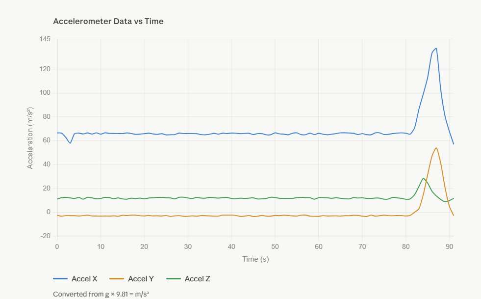
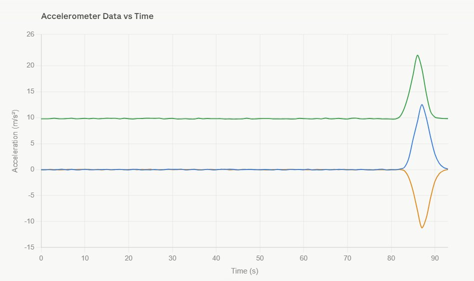

# MPU6250 — Angle Calculation, Low Pass Filter, Live Plotting & Calibration

> This guide continues after successful accelerometer + gyroscope readings from the MPU6250.
> We now calculate angles using a Low Pass Filter,
> plot them on a live web server, and calibrate the IMU for clean accurate readings.

---

## What We Already Have ✅

From the previous setup, our MPU6250 is connected and giving:
- Accelerometer data (X, Y, Z) in m/s²
- Gyroscope data (X, Y, Z) in °/s
- Stable flat readings for ~80 seconds, then movement detected (as seen in the plot)

---

## Table of Contents

1. [Why We Need a Low Pass Filter](#1-why-we-need-a-low-pass-filter)
2. [How the Low Pass Filter Works](#2-how-the-low-pass-filter-works)
3. [Install Libraries for Live Plotting](#3-install-libraries-for-live-plotting)
4. [Full Code with Explanation](#4-full-code-with-explanation)
5. [Run & View in Browser](#5-run--view-in-browser)
6. [Calibration — Why It Is Needed](#6-calibration--why-it-is-needed)
7. [How to Calibrate the MPU6250](#7-how-to-calibrate-the-mpu6250)
8. [Apply Calibration Offsets](#8-apply-calibration-offsets)

---

## 1. Why We Need a Low Pass Filter

When you look at the accelerometer plot from earlier, even when the sensor is **completely still**,
the readings are not a clean flat line — they are **shaking/vibrating** around the true value.

```
Without Low Pass Filter:           With Low Pass Filter:

 Accel Z                            Accel Z
  |  ~~~~~~~~~~~~~~~~~~~~            |  ──────────────────
  |~~~~                              |
  └──────────────► time              └──────────────► time
  Noisy, hard to use                 Smooth, clean signal
```

This noise comes from:
- **Vibration** from motors or mechanical movement
- **Electrical noise** in the circuit
- **Sensor sensitivity** picking up tiny movements

If we calculate angles from this noisy data, the angles will also jump around wildly.
The Low Pass Filter **smooths out the noise** by only allowing slow changes through
and blocking fast spikes.

---

## 2. How the Low Pass Filter Works

### Simple Explanation

Think of it like this:

> "The new reading should be mostly the old value, with just a little bit of the new raw reading mixed in."

```
filtered = alpha × raw_new + (1 - alpha) × filtered_old
```

Where **alpha** is a value between 0 and 1:

| Alpha Value | Effect |
|---|---|
| `alpha = 1.0` | No filtering — raw noisy signal passes through |
| `alpha = 0.5` | Medium filtering — balanced |
| `alpha = 0.1` | Heavy filtering — very smooth but slow to respond |
| `alpha = 0.2` | Good for IMU — smooth but still responsive ✅ |

### Example with numbers

Suppose the sensor is at rest, true value = 9.81 m/s², but noise spikes to 11.5:

```
Without filter:  9.81 → 9.81 → 11.5 → 9.81   ← big jump visible
With filter:     9.81 → 9.81 → 9.93 → 9.87   ← spike absorbed smoothly
```

We use `alpha = 0.2` — this means:
- **80% weight** on the previous smooth value (stability)
- **20% weight** on the new raw reading (responsiveness)

---

## 3. Install Libraries for Live Plotting

SSH into your Raspberry Pi:

```bash
ssh pi@raspberrypi.local
source .venv/bin/activate
```

Install required libraries:

```bash
pip install flask
pip install plotly
pip install numpy
```

### Library Overview

| Library | Purpose |
|---|---|
| `flask` | Runs a lightweight web server on the Pi |
| `plotly` | Creates interactive live charts in browser |
| `numpy` | Fast math operations |
| `smbus2` | I2C communication with MPU6250 (already installed) |

---

## 4. Full Code with Explanation

Create the main script:

```bash
nano live_angles.py
```

Paste this full code:

```python
import smbus2
import time
import math
import threading
from flask import Flask, jsonify, render_template_string

# ─────────────────────────────────────────────────────────────
# SECTION 1: MPU6250 REGISTER ADDRESSES
# ─────────────────────────────────────────────────────────────
# These are fixed memory addresses inside the MPU6250 chip.
# We read from these addresses to get sensor data.
MPU6250_ADDR = 0x68    # I2C address of the sensor (default when AD0=GND)
PWR_MGMT_1   = 0x6B    # Power management register — write 0 here to wake up the sensor
ACCEL_XOUT_H = 0x3B    # Starting register for accelerometer X high byte

# ─────────────────────────────────────────────────────────────
# SECTION 2: I2C BUS INITIALIZATION
# ─────────────────────────────────────────────────────────────
# SMBus(1) opens I2C bus number 1 on the Raspberry Pi (pins 3 and 5)
bus = smbus2.SMBus(1)

# The MPU6250 starts in SLEEP mode by default.
# Writing 0x00 to PWR_MGMT_1 wakes it up so it starts measuring.
bus.write_byte_data(MPU6250_ADDR, PWR_MGMT_1, 0x00)
time.sleep(0.1)   # Small delay to let the sensor stabilize after waking up

# ─────────────────────────────────────────────────────────────
# SECTION 3: READ RAW 16-BIT VALUE FROM SENSOR
# ─────────────────────────────────────────────────────────────
def read_word(reg):
    # The sensor stores each measurement as 2 bytes (16 bits):
    #   HIGH byte = upper 8 bits
    #   LOW byte  = lower 8 bits
    # We read both and combine them into one number.
    high  = bus.read_byte_data(MPU6250_ADDR, reg)
    low   = bus.read_byte_data(MPU6250_ADDR, reg + 1)

    # Combine: shift high byte left by 8 bits, then add low byte
    # Example: high=0x06, low=0x40 → value = 0x0640 = 1600
    value = (high << 8) | low

    # The sensor uses signed integers (can be negative for opposite direction).
    # If value >= 32768 (0x8000), it means the number is negative in 2's complement.
    # We subtract 65536 to convert it to a proper negative Python integer.
    if value >= 0x8000:
        value -= 65536
    return value

# ─────────────────────────────────────────────────────────────
# SECTION 4: LOW PASS FILTER SETUP
# ─────────────────────────────────────────────────────────────
# Alpha controls how much smoothing is applied.
# 0.2 = 20% new reading + 80% previous smooth value.
# Lower alpha = smoother but slower. Higher alpha = faster but noisier.
ALPHA = 0.2

# These store the previous filtered values for accel only.
# They start at 0 and get updated every loop iteration.
ax_filtered = 0.0
ay_filtered = 0.0
az_filtered = 0.0

# ─────────────────────────────────────────────────────────────
# SECTION 5: GET ACCELEROMETER DATA (with Low Pass Filter)
# ─────────────────────────────────────────────────────────────
def get_accel():
    global ax_filtered, ay_filtered, az_filtered

    # Read raw values from sensor registers.
    # Divide by 16384.0 because at ±2g range, 16384 raw units = 1g.
    # Multiply by 9.81 to convert from g to m/s².
    ax_raw = (read_word(ACCEL_XOUT_H)     / 16384.0) * 9.81
    ay_raw = (read_word(ACCEL_XOUT_H + 2) / 16384.0) * 9.81
    az_raw = (read_word(ACCEL_XOUT_H + 4) / 16384.0) * 9.81

    # Apply Low Pass Filter:
    # new_filtered = ALPHA × raw + (1 - ALPHA) × old_filtered
    # This smooths out sudden spikes and electrical noise.
    # We are NOT using gyroscope here — angles come from accelerometer only.
    ax_filtered = ALPHA * ax_raw + (1 - ALPHA) * ax_filtered
    ay_filtered = ALPHA * ay_raw + (1 - ALPHA) * ay_filtered
    az_filtered = ALPHA * az_raw + (1 - ALPHA) * az_filtered

    return ax_filtered, ay_filtered, az_filtered

# ─────────────────────────────────────────────────────────────
# SECTION 6: ANGLE CALCULATION FROM ACCELEROMETER ONLY
# ─────────────────────────────────────────────────────────────
# We use only the filtered accelerometer data to calculate angles.
# atan2 gives us the angle from the ratio of acceleration components.
#
# Roll  = tilt left/right   → uses Y and Z acceleration
# Pitch = tilt forward/back → uses X, Y and Z acceleration
#
# These angles are calculated fresh every loop — no gyroscope involved.

timestamps = []
roll_data  = []
pitch_data = []
start_time = time.time()

def calculate_angles():
    while True:
        # Get low-pass filtered accelerometer values
        ax, ay, az = get_accel()

        # Calculate Roll:
        # atan2(ay, az) gives the angle between Y and Z acceleration.
        # When flat: ay≈0, az≈9.81 → atan2(0, 9.81) = 0° (no roll)
        # When tilted left: ay increases → angle increases
        roll  = math.degrees(math.atan2(ay, az))

        # Calculate Pitch:
        # atan2(-ax, sqrt(ay²+az²)) gives forward/backward tilt.
        # sqrt(ay²+az²) is the magnitude in the Y-Z plane.
        # When flat: ax≈0 → atan2(0, 9.81) = 0° (no pitch)
        # When tilted forward: ax changes → angle changes
        pitch = math.degrees(math.atan2(-ax, math.sqrt(ay**2 + az**2)))

        # Store data for plotting
        elapsed = round(time.time() - start_time, 2)
        timestamps.append(elapsed)
        roll_data.append(round(roll, 3))
        pitch_data.append(round(pitch, 3))

        # Keep only last 200 points in memory.
        # Without this, the list grows forever and slows down the Pi.
        if len(timestamps) > 200:
            timestamps.pop(0)
            roll_data.pop(0)
            pitch_data.pop(0)

        # Sleep 50ms = 20Hz update rate.
        # Faster update = more CPU usage. 20Hz is good for prosthetic leg.
        time.sleep(0.05)

# ─────────────────────────────────────────────────────────────
# SECTION 7: FLASK WEB SERVER + LIVE CHART
# ─────────────────────────────────────────────────────────────
# Flask runs a tiny web server on the Pi.
# We serve an HTML page that fetches /data every 200ms and updates the chart.
app = Flask(__name__)

HTML_PAGE = """
<!DOCTYPE html>
<html>
<head>
    <title>MPU6250 Live Angles</title>
    <script src="https://cdn.plot.ly/plotly-latest.min.js"></script>
    <style>
        body { font-family: Arial; background: #111; color: white; text-align: center; }
        h1   { margin-top: 20px; color: #00ccff; }
        #chart { width: 95%; margin: auto; }
        .values { font-size: 24px; margin: 10px; }
        .roll  { color: #ff6666; }
        .pitch { color: #66ff66; }
    </style>
</head>
<body>
    <h1>MPU6250 Live Angle Monitor (Low Pass Filter)</h1>
    <div class="values">
        Roll: <span class="roll" id="roll_val">0.00</span>°
        &nbsp;&nbsp;&nbsp;
        Pitch: <span class="pitch" id="pitch_val">0.00</span>°
    </div>
    <div id="chart"></div>

    <script>
        var layout = {
            paper_bgcolor: '#111',
            plot_bgcolor:  '#1a1a1a',
            font:  { color: 'white' },
            title: { text: 'Roll & Pitch vs Time', font: { color: '#00ccff' } },
            xaxis: { title: 'Time (s)', color: 'white' },
            yaxis: { title: 'Angle (°)', color: 'white' },
            legend: { font: { color: 'white' } }
        };

        var rollTrace  = { x: [], y: [], name: 'Roll',  mode: 'lines', line: { color: '#ff6666' } };
        var pitchTrace = { x: [], y: [], name: 'Pitch', mode: 'lines', line: { color: '#66ff66' } };

        Plotly.newPlot('chart', [rollTrace, pitchTrace], layout);

        // fetchData runs every 200ms and updates the chart with latest values from Pi
        function fetchData() {
            fetch('/data')
                .then(r => r.json())
                .then(d => {
                    Plotly.update('chart', {
                        x: [d.time, d.time],
                        y: [d.roll, d.pitch]
                    });
                    if (d.roll.length > 0) {
                        document.getElementById('roll_val').innerText  = d.roll[d.roll.length-1].toFixed(2);
                        document.getElementById('pitch_val').innerText = d.pitch[d.pitch.length-1].toFixed(2);
                    }
                });
        }

        setInterval(fetchData, 200);  // Refresh every 200ms
    </script>
</body>
</html>
"""

# Route '/' serves the HTML page to the browser
@app.route('/')
def index():
    return render_template_string(HTML_PAGE)

# Route '/data' returns JSON with latest timestamps, roll, pitch values.
# The browser fetches this every 200ms to update the chart.
@app.route('/data')
def data():
    return jsonify({
        'time':  timestamps,
        'roll':  roll_data,
        'pitch': pitch_data
    })

# ─────────────────────────────────────────────────────────────
# SECTION 8: MAIN — START EVERYTHING
# ─────────────────────────────────────────────────────────────
if __name__ == '__main__':
    # Run the IMU reading loop in a background thread.
    # daemon=True means this thread automatically stops when main program exits.
    # Without threading, the Flask server and IMU loop would block each other.
    thread = threading.Thread(target=calculate_angles, daemon=True)
    thread.start()

    print("Low Pass Filter active! (alpha = 0.2)")
    print("Live angle server running!")
    print("Open your browser and go to: http://raspberrypi.local:5000")

    # host='0.0.0.0' means accept connections from any device on the network.
    # This lets your laptop access the Pi's server over WiFi.
    app.run(host='0.0.0.0', port=5000)
```

Save with `Ctrl+X → Y → Enter`.

---

### Code Summary — What Each Section Does

| Section | What it does |
|---|---|
| Section 1 | Defines I2C address and register locations inside the MPU6250 chip |
| Section 2 | Opens I2C bus and wakes up the sensor from sleep mode |
| Section 3 | Reads raw 16-bit integer by combining two 8-bit bytes |
| Section 4 | Sets up Low Pass Filter constant (alpha=0.2) and previous filtered values |
| Section 5 | Reads accelerometer, converts to m/s², applies Low Pass Filter |
| Section 6 | Calculates Roll & Pitch from filtered accelerometer using atan2 |
| Section 7 | Flask web server serves live chart page and JSON data endpoint |
| Section 8 | Starts IMU thread and web server together |

---

### Filter Flow Diagram

```
Raw Accelerometer Reading (noisy)
            │
            ▼
┌───────────────────────┐
│   Low Pass Filter      │  ← filtered = 0.2 × raw + 0.8 × prev
│   alpha = 0.2          │  ← removes vibration and noise spikes
└───────────────────────┘
            │
            ▼
┌───────────────────────┐
│  atan2 Angle Formula  │  ← Roll = atan2(ay, az)
│  (from accel only)    │  ← Pitch = atan2(-ax, sqrt(ay²+az²))
└───────────────────────┘
            │
            ▼
    Clean Angle (°) ✅
```

---

## 5. Run & View in Browser

Run the server on Pi:

```bash
python3 live_angles.py
```

You should see:

```
Low Pass Filter active! (alpha = 0.2)
Live angle server running!
Open your browser and go to: http://raspberrypi.local:5000
```

Open on your laptop browser:

```
http://raspberrypi.local:5000
```

> If that doesn't work, use the Pi's IP address:
> ```
> http://192.168.x.x:5000
> ```

You will see a **live graph updating every 200ms** showing smooth Roll and Pitch angles.

---

## 6. Calibration — Why It Is Needed

Even with the Low Pass Filter applied, if the sensor has a built-in bias error,
the angles will still be offset from the true value.

> ⚠️ **Problem:** Even when the sensor is completely still (0–80 seconds):
> - Accel X showing ~63.8 m/s² instead of 0 m/s²
> - Accel Y showing ~-2.9 m/s² instead of 0 m/s²
> - Accel Z showing ~11.8 m/s² instead of 9.81 m/s² (gravity)

This is **sensor bias** — a fixed error present in every IMU from manufacturing.
The Low Pass Filter smooths noise but cannot fix bias. Calibration fixes bias.

### Before Calibration — Actual Plot


)

> X axis sitting at ~65 m/s² instead of 0, Z at ~13 m/s² instead of 9.81 m/s² — clear sensor bias.

### Without Calibration vs With Calibration

| | Without Calibration | With Calibration |
|---|---|---|
| Accel X at rest | ~63.8 m/s²  | ~0.0 m/s²  |
| Accel Y at rest | ~-2.9 m/s²  | ~0.0 m/s²  |
| Accel Z at rest | ~11.8 m/s² | ~9.81 m/s²  |
| Angles accurate | Offset | Correct |


## 7. How to Calibrate the MPU6250

### Step 7.1 — Place Sensor Flat and Still

Place the MPU6250 on a **completely flat surface**, do not touch it during calibration.

### Step 7.2 — Run Calibration Script

```bash
nano calibrate_mpu.py
```

Paste this:

```python
import smbus2
import time

MPU6250_ADDR = 0x68
PWR_MGMT_1   = 0x6B
ACCEL_XOUT_H = 0x3B

bus = smbus2.SMBus(1)
bus.write_byte_data(MPU6250_ADDR, PWR_MGMT_1, 0x00)
time.sleep(0.1)

def read_word(reg):
    high  = bus.read_byte_data(MPU6250_ADDR, reg)
    low   = bus.read_byte_data(MPU6250_ADDR, reg + 1)
    value = (high << 8) | low
    if value >= 0x8000:
        value -= 65536
    return value

def get_accel():
    ax = (read_word(ACCEL_XOUT_H)     / 16384.0) * 9.81
    ay = (read_word(ACCEL_XOUT_H + 2) / 16384.0) * 9.81
    az = (read_word(ACCEL_XOUT_H + 4) / 16384.0) * 9.81
    return ax, ay, az

SAMPLES = 500
print(f"Collecting {SAMPLES} samples... Keep sensor FLAT and STILL!\n")
time.sleep(2)

ax_sum = ay_sum = az_sum = 0.0

for i in range(SAMPLES):
    ax, ay, az = get_accel()
    ax_sum += ax
    ay_sum += ay
    az_sum += az
    time.sleep(0.005)

# Average all samples to find the constant bias offset
ax_off = ax_sum / SAMPLES            # Should be 0 m/s²  → offset = average error
ay_off = ay_sum / SAMPLES            # Should be 0 m/s²  → offset = average error
az_off = (az_sum / SAMPLES) - 9.81  # Should be 9.81 m/s² → subtract expected gravity

print("=" * 40)
print("CALIBRATION OFFSETS (copy these!):")
print("=" * 40)
print(f"ACCEL_X_OFFSET = {ax_off:.4f}")
print(f"ACCEL_Y_OFFSET = {ay_off:.4f}")
print(f"ACCEL_Z_OFFSET = {az_off:.4f}")
print("=" * 40)
```

Save and run:

```bash
python3 calibrate_mpu.py
```

### Example Output:

```
Collecting 500 samples... Keep sensor FLAT and STILL!

========================================
CALIBRATION OFFSETS (copy these!):
========================================
ACCEL_X_OFFSET = -0.0231
ACCEL_Y_OFFSET =  0.0154
ACCEL_Z_OFFSET =  0.0412
========================================
```

> 📋 **Copy and save these values** — you will use them in the next step.

---

## 8. Apply Calibration Offsets

Add your offsets at the top of `live_angles.py`:

```python
# ── Calibration Offsets (paste YOUR values here) ──────────
ACCEL_X_OFFSET =  0.0000   # Replace with your value
ACCEL_Y_OFFSET =  0.0000   # Replace with your value
ACCEL_Z_OFFSET =  0.0000   # Replace with your value
```

Update `get_accel()` to subtract offsets after filtering:

```python
def get_accel():
    global ax_filtered, ay_filtered, az_filtered
    ax_raw = (read_word(ACCEL_XOUT_H)     / 16384.0) * 9.81
    ay_raw = (read_word(ACCEL_XOUT_H + 2) / 16384.0) * 9.81
    az_raw = (read_word(ACCEL_XOUT_H + 4) / 16384.0) * 9.81

    # Apply Low Pass Filter first
    ax_filtered = ALPHA * ax_raw + (1 - ALPHA) * ax_filtered
    ay_filtered = ALPHA * ay_raw + (1 - ALPHA) * ay_filtered
    az_filtered = ALPHA * az_raw + (1 - ALPHA) * az_filtered

    # Then subtract calibration offset to remove sensor bias
    return (ax_filtered - ACCEL_X_OFFSET,
            ay_filtered - ACCEL_Y_OFFSET,
            az_filtered - ACCEL_Z_OFFSET)
```

Run the live server again:

```bash
python3 live_angles.py
```

Open:

```
http://raspberrypi.local:5000
```

You should now see **clean, stable, smooth angle readings**. ✅

---

## Full Flow Summary

```
MPU6250 giving raw accel data ✅
            │
  python3 calibrate_mpu.py
  → Place sensor flat → collect 500 samples
  → Copy the 3 accel offset values
            │
  Add offsets + Low Pass Filter (α=0.2) to live_angles.py
            │
  pip install flask plotly numpy
            │
  python3 live_angles.py
            │
  Open browser → http://raspberrypi.local:5000
            │
  Live smooth Roll & Pitch graph! ✅

Signal path:
  Raw accel → Low Pass Filter (α=0.2) → atan2 angle formula → Clean angle
```

---
### After Calibration — Actual Plot



> X axis now at ~0 m/s², Z sitting cleanly at ~9.81 m/s² (gravity). Calibration successful ✅

---

## References

- [MPU6250 Datasheet](https://invensense.tdk.com/products/motion-tracking/6-axis/mpu-6500/)
- [Flask Documentation](https://flask.palletsprojects.com/)
- [Plotly JS Documentation](https://plotly.com/javascript/)
- [Low Pass Filter Explained](https://en.wikipedia.org/wiki/Low-pass_filter)
