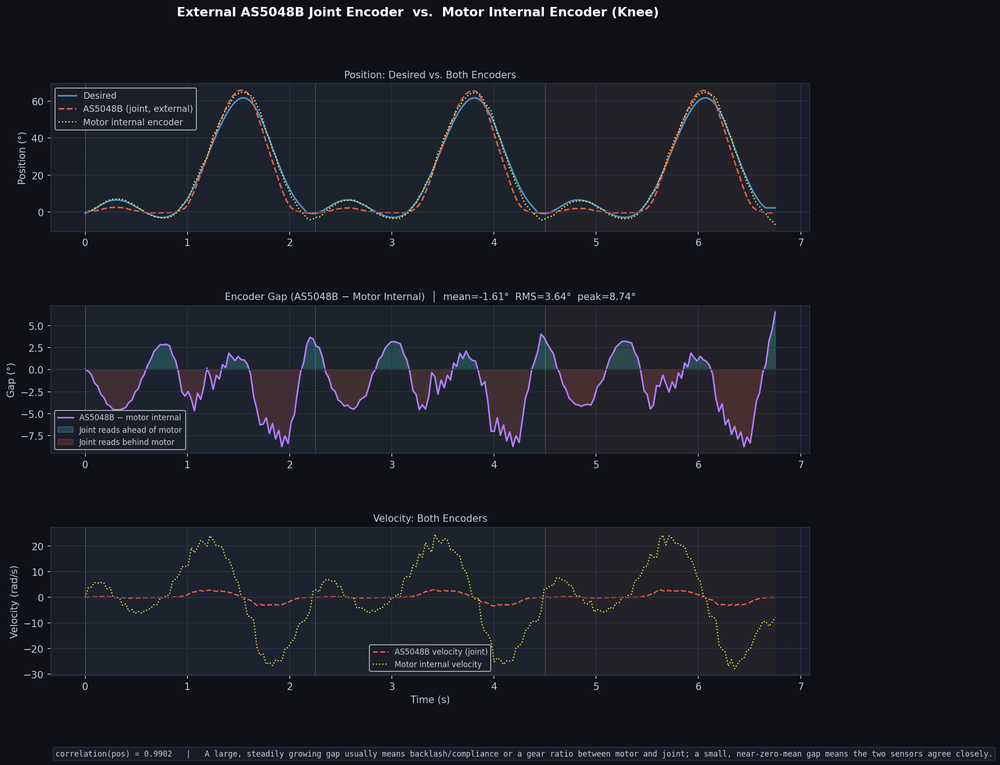
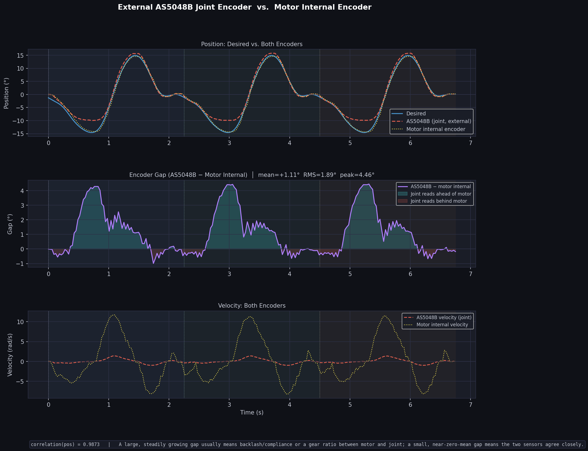

## Overview

The AS5048B is a 14-bit absolute magnetic rotary encoder used to measure the angular position of the knee and ankle joints. Unlike the motor's internal encoder, the AS5048B is mounted directly on the joint, allowing it to measure the actual joint position independently of the motor.

The encoder communicates with the Raspberry Pi through the I²C interface and was integrated with both the knee and ankle trajectory tracking programs.

---

# Objectives

The encoder was integrated to:

- Measure the actual joint angle.
- Validate the motion produced by the actuator.
- Compare the external joint encoder with the motor's internal encoder.
- Detect transmission errors such as backlash or compliance.
- Log encoder data for offline analysis.

---

# Features

- 14-bit absolute position sensor
- 360° angle measurement
- High-resolution joint angle feedback
- I²C communication
- No homing required after power-up
- Real-time angle measurement
- Compatible with Raspberry Pi

---
# Hardware Used

| Component | Description |
|-----------|-------------|
| Raspberry Pi 4 | Main controller for motor control and encoder data acquisition |
| Cubemars AK80-9 Actuator | Brushless servo actuator used for knee and ankle motion |
| AS5048B Magnetic Encoder | External 14-bit absolute encoder for joint angle measurement |
| Diametrically Magnetized Magnet | Mounted on the joint shaft for encoder angle sensing |
| I²C Interface | Communication between the Raspberry Pi and the AS5048B encoder |
| CAN Interface (Waveshare CAN HAT) | Communication between the Raspberry Pi and the Cubemars actuator |
| 40 V Battery | Power supply for the actuator |
| Emergency Stop (E-Stop) | Safety switch for immediately disconnecting motor power during testing |
| Connecting Wires | Electrical connections for power and signal transmission |

---

# Wiring

The encoder was connected to the Raspberry Pi using four wires.

| Encoder Pin | Raspberry Pi |
|-------------|--------------|
| VCC | 3.3 V |
| GND | GND |
| SDA | GPIO 2 (SDA) |
| SCL | GPIO 3 (SCL) |

---

# Working Principle

The AS5048B measures the magnetic field generated by a diametrically magnetized magnet attached to the rotating shaft. As the joint rotates, the encoder continuously measures the absolute angular position and transmits the data to the Raspberry Pi through the I²C interface.

Unlike incremental encoders, the AS5048B always reports the absolute position immediately after power-up, eliminating the need for a homing sequence.

---

# Encoder Mounting

The AS5048B encoder was mounted directly above a diametrically magnetized magnet fixed to the rotating shaft. The encoder senses the magnetic field produced by the rotating magnet to determine the absolute angular position of the joint.

For reliable operation, the magnet should be centered over the sensing chip and the distance between the magnet and the AS5048B sensing chip should be **no more than 2 mm**. Proper alignment ensures accurate angle measurements and stable encoder performance.


**Figure 1.** AS5048B encoder PCB showing the sensing chip. The magnet should be positioned directly above the sensing chip with a maximum separation of **2 mm**.

## Encoder Mounted on the Test Rig

The figure below shows the AS5048B encoder mounted on the prosthetic joint test setup. The encoder is fixed to the stationary bracket while the magnet is attached to the rotating shaft. As the shaft rotates, the encoder measures the joint angle without physical contact.


**Figure 2.** AS5048B magnetic encoder mounted on the prosthetic joint test setup.


# Knee Encoder Source Code

The following Python program integrates the AS5048B encoder with the knee trajectory tracking controller. It executes the Winter gait trajectory, logs encoder and motor data, and generates comparison plots.

```python
from opensourceleg.actuators.tmotor import TMotorServoActuator
from opensourceleg.sensors.encoder import AS5048B
import pandas as pd
import numpy as np
import time
import matplotlib
matplotlib.use("Agg")
import matplotlib.pyplot as plt
import matplotlib.gridspec as gridspec


# ==================================
# Motor constants  (AK80-9)
# ==================================

KT_MOTOR = 0.091   # Nm/A  — torque constant


# ==================================
# External AS5048B encoder constants
# ==================================
# An AS5048B magnetic encoder is now mounted directly on the knee joint
# (rather than relying solely on the motor's internal encoder). Joint-side
# feedback avoids belt/cable stretch, backlash, and transmission compliance
# that the motor-side encoder can't see, so it's logged here purely as a
# diagnostic (see "external_encoder_*" columns) so belt slip / backlash can
# be spotted later — same role it plays in the ankle script. The motor's
# own encoder remains the primary source of actual_position/actual_velocity
# used by the control loop.

ENCODER_BUS            = "/dev/i2c-1"   # I2C bus the AS5048B is wired to
ENCODER_A1_ADR_PIN      = False         # both address pins tied low on this
ENCODER_A2_ADR_PIN      = False         # board -> i2cdetect confirms addr 0x40
ENCODER_ZERO_POSITION   = 0             # raw zero offset (0-16383); refined at runtime below
ENCODER_ENABLE_DIAGNOSTICS = True       # checks magnetic field strength / data validity
ENCODER_SIGN            = 1             # set to -1 if the encoder is mounted mirrored
                                         # relative to the motor's positive direction


# ==================================
# Helper functions
# ==================================

def make_cycle_continuous(t_one, q_one, target_rad, smooth_window=21):
    """
    Circular smoothing:
    removes start-end gait discontinuity
    while keeping peak exactly at target_rad.
    """
    q = q_one.copy()

    if smooth_window % 2 == 0:
        smooth_window += 1

    pad = smooth_window // 2

    q_pad = np.r_[q[-pad:], q, q[:pad]]
    kernel = np.ones(smooth_window) / smooth_window
    q_smooth = np.convolve(q_pad, kernel, mode="valid")
    q_smooth = q_smooth[:len(q)]

    q_smooth[-1] = q_smooth[0]

    q_smooth = q_smooth - np.min(q_smooth)
    q_smooth = target_rad * q_smooth / np.max(q_smooth)
    q_smooth[-1] = q_smooth[0]

    qd_smooth  = np.gradient(q_smooth, t_one)
    qdd_smooth = np.gradient(qd_smooth, t_one)

    return q_smooth, qd_smooth, qdd_smooth


def smooth_signal_circular(signal, smooth_window=21):
    """
    Apply the same circular smoothing to an arbitrary 1-D signal
    (used for torque) and force start == end closure.
    """
    if smooth_window % 2 == 0:
        smooth_window += 1

    pad = smooth_window // 2
    sig_pad = np.r_[signal[-pad:], signal, signal[:pad]]
    kernel  = np.ones(smooth_window) / smooth_window
    smoothed = np.convolve(sig_pad, kernel, mode="valid")[:len(signal)]
    smoothed[-1] = smoothed[0]
    return smoothed


def unwrap_motor_position(raw_pos, prev_raw_pos, unwrapped_pos):
    if prev_raw_pos is None:
        return raw_pos, raw_pos

    delta = raw_pos - prev_raw_pos

    if delta > np.pi:
        delta -= 2 * np.pi
    elif delta < -np.pi:
        delta += 2 * np.pi

    unwrapped_pos += delta
    return raw_pos, unwrapped_pos


def lead_interp(t_now, lead_time, t_full, q_full, qd_full, qdd_full):
    future_t = t_now + lead_time
    if future_t > t_full[-1]:
        future_t = t_full[-1]

    q_future   = np.interp(future_t, t_full, q_full)
    qd_future  = np.interp(future_t, t_full, qd_full)
    qdd_future = np.interp(future_t, t_full, qdd_full)

    return q_future, qd_future, qdd_future


# ==================================
# Plot function
# ==================================

def plot_tracking(df, csv_path="tracking_log_v21_knee_encoder.csv", n_cycles=3, target_deg=64.7):
    t    = df["time"].values
    dp   = df["desired_position"].values
    ap   = df["actual_position"].values
    dv   = df["desired_velocity"].values
    av   = df["actual_velocity"].values
    pe   = df["position_error"].values
    cmd  = df["velocity_command"].values
    cyc  = df["cycle"].values
    curr = df["motor_current"].values
    torq = df["output_torque"].values

    # NEW — desired signals
    des_torq = df["desired_torque"].values
    des_curr = df["desired_current"].values

    dp_deg = np.degrees(dp - dp[0])
    ap_deg = np.degrees(ap - dp[0])
    pe_deg = np.degrees(pe)

    PANEL_BG = "#1a1d27"
    GRID_CLR = "#2e3147"
    TEXT_CLR = "#c8ccd8"

    BLUE   = "#4fa3e0"
    RED    = "#e05f4f"
    GREEN  = "#4fce82"
    ORANGE = "#f0a050"
    PURPLE = "#b07fff"
    CYAN   = "#4fefef"
    YELLOW = "#f0e050"

    CYCLE_COLORS = ["#4fa3e0", "#4fce82", "#f0a050"]

    fig = plt.figure(figsize=(14, 16))
    fig.patch.set_facecolor("#0f1117")

    fig.suptitle(
        f"Knee Motor Tracking — v21 (motor encoder in loop, AS5048B logged)  "
        f"({n_cycles} Continuous Gait Cycles, {target_deg}°)",
        fontsize=13,
        fontweight="bold",
        color="white",
        y=0.99
    )

    gs = gridspec.GridSpec(5, 1, hspace=0.55)

    def style_ax(ax, title, ylabel):
        ax.set_facecolor(PANEL_BG)
        ax.spines[:].set_color(GRID_CLR)
        ax.tick_params(colors=TEXT_CLR)
        ax.xaxis.label.set_color(TEXT_CLR)
        ax.yaxis.label.set_color(TEXT_CLR)
        ax.set_title(title, color=TEXT_CLR, fontsize=10, pad=6)
        ax.set_ylabel(ylabel, color=TEXT_CLR)
        ax.grid(True, color=GRID_CLR, lw=0.8)

    cycle_dur = t[-1] / n_cycles

    def shade_cycles(ax):
        for c in range(n_cycles):
            t0 = c * cycle_dur
            t1 = (c + 1) * cycle_dur
            ax.axvspan(t0, t1, alpha=0.04, color=CYCLE_COLORS[c % len(CYCLE_COLORS)])
            ax.axvline(t0, color="white", lw=0.5, alpha=0.3, ls="--")

    # ==================================
    # Panel 1: Position
    # ==================================

    ax1 = fig.add_subplot(gs[0])
    style_ax(ax1, "Position Tracking  (relative to motor start)", "Position (°)")

    ax1.plot(t, dp_deg, color=BLUE, lw=1.8, label="Desired")
    ax1.plot(t, ap_deg, color=RED,  lw=1.5, ls="--", label="Actual (motor internal, control feedback)")
    if "external_encoder_deg" in df.columns:
        ext_deg = df["external_encoder_deg"].values
        ax1.plot(t, ext_deg, color=YELLOW, lw=1.0, ls=":", alpha=0.8,
                  label="AS5048B external encoder (diagnostic)")
    ax1.fill_between(t, dp_deg, ap_deg, alpha=0.15, color=ORANGE)
    ax1.axhline(target_deg, color=CYAN, lw=0.8, ls=":", alpha=0.7, label=f"{target_deg}° target")
    ax1.axhline(0, color=GRID_CLR, lw=0.8)

    shade_cycles(ax1)

    for c in range(n_cycles):
        ax1.text(
            c * cycle_dur + 0.05, 1.0, f"C{c + 1}",
            color=CYCLE_COLORS[c % len(CYCLE_COLORS)],
            fontsize=8, transform=ax1.get_xaxis_transform()
        )

    peak_idx = np.argmax(np.abs(pe))
    ax1.annotate(
        f"Peak error\n{np.degrees(pe[peak_idx]):.1f}°",
        xy=(t[peak_idx], ap_deg[peak_idx]),
        xytext=(t[peak_idx] - 0.35, ap_deg[peak_idx] - 8),
        color=ORANGE, fontsize=8,
        arrowprops=dict(arrowstyle="->", color=ORANGE)
    )

    ax1.legend(fontsize=9, facecolor=PANEL_BG, labelcolor=TEXT_CLR)

    # ==================================
    # Panel 2: Velocity and command
    # ==================================

    ax2 = fig.add_subplot(gs[1])
    style_ax(ax2, "Velocity Tracking & Command", "rad/s  /  cmd units")

    ax2.plot(t, dv,  color=BLUE,  lw=1.8, label="Desired vel")
    ax2.plot(t, av,  color=RED,   lw=1.5, ls="--", label="Actual vel")
    ax2.plot(t, cmd, color=GREEN, lw=1.2, ls=":",  label="Velocity command")
    ax2.axhline( 100, color="white", lw=0.8, ls="--", alpha=0.4, label="±VEL_LIMIT")
    ax2.axhline(-100, color="white", lw=0.8, ls="--", alpha=0.4)
    ax2.fill_between(t,  100, np.clip(cmd,  100, 200), alpha=0.25, color="red")
    ax2.fill_between(t, -100, np.clip(cmd, -200,-100), alpha=0.25, color="red")

    shade_cycles(ax2)
    ax2.legend(fontsize=8, facecolor=PANEL_BG, labelcolor=TEXT_CLR)

    # ==================================
    # Panel 3: Error
    # ==================================

    ax3 = fig.add_subplot(gs[2])

    rms_all  = np.sqrt(np.mean(pe_deg**2))
    peak_all = np.max(np.abs(pe_deg))

    cycle_rms_parts = []
    for c in range(n_cycles):
        mask  = cyc == (c + 1)
        rms_c = np.sqrt(np.mean(pe_deg[mask]**2)) if mask.any() else 0
        cycle_rms_parts.append(f"C{c + 1}:{rms_c:.1f}°")

    cycle_rms_str = "  ".join(cycle_rms_parts)

    style_ax(
        ax3,
        f"Position Error  │  RMS={rms_all:.2f}°  Peak={peak_all:.2f}°"
        f"  │  Per-cycle:  {cycle_rms_str}",
        "Error (°)"
    )

    ax3.plot(t, pe_deg,       color=PURPLE,  lw=1.8, label="Position error")
    ax3.plot(t, np.abs(pe_deg), color="white", lw=0.9, ls=":", alpha=0.6, label="|error|")
    ax3.axhline(0, color=GRID_CLR, lw=1.0)
    ax3.fill_between(t, 0, pe_deg, where=(pe_deg > 0), alpha=0.2, color=BLUE, label="Lagging")
    ax3.fill_between(t, 0, pe_deg, where=(pe_deg < 0), alpha=0.2, color=RED,  label="Overshooting")

    shade_cycles(ax3)
    ax3.legend(fontsize=8, facecolor=PANEL_BG, labelcolor=TEXT_CLR)

    # ==================================
    # Panel 4: Current  (desired vs actual)
    # ==================================

    ax4 = fig.add_subplot(gs[3])

    peak_curr     = np.max(np.abs(curr))
    rms_curr      = np.sqrt(np.mean(curr**2))
    peak_des_curr = np.max(np.abs(des_curr))

    style_ax(
        ax4,
        f"Motor Current  │  Actual: Peak={peak_curr:.2f} A  RMS={rms_curr:.2f} A"
        f"  │  Desired Peak={peak_des_curr:.2f} A  (Winter gait / Kt)",
        "Current (A)"
    )

    ax4.plot(t, des_curr, color=BLUE,   lw=1.5, ls="--", label="Desired current (Winter/Kt)")
    ax4.plot(t, curr,     color=YELLOW, lw=1.5,           label="Actual current")
    ax4.axhline(0, color=GRID_CLR, lw=0.8)
    ax4.fill_between(t, 0, curr,     where=(curr > 0),     alpha=0.15, color=YELLOW)
    ax4.fill_between(t, 0, curr,     where=(curr < 0),     alpha=0.15, color=RED)
    ax4.fill_between(t, 0, des_curr, where=(des_curr > 0), alpha=0.08, color=BLUE)
    ax4.fill_between(t, 0, des_curr, where=(des_curr < 0), alpha=0.08, color=BLUE)

    shade_cycles(ax4)
    ax4.legend(fontsize=8, facecolor=PANEL_BG, labelcolor=TEXT_CLR)

    # ==================================
    # Panel 5: Torque  (desired vs actual)
    # ==================================

    ax5 = fig.add_subplot(gs[4])

    peak_torq     = np.max(np.abs(torq))
    rms_torq      = np.sqrt(np.mean(torq**2))
    peak_des_torq = np.max(np.abs(des_torq))

    style_ax(
        ax5,
        f"Output Torque  │  Actual: Peak={peak_torq:.2f} Nm  RMS={rms_torq:.2f} Nm"
        f"  │  Desired Peak={peak_des_torq:.2f} Nm  (Winter gait)",
        "Torque (Nm)"
    )

    ax5.plot(t, des_torq, color=BLUE, lw=1.5, ls="--", label="Desired torque (Winter gait)")
    ax5.plot(t, torq,     color=CYAN, lw=1.5,           label="Actual torque")
    ax5.axhline(0, color=GRID_CLR, lw=0.8)
    ax5.fill_between(t, 0, torq,     where=(torq > 0),     alpha=0.15, color=CYAN)
    ax5.fill_between(t, 0, torq,     where=(torq < 0),     alpha=0.15, color=RED)
    ax5.fill_between(t, 0, des_torq, where=(des_torq > 0), alpha=0.08, color=BLUE)
    ax5.fill_between(t, 0, des_torq, where=(des_torq < 0), alpha=0.08, color=BLUE)

    shade_cycles(ax5)
    ax5.set_xlabel("Time (s)", color=TEXT_CLR)
    ax5.legend(fontsize=8, facecolor=PANEL_BG, labelcolor=TEXT_CLR)

    # ==================================
    # Param footer
    # ==================================

    param_txt = (
        "v21 (knee): KP=60, KI=5, KD=0.9, VEL_SCALE=18, ACC_SCALE=0.35, "
        "VEL_LIMIT=100, LEAD_TIME=0.10, TIME_SCALE=2.0 | "
        "position/velocity feedback from motor internal encoder (CAN) "
        "(external AS5048B joint encoder logged as diagnostic only) | "
        "circular smoothing + peak fixed | desired τ/I from Winter gait CSV"
    )

    fig.text(
        0.13, 0.005, param_txt,
        fontsize=7.5, color=TEXT_CLR, family="monospace",
        bbox=dict(boxstyle="round", fc=PANEL_BG, ec=GRID_CLR, alpha=0.9)
    )

    png_path = csv_path.replace(".csv", ".png")
    plt.savefig(png_path, dpi=150, bbox_inches="tight", facecolor=fig.get_facecolor())
    print(f"Saved: {png_path}")
    plt.close()


# ==================================
# Plot function: external vs internal encoder comparison
# ==================================

def plot_encoder_comparison(df, csv_path="tracking_log_v21_knee_encoder.csv"):
    """
    Dedicated comparison of the external AS5048B joint encoder against the
    motor's internal encoder: position overlay, the gap between them, and
    velocity overlay. Uses the same log DataFrame plot_tracking() consumes.
    """
    required = [
        "time", "cycle", "desired_deg", "actual_deg", "external_encoder_deg",
        "encoder_motor_gap_deg", "actual_velocity", "external_encoder_velocity",
    ]
    missing = [c for c in required if c not in df.columns]
    if missing:
        print(f"Skipping encoder comparison plot -- missing column(s): {missing}")
        return

    t       = df["time"].values
    cyc     = df["cycle"].values
    des_deg = df["desired_deg"].values
    enc_deg = df["external_encoder_deg"].values   # external AS5048B (joint), diagnostic
    mot_deg = df["actual_deg"].values             # motor's own encoder, control feedback
    gap_deg = df["encoder_motor_gap_deg"].values
    enc_vel = df["external_encoder_velocity"].values
    mot_vel = df["actual_velocity"].values

    n_cycles = int(cyc.max())

    PANEL_BG = "#1a1d27"
    GRID_CLR = "#2e3147"
    TEXT_CLR = "#c8ccd8"
    RED    = "#e05f4f"
    PURPLE = "#b07fff"
    CYAN   = "#4fefef"
    YELLOW = "#f0e050"
    BLUE   = "#4fa3e0"
    CYCLE_COLORS = ["#4fa3e0", "#4fce82", "#f0a050"]

    def style_ax(ax, title, ylabel):
        ax.set_facecolor(PANEL_BG)
        ax.spines[:].set_color(GRID_CLR)
        ax.tick_params(colors=TEXT_CLR)
        ax.xaxis.label.set_color(TEXT_CLR)
        ax.yaxis.label.set_color(TEXT_CLR)
        ax.set_title(title, color=TEXT_CLR, fontsize=10, pad=6)
        ax.set_ylabel(ylabel, color=TEXT_CLR)
        ax.grid(True, color=GRID_CLR, lw=0.8)

    def shade_cycles(ax):
        cycle_dur = t[-1] / n_cycles
        for c in range(n_cycles):
            t0 = c * cycle_dur
            t1 = (c + 1) * cycle_dur
            ax.axvspan(t0, t1, alpha=0.04, color=CYCLE_COLORS[c % len(CYCLE_COLORS)])
            ax.axvline(t0, color="white", lw=0.5, alpha=0.3, ls="--")

    gap_rms  = float(np.sqrt(np.mean(gap_deg**2)))
    gap_peak = float(np.max(np.abs(gap_deg)))
    gap_mean = float(np.mean(gap_deg))
    corr     = float(np.corrcoef(enc_deg, mot_deg)[0, 1])

    print("\n=== Encoder comparison stats ===")
    print(f"Gap (AS5048B - motor internal), degrees:")
    print(f"  mean = {gap_mean:+.3f}°   RMS = {gap_rms:.3f}°   peak = {gap_peak:.3f}°")
    print(f"Correlation (position, encoder vs motor internal) = {corr:.5f}")

    fig = plt.figure(figsize=(14, 11))
    fig.patch.set_facecolor("#0f1117")
    fig.suptitle(
        "External AS5048B Joint Encoder  vs.  Motor Internal Encoder (Knee)",
        fontsize=13, fontweight="bold", color="white", y=0.98,
    )

    gs = gridspec.GridSpec(3, 1, hspace=0.5)

    ax1 = fig.add_subplot(gs[0])
    style_ax(ax1, "Position: Desired vs. Both Encoders", "Position (°)")
    ax1.plot(t, des_deg, color=BLUE,   lw=1.6, label="Desired", alpha=0.9)
    ax1.plot(t, enc_deg, color=RED,    lw=1.6, ls="--", label="AS5048B (joint, external)")
    ax1.plot(t, mot_deg, color=YELLOW, lw=1.3, ls=":",  label="Motor internal encoder")
    ax1.axhline(0, color=GRID_CLR, lw=0.8)
    shade_cycles(ax1)
    ax1.legend(fontsize=9, facecolor=PANEL_BG, labelcolor=TEXT_CLR)

    ax2 = fig.add_subplot(gs[1])
    style_ax(
        ax2,
        f"Encoder Gap (AS5048B − Motor Internal)  │  "
        f"mean={gap_mean:+.2f}°  RMS={gap_rms:.2f}°  peak={gap_peak:.2f}°",
        "Gap (°)",
    )
    ax2.plot(t, gap_deg, color=PURPLE, lw=1.6, label="AS5048B − motor internal")
    ax2.axhline(0, color=GRID_CLR, lw=1.0)
    ax2.fill_between(t, 0, gap_deg, where=(gap_deg > 0), alpha=0.2, color=CYAN,
                       label="Joint reads ahead of motor")
    ax2.fill_between(t, 0, gap_deg, where=(gap_deg < 0), alpha=0.2, color=RED,
                       label="Joint reads behind motor")
    shade_cycles(ax2)
    ax2.legend(fontsize=8, facecolor=PANEL_BG, labelcolor=TEXT_CLR)

    ax3 = fig.add_subplot(gs[2])
    style_ax(ax3, "Velocity: Both Encoders", "Velocity (rad/s)")
    ax3.plot(t, enc_vel, color=RED,    lw=1.4, ls="--", label="AS5048B velocity (joint)")
    ax3.plot(t, mot_vel, color=YELLOW, lw=1.2, ls=":",  label="Motor internal velocity")
    ax3.axhline(0, color=GRID_CLR, lw=0.8)
    shade_cycles(ax3)
    ax3.set_xlabel("Time (s)", color=TEXT_CLR)
    ax3.legend(fontsize=8, facecolor=PANEL_BG, labelcolor=TEXT_CLR)

    footer = (
        f"correlation(pos) = {corr:.4f}   |   "
        "A large, steadily growing gap usually means backlash/compliance or "
        "a gear ratio between motor and joint; a small, near-zero-mean gap "
        "means the two sensors agree closely."
    )
    fig.text(
        0.13, 0.005, footer, fontsize=8, color=TEXT_CLR, family="monospace",
        bbox=dict(boxstyle="round", fc=PANEL_BG, ec=GRID_CLR, alpha=0.9),
    )

    png_path = csv_path.replace(".csv", "_encoder_comparison.png")
    plt.savefig(png_path, dpi=150, bbox_inches="tight", facecolor=fig.get_facecolor())
    print(f"Saved: {png_path}")
    plt.close()


# ==================================
# Load and downsample trajectory
# ==================================

traj = pd.read_csv("walk_Winter1.csv")
traj = traj.iloc[::4].reset_index(drop=True)

t_raw   = traj["knee_time"].values
q_raw   = traj["knee_position"].values
tau_raw = traj["knee_torque"].values          # <-- NEW: Winter gait torque


# ==================================
# Zero reference and scale trajectory
# ==================================

TARGET_DEG = 64.7
TARGET_RAD = np.radians(TARGET_DEG)

TIME_SCALE = 2.0

q_min = q_raw.min()
q_max = q_raw.max()

scale_factor = TARGET_RAD / (q_max - q_min)

t_one = (t_raw - t_raw[0]) * TIME_SCALE
q_one = scale_factor * (q_raw - q_min)

q_one, qd_one, qdd_one = make_cycle_continuous(
    t_one, q_one,
    target_rad=TARGET_RAD,
    smooth_window=21
)

# Smooth torque with the same circular window for consistency
tau_one = smooth_signal_circular(tau_raw, smooth_window=21)

cycle_dur = t_one[-1]

print(
    f"Trajectory zero-referenced span: "
    f"{np.degrees(q_one.min()):.2f}° → {np.degrees(q_one.max()):.2f}°"
)
print(
    f"Desired torque range            : "
    f"{tau_one.min():.3f} Nm → {tau_one.max():.3f} Nm"
)
print(
    f"Desired current range (τ/Kt)    : "
    f"{(tau_one/KT_MOTOR).min():.2f} A → {(tau_one/KT_MOTOR).max():.2f} A"
)


# ==================================
# Build continuous multi-cycle trajectory
# ==================================

N_CYCLES = 3

t_cycle   = t_one[:-1]
q_cycle   = q_one[:-1]
qd_cycle  = qd_one[:-1]
qdd_cycle = qdd_one[:-1]
tau_cycle = tau_one[:-1]                      # <-- NEW

t_full   = np.concatenate([t_cycle   + c * cycle_dur for c in range(N_CYCLES)])
q_full   = np.concatenate([q_cycle   for _ in range(N_CYCLES)])
qd_full  = np.concatenate([qd_cycle  for _ in range(N_CYCLES)])
qdd_full = np.concatenate([qdd_cycle for _ in range(N_CYCLES)])
tau_full = np.concatenate([tau_cycle for _ in range(N_CYCLES)])   # <-- NEW

cycle_label = np.concatenate([
    np.full(len(t_cycle), c + 1) for c in range(N_CYCLES)
])

print(f"Single cycle samples     : {len(t_cycle)}")
print(f"Total samples ×{N_CYCLES}       : {len(t_full)}")
print(f"Single cycle duration    : {cycle_dur:.3f} s")
print(f"Total duration           : {t_full[-1]:.3f} s")
print(f"Trajectory range         : {np.degrees(q_full.max() - q_full.min()):.2f}°")
print(f"Peak |vel| desired       : {np.max(np.abs(qd_full)):.2f} rad/s")
print(f"Peak |acc| desired       : {np.max(np.abs(qdd_full)):.2f} rad/s²")
print(f"Target peak flexion      : {TARGET_DEG}°")


# ==================================
# Connect motor
# ==================================

motor = TMotorServoActuator(motor_type="AK80-9", motor_id=100)
motor.start()
motor.set_control_mode(type(motor.mode).VELOCITY)
motor.update()

encoder = AS5048B(
    tag="knee_encoder",
    bus=ENCODER_BUS,
    A1_adr_pin=ENCODER_A1_ADR_PIN,
    A2_adr_pin=ENCODER_A2_ADR_PIN,
    zero_position=ENCODER_ZERO_POSITION,
    enable_diagnostics=ENCODER_ENABLE_DIAGNOSTICS,
)
encoder.start()
encoder.update()


# ==================================
# Reference alignment
# ==================================

q0_motor   = motor.output_position
q0_encoder = ENCODER_SIGN * encoder.abs_ang
q0_traj    = q_full[0]

print(f"Motor shaft at start     : {q0_motor:.4f} rad  ({np.degrees(q0_motor):.2f}°)")
print(f"Encoder (joint) at start : {q0_encoder:.4f} rad  ({np.degrees(q0_encoder):.2f}°)")
print(f"Trajectory start pos     : {np.degrees(q0_traj):.4f}°")
print(f"Motor will swing         : 0° → {TARGET_DEG}° relative")

# Sanity check: a large mismatch here usually means a transmission-stage
# gear ratio between motor and joint that this script assumes is 1:1, or
# the encoder mounted with the wrong sign/orientation.
print(
    f"Motor/encoder offset at start : "
    f"{np.degrees(q0_motor - q0_encoder):.2f}°  "
    f"(expected ~0° for a direct-drive joint)"
)


# ==================================
# Controller parameters v21
# ==================================

KP_POS = 60.0
KI_POS = 5.0
KD_VEL = 0.9

VEL_SCALE = 18.0
ACC_SCALE = 0.35

VEL_LIMIT = 100.0
LEAD_TIME = 0.10

INTEGRAL_CMD_CAP = 5.0

integral_error = 0.0
prev_cycle     = 1


# ==================================
# Actual position unwrap variables
# ==================================

prev_raw_actual_pos  = None
actual_pos_unwrapped = None


# ==================================
# Logging
# ==================================

log_time        = []
log_cycle       = []
log_des_pos     = []
log_act_pos     = []
log_des_vel     = []
log_act_vel     = []
log_des_acc     = []
log_pos_err     = []
log_vel_err     = []
log_cmd_vel     = []
log_integral    = []
log_current     = []
log_torque      = []
log_des_torque  = []    # <-- NEW
log_des_current = []    # <-- NEW
log_ext_encoder_pos = []   # external AS5048B joint encoder, diagnostic only
log_ext_encoder_vel = []   # external AS5048B joint encoder, diagnostic only

CSV_OUT = "tracking_log_v21_knee_encoder.csv"


# ==================================
# Run gait cycles
# ==================================

try:
    start_time = time.time()

    for i in range(len(q_full)):

        target_time = start_time + t_full[i]
        while time.time() < target_time:
            pass

        current_cycle = int(cycle_label[i])

        if current_cycle != prev_cycle:
            prev_cycle = current_cycle
            print(f"\n--- Cycle {current_cycle} start  t={t_full[i]:.3f} s ---\n")

        dt = t_full[i] - t_full[i - 1] if i > 0 else 1e-4
        dt = max(dt, 1e-4)

        motor.update()
        encoder.update()

        # PRIMARY feedback for control: the motor's own (CAN-bus) encoder,
        # unchanged from before. This is what actual_pos/actual_vel feed
        # into the PD+feedforward law below.
        raw_actual_pos = motor.output_position
        actual_vel     = motor.output_velocity
        actual_current = motor.motor_current
        actual_torque  = motor.output_torque

        prev_raw_actual_pos, actual_pos = unwrap_motor_position(
            raw_actual_pos,
            prev_raw_actual_pos,
            actual_pos_unwrapped
        )
        actual_pos_unwrapped = actual_pos

        # DIAGNOSTIC ONLY: external AS5048B joint encoder. Read and logged
        # every iteration for direct comparison against the motor's own
        # encoder (see encoder_motor_gap_deg in the CSV / the comparison
        # plot), but never used in pos_error / vel_error below.
        external_encoder_pos = q0_motor + ENCODER_SIGN * encoder.abs_ang - q0_encoder
        external_encoder_vel = ENCODER_SIGN * encoder.velocity

        # Position / velocity / acceleration reference (with lead)
        q_ref, qd_ref, qdd_ref = lead_interp(
            t_full[i], LEAD_TIME,
            t_full, q_full, qd_full, qdd_full
        )

        # Desired torque and current from Winter gait (with same lead)  <-- NEW
        future_t    = min(t_full[i] + LEAD_TIME, t_full[-1])
        tau_ref     = np.interp(future_t, t_full, tau_full)
        i_ref       = tau_ref / KT_MOTOR

        desired_pos = q0_motor + (q_ref - q0_traj)
        desired_vel = qd_ref
        desired_acc = qdd_ref

        pos_error = desired_pos - actual_pos
        vel_error = desired_vel - actual_vel

        cmd_pd = (
            ACC_SCALE * desired_acc
            + VEL_SCALE * desired_vel
            + KP_POS * pos_error
            + KD_VEL * vel_error
        )

        if abs(cmd_pd) < VEL_LIMIT:
            integral_error += pos_error * dt

        integral_error = np.clip(
            integral_error,
            -INTEGRAL_CMD_CAP / KI_POS,
            INTEGRAL_CMD_CAP / KI_POS
        )

        velocity_cmd = np.clip(
            cmd_pd + KI_POS * integral_error,
            -VEL_LIMIT,
            VEL_LIMIT
        )

        motor.set_motor_velocity(float(velocity_cmd))

        des_deg = np.degrees(desired_pos - q0_motor)
        act_deg = np.degrees(actual_pos  - q0_motor)

        log_time.append(t_full[i])
        log_cycle.append(current_cycle)
        log_des_pos.append(desired_pos)
        log_act_pos.append(actual_pos)
        log_des_vel.append(desired_vel)
        log_act_vel.append(actual_vel)
        log_des_acc.append(desired_acc)
        log_pos_err.append(pos_error)
        log_vel_err.append(vel_error)
        log_cmd_vel.append(velocity_cmd)
        log_integral.append(integral_error)
        log_current.append(actual_current)
        log_torque.append(actual_torque)
        log_des_torque.append(tau_ref)      # <-- NEW
        log_des_current.append(i_ref)       # <-- NEW
        log_ext_encoder_pos.append(external_encoder_pos)
        log_ext_encoder_vel.append(external_encoder_vel)

        print(
            f"t={t_full[i]:.3f}  C{current_cycle}"
            f"  des={des_deg:6.2f}°"
            f"  act={act_deg:6.2f}°"
            f"  err={np.degrees(pos_error):+6.2f}°"
            f"  cmd={velocity_cmd:6.1f}"
            f"  I_act={actual_current:5.2f}A  I_des={i_ref:5.2f}A"
            f"  τ_act={actual_torque:5.2f}Nm  τ_des={tau_ref:5.2f}Nm"
        )

    motor.set_motor_velocity(0)

except KeyboardInterrupt:
    print("\nStopped by user")
    motor.set_motor_velocity(0)

finally:
    motor.set_motor_velocity(0)

    ext_encoder_pos_arr = np.array(log_ext_encoder_pos)
    act_pos_arr         = np.array(log_act_pos)   # motor-internal, the control feedback

    df = pd.DataFrame({
        "time":                 log_time,
        "cycle":                log_cycle,
        "desired_position":     log_des_pos,
        "actual_position":      log_act_pos,   # motor-internal encoder (control feedback)
        "desired_deg":          np.degrees(np.array(log_des_pos) - q0_motor),
        "actual_deg":           np.degrees(np.array(log_act_pos) - q0_motor),
        "desired_velocity":     log_des_vel,
        "actual_velocity":      log_act_vel,
        "desired_acceleration": log_des_acc,
        "position_error":       log_pos_err,
        "position_error_deg":   np.degrees(log_pos_err),
        "velocity_error":       log_vel_err,
        "velocity_command":     log_cmd_vel,
        "integral_error":       log_integral,
        "motor_current":        log_current,
        "output_torque":        log_torque,
        "desired_torque":       log_des_torque,    # <-- NEW
        "desired_current":      log_des_current,   # <-- NEW
        "external_encoder_position": log_ext_encoder_pos,   # AS5048B, diagnostic only
        "external_encoder_velocity": log_ext_encoder_vel,   # AS5048B, diagnostic only
        "external_encoder_deg":      np.degrees(ext_encoder_pos_arr - q0_motor),
        # backlash/compliance proxy: joint-side (AS5048B) minus motor-side encoder
        "encoder_motor_gap_deg":     np.degrees(ext_encoder_pos_arr - act_pos_arr),
    })

    df.to_csv(CSV_OUT, index=False)
    motor.stop()
    encoder.stop()

    print(f"\nSaved: {CSV_OUT}")

    plot_tracking(
        df,
        csv_path=CSV_OUT,
        n_cycles=N_CYCLES,
        target_deg=TARGET_DEG
    )

    plot_encoder_comparison(
        df,
        csv_path=CSV_OUT
    )

```

---

# Ankle Encoder Source Code

The following Python program integrates the AS5048B encoder with the ankle trajectory tracking controller.

```python
from opensourceleg.actuators.tmotor import TMotorServoActuator
from opensourceleg.sensors.encoder import AS5048B
import pandas as pd
import numpy as np
import time
import matplotlib
matplotlib.use("Agg")
import matplotlib.pyplot as plt
import matplotlib.gridspec as gridspec


# ==================================
# Motor constants  (AK80-9)
# ==================================

KT_MOTOR = 0.091   # Nm/A  — torque constant


# ==================================
# External AS5048B encoder constants
# ==================================
# An AS5048B magnetic encoder is now mounted directly on the ankle joint
# (rather than relying solely on the motor's internal encoder). Joint-side
# feedback avoids belt/cable stretch, backlash, and transmission compliance
# that the motor-side encoder can't see, so it becomes the primary source
# of actual_position/actual_velocity used by the control loop. The motor's
# own encoder is still read and logged purely as a diagnostic (see
# "motor_internal_*" columns) so belt slip / backlash can be spotted later.

ENCODER_BUS            = "/dev/i2c-1"   # I2C bus the AS5048B is wired to
ENCODER_A1_ADR_PIN      = False         # both address pins tied low on this
ENCODER_A2_ADR_PIN      = False         # board -> i2cdetect confirms addr 0x40
ENCODER_ZERO_POSITION   = 0             # raw zero offset (0-16383); refined at runtime below
ENCODER_ENABLE_DIAGNOSTICS = True       # checks magnetic field strength / data validity
ENCODER_SIGN            = 1             # set to -1 if the encoder is mounted mirrored
                                         # relative to the motor's positive direction


# ==================================
# Helper functions
# ==================================

def make_cycle_continuous(t_one, q_one, target_rad, smooth_window=21):
    """
    Circular smoothing:
    removes start-end gait discontinuity
    while keeping peak exactly at target_rad.
    """
    q = q_one.copy()

    if smooth_window % 2 == 0:
        smooth_window += 1

    pad = smooth_window // 2

    q_pad = np.r_[q[-pad:], q, q[:pad]]
    kernel = np.ones(smooth_window) / smooth_window
    q_smooth = np.convolve(q_pad, kernel, mode="valid")
    q_smooth = q_smooth[:len(q)]

    q_smooth[-1] = q_smooth[0]

    q_smooth = q_smooth - np.min(q_smooth)
    q_smooth = target_rad * q_smooth / np.max(q_smooth)
    q_smooth[-1] = q_smooth[0]

    qd_smooth  = np.gradient(q_smooth, t_one)
    qdd_smooth = np.gradient(qd_smooth, t_one)

    return q_smooth, qd_smooth, qdd_smooth


def smooth_signal_circular(signal, smooth_window=21):
    """
    Apply the same circular smoothing to an arbitrary 1-D signal
    (used for torque) and force start == end closure.
    """
    if smooth_window % 2 == 0:
        smooth_window += 1

    pad = smooth_window // 2
    sig_pad = np.r_[signal[-pad:], signal, signal[:pad]]
    kernel  = np.ones(smooth_window) / smooth_window
    smoothed = np.convolve(sig_pad, kernel, mode="valid")[:len(signal)]
    smoothed[-1] = smoothed[0]
    return smoothed


def ema_filter(prev_filtered, new_value, alpha):
    """
    Simple exponential moving-average low-pass filter.
    alpha closer to 1 -> trusts new_value more (less smoothing, less lag).
    alpha closer to 0 -> heavier smoothing, more lag.
    """
    if prev_filtered is None:
        return new_value
    return alpha * new_value + (1.0 - alpha) * prev_filtered


def unwrap_motor_position(raw_pos, prev_raw_pos, unwrapped_pos):
    if prev_raw_pos is None:
        return raw_pos, raw_pos

    delta = raw_pos - prev_raw_pos

    if delta > np.pi:
        delta -= 2 * np.pi
    elif delta < -np.pi:
        delta += 2 * np.pi

    unwrapped_pos += delta
    return raw_pos, unwrapped_pos


def lead_interp(t_now, lead_time, t_full, q_full, qd_full, qdd_full):
    future_t = t_now + lead_time
    if future_t > t_full[-1]:
        future_t = t_full[-1]

    q_future   = np.interp(future_t, t_full, q_full)
    qd_future  = np.interp(future_t, t_full, qd_full)
    qdd_future = np.interp(future_t, t_full, qdd_full)

    return q_future, qd_future, qdd_future


# ==================================
# Plot function
# ==================================

def plot_tracking(df, csv_path="tracking_log_v25_ankle_encoder.csv", n_cycles=3, target_deg=29.5):
    t    = df["time"].values
    dp   = df["desired_position"].values
    ap   = df["actual_position"].values
    dv   = df["desired_velocity"].values
    av   = df["actual_velocity"].values
    av_f = df["actual_velocity_filtered"].values
    pe   = df["position_error"].values
    cmd  = df["velocity_command"].values
    cmd_raw = df["velocity_command_raw"].values
    cyc  = df["cycle"].values
    curr = df["motor_current"].values
    torq = df["output_torque"].values

    # Desired signals
    des_torq = df["desired_torque"].values
    des_curr = df["desired_current"].values

    dp_deg = np.degrees(dp - dp[0])
    ap_deg = np.degrees(ap - dp[0])
    pe_deg = np.degrees(pe)

    PANEL_BG = "#1a1d27"
    GRID_CLR = "#2e3147"
    TEXT_CLR = "#c8ccd8"

    BLUE   = "#4fa3e0"
    RED    = "#e05f4f"
    GREEN  = "#4fce82"
    ORANGE = "#f0a050"
    PURPLE = "#b07fff"
    CYAN   = "#4fefef"
    YELLOW = "#f0e050"

    CYCLE_COLORS = ["#4fa3e0", "#4fce82", "#f0a050"]

    fig = plt.figure(figsize=(14, 16))
    fig.patch.set_facecolor("#0f1117")

    fig.suptitle(
        f"Ankle Motor Tracking — v25.1 (motor encoder in loop, AS5048B logged)  "
        f"({n_cycles} Continuous Gait Cycles, {target_deg}°)",
        fontsize=13,
        fontweight="bold",
        color="white",
        y=0.99
    )

    gs = gridspec.GridSpec(5, 1, hspace=0.55)

    def style_ax(ax, title, ylabel):
        ax.set_facecolor(PANEL_BG)
        ax.spines[:].set_color(GRID_CLR)
        ax.tick_params(colors=TEXT_CLR)
        ax.xaxis.label.set_color(TEXT_CLR)
        ax.yaxis.label.set_color(TEXT_CLR)
        ax.set_title(title, color=TEXT_CLR, fontsize=10, pad=6)
        ax.set_ylabel(ylabel, color=TEXT_CLR)
        ax.grid(True, color=GRID_CLR, lw=0.8)

    cycle_dur = t[-1] / n_cycles

    def shade_cycles(ax):
        for c in range(n_cycles):
            t0 = c * cycle_dur
            t1 = (c + 1) * cycle_dur
            ax.axvspan(t0, t1, alpha=0.04, color=CYCLE_COLORS[c % len(CYCLE_COLORS)])
            ax.axvline(t0, color="white", lw=0.5, alpha=0.3, ls="--")

    # ==================================
    # Panel 1: Position
    # ==================================

    ax1 = fig.add_subplot(gs[0])
    style_ax(ax1, "Position Tracking  (relative to motor start)", "Position (°)")

    ax1.plot(t, dp_deg, color=BLUE, lw=1.8, label="Desired")
    ax1.plot(t, ap_deg, color=RED,  lw=1.5, ls="--", label="Actual (motor internal, control feedback)")
    if "external_encoder_deg" in df.columns:
        ext_deg = df["external_encoder_deg"].values
        ax1.plot(t, ext_deg, color=YELLOW, lw=1.0, ls=":", alpha=0.8,
                  label="AS5048B external encoder (diagnostic)")
    ax1.fill_between(t, dp_deg, ap_deg, alpha=0.15, color=ORANGE)
    ax1.axhline(target_deg, color=CYAN, lw=0.8, ls=":", alpha=0.7, label=f"{target_deg}° target")
    ax1.axhline(0, color=GRID_CLR, lw=0.8)

    shade_cycles(ax1)

    for c in range(n_cycles):
        ax1.text(
            c * cycle_dur + 0.05, 1.0, f"C{c + 1}",
            color=CYCLE_COLORS[c % len(CYCLE_COLORS)],
            fontsize=8, transform=ax1.get_xaxis_transform()
        )

    peak_idx = np.argmax(np.abs(pe))
    ax1.annotate(
        f"Peak error\n{np.degrees(pe[peak_idx]):.1f}°",
        xy=(t[peak_idx], ap_deg[peak_idx]),
        xytext=(t[peak_idx] - 0.35, ap_deg[peak_idx] - 8),
        color=ORANGE, fontsize=8,
        arrowprops=dict(arrowstyle="->", color=ORANGE)
    )

    ax1.legend(fontsize=9, facecolor=PANEL_BG, labelcolor=TEXT_CLR)

    # ==================================
    # Panel 2: Velocity and command
    # ==================================

    ax2 = fig.add_subplot(gs[1])
    style_ax(ax2, "Velocity Tracking & Command", "rad/s  /  cmd units")

    ax2.plot(t, dv,  color=BLUE,  lw=1.8, label="Desired vel")
    ax2.plot(t, av,  color=RED,   lw=0.8, alpha=0.35, label="Actual vel (raw)")
    ax2.plot(t, av_f, color=RED,  lw=1.5, ls="--", label="Actual vel (filtered)")
    ax2.plot(t, cmd_raw, color=GREEN, lw=0.8, alpha=0.3, label="Velocity cmd (raw)")
    ax2.plot(t, cmd, color=GREEN, lw=1.4, ls=":",  label="Velocity cmd (filtered/slewed)")
    ax2.axhline( 100, color="white", lw=0.8, ls="--", alpha=0.4, label="±VEL_LIMIT")
    ax2.axhline(-100, color="white", lw=0.8, ls="--", alpha=0.4)
    ax2.fill_between(t,  100, np.clip(cmd,  100, 200), alpha=0.25, color="red")
    ax2.fill_between(t, -100, np.clip(cmd, -200,-100), alpha=0.25, color="red")

    shade_cycles(ax2)
    ax2.legend(fontsize=8, facecolor=PANEL_BG, labelcolor=TEXT_CLR)

    # ==================================
    # Panel 3: Error
    # ==================================

    ax3 = fig.add_subplot(gs[2])

    rms_all  = np.sqrt(np.mean(pe_deg**2))
    peak_all = np.max(np.abs(pe_deg))

    cycle_rms_parts = []
    for c in range(n_cycles):
        mask  = cyc == (c + 1)
        rms_c = np.sqrt(np.mean(pe_deg[mask]**2)) if mask.any() else 0
        cycle_rms_parts.append(f"C{c + 1}:{rms_c:.1f}°")

    cycle_rms_str = "  ".join(cycle_rms_parts)

    style_ax(
        ax3,
        f"Position Error  │  RMS={rms_all:.2f}°  Peak={peak_all:.2f}°"
        f"  │  Per-cycle:  {cycle_rms_str}",
        "Error (°)"
    )

    ax3.plot(t, pe_deg,       color=PURPLE,  lw=1.8, label="Position error")
    ax3.plot(t, np.abs(pe_deg), color="white", lw=0.9, ls=":", alpha=0.6, label="|error|")
    ax3.axhline(0, color=GRID_CLR, lw=1.0)
    ax3.fill_between(t, 0, pe_deg, where=(pe_deg > 0), alpha=0.2, color=BLUE, label="Lagging")
    ax3.fill_between(t, 0, pe_deg, where=(pe_deg < 0), alpha=0.2, color=RED,  label="Overshooting")

    shade_cycles(ax3)
    ax3.legend(fontsize=8, facecolor=PANEL_BG, labelcolor=TEXT_CLR)

    # ==================================
    # Panel 4: Current  (desired vs actual)
    # ==================================

    ax4 = fig.add_subplot(gs[3])

    peak_curr     = np.max(np.abs(curr))
    rms_curr      = np.sqrt(np.mean(curr**2))
    peak_des_curr = np.max(np.abs(des_curr))

    style_ax(
        ax4,
        f"Motor Current  │  Actual: Peak={peak_curr:.2f} A  RMS={rms_curr:.2f} A"
        f"  │  Desired Peak={peak_des_curr:.2f} A  (Winter gait / Kt)",
        "Current (A)"
    )

    ax4.plot(t, des_curr, color=BLUE,   lw=1.5, ls="--", label="Desired current (Winter/Kt)")
    ax4.plot(t, curr,     color=YELLOW, lw=1.5,           label="Actual current")
    ax4.axhline(0, color=GRID_CLR, lw=0.8)
    ax4.fill_between(t, 0, curr,     where=(curr > 0),     alpha=0.15, color=YELLOW)
    ax4.fill_between(t, 0, curr,     where=(curr < 0),     alpha=0.15, color=RED)
    ax4.fill_between(t, 0, des_curr, where=(des_curr > 0), alpha=0.08, color=BLUE)
    ax4.fill_between(t, 0, des_curr, where=(des_curr < 0), alpha=0.08, color=BLUE)

    shade_cycles(ax4)
    ax4.legend(fontsize=8, facecolor=PANEL_BG, labelcolor=TEXT_CLR)

    # ==================================
    # Panel 5: Torque  (desired vs actual)
    # ==================================

    ax5 = fig.add_subplot(gs[4])

    peak_torq     = np.max(np.abs(torq))
    rms_torq      = np.sqrt(np.mean(torq**2))
    peak_des_torq = np.max(np.abs(des_torq))

    style_ax(
        ax5,
        f"Output Torque  │  Actual: Peak={peak_torq:.2f} Nm  RMS={rms_torq:.2f} Nm"
        f"  │  Desired Peak={peak_des_torq:.2f} Nm  (Winter gait)",
        "Torque (Nm)"
    )

    ax5.plot(t, des_torq, color=BLUE, lw=1.5, ls="--", label="Desired torque (Winter gait)")
    ax5.plot(t, torq,     color=CYAN, lw=1.5,           label="Actual torque")
    ax5.axhline(0, color=GRID_CLR, lw=0.8)
    ax5.fill_between(t, 0, torq,     where=(torq > 0),     alpha=0.15, color=CYAN)
    ax5.fill_between(t, 0, torq,     where=(torq < 0),     alpha=0.15, color=RED)
    ax5.fill_between(t, 0, des_torq, where=(des_torq > 0), alpha=0.08, color=BLUE)
    ax5.fill_between(t, 0, des_torq, where=(des_torq < 0), alpha=0.08, color=BLUE)

    shade_cycles(ax5)
    ax5.set_xlabel("Time (s)", color=TEXT_CLR)
    ax5.legend(fontsize=8, facecolor=PANEL_BG, labelcolor=TEXT_CLR)

    # ==================================
    # Param footer
    # ==================================

    param_txt = (
        "v25.1 (ankle): KP=55, KI=3, KD=1.1, VEL_SCALE=16.5, ACC_SCALE=0.28, "
        "VEL_LIMIT=100, LEAD_TIME=0.13, TIME_SCALE=2.0 | "
        "VEL_FILTER=0.45, CMD_FILTER=0.45, SLEW=600/s | "
        "position/velocity feedback from motor internal encoder (CAN, same as v24) "
        "(external AS5048B joint encoder logged as diagnostic only) | "
        "circular smoothing + peak fixed | desired τ/I from Winter ankle gait CSV"
    )

    fig.text(
        0.13, 0.005, param_txt,
        fontsize=7.5, color=TEXT_CLR, family="monospace",
        bbox=dict(boxstyle="round", fc=PANEL_BG, ec=GRID_CLR, alpha=0.9)
    )

    png_path = csv_path.replace(".csv", ".png")
    plt.savefig(png_path, dpi=150, bbox_inches="tight", facecolor=fig.get_facecolor())
    print(f"Saved: {png_path}")
    plt.close()


# ==================================
# Plot function: external vs internal encoder comparison
# ==================================

def plot_encoder_comparison(df, csv_path="tracking_log_v25_ankle_encoder.csv"):
    """
    Dedicated comparison of the external AS5048B joint encoder against the
    motor's internal encoder: position overlay, the gap between them, and
    velocity overlay. Uses the same log DataFrame plot_tracking() consumes.
    """
    required = [
        "time", "cycle", "desired_deg", "actual_deg", "external_encoder_deg",
        "encoder_motor_gap_deg", "actual_velocity", "external_encoder_velocity",
    ]
    missing = [c for c in required if c not in df.columns]
    if missing:
        print(f"Skipping encoder comparison plot -- missing column(s): {missing}")
        return

    t       = df["time"].values
    cyc     = df["cycle"].values
    des_deg = df["desired_deg"].values
    enc_deg = df["external_encoder_deg"].values   # external AS5048B (joint), diagnostic
    mot_deg = df["actual_deg"].values             # motor's own encoder, control feedback
    gap_deg = df["encoder_motor_gap_deg"].values
    enc_vel = df["external_encoder_velocity"].values
    mot_vel = df["actual_velocity"].values

    n_cycles = int(cyc.max())

    PANEL_BG = "#1a1d27"
    GRID_CLR = "#2e3147"
    TEXT_CLR = "#c8ccd8"
    RED    = "#e05f4f"
    PURPLE = "#b07fff"
    CYAN   = "#4fefef"
    YELLOW = "#f0e050"
    BLUE   = "#4fa3e0"
    CYCLE_COLORS = ["#4fa3e0", "#4fce82", "#f0a050"]

    def style_ax(ax, title, ylabel):
        ax.set_facecolor(PANEL_BG)
        ax.spines[:].set_color(GRID_CLR)
        ax.tick_params(colors=TEXT_CLR)
        ax.xaxis.label.set_color(TEXT_CLR)
        ax.yaxis.label.set_color(TEXT_CLR)
        ax.set_title(title, color=TEXT_CLR, fontsize=10, pad=6)
        ax.set_ylabel(ylabel, color=TEXT_CLR)
        ax.grid(True, color=GRID_CLR, lw=0.8)

    def shade_cycles(ax):
        cycle_dur = t[-1] / n_cycles
        for c in range(n_cycles):
            t0 = c * cycle_dur
            t1 = (c + 1) * cycle_dur
            ax.axvspan(t0, t1, alpha=0.04, color=CYCLE_COLORS[c % len(CYCLE_COLORS)])
            ax.axvline(t0, color="white", lw=0.5, alpha=0.3, ls="--")

    gap_rms  = float(np.sqrt(np.mean(gap_deg**2)))
    gap_peak = float(np.max(np.abs(gap_deg)))
    gap_mean = float(np.mean(gap_deg))
    corr     = float(np.corrcoef(enc_deg, mot_deg)[0, 1])

    print("\n=== Encoder comparison stats ===")
    print(f"Gap (AS5048B - motor internal), degrees:")
    print(f"  mean = {gap_mean:+.3f}°   RMS = {gap_rms:.3f}°   peak = {gap_peak:.3f}°")
    print(f"Correlation (position, encoder vs motor internal) = {corr:.5f}")

    fig = plt.figure(figsize=(14, 11))
    fig.patch.set_facecolor("#0f1117")
    fig.suptitle(
        "External AS5048B Joint Encoder  vs.  Motor Internal Encoder",
        fontsize=13, fontweight="bold", color="white", y=0.98,
    )

    gs = gridspec.GridSpec(3, 1, hspace=0.5)

    ax1 = fig.add_subplot(gs[0])
    style_ax(ax1, "Position: Desired vs. Both Encoders", "Position (°)")
    ax1.plot(t, des_deg, color=BLUE,   lw=1.6, label="Desired", alpha=0.9)
    ax1.plot(t, enc_deg, color=RED,    lw=1.6, ls="--", label="AS5048B (joint, external)")
    ax1.plot(t, mot_deg, color=YELLOW, lw=1.3, ls=":",  label="Motor internal encoder")
    ax1.axhline(0, color=GRID_CLR, lw=0.8)
    shade_cycles(ax1)
    ax1.legend(fontsize=9, facecolor=PANEL_BG, labelcolor=TEXT_CLR)

    ax2 = fig.add_subplot(gs[1])
    style_ax(
        ax2,
        f"Encoder Gap (AS5048B − Motor Internal)  │  "
        f"mean={gap_mean:+.2f}°  RMS={gap_rms:.2f}°  peak={gap_peak:.2f}°",
        "Gap (°)",
    )
    ax2.plot(t, gap_deg, color=PURPLE, lw=1.6, label="AS5048B − motor internal")
    ax2.axhline(0, color=GRID_CLR, lw=1.0)
    ax2.fill_between(t, 0, gap_deg, where=(gap_deg > 0), alpha=0.2, color=CYAN,
                       label="Joint reads ahead of motor")
    ax2.fill_between(t, 0, gap_deg, where=(gap_deg < 0), alpha=0.2, color=RED,
                       label="Joint reads behind motor")
    shade_cycles(ax2)
    ax2.legend(fontsize=8, facecolor=PANEL_BG, labelcolor=TEXT_CLR)

    ax3 = fig.add_subplot(gs[2])
    style_ax(ax3, "Velocity: Both Encoders", "Velocity (rad/s)")
    ax3.plot(t, enc_vel, color=RED,    lw=1.4, ls="--", label="AS5048B velocity (joint)")
    ax3.plot(t, mot_vel, color=YELLOW, lw=1.2, ls=":",  label="Motor internal velocity")
    ax3.axhline(0, color=GRID_CLR, lw=0.8)
    shade_cycles(ax3)
    ax3.set_xlabel("Time (s)", color=TEXT_CLR)
    ax3.legend(fontsize=8, facecolor=PANEL_BG, labelcolor=TEXT_CLR)

    footer = (
        f"correlation(pos) = {corr:.4f}   |   "
        "A large, steadily growing gap usually means backlash/compliance or "
        "a gear ratio between motor and joint; a small, near-zero-mean gap "
        "means the two sensors agree closely."
    )
    fig.text(
        0.13, 0.005, footer, fontsize=8, color=TEXT_CLR, family="monospace",
        bbox=dict(boxstyle="round", fc=PANEL_BG, ec=GRID_CLR, alpha=0.9),
    )

    png_path = csv_path.replace(".csv", "_encoder_comparison.png")
    plt.savefig(png_path, dpi=150, bbox_inches="tight", facecolor=fig.get_facecolor())
    print(f"Saved: {png_path}")
    plt.close()


# ==================================
# Load and downsample trajectory
# ==================================

traj = pd.read_csv("walk_Winter1.csv")
traj = traj.iloc[::4].reset_index(drop=True)

t_raw   = traj["ankle_time"].values
q_raw   = traj["ankle_position"].values
tau_raw = traj["ankle_torque"].values         # Winter gait ankle torque


# ==================================
# Zero reference and scale trajectory
# ==================================

# NOTE: the ankle's natural range of motion in the Winter dataset spans
# roughly -9.6deg (plantarflexion) to +19.9deg (dorsiflexion), i.e. ~29.5deg
# total. Like the knee version, this script maps the *entire* range onto
# [0, TARGET_RAD], so 0 corresponds to peak plantarflexion and TARGET_DEG
# corresponds to peak dorsiflexion -- it does not preserve the anatomical
# zero. Adjust TARGET_DEG to whatever total excursion you want the motor to
# reproduce.
TARGET_DEG = 29.5
TARGET_RAD = np.radians(TARGET_DEG)

TIME_SCALE = 2.0

q_min = q_raw.min()
q_max = q_raw.max()

scale_factor = TARGET_RAD / (q_max - q_min)

t_one = (t_raw - t_raw[0]) * TIME_SCALE
q_one = scale_factor * (q_raw - q_min)

q_one, qd_one, qdd_one = make_cycle_continuous(
    t_one, q_one,
    target_rad=TARGET_RAD,
    smooth_window=21
)

# Smooth torque with the same circular window for consistency
tau_one = smooth_signal_circular(tau_raw, smooth_window=21)

cycle_dur = t_one[-1]

print(
    f"Trajectory zero-referenced span: "
    f"{np.degrees(q_one.min()):.2f}° → {np.degrees(q_one.max()):.2f}°"
)
print(
    f"Desired torque range            : "
    f"{tau_one.min():.3f} Nm → {tau_one.max():.3f} Nm"
)
print(
    f"Desired current range (τ/Kt)    : "
    f"{(tau_one/KT_MOTOR).min():.2f} A → {(tau_one/KT_MOTOR).max():.2f} A"
)


# ==================================
# Build continuous multi-cycle trajectory
# ==================================

N_CYCLES = 3

t_cycle   = t_one[:-1]
q_cycle   = q_one[:-1]
qd_cycle  = qd_one[:-1]
qdd_cycle = qdd_one[:-1]
tau_cycle = tau_one[:-1]

t_full   = np.concatenate([t_cycle   + c * cycle_dur for c in range(N_CYCLES)])
q_full   = np.concatenate([q_cycle   for _ in range(N_CYCLES)])
qd_full  = np.concatenate([qd_cycle  for _ in range(N_CYCLES)])
qdd_full = np.concatenate([qdd_cycle for _ in range(N_CYCLES)])
tau_full = np.concatenate([tau_cycle for _ in range(N_CYCLES)])

cycle_label = np.concatenate([
    np.full(len(t_cycle), c + 1) for c in range(N_CYCLES)
])

print(f"Single cycle samples     : {len(t_cycle)}")
print(f"Total samples ×{N_CYCLES}       : {len(t_full)}")
print(f"Single cycle duration    : {cycle_dur:.3f} s")
print(f"Total duration           : {t_full[-1]:.3f} s")
print(f"Trajectory range         : {np.degrees(q_full.max() - q_full.min()):.2f}°")
print(f"Peak |vel| desired       : {np.max(np.abs(qd_full)):.2f} rad/s")
print(f"Peak |acc| desired       : {np.max(np.abs(qdd_full)):.2f} rad/s²")
print(f"Target peak excursion    : {TARGET_DEG}°")


# ==================================
# Connect motor
# ==================================

motor = TMotorServoActuator(motor_type="AK80-9", motor_id=100)
motor.start()
motor.set_control_mode(type(motor.mode).VELOCITY)
motor.update()

encoder = AS5048B(
    tag="ankle_encoder",
    bus=ENCODER_BUS,
    A1_adr_pin=ENCODER_A1_ADR_PIN,
    A2_adr_pin=ENCODER_A2_ADR_PIN,
    zero_position=ENCODER_ZERO_POSITION,
    enable_diagnostics=ENCODER_ENABLE_DIAGNOSTICS,
)
encoder.start()
encoder.update()


# ==================================
# Reference alignment
# ==================================

q0_motor   = motor.output_position
q0_encoder = ENCODER_SIGN * encoder.abs_ang
q0_traj    = q_full[0]

print(f"Motor shaft at start     : {q0_motor:.4f} rad  ({np.degrees(q0_motor):.2f}°)")
print(f"Encoder (joint) at start : {q0_encoder:.4f} rad  ({np.degrees(q0_encoder):.2f}°)")
print(f"Trajectory start pos     : {np.degrees(q0_traj):.4f}°")
print(f"Motor will swing         : 0° → {TARGET_DEG}° relative")

# Sanity check: a large mismatch here usually means a transmission-stage
# gear ratio between motor and joint that this script assumes is 1:1, or
# the encoder mounted with the wrong sign/orientation.
print(
    f"Motor/encoder offset at start : "
    f"{np.degrees(q0_motor - q0_encoder):.2f}°  "
    f"(expected ~0° for a direct-drive joint)"
)


# ==================================
# Controller parameters v24
# ==================================
# NOTE (v25 -> v25.1): the first v25 pass fed the control loop directly
# from the external AS5048B (read over I2C). That regressed tracking
# badly (RMS 0.6deg -> 4.8deg) because these gains -- especially
# LEAD_TIME and the aggressive VEL_SCALE/ACC_SCALE feedforward -- were
# tuned tightly around the CAN bus's near-zero feedback latency. I2C
# block reads are slower and less deterministic than cached CAN
# telemetry, and that added latency alone was enough to shift the
# delicate lag/overshoot balance described below and get amplified by
# the feedforward terms. Fix: the control loop feeds from the motor's
# own encoder again (unchanged from v24), and the AS5048B is read and
# logged purely as a comparison signal -- never used in pos_error /
# vel_error. If you want the joint-side encoder to actually close the
# loop, LEAD_TIME/KD_VEL will need to be retuned for the I2C read
# latency your specific bus speed produces.
# v22 fixed the high-frequency chatter, but the position error grew
# (RMS 1.3deg -> 2.5deg, peak 3.3deg -> 5.6deg) with a clear overshoot
# pattern at the fast trajectory peaks: actual position swings past desired
# by ~5.5deg before correcting. That's an underdamped response caused by
# cutting KD_VEL in half while also adding lag (feedback filter + command
# filter + slew limit) -- by the time the correction propagates through,
# the trajectory has already moved on, so the system overshoots and then
# has to swing back.
#
# v23 fixed the overshoot (peak 5.6deg -> 3.7deg, RMS 2.5deg -> 1.8deg) by
# raising KD_VEL and trimming the VEL_SCALE/ACC_SCALE feedforward. But it
# overcorrected: now the error is consistently *lagging* right at the
# peaks (actual reaches ~13deg while desired hits ~15deg) -- trimming the
# feedforward that helps the motor accelerate into the peak, combined with
# the extra damping resisting fast motion, means the actual position
# arrives late and undershoots the peak instead of overshooting it.
#
# v24 splits the difference rather than picking one extreme:
#   1) restore VEL_SCALE/ACC_SCALE partway back toward v22 (enough push to
#      reach the peak in time, less than v22's amount that caused overshoot)
#   2) ease KD_VEL down slightly from v23 -- v23's damping was strong enough
#      to fight overshoot but also resists the fast peak motion; pulling it
#      back a bit lets more of the restored feedforward actually take effect
#   3) raise KP_POS a little for a stronger pull toward the reference
#      throughout, which helps close lag without needing more feedforward
#   4) raise LEAD_TIME so the controller previews the reference further
#      ahead -- this phase-advances when it starts ramping toward a peak,
#      directly targeting "arriving late"
# VEL_FILTER_ALPHA / CMD_FILTER_ALPHA / CMD_SLEW_RATE are left as in v23
# since chatter is still well controlled there -- no reason to touch them.
# If the peak error is still too high, nudge LEAD_TIME up further or raise
# VEL_SCALE more. If overshoot reappears, ease KD_VEL back up first.

KP_POS = 55.0          # was 50.0 -- slightly stronger pull toward the reference
KI_POS = 3.0
KD_VEL = 1.1           # was 1.3 in v23 -- ease off so feedforward isn't fighting damping

VEL_SCALE = 16.5        # was 14.0 in v23 -- restore some push to reach the peak in time
ACC_SCALE = 0.28        # was 0.20 in v23 -- restore some push to reach the peak in time

VEL_LIMIT = 100.0
LEAD_TIME = 0.13        # was 0.10 -- preview the reference further ahead to reduce lag

INTEGRAL_CMD_CAP = 5.0

VEL_FILTER_ALPHA = 0.45   # unchanged from v23 -- still smooths raw sensor noise
CMD_FILTER_ALPHA = 0.45   # unchanged from v23
CMD_SLEW_RATE     = 600.0 # unchanged from v23

integral_error      = 0.0
prev_cycle          = 1
filtered_actual_vel = None   # EMA state for feedback filtering
prev_sent_cmd        = 0.0   # EMA + slew-limit state for the outgoing command


# ==================================
# Actual position unwrap variables
# ==================================

prev_raw_actual_pos  = None
actual_pos_unwrapped = None


# ==================================
# Logging
# ==================================

log_time        = []
log_cycle       = []
log_des_pos     = []
log_act_pos     = []
log_des_vel     = []
log_act_vel     = []
log_act_vel_filt = []
log_des_acc     = []
log_pos_err     = []
log_vel_err     = []
log_cmd_vel     = []
log_cmd_vel_raw = []
log_integral    = []
log_current     = []
log_torque      = []
log_des_torque  = []
log_des_current = []
log_ext_encoder_pos = []   # external AS5048B joint encoder, diagnostic only
log_ext_encoder_vel = []   # external AS5048B joint encoder, diagnostic only

CSV_OUT = "tracking_log_v25_ankle_encoder.csv"


# ==================================
# Run gait cycles
# ==================================

try:
    start_time = time.time()

    for i in range(len(q_full)):

        target_time = start_time + t_full[i]
        while time.time() < target_time:
            pass

        current_cycle = int(cycle_label[i])

        if current_cycle != prev_cycle:
            prev_cycle = current_cycle
            print(f"\n--- Cycle {current_cycle} start  t={t_full[i]:.3f} s ---\n")

        dt = t_full[i] - t_full[i - 1] if i > 0 else 1e-4
        dt = max(dt, 1e-4)

        motor.update()
        encoder.update()

        # PRIMARY feedback for control: the motor's own (CAN-bus) encoder,
        # same as v24. This is what actual_pos/actual_vel feed into the
        # PD+feedforward law below -- restored after v25's first pass
        # (feeding the loop from the I2C-based AS5048B directly) regressed
        # tracking, because these gains were tuned around CAN's near-zero
        # feedback latency (see the v25.1 note above).
        raw_motor_pos  = motor.output_position
        actual_current = motor.motor_current
        actual_torque  = motor.output_torque

        prev_raw_actual_pos, actual_pos = unwrap_motor_position(
            raw_motor_pos,
            prev_raw_actual_pos,
            actual_pos_unwrapped
        )
        actual_pos_unwrapped = actual_pos
        actual_vel = motor.output_velocity

        # DIAGNOSTIC ONLY: external AS5048B joint encoder. Read and logged
        # every iteration for direct comparison against the motor's own
        # encoder (see encoder_motor_gap_deg in the CSV / the comparison
        # plot), but never used in pos_error / vel_error below.
        external_encoder_pos = q0_motor + ENCODER_SIGN * encoder.abs_ang - q0_encoder
        external_encoder_vel = ENCODER_SIGN * encoder.velocity

        # Low-pass filter the velocity feedback before using it in the
        # derivative term -- raw feedback noise is what gets amplified
        # into command/current/torque chatter if used directly.
        filtered_actual_vel = ema_filter(filtered_actual_vel, actual_vel, VEL_FILTER_ALPHA)

        # Position / velocity / acceleration reference (with lead)
        q_ref, qd_ref, qdd_ref = lead_interp(
            t_full[i], LEAD_TIME,
            t_full, q_full, qd_full, qdd_full
        )

        # Desired torque and current from Winter gait (with same lead)
        future_t    = min(t_full[i] + LEAD_TIME, t_full[-1])
        tau_ref     = np.interp(future_t, t_full, tau_full)
        i_ref       = tau_ref / KT_MOTOR

        desired_pos = q0_motor + (q_ref - q0_traj)
        desired_vel = qd_ref
        desired_acc = qdd_ref

        pos_error = desired_pos - actual_pos
        vel_error = desired_vel - filtered_actual_vel

        cmd_pd = (
            ACC_SCALE * desired_acc
            + VEL_SCALE * desired_vel
            + KP_POS * pos_error
            + KD_VEL * vel_error
        )

        if abs(cmd_pd) < VEL_LIMIT:
            integral_error += pos_error * dt

        integral_error = np.clip(
            integral_error,
            -INTEGRAL_CMD_CAP / KI_POS,
            INTEGRAL_CMD_CAP / KI_POS
        )

        velocity_cmd_raw = np.clip(
            cmd_pd + KI_POS * integral_error,
            -VEL_LIMIT,
            VEL_LIMIT
        )

        # Slew-rate limit: cap how fast the command can change between
        # loop iterations, then apply a final low-pass filter for smoothing.
        max_step = CMD_SLEW_RATE * dt
        velocity_cmd_rl = np.clip(
            velocity_cmd_raw,
            prev_sent_cmd - max_step,
            prev_sent_cmd + max_step
        )
        velocity_cmd = ema_filter(prev_sent_cmd, velocity_cmd_rl, CMD_FILTER_ALPHA)
        velocity_cmd = float(np.clip(velocity_cmd, -VEL_LIMIT, VEL_LIMIT))
        prev_sent_cmd = velocity_cmd

        motor.set_motor_velocity(velocity_cmd)

        des_deg = np.degrees(desired_pos - q0_motor)
        act_deg = np.degrees(actual_pos  - q0_motor)

        log_time.append(t_full[i])
        log_cycle.append(current_cycle)
        log_des_pos.append(desired_pos)
        log_act_pos.append(actual_pos)
        log_des_vel.append(desired_vel)
        log_act_vel.append(actual_vel)
        log_act_vel_filt.append(filtered_actual_vel)
        log_des_acc.append(desired_acc)
        log_pos_err.append(pos_error)
        log_vel_err.append(vel_error)
        log_cmd_vel.append(velocity_cmd)
        log_cmd_vel_raw.append(velocity_cmd_raw)
        log_integral.append(integral_error)
        log_current.append(actual_current)
        log_torque.append(actual_torque)
        log_des_torque.append(tau_ref)
        log_des_current.append(i_ref)
        log_ext_encoder_pos.append(external_encoder_pos)
        log_ext_encoder_vel.append(external_encoder_vel)

        print(
            f"t={t_full[i]:.3f}  C{current_cycle}"
            f"  des={des_deg:6.2f}°"
            f"  act={act_deg:6.2f}°"
            f"  err={np.degrees(pos_error):+6.2f}°"
            f"  cmd={velocity_cmd:6.1f} (raw={velocity_cmd_raw:6.1f})"
            f"  I_act={actual_current:5.2f}A  I_des={i_ref:5.2f}A"
            f"  τ_act={actual_torque:5.2f}Nm  τ_des={tau_ref:5.2f}Nm"
        )

    motor.set_motor_velocity(0)

except KeyboardInterrupt:
    print("\nStopped by user")
    motor.set_motor_velocity(0)

finally:
    motor.set_motor_velocity(0)

    ext_encoder_pos_arr = np.array(log_ext_encoder_pos)
    act_pos_arr         = np.array(log_act_pos)   # motor-internal, the control feedback

    df = pd.DataFrame({
        "time":                 log_time,
        "cycle":                log_cycle,
        "desired_position":     log_des_pos,
        "actual_position":      log_act_pos,   # motor-internal encoder (control feedback)
        "desired_deg":          np.degrees(np.array(log_des_pos) - q0_motor),
        "actual_deg":           np.degrees(np.array(log_act_pos) - q0_motor),
        "desired_velocity":     log_des_vel,
        "actual_velocity":      log_act_vel,
        "actual_velocity_filtered": log_act_vel_filt,
        "desired_acceleration": log_des_acc,
        "position_error":       log_pos_err,
        "position_error_deg":   np.degrees(log_pos_err),
        "velocity_error":       log_vel_err,
        "velocity_command":     log_cmd_vel,
        "velocity_command_raw": log_cmd_vel_raw,
        "integral_error":       log_integral,
        "motor_current":        log_current,
        "output_torque":        log_torque,
        "desired_torque":       log_des_torque,
        "desired_current":      log_des_current,
        "external_encoder_position": log_ext_encoder_pos,   # AS5048B, diagnostic only
        "external_encoder_velocity": log_ext_encoder_vel,   # AS5048B, diagnostic only
        "external_encoder_deg":      np.degrees(ext_encoder_pos_arr - q0_motor),
        # backlash/compliance proxy: joint-side (AS5048B) minus motor-side encoder
        "encoder_motor_gap_deg":     np.degrees(ext_encoder_pos_arr - act_pos_arr),
    })

    df.to_csv(CSV_OUT, index=False)
    motor.stop()
    encoder.stop()

    print(f"\nSaved: {CSV_OUT}")

    plot_tracking(
        df,
        csv_path=CSV_OUT,
        n_cycles=N_CYCLES,
        target_deg=TARGET_DEG
    )

    plot_encoder_comparison(
        df,
        csv_path=CSV_OUT
    )

```

---

# Program Features

Both implementations include:

- External encoder initialization
- Continuous joint angle measurement
- Winter gait trajectory execution
- Motor trajectory tracking
- External vs. internal encoder comparison
- Current and torque logging
- Position and velocity logging
- Automatic CSV generation
- Automatic performance plots

---


## Knee Encoder Results

Figure 1 shows the comparison between the external AS5048B encoder and the motor's internal encoder during knee trajectory tracking.



---

## Ankle Encoder Results

Figure 2 shows the comparison between the external AS5048B encoder and the motor's internal encoder during ankle trajectory tracking.




# Conclusion

The AS5048B magnetic encoder was successfully integrated with both the knee and ankle control systems. It provided reliable joint angle measurements throughout gait execution and served as an independent validation of the motor's internal encoder.

The comparison between the external and internal encoders showed high correlation for both joints while also highlighting small differences caused by transmission compliance and mechanical backlash. This makes the encoder a valuable diagnostic tool and provides a foundation for future closed-loop joint control and advanced control strategies.
