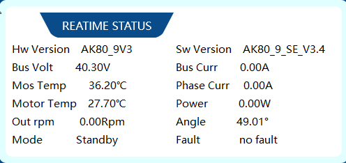

# Chapter 2 — Currents, Torque, and FOC Inside the AK80-9

---

**FirstAuthor:** Pritam Ranjan Kalita, Project Assistant, WeRoCon Laboratory, August 2026. <br>
**Disclaimer:** This tutorial was written and reviewed by the author. AI-assisted tools were used to support drafting, editing, and language refinement, with all technical content verified by the author.

---

When you start working with the CubeMars AK80-9 V3.0 KV100, you will notice something confusing very quickly. Many different things are measured in **amperes (A)**. Your bench power supply shows a current. CubeMarsTool shows a current. The CAN protocol tables in the manual talk about current. The datasheet gives a rated current and a peak current.

Here is the surprise: **these are not all the same current.** Mixing them up is the most common mistake new users make with this actuator. It leads to wrong torque calculations and wrongly sized power supplies.

This chapter is the "physics chapter" of our series. It explains, step by step and in one place, what is happening electrically inside the AK80-9. Every later chapter will point back here instead of explaining these ideas again. Here is our path:

- the six different "currents" and how to tell them apart (§1);
- the DC input current, and why it is *not* the torque current (§2);
- how the driver turns one fixed DC voltage into three adjustable motor voltages, using PWM and something called an inverter (§3);
- why the three motor currents must keep changing all the time (§4);
- Field-Oriented Control (FOC) explained in one page: the two magic numbers $I_d$ and $I_q$ (§5);
- how $I_q$ becomes torque at the output shaft, and why there are *two* torque constants (§6–7);
- short previews of brake current and MIT torque, which later chapters cover fully (§8, §11);
- the difference between what the protocol *allows* and what the motor can *survive* — the ±60 A trap (§9);
- and finally, one big diagram showing the complete chain from power supply to output shaft (§10).

Do not worry — you do not need to command the motor at all in this chapter. The only hands-on part is a simple "look at the numbers" demo at the end. If you want to learn about the *units* the motor uses (degrees, ERPM, rad/s, N·m), that is Chapter 3. The software and the first power-up are in Chapter 4.

## 1. The Cast List: Six Things Measured in Amps

Before any physics, let us meet the full cast. The table below lists every quantity around this actuator that is measured in amperes. Keep coming back to this table. Whenever a manual page or a telemetry field mentions "current" and you are not sure *which* current it means, this table will tell you:

| Current | Symbol | What it really is | Where you meet it |
|---|---|---|---|
| DC input current | $I_{\mathrm{in}}$ | Current flowing from your external DC power supply into the driver (also called *DC bus current*) | Bench power supply display; §2 |
| Phase currents | $i_a, i_b, i_c$ | The real, physical currents inside the three motor windings | Motor windings; §§3–4 |
| Direct-axis current | $I_d$ | A mathematical current component used by FOC, kept ≈ 0 | Inside the controller; §5 |
| Quadrature-axis current | $I_q$ | The mathematical current component that produces torque | Current Loop Mode command and telemetry; §§5–7, Ch 6 |
| Brake current | $I_{\mathrm{brake}}$ | A commanded braking-current *size* (no + or − sign) | Current Brake Mode; §8, Ch 7 |
| Rated / peak current | $I_{\mathrm{rated}}, I_{\mathrm{peak}}$ | The safety limits from the datasheet: **12 A rated, 28 A peak** | Ch 1's ratings table; §9 |

And here is the one key idea that the whole chapter is built on:

> **The current shown on your external power supply is NOT the current being commanded, controlled, or turned into torque inside the driver.** Each of the six quantities above lives at a different point in the electrical chain.

Why does this matter to you? Because you will need this distinction every time you use Current Loop Mode (Ch 6), read CubeMarsTool telemetry, choose a DC power supply, calculate torque, or read the protocol tables in the manual.

## 2. DC Input Current $I_{\mathrm{in}}$ and Input Power

First, remember what the AK80-9 actually is. It is not a simple DC motor that you connect straight to a power supply. It is an integrated actuator. Inside the same housing there is a three-phase permanent-magnet motor, a MOSFET inverter, an encoder, a small computer running FOC, and a 9:1 planetary gearbox (see Ch 1 §1). So your power supply feeds the *driver electronics*, not the motor windings directly.

Now imagine the actuator is connected to a 48 V bench power supply, and the front panel of the supply shows:

```text
Voltage: 48.0 V
Current: 2.0 A
```

That 2 A on the display is (approximately) the DC input current: $I_{\mathrm{in}} \approx 2$ A. The electrical power going into the actuator is easy to calculate:

$$
P_{\mathrm{in}} = V_{\mathrm{DC}} \, I_{\mathrm{in}} = 48 \times 2 = 96\ \mathrm{W}.
$$

So far so good. But here is the important part. This 2 A is **not** the motor's torque-producing current. In general,

$$
I_{\mathrm{in}} \neq I_q .
$$

Why not? Because between the supply and the windings sits a switching inverter. Its job is to convert DC electrical power into the three-phase form the motor needs. How different the two currents are depends on many things: motor speed, mechanical load, commanded torque, PWM duty, acceleration, losses, efficiency, and whether the motor is momentarily acting as a generator.

Here is a simple way to build intuition. The inverter behaves like a power converter. It roughly conserves **power**, not current. At low speed, the motor needs only a small voltage. So the driver can push a *large* current through the windings while pulling only a *small* current from the 48 V supply. In fact, at low speed and high torque, $I_q$ can be several times bigger than $I_{\mathrm{in}}$. Strange at first — but perfectly normal.

One more situation from that list deserves a short note: "acting as a generator." When the motor is braking, mechanical energy flows *backwards* through the inverter, toward the DC bus. During those moments, the DC-side current can drop toward zero or even reverse, while a large current still flows in the windings. It is one more case where the two currents clearly go separate ways. This matters in practice for Brake mode (Ch 7), and for power supplies that do not like receiving current back.

The practical rules to take away:

- Never take the number from your power supply's front panel and put it into a torque formula that expects $I_q$ (§6).
- If CubeMarsTool shows an $I_q$ value that disagrees with your bench supply's display, do not panic. Neither instrument is broken. They are simply measuring different points in the chain (§10's diagram shows both points).

In Chapter 6, once you can command $I_q$ yourself, you can check this on real hardware: glance from the power supply display to the CubeMarsTool current reading, side by side, and you will see with your own eyes that they are different.

## 3. The Inverter and PWM: How One Fixed DC Voltage Becomes Adjustable Motor Voltage

Here is the first puzzle of motor control. Your supply gives one fixed DC voltage with a fixed polarity: +48 V and ground, always. But a three-phase motor needs three voltages that keep changing — in size *and* in sign. How can fixed DC produce that?

The answer is a power-electronics circuit called the **three-phase MOSFET inverter**. It contains six electronic switches (MOSFETs), arranged in three pairs:

```text
                         +Vbus
                           |
              +------------+------------+
              |            |            |
             Q1           Q3           Q5
              |            |            |
              A            B            C
              |            |            |
             Q2           Q4           Q6
              |            |            |
              +------------+------------+
                           |
                          GND
```

Each motor phase (A, B, C) hangs between one pair of switches. Such a pair is called a *half-bridge*: Q1/Q2 serve phase A, Q3/Q4 serve phase B, Q5/Q6 serve phase C. By switching these MOSFETs on and off very quickly, the controller decides the electrical conditions at the three motor terminals. In one line, the inverter's job is:

```text
Fixed DC power  →  MOSFET switching  →  controlled three-phase excitation
```

### PWM: getting an "in-between" voltage from a switch that only knows ON and OFF

There is a problem, though. Each switch has only two states. It is either fully ON or fully OFF. It cannot output an in-between voltage like 12 V from a 48 V bus. So how do we get in-between voltages?

The trick: switch extremely fast, and play with the *timing*.

```text
48 V    ┌───────┐       ┌───────┐
        │       │       │       │
        │       │       │       │
 0 V ───┘       └───────┘       └───────
        ◄──Ton──►
        ◄─────Tpwm─────►
```

Look at one switching period, $T_{\mathrm{PWM}}$. Suppose the switch stays ON for a time $t_{\mathrm{ON}}$ inside that period. We define the **duty cycle** (also called duty ratio):

$$
D = \frac{t_{\mathrm{ON}}}{T_{\mathrm{PWM}}}.
$$

In plain words: *duty cycle tells us what fraction of each period the switch stays ON.* The average voltage over one period is then simply:

$$
V_{\mathrm{avg}} = D \, V_{\mathrm{bus}}.
$$

This technique is called **Pulse-Width Modulation (PWM)**. The name comes from the fact that the controller modulates (adjusts) the width of the ON pulses. With the AK80-9's nominal 48 V bus, it looks like this:

| Duty $D$ | ON pattern inside one period (conceptual) | $V_{\mathrm{avg}} = D \times 48$ V |
|---:|---|---:|
| 0.25 | `ON ON OFF OFF OFF OFF OFF OFF` | 12 V |
| 0.50 | `ON ON ON ON OFF OFF OFF OFF` | 24 V |
| 0.75 | `ON ON ON ON ON ON OFF OFF` | 36 V |
| 1.00 | `ON ON ON ON ON ON ON ON` | 48 V |

Does the motor "feel" the fast ON/OFF jumps? No — the motor windings have inductance, which smooths out the fast switching. The motor effectively responds to the *average* voltage, not to the individual pulses. So the intuition to remember is simple: **larger $|D|$ → more voltage drive available.**

One warning before you get too comfortable with this picture. The single-switch example above teaches you what "duty" *means*. It does **not** mean that a CubeMars Duty Cycle command of 0.5 puts a steady 24 V on all three phases. The real inverter runs three half-bridges, each with its own continuously changing duty pattern, and the phase voltages change all the time. The relationship between the signed CubeMars duty *command* and the physical per-MOSFET duty patterns is its own topic, and it belongs in the Duty Cycle Mode chapter (see Ch 5 §1).

### The inverter also controls voltage polarity (the + and − direction)

Adjustable voltage size is only half the story. To rotate the motor, the phase currents must also be able to *reverse direction*. And for that, the applied voltages must be able to reverse their relative polarity. Let us see how a fixed-polarity supply can do this.

Look at two motor terminals, A and B. The voltage between them is $V_{AB} = V_A - V_B$:

```text
Case 1:  A at higher potential          Case 2:  B at higher potential
         V_AB > 0                                V_AB < 0
         A ────────►  B                          A ◄──────── B
```

Notice: the DC supply itself never changes. It stays `+Vbus / GND` the whole time. What changes is *which motor terminal the inverter connects closer to the higher potential*. By re-timing the six switches, the controller can flip the sign of $V_{AB}$ (and $V_{BC}$, $V_{CA}$) whenever it wants. That is the whole trick: a fixed-polarity source drives current in both directions through every winding.

### Voltages cause currents — not the other way around

One small but important physical detail, which will help you understand the FOC loop in §5. The inverter directly controls the *voltages* at the motor terminals. It cannot instantly force a current to be some value. Why? Because the windings are inductive, and current in an inductor cannot jump instantly. The chain of cause and effect is:

```text
MOSFET switching → phase voltages → currents begin to change → phase currents
```

So the accurate statement is: **the inverter controls the size and relative polarity of the phase voltages, and those voltages then steer the phase currents in the desired directions.** Apply the right voltage, at the right time, with the right polarity — and the current will follow.

## 4. The Phase Currents $i_a$, $i_b$, $i_c$ — and Why They Must Keep Changing

Now let us look inside the motor itself. The **stator** is the part that does not move; it carries the three phase windings A, B, and C. The **rotor** is the part that rotates; it carries permanent magnets. When current flows through the windings, it creates a magnetic field, and that field interacts with the rotor magnets to produce torque:

```text
Current through stator windings → stator magnetic field
        → interaction with rotor magnets → electromagnetic torque → rotation
```

Here comes the second puzzle. What if we simply fed the three phases *constant* currents? We would get a magnetic field that stands still. The rotor would turn to line up with it — and then stop. No continuous rotation!

For continuous rotation, we need a **rotating stator magnetic field**. And to make the field rotate, the three phase currents must keep changing — in size, in direction, and with the right timing.

How should they change? Conceptually, something like this:

$$
i_a = I\sin(\theta_e), \qquad i_b = I\sin(\theta_e - 120°), \qquad i_c = I\sin(\theta_e + 120°),
$$

where $I$ is the current amplitude and $\theta_e$ is the rotor's *electrical* angle. ($\theta_e$ is the angle FOC uses to decide how the phase currents should vary as the rotor turns. How it relates to the mechanical angle, through the pole pairs, is explained in Ch 3 §2.) The real drive waveforms are more complicated than these clean sine waves, but the equations show the essential point:

> **Each phase current must swing both positive and negative during every electrical cycle.**

For example, at one instant the currents might be $i_a = +5$ A, $i_b = -3$ A, $i_c = -2$ A. A moment later: $i_a = -2$ A, $i_b = +5$ A, $i_c = -3$ A.

Why does this rotate the field? Picture the three windings as three electromagnets standing around the rotor. As the current distribution advances from one pattern to the next, the *combined* magnetic field points in a slightly different direction each time:

```text
      ↗              →              ↘              ↓
  [Rotor]        [Rotor]        [Rotor]        [Rotor]     ...and around it goes
```

The rotor's permanent magnets chase this rotating field — and that chase is what produces torque and rotation. But the chase only works if the field's timing follows the rotor's *actual* position accurately. Deciding that timing is exactly the job of FOC, coming up in §5.

One more useful fact. The three phases are not three independent current sources. In the AK80-9's three-wire connection, for an ideal balanced motor:

$$
i_a + i_b + i_c \approx 0.
$$

Our example obeys this: $5 - 3 - 2 = 0$. In simple words: whatever current flows *into* the motor through one terminal must flow *out* through the others:

```text
                +5 A
                  ▼
               Phase A
                  │
                MOTOR
               /     \
         Phase B     Phase C
            ▲            ▲
          −3 A         −2 A
```

The + and − signs just describe the current direction, according to the chosen reference convention. A moment later, the distribution shifts as the field keeps rotating.

Let us now state the driver's full task in one sentence: *from a fixed DC bus, produce three phase currents that alternate in exactly the right pattern, synchronized with where the rotor actually is.* The inverter and PWM (§3) provide the *tools* for doing this. Deciding the *pattern* is the job of FOC.

## 5. FOC in One Page: Clarke, Park, $I_d$ and $I_q$

**Field-Oriented Control (FOC)** is the technique the AK80-9 uses to manage the motor's three-phase behavior relative to the rotor. The encoder tells the controller the rotor's electrical position $\theta_e$ at every moment. Why is that so important? Because the correct current pattern depends on where the rotor magnets are pointing *right now*:

```text
Rotor now:        A moment later:
      N                    N
      ↑                   ↗
      ●                  ●
      ↓                 ↙
      S                S
```

Once the rotor has moved, the current pattern that was correct a moment ago is wrong now. FOC continuously recalculates the pattern from $\theta_e$, so the stator field always stays correctly oriented relative to the rotor magnets.

### Two transformations, two currents

There is a practical problem: working directly with three constantly alternating currents is mathematically painful. FOC solves this with a clever change of viewpoint. It transforms the currents into a coordinate frame that *rotates together with the rotor*. This happens in two steps:

1. **Clarke transformation:** $(i_a, i_b, i_c) \rightarrow (i_\alpha, i_\beta)$ — the three phase currents are reduced to two components in a stationary frame.
2. **Park transformation:** $(i_\alpha, i_\beta) \xrightarrow{\theta_e} (I_d, I_q)$ — those two components are rotated into the rotor's own frame.

In the rotating frame there are two axes. The d-axis points along the rotor's magnetic flux, and the q-axis is perpendicular to it. The two resulting current components have beautifully simple meanings:

- **$I_d$** — the flux-related component. For a permanent-magnet motor in normal operation, the controller keeps $I_d^* \approx 0$. Why? The rotor magnets already provide the flux, so current spent on the d-axis mostly just makes heat, not torque. Good news: you never command $I_d$ yourself in any Servo or MIT mode. The internal controller handles it.
- **$I_q$** — the torque-producing component. To a very good approximation, all the useful torque comes from $I_q$, through the torque constant (§6).

> **$I_d$ and $I_q$ are mathematics, not wires.** There is no fourth or fifth cable carrying them. They are components of the *same* physical stator-current vector, just expressed in a rotating coordinate system. And here is why this viewpoint is so useful: if the sinusoidal phase currents are balanced and correctly timed, $I_d$ and $I_q$ come out as *steady, DC-like numbers*. Controlling two slowly changing numbers is much, much easier than chasing three sine waves.

### The FOC control loop

Here is the complete loop, which the controller runs thousands of times per second:

```text
Desired Id* (≈0), Iq*
        |
        v
Compare with measured Id, Iq   ◄── Clarke + Park on measured ia, ib, ic (using θe)
        |
        v
Current controllers → required Vd, Vq
        |
        v
Inverse transformation (using θe) → three-phase voltage commands
        |
        v
PWM / modulation → six MOSFET gate signals
        |
        v
Inverter → phase voltages → ia, ib, ic → motor torque
```

Let us walk through one concrete pass. Suppose Current Loop Mode asks for $I_q^* = 2.0$ A, but the transformation of the measured phase currents says the actual $I_q$ is only 1.5 A:

```text
Desired Iq = 2.0 A     Actual Iq = 1.5 A     Current error = +0.5 A
```

The current controller sees the +0.5 A error and concludes: "more electrical drive needed." It raises its voltage commands $V_d$, $V_q$. The inverse transformation (using $\theta_e$) turns those into three-phase voltage commands. The PWM stage converts them into new switching duty patterns. The inverter applies them. The phase currents grow. The loop measures again — and repeats. This happens so fast that, from the outside, $I_q$ simply looks pinned to its target.

### FOC, PWM, and the inverter have different jobs

It helps a lot to keep these three layers mentally separate, because later chapters refer to them individually:

- **FOC** answers the question: *"what electrical action is needed, relative to the rotor?"* It lives in the world of $\theta_e$, $I_d$, $I_q$, $V_d$, $V_q$.
- **PWM / modulation** answers: *"how can that voltage action be built from a fixed DC bus?"* It converts voltage commands into switching duty patterns.
- The **MOSFET inverter** does the physical switching.

```text
FOC ── decides the desired electrical action ──► voltage commands
        │
        ▼
PWM / modulation ── decides the switching pattern ──► gate signals
        │
        ▼
MOSFET inverter ── physically switches the DC bus ──► three motor phases
```

Together, these three let a plain DC supply produce phase voltages of controlled size, relative polarity, and timing — and through them, phase currents of controlled size and direction.

Here is a fact worth remembering for the rest of the series: **every** control mode you will learn — Duty, Current, Brake, Velocity, Position, Position–Velocity, and MIT — ultimately works through this same FOC + PWM + inverter machinery. The modes differ only in *which quantity the outermost loop regulates* (see Ch 4 §1 for the mode map, and Ch 12 for how to choose between them).

## 6. From $I_q$ to Torque: The Two Torque Constants

This section is the series' one full treatment of the torque–current relationship. Later chapters (especially Ch 6 on Current Loop Mode and Ch 11 on MIT mode) will use these results without deriving them again.

First, let us be clear about what an $I_q$ command actually *means*. The manual defines Current Loop Mode as giving "a specified $I_q$ current" to the motor, with output torque $= i_q \cdot K_T$. So when you type $I_q^* = 2$ A into CubeMarsTool, the command does **not** mean "make the external DC supply provide 2 A" (§2). It means: *regulate the motor's torque-producing FOC current component to 2 A.* The internal controller then measures the phase currents, computes the actual $I_d$ and $I_q$, compares them with the command, and adjusts the PWM until they match — the loop from §5.

### 6.1 Why are there two constants?

If you read CubeMars documentation for the AK80-9, you will find **two** torque-constant values: **0.095 N·m/A** and **0.5701 N·m/A**. Which one is correct? Both! They simply describe torque at two different *places* in the actuator.

Remember that the AK80-9 is a *geared* actuator. The internal motor produces electromagnetic torque first, and then the 9:1 planetary gearbox multiplies that torque before it reaches the output shaft:

```text
Iq ──► ELECTRIC MOTOR ──► motor-side torque ──► 9:1 GEARBOX ──► output-shaft torque
```

The two constants belong to those two torque locations: one for the motor side (before the gearbox) and one for the output side (after it).

### 6.2 The motor-side constant: $K_{T,m} = 0.095$ N·m/A

This constant links $I_q$ to the electromagnetic torque of the internal motor, *before* the gearbox:

$$
\tau_m = K_{T,m}\, I_q = 0.095\, I_q ,
$$

with $\tau_m$ in N·m when $I_q$ is in A. Example: for $I_q = 2$ A, we get $\tau_m = 0.095 \times 2 = 0.19$ N·m. That looks tiny — and it is! The raw internal motor is a fast, low-torque machine. Use 0.095 N·m/A only when you specifically want the torque produced by the internal rotor itself.

### 6.3 The gearbox multiplies torque — but not perfectly

A perfect (ideal) 9:1 gearbox would multiply torque exactly by 9. That would give an ideal output-side constant of $9 \times 0.095 = 0.855$ N·m/A. For our 2 A example: $9 \times 0.19 = 1.71$ N·m at the output.

But a real gearbox is not 100% efficient. Gear meshing, bearings, and seals all create friction, and friction eats some of the torque. So the real output torque is lower than the ideal value. If we call the gearbox efficiency $\eta_g$ and the gear ratio $N$, then:

$$
\tau_{\mathrm{out}} = \tau_m N \eta_g = K_{T,m}\, N\, \eta_g \, I_q .
$$

The product $K_{T,m} N \eta_g$ acts as an **effective output-side torque constant** — one single number that already includes the gearbox and its losses.

### 6.4 The output-side constant: $K_{T,\mathrm{out}} = 0.5701$ N·m/A

This is exactly that number, as stated by CubeMars for the AK80-9:

$$
\tau_{\mathrm{out}} \approx 0.5701\, I_q .
$$

Example: for $I_q = 2$ A, $\tau_{\mathrm{out}} \approx 0.5701 \times 2 \approx 1.14$ N·m. So if your practical question is *"I commanded 2 A of $I_q$ in Current Loop Mode — how much torque do I get at the output shaft?"*, the answer is about 1.14 N·m.

(By the way, if you compare 0.5701 with the ideal 0.855, you get $0.5701 / 0.855 \approx 0.67$. That is the effective gearbox-and-drivetrain efficiency hidden inside CubeMars's stated relationship.)

### 6.5 Which constant should I use?

It depends entirely on *which torque you want to calculate*:

| What you want to calculate | Constant | Equation |
|---|---:|---|
| Internal motor electromagnetic torque, before gearbox | **0.095 N·m/A** | $\tau_m = 0.095\, I_q$ |
| Ideal 9:1 gearbox output, ignoring losses | **0.855 N·m/A** | $\tau_{\mathrm{out,ideal}} = 9(0.095) I_q$ |
| Practical output-shaft torque, per CubeMars's stated relationship | **0.5701 N·m/A** | $\tau_{\mathrm{out}} \approx 0.5701\, I_q$ |

For most robotics work, **output-shaft torque is the one you care about** — it is what your robot joint, wheel, or linkage actually receives. So $\tau_{\mathrm{out}} \approx 0.5701\, I_q$ will be your everyday formula.

> **Do not use the DC input current in these calculations.** The $I_q$ in every equation of this section is the FOC q-axis current — never the number on your power supply's front panel (§2).

### 6.6 A model, not a torque sensor

One honest caution before we move on. The formula $\tau = K_T I_q$ tells you the *expected* torque for a given q-axis current. It is an engineering model — not a measurement of the true external torque. The real delivered torque can differ, because of:

- gearbox, bearing, and seal friction (especially near zero speed and when the direction reverses),
- motor temperature (magnet strength and winding resistance drift as things heat up),
- current-measurement error and controller calibration,
- manufacturing variation and operating conditions.

If your application truly needs an accurate measurement of the actual shaft torque, use a calibrated torque sensor, or build an experimentally validated model of your actuator. But for learning, control design, and understanding Current Loop behavior, the $K_T$ relationships above are exactly the connection you need between current and torque.

## 7. Signed $I_q$ Means Torque Direction

The q-axis current carries a sign, and the sign has physical meaning: $I_q = +2$ A and $I_q = -2$ A produce torques of equal size in *opposite* directions — about $+1.14$ N·m and $-1.14$ N·m respectively. Which physical rotation sense counts as "positive" depends on your motor's configured direction convention, so check it once on your setup and write it down. Two interesting consequences of signed torque — that a negative torque first *brakes* a spinning motor and only then reverses it, and that torque direction is not the same thing as rotation direction — are demonstrated on real hardware in Ch 6 §3–4.

## 8. Brake Current: A Short Preview

Current Brake Mode accepts a commanded braking-current **size** (protocol range 0–60 A) and uses it to resist motion and hold the shaft near its current position; CubeMars explicitly warns you to watch motor temperature while using it. Unlike Current Loop's signed $I_q$, the brake command has no + or − sign — the controller itself chooses whichever torque direction opposes the motion. And note: holding a load at zero speed still means real winding current, and real heating. The full story — the direction logic, holding behavior, thermal limits, and demos — is Chapter 7.

## 9. Ratings vs Protocol Ranges: 12 A, 28 A, and ±60 A

This section states, once for the entire series, a distinction that trips up almost every new user:

> **Command-encoding range ≠ motor rating.**

We now have two very different sets of current numbers in front of us, and they must never be mixed.

**Set one — the AK80-9 V3.0's published specifications** (Ch 1 §3): a **rated current of 12 A**, which the motor can carry continuously, and a **peak current of 28 A**, which is allowed only for short bursts. These numbers describe what the *hardware* can survive.

**Set two — the communication protocol's numeric ranges.** The protocol is shared by the whole AK driver family, so its number ranges are wider than any single motor's ratings:

| Protocol item | Encoding | Numeric range | Physical range |
|---|---|---|---|
| Current Loop command (CAN ID 1) | int32, 1 LSB = 0.001 A | −60 000 … +60 000 | **−60 … +60 A** |
| Brake-current command (CAN ID 2) | int32, 1 LSB = 0.001 A | 0 … 60 000 | **0 … 60 A** |
| Telemetry current field (upload frame) | int16, 1 LSB = 0.01 A | −6 000 … +6 000 | **−60 … +60 A** |

The ±60 A figures describe what the *message format can express* — not what the AK80-9 can safely carry. There is even a likely reason for that exact number: the manual's driver specifications list a maximum current of 60 A for the big-size AK driver board. The protocol range fits the strongest member of the family, and every smaller motor simply uses part of it. The driver will happily *accept* a 45 A command. The AK80-9's windings will not be happy about it at all. Treat 12 A as your continuous ceiling and 28 A as a short-burst ceiling — and stay far below both while you are learning (Ch 4 §6's ground rules).

So, whenever you read a number range in the manual's protocol chapter, ask yourself two separate questions: *what can the message encode?* and *what can my motor tolerate?* The first question is answered by the tables above. The second is answered by Ch 1's ratings table. Only the second question protects your hardware.

One naming caution, stated carefully because this chapter is the series' reference on the topic. The Current Loop command is explicitly an **$I_q$** command — the manual defines the mode as "a specified Iq current given to the motor." The brake-current command, however, is **not** labelled $I_q$ by the manual. It is a braking-current *size*, and the firmware decides the direction (§8). So the correct summary is: Current Loop supports a signed $I_q$ command range of −60 to +60 A, while Current Brake supports a braking-current size range of 0–60 A. And neither of those ranges is a rating.

## 10. The Full Chain, End to End

Everything in this chapter fits into a single picture — the complete path from your bench supply to the torque at the output shaft. This diagram is the series' master reference; later chapters will point to it rather than redraw it.

```text
                EXTERNAL DC SUPPLY
                      48 V
                        │
                    I_input
                        │
                        ▼
     ┌─────────────────────────────────────┐
     │             AK80-9 DRIVER           │
     │                                     │
     │       Higher-Level Controller       │
     │      (your selected control mode)   │
     │                  │                  │
     │         gives desired Iq*           │
     │                  ▼                  │
     │           FOC Controller ◄──────────┼───── Id, Iq (measured)
     │                  │                  │              ▲
     │          voltage commands           │              │
     │                  ▼                  │      Park Transformation
     │                 PWM                 │              ▲
     │                  │                  │            α / β
     │                  ▼                  │              ▲
     │           MOSFET Inverter           │     Clarke Transformation
     └──────────────────┬──────────────────┘              ▲
                        │                                 │
                  ia   ib   ic ───────────────────────────┘
                   \    │    /       (the same phase currents are
                    \   │   /         measured and fed back to FOC)
                     ▼  ▼  ▼
                  MOTOR PHASES
                        │
                        ▼
                 ELECTROMAGNETIC
                   MOTOR TORQUE
                (KT = 0.095 N·m/A)
                        │
                        ▼
                   9:1 GEARBOX
             (× 9, minus gear losses)
                        │
                        ▼
                   OUTPUT-SHAFT
                      TORQUE
                (KT ≈ 0.5701 N·m/A)
```

How to read this diagram — it contains three flows in one picture:

1. **The power path (outside the box, top to bottom):** the 48 V supply delivers the input current $I_{\mathrm{in}}$ to the driver; the DC bus feeds that power directly to the MOSFET inverter; the inverter pushes it into the three motor phases; and the motor turns it into torque, which the gearbox multiplies on the way to the output shaft.
2. **The command path (inside the box, top to bottom):** the higher-level controller — whichever control mode you selected (Duty, Velocity, Position, MIT, …) — works out the desired torque-producing current $I_q^*$ and gives it to the FOC controller. FOC turns it into voltage commands, PWM turns those into switching patterns, and the inverter carries them out. This is the §5 loop drawn vertically.
3. **The measurement path (the right-hand branch, bottom to top):** the same three phase currents that drive the motor are also *measured*, sent through the Clarke transformation (→ α/β), then the Park transformation (→ $I_d$, $I_q$), and fed back into the FOC controller so it can compare "measured" against "desired." The Clarke/Park branch is mathematics running inside the controller — not a separate electrical circuit.

To make the picture concrete, let us walk one command through it. You type $I_q^* = 2$ A in Current Loop Mode:

1. The FOC loop (§5) adjusts the PWM until the transformed phase currents give a measured $I_q = 2$ A. The three physical currents $i_a, i_b, i_c$ are alternating, sine-like waveforms whose size and timing *encode* that 2 A q-axis value.
2. The motor produces $\tau_m = 0.095 \times 2 = 0.19$ N·m of electromagnetic torque (§6.2).
3. The gearbox multiplies it — minus losses — to $\tau_{\mathrm{out}} \approx 0.5701 \times 2 \approx 1.14$ N·m at the output shaft (§6.4).
4. Meanwhile, the DC supply delivers whatever input current this operating point happens to demand — possibly far less than 2 A at low speed, and equal to 2 A only by coincidence (§2). The supply's front panel tells you about the *top* of the diagram, never the middle.

Every mode in this series drives this same chain. Only the outermost control loop is different.

## 11. What Current Does MIT Mode Use?

MIT (Force Control) mode, the topic of Chapter 11, does not ask you for a current at all. Its command packet carries a desired position, a desired velocity, two gains ($K_p$ and $K_d$), and a feedforward *torque* — and for the AK80-9, that torque command is written directly in newton-metres, over a ±18 N·m range. Internally, the driver converts the resulting torque request into motor currents through exactly the FOC machinery of §5 and the torque relationships of §6. There is no separate "MIT current." The practical rule for you: **an MIT torque command in N·m is not interchangeable with a Servo Current Loop command in A**, even though one is ultimately implemented by the other. How the MIT equation combines its five inputs into a torque request is Chapter 11's opening topic.

## Demo — Watching the Currents at Idle

This chapter's demo is pure observation: no motion, no commands, no load. Its goal is simple — to attach real, on-screen numbers to the quantities we just defined, *before* you ever command the motor. If you have not yet connected and calibrated the actuator, come back and do this demo after Chapter 4's first power-up procedure (calibrated per Ch 4, unloaded).

**Starting condition:** actuator powered from the 48 V supply, calibrated per Ch 4, no load on the shaft, no control mode active.

**Steps and what you should observe:**

1. Connect with CubeMarsTool and open the **Real-time Data** panel.
2. Find the current, voltage, and temperature fields, and match each one to a row of §1's table. With the motor idle, you should see: bus voltage ≈ 48 V (whatever your supply provides), bus current ≈ 0 A, motor current ≈ 0 A, and driver temperature near room temperature. (The bus current is not exactly zero — the driver has a small standby draw of ≤ 50 mA — but it is far too small to see here.)
3. Think about what that motor-current field *is*. It is the FOC-side view of the current, not a reading of your power supply.
4. Now compare with your bench supply's front panel: at idle, it also shows nearly 0 A. Enjoy the moment — this is the *one* operating point where "supply current" and "motor current" agree, because both are basically zero. Every interesting operating point will separate them, as Ch 6's demos will show you once you can command $I_q$. Keep Figure 2.1 as the baseline for that future comparison.

**Expected values at idle:**

| Field | Expected reading | Which quantity (§1 table) |
|---|---|---|
| Input / bus voltage | ≈ your supply voltage (nominally 48 V) | the supply side of $I_{\mathrm{in}}$'s world |
| Current | ≈ 0.00 A | motor current, per §9's telemetry row |
| Driver temperature | near room temperature | thermal telemetry (int8, −20…127 °C) |
| Position / speed | unchanging values, 0 speed | Ch 3's units |

If any field shows something very different at idle — tens of amps, or an error code other than 0 — stop. Re-check your wiring and calibration (Ch 4) before moving on to any mode chapter.


<div style="display: flex; flex-direction: column; align-items: center; justify-content: center; width: 100%;">
  <figure style="text-align: center; margin: 0;">
    <figure>
        
        <figcaption>
        Figure 2.1: CubeMarsTool Real-time Data panel when the motor is at idle.
        <br>
        <i>
        Screenshot captured from CubeMars' CubeMarsTool Upper Computer parameter-configuration software, © CubeMars / Nanchang Kude Intelligent Technology Co., Ltd.
        </i>
        </figcaption>
    </figure>
  </figure>
</div>

There is no video for this chapter — nothing moves, and the phenomena of interest (currents, transformations, torque constants) are either numbers in telemetry or mathematics inside the controller.

## Where These Ideas Go Next

This chapter is a hub. Here is where each of its threads continues in the series:

| Concept established here | Continues in |
|---|---|
| Units for speed, position, torque (ERPM, degrees, rad/s, N·m) | Ch 3 |
| CubeMarsTool, calibration, first power-up, safety ground rules | Ch 4 |
| Duty command vs physical PWM duty; back-EMF and voltage headroom | Ch 5 |
| Commanding $I_q$; torque → acceleration, not speed; $I_q$ ≠ supply-current demos | Ch 6 |
| Brake current, holding, "zero speed ≠ zero current ≠ zero heat" | Ch 7 |
| The MIT equation and torque-in-N·m commands | Ch 11 |
| Choosing between all the modes | Ch 12 |

## Key Takeaways

- Six different quantities around this actuator are measured in amps. The number on your power supply's display is only one of them — and it is never the one that belongs in a torque formula.
- The inverter + PWM build adjustable, sign-reversible phase voltages from a fixed 48 V bus. Those voltages drive the alternating phase currents that create the rotating magnetic field.
- FOC collapses three alternating phase currents into two steady components: $I_d$ (flux, kept ≈ 0) and $I_q$ (torque). They are coordinates, not wires.
- $\tau_m = 0.095\, I_q$ before the gearbox; $\tau_{\mathrm{out}} \approx 0.5701\, I_q$ at the output shaft. Use the output-side constant for robotics work.
- A signed $I_q$ sets the torque direction. The brake command is an unsigned size, and the firmware picks the direction.
- Protocol ranges (±60 A command, ±60 A telemetry) are encoding limits shared across the AK family. The AK80-9's real limits stay 12 A continuous / 28 A peak.

## Safety Notes

- Never treat the ±60 A protocol range as permission. Keep commanded and observed currents within the AK80-9's 12 A continuous / 28 A peak ratings — and much lower while learning.
- Sustained current at zero or low speed (holding, stalling, braking) turns electrical power almost entirely into heat. Watch the driver-temperature telemetry whenever the shaft is loaded but not moving (full treatment in Ch 7 §5).
- Follow Ch 4 §6's series ground rules for every hands-on step: start with no load, use conservative commands, and know where the Stop button is.

## Sources / References

1. **CubeMars AK Series Module Product Manual, Ver. 3.0.1 (2025.03.14)** — specifically: §4.1 "Servo Mode Control Modes and Description" (p. 31: mode definitions; Current Loop defined as a specified $I_q$ current with output torque = $i_q \cdot K_T$; Current Brake defined as a specified braking current with temperature warning); §4.1.2 "Current Loop Mode" (p. 33: int32 encoding, −60 000…60 000 ↔ −60…60 A); §4.1.3 "Current Brake Mode" (p. 33–34: int32 encoding, 0…60 000 ↔ 0…60 A); §4.3.1 "CAN Upload Message Protocol" (p. 42: telemetry current int16, ±6 000 ↔ ±60 A, 0.01 A/LSB); §3.3.1.5 "Current Loop Mode" and §3.3.1.7 "Braking Loop Mode" (p. 26–27: GUI I and B command fields); §4.2 (p. 37–38: MIT mode command contents) and the MIT parameter-range table (p. 39: AK80-9 torque range ±18 N·m); §1.1/§1.2 driver product specifications (p. 7–8: 48 V rated / 18–52 V allowable working voltage, ≤ 50 mA standby consumption).
2. **CubeMars AK80-9 V3.0 KV100 product specifications**, cubemars.com (accessed August 2026) — rated/peak current (12 A / 28 A), torque constant $K_T$ = 0.095 N·m/A, output torque coefficient 0.5701 N·m/A, 9:1 reduction; summarized in this series' reference table (Ch 1 §2).
3. **CubeMarsTool upper-computer software** — Real-time Data panel shown in Figure 2.1; © CubeMars / Nanchang Kude Intelligent Technology Co., Ltd.
