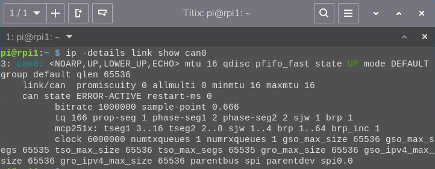
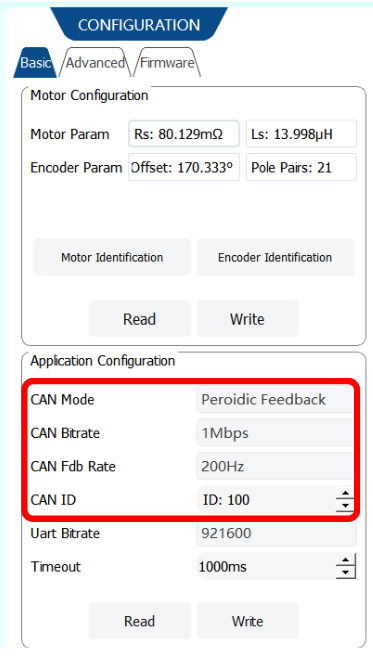
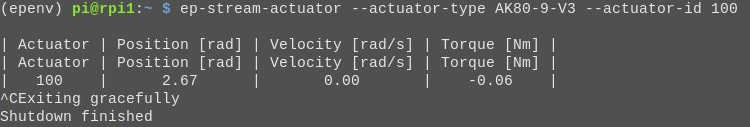

# Chapter 13 — From Bench to Robot: Controlling the AK80-9 from a Raspberry Pi 5 using Python

---

**FirstAuthor:** Pritam Ranjan Kalita, Project Assistant, WeRoCon Laboratory, August 2026. <br>
**Disclaimer:** This tutorial was written and reviewed by the author. AI-assisted tools were used to support drafting, editing, and language refinement, with all technical content verified by the author.

---

Chapter 12 called itself the final chapter — and it is in a way ! You now know all of the AK80-9's control tools, and you know which one to pick for which job. But every single command so far was sent the same way: by clicking buttons in CubeMarsTool UpperComputer Software on a PC, using R-Link UART connection. That was perfect for *learning* the modes. However, this way is useless for our purpose - *the research*. A gait controller cannot click buttons. Chapter 12 §7.2 ended with a sentence worth re-reading:

> *"A gait controller in our lab is, at its lowest level, a program that tracks which point of the gait cycle the wearer is in and streams the matching five numbers to this motor."*

This chapter is where we build the machine that can run that program. Remember the two-level control diagram from the very first pages of Chapter 1 §1? The top box was labelled *"YOU (or your robot's main computer)"*. Until today, "you" meant a human at a GUI. From today, it means a **Raspberry Pi 5** running **Python** — a real robot's main computer, streaming real CAN frames.

To get there, we need three new things, and they map exactly onto the steps of this chapter:

1. a piece of **hardware** that gives the Raspberry Pi a CAN port — the **Waveshare RS485 CAN HAT** — and the wiring that connects Pi ↔ HAT ↔ motor (**Step 1, §2**);
2. a piece of **operating-system configuration** that turns that HAT into a proper Linux network interface called `can0` (**Step 2, §3**);
3. a piece of **software** that speaks the motor's CAN protocol for us, so we command in radians and newton-metres instead of packing bytes by hand — the open-source **EPICally Powerful** library from Georgia Tech's EPIC and PoWeR labs (**Step 3, §4**);

and then we put it all together: a Python script on the Pi that wakes the motor, streams velocity commands that sweep the shaft through a gentle sine wave, and reads its telemetry the whole time (**Step 4, §5**). Troubleshooting (§6) and a look at where this unlocks the research-level work (§7) close the chapter.

Nothing in Chapters 1–12 is wasted here. On the contrary: this chapter is deliberately thin on *new* motor theory, because there is none — the frames the Pi will send are the very Servo control-mode frames Chapters 5–10 taught (with Chapter 11 §13's MIT frame one suffix away, §4.5), the telemetry it will read is the upload frame from Chapter 3 §6's units table, and every safety rule is still Chapter 4 §6. What is genuinely new is the *plumbing*: Linux, SocketCAN, and a Python API. Let's build it.

**Starting condition for this whole chapter:** a motor that has already been through Chapter 4 — connected to CubeMarsTool at least once, calibrated (or factory-calibrated), healthy LEDs, known CAN ID. If you have not done Chapter 4 yet, do it first; §4.2 below will send you back there anyway.

## 1. The New Picture: Who Talks to Whom

Before touching any hardware, let's see the whole chain we are about to build. Read it top to bottom — a command's journey from your Python code to the motor windings:

```text
┌───────────────────────────────────────────────────────────────┐
│  RASPBERRY PI 5                                               │
│                                                               │
│   your Python script  (e.g. first_motion.py — §5)             │
│        │  set_velocity(1.0 rad/s)                             │
│        ▼                                                      │
│   EPICally Powerful  (packs the CAN frame for you — §4)       │
│        │  4 data bytes, extended ID = (3 << 8) | CAN_ID       │
│        ▼                                                      │
│   python-can  →  SocketCAN ("can0" network interface — §3)    │
│        │                                                      │
│        ▼                                                      │
│   ┌─────────────────────────────────────────────┐             │
│   │  RS485 CAN HAT  (on the 40-pin GPIO header) │             │
│   │   MCP2515 CAN controller  (talks SPI)       │             │
│   │   SN65HVD230 CAN transceiver                │             │
│   └───────────────┬─────────────────────────────┘             │
└───────────────────┼───────────────────────────────────────────┘
                    │  CAN_H ── white wire
                    │  CAN_L ── blue  wire      (1 Mbit/s bus)
                    ▼
┌───────────────────────────────────────────────────────────────┐
│  AK80-9 V3.0  (powered separately: 18–52 V DC, 48 V nominal)  │
│   driver board → velocity PI → iq_ref → FOC → windings (Ch 8) │
│   …and every ~5 ms it *replies*: position, speed, current,    │
│   temperature, error code (the upload frame, Ch 3 §6)         │
└───────────────────────────────────────────────────────────────┘
```

Three observations that make everything below make sense.

**First: the Raspberry Pi has no CAN port of its own.** None of the Pi's built-in interfaces speak CAN. The HAT fixes this with two chips: an **MCP2515**, a complete CAN protocol controller that the Pi talks to over its SPI bus, and an **SN65HVD230**, the transceiver that converts the controller's digital signals into the differential CAN_H/CAN_L voltages on the physical bus. The good news — and the reason Step 2 is short — is that Linux already ships a driver for the MCP2515. We only have to *tell* the kernel the chip is there; we never write driver code.

**Second: in Linux, a CAN bus is a network interface.** This is the elegant idea called **SocketCAN**: once configured, the CAN bus appears next to `eth0` and `wlan0` as an interface named `can0`, and programs read and write CAN frames through ordinary network sockets. That is why Step 2 will use networking commands (`ip link …`) to switch the bus on, and why any language with socket support — Python included — can drive the motor.

**Third: two power worlds, one data bridge.** The Pi runs on its own 5 V USB-C supply. The motor runs on its own 18–52 V supply (Chapter 1 §5). These two power systems stay completely separate — the only thing that crosses between them is the CAN data pair. Keep this picture in mind while wiring: *signal wires meet; power wires never do.*

One naming note before we start. This series has always written commands from the motor's point of view — Control Mode IDs, ERPM, the MIT frame. Nothing about that changes. The Pi is simply a new *speaker* of the same language. Whenever you wonder "what is EP actually sending right now?", the answer is always in Chapter 4 §1's mode-ID map and the protocol chapters behind it — Chapters 5–10 for the Servo frames this chapter uses, Chapter 11 §13 for the MIT frame.

## 2. Step 1 — Hardware: Wiring Pi ↔ CAN HAT ↔ Motor

> **Do this entire section with everything powered OFF.** Motor supply off and unplugged; Raspberry Pi shut down and unplugged. We only apply power at the very end, in the order given in §2.5.

### 2.1 Meet the Waveshare RS485 CAN HAT

The [RS485 CAN HAT](https://www.waveshare.com/rs485-can-hat.htm) is a small (65 × 30 mm) expansion board that adds two industrial buses to a Raspberry Pi: an RS485 port and — the one we care about — a **CAN port**. Its CAN side is built from the two chips we met in §1 (MCP2515 controller on SPI, SN65HVD230 transceiver) and ends in a green **screw terminal labelled H and L** — that is where the motor's CAN pair will land. The board also carries an onboard **120 Ω terminating resistor** for the CAN interface, which is exactly what a short bench bus needs (more on termination in §2.3).

Two practical notes about this specific board:

- **It exists in two crystal versions, and Step 2 depends on which one you have.** Boards produced since roughly August 2019 carry a **12 MHz** crystal; older boards carry **8 MHz**. Flip your HAT over to its component side and read the small silver crystal near the MCP2515: it is printed **"12.000"** or **"8.000"**. Note it down now — §3.2 will ask.
- **The RS485 half is simply unused in this chapter.** Same board, two functions; we only wire and configure the CAN half. (If a future project needs RS485, the same Waveshare wiki page covers it.)

### 2.2 Mounting the HAT on the Raspberry Pi 5

The HAT plugs directly onto the Pi's **40-pin GPIO header** — no individual jumper wires, no soldering. With the Pi fully powered off:

1. Hold the CAN HAT Board with its component's side up over the RPi board such that its 40-pin female socket (on the other side of the CAN HAT board) is exactly over and aligned with the RPi's 40-pin male header.
2. Check the orientation: the HAT's body should sit **over** the Pi's board (within the Pi's footprint) --> with the green screw terminals facing outwards at the RPi board edge. Simply put,  hold your CAN HAT Board, with its component side up, over the RPi Board, such that the name "RS485 CAN HAT" should start from the USB port side of the RPi Board and the word "HAT" should lie towards the outer side of the RPi board. *(See the picture below)*
3. Press down evenly until the connector is fully seated. A half-seated header is the classic source of "device not found" errors later.

<div style="display: flex; flex-direction: column; align-items: center; justify-content: center; width: 100%;">
  <figure style="text-align: center; margin: 0;">
     <figure>
      
      <figcaption>
        Figure 13.1: Photograph of CAN HAT over Raspberry Pi 5 Board Assembly. Notice how the word "RS485" written over the CAN HAT Board is towards the side of the USB Ports and the word "HAT" is towards the outer side of the RPi Board. 
      </figcaption>
    </figure>
</figure>
</div>

Which GPIO signals is the HAT actually using? You do not need to wire them — the header does it — but it is worth *knowing*, because these names reappear in Step 2's configuration line:

| HAT signal (CAN side) | Raspberry Pi pin (BCM) | Role |
|---|---|---|
| 3V3 | 3V3 | powers the HAT's logic |
| GND | GND | common ground with the Pi |
| SCK / MOSI / MISO | SPI0 SCK / MOSI / MISO | the SPI bus the MCP2515 talks on |
| CS | CE0 | SPI chip-select for the MCP2515 |
| INT | GPIO 25 | interrupt line — "a CAN frame arrived!" |

That `INT → GPIO 25` row is why the overlay line in §3.2 says `interrupt=25`. Configuration stops being magic once you have seen this table.

### 2.3 Motor ↔ HAT: Connecting the CAN Pair

Now the connection this chapter exists for. Recall from Chapter 1 §1 and Chapter 4 §4 that the V3.0 actuator's **black XT30 (2+2) connector** carries *both* DC power *and* the CAN bus in one plug, and that the motor ships with a matching pigtail cable — XT30 (2+2) female on one end, four stripped-and-tinned wires on the other. Here is that pinout again, now with a "goes to" column for our new setup:

| XT30 (2+2) pin | Function | Wire colour | Goes to |
|:---:|---|---|---|
| 1 | Power positive (+) | Red (16 AWG) | motor power supply **+** (via E-stop and fuse, §2.4) |
| 2 | Power negative (−) | Black (16 AWG) | motor power supply **−** |
| 3 | **CAN_H** | **White** (thin, 30 AWG) | HAT screw terminal **H** |
| 4 | **CAN_L** | **Blue** (thin, 30 AWG) | HAT screw terminal **L** |

So the data connection is exactly two small wires:

```text
   AK80-9 pigtail                    RS485 CAN HAT
   ───────────────                   ──────────────
   White  (CAN_H)  ────────────────►  H  (screw terminal)
   Blue   (CAN_L)  ────────────────►  L  (screw terminal)
```

<figure>
    
    <figcaption>
      Figure 13.2: How the HAT's H/L terminals connect towards the actuator: one CAN_H/CAN_L pair per actuator, and multiple actuators simply join the same two terminals in parallel. In this chapter: one pair, one motor (§2.3). *Source: EPICally Powerful documentation, EPIC Lab, Georgia Institute of Technology
    *</figcaption>
</figure>

Strip a few millimetres, insert into the screw terminal, tighten, and give each wire a gentle tug test. Four rules keep this little link healthy:

- **H to H, L to L — never crossed.** A swapped pair is the single most common "candump shows nothing" cause (§6). The Waveshare wiki says it in five words: *"make sure that the lines H-H, and L-L are connected."*
- **Keep the pair together.** Lightly twisting the white and blue wires around each other along their run improves noise immunity — that is what CAN's differential signalling is designed for.
- **Keep it short and away from power wiring** on the bench. The thick red/black motor power leads carry switching currents; don't bundle the CAN pair tightly along them.
- **Termination.** A CAN bus formally wants a 120 Ω resistor at each physical end. Our bench bus is a few tens of centimetres with two nodes; the HAT's onboard 120 Ω plus the drive electronics is reliably sufficient at this length, and this is also exactly the configuration EPICally Powerful's authors run their exoskeletons with. If you ever grow this into a long, multi-motor bus and see errors, revisit termination at both physical ends of the line.

### 2.4 Power: Two Separate Supplies

**The motor** is powered exactly as in every chapter since Chapter 4: red and black pigtail wires to a bench supply set inside the **18–52 V** window (48 V nominal), current limit set low (a few amps) for first-time tests — all the Chapter 1 §5 and Chapter 4 §4 rules apply unchanged. For a setup you will use repeatedly, adopt the wiring discipline that the EPICally Powerful mechatronics guide recommends and our lab follows: battery/supply → **emergency-stop switch** → **fuse (≈20 A)** → XT30 (2+2) to the actuator, with the E-stop *before* any parallel split to multiple actuators and one fuse *per* actuator after the split. That mushroom-button E-stop is now your primary hardware kill switch — CubeMarsTool's on-screen Stop button (Chapter 4 §3, area G) is not part of this setup anymore.

**The Raspberry Pi 5** is powered from its own official **5 V USB-C supply** (the 27 W one). Do **not** try to feed the Pi from the motor's 48 V rail unless you deliberately build a buck-converter stage for it (the EPICally Powerful docs show that "unified power" wiring for untethered wearables — a good future upgrade, not a day-one need). For this chapter: wall adapter for the Pi, bench supply for the motor, and the only thing joining them is the white/blue CAN pair.

### 2.5 The Complete Bench, and the Power-Up Order

Everything wired? Walk this checklist once, slowly:

1. Motor bolted to the bench, output shaft **bare** (Chapter 4 §6, rule 1).
2. HAT fully seated on the Pi's 40-pin header; screwed down.
3. White → H, Blue → L at the screw terminal; tug-tested.
4. Motor power path: supply (off) → E-stop (released/off) → fuse → XT30 (2+2) plugged fully into the actuator. Supply set to 48 V (or your chosen value in 18–52 V), current limit a few amps.
5. Pi's USB-C supply ready but everything still off; keyboard/monitor or SSH access to the Pi prepared.
6. Nothing conductive lying across the bench; hands, hair, cables clear (rule 6).

**Power-up order for every session in this chapter:** ① Raspberry Pi first — let it boot fully. ② Then the motor supply / E-stop. On power-up you should see the familiar healthy LED pattern from Chapter 4 §4: blue steady, green and red flashing for ~2 s then going out. If red stays lit, stop and diagnose before continuing — nothing in software can fix a hardware fault. Power-down order is the reverse: motor supply off first, Pi shut down (`sudo shutdown now`) second.

**Video companions for this step** (watchable alongside the lesson): the EPICally Powerful *mechatronics walkthrough* — [youtube.com/watch?v=fhiH9PkrNj4](https://www.youtube.com/watch?v=fhiH9PkrNj4) — and the full EP video tutorial playlist — [youtube.com/playlist?list=PLpoS8Arl9MxfbMvvfZNv9yS5zY06kI1Cy](https://www.youtube.com/playlist?list=PLpoS8Arl9MxfbMvvfZNv9yS5zY06kI1Cy).

## 3. Step 2 — Software: Teaching Raspberry Pi OS to Speak CAN

Hardware done. The Pi now physically *has* a CAN controller — but its operating system doesn't know it yet. This step has a clean shape that is worth stating up front, because it answers the "which commands do I run when?" question directly:

- **§3.1–§3.3 are one-time setup.** You do them once per Raspberry Pi (or once per fresh SD card). They involve one file edit and **one reboot**.
- **§3.4 is the every-session part.** Two commands that switch the bus on. They do not survive a reboot — run them each time you power up the Pi to work with the motor (or automate them, §3.7).
- **§3.5–§3.6 are tests** — first without the motor, then with it.

Everything below was written and verified on **Raspberry Pi OS based on Debian 13 ("trixie")**, and is phrased so it keeps working on future releases: the two things that have historically moved between OS versions (the location of `config.txt`, and the old `ifconfig` tool) are called out explicitly where they appear.

### 3.1 One Idea First: SocketCAN

When this step succeeds, you will not get a "driver" or a "COM port". You will get a **network interface** named `can0`, sitting right beside `eth0` and `wlan0`. That is Linux's SocketCAN framework (§1): CAN frames become things you send and receive through sockets, and the bus is administered with the standard networking tool `ip`. Hold onto the analogy — *"can0 is a network card for the CAN bus"* — and every command below reads naturally: we will *enable* the card (one-time), *bring the link up* at a chosen bit rate (each boot), and *watch traffic* on it (candump).

### 3.2 One-Time Setup ①: Tell the Kernel About the MCP2515

🔧 **One-time.** The kernel learns about attached hardware from a boot-time configuration file. On current Raspberry Pi OS (Bookworm, trixie, and onward) that file is **`/boot/firmware/config.txt`**; on releases before Bookworm it lived at `/boot/config.txt` — if the first path doesn't exist on some older Pi you inherit, use the second. Open it as root:

```bash
sudo nano /boot/firmware/config.txt
```

Scroll to the end and add these two lines (the first may already exist — one copy is enough):

```text
dtparam=spi=on
dtoverlay=mcp2515-can0,oscillator=12000000,interrupt=25,spimaxfrequency=2000000
```

You can now read this line fluently: *switch on the SPI bus; load the MCP2515 device-tree overlay as `can0`; its crystal runs at 12 MHz; its interrupt arrives on GPIO 25 (§2.2's table); talk SPI to it at up to 2 MHz.*

> **⚠ The crystal check from §2.1 matters right here.** The `oscillator=` value must match the crystal printed on *your* HAT, or the bus will run at the wrong bit rate and nothing will communicate — the most maddening failure in this whole chapter because everything *looks* configured. If your board says **12.000** (all boards since ~Aug 2019), use the line above. If it says **8.000**, use instead:
>
> ```text
> dtparam=spi=on
> dtoverlay=mcp2515-can0,oscillator=8000000,interrupt=25,spimaxfrequency=1000000
> ```

Save (Ctrl+O, Enter) and exit (Ctrl+X). While we're doing one-time installs, also grab the CAN debugging toolkit — we'll want it in §3.5:

```bash
sudo apt update
sudo apt install -y can-utils
```

Now the **reboot** — the overlay is only read at boot, so this is not optional:

```bash
sudo reboot
```

### 3.3 One-Time Setup ②: Verify the Controller Was Found

🔧 **One-time (after the reboot).** Two checks, ten seconds:

```bash
dmesg | grep -i '\(can\|spi\)'
```

Success looks like a line containing **`mcp251x spi0.0 can0: MCP2515 successfully initialized`**. If you instead see `Cannot initialize MCP2515` (or nothing CAN-related at all): the HAT is not seated properly on the header, the `config.txt` lines have a typo, or you skipped the reboot — §6 walks the fixes. Second check:

```bash
ip link show can0
```

This should print an entry for `can0` in state `DOWN`. **DOWN is correct at this point** — the interface exists (one-time setup succeeded) but is not yet switched on. Switching it on is the every-session part, next.

### 3.4 Every-Session Commands: Bring the Bus Up

🔁 **Every session.** These settings do *not* survive a reboot. Each time the Pi boots and you want to talk to the motor, run:

```bash
sudo ip link set can0 up type can bitrate 1000000
sudo ip link set can0 txqueuelen 65536
```

Line one brings the interface up **at 1,000,000 bit/s = 1 Mbit/s** — chosen because it is the AK80-9's CAN bit rate (Chapter 1's ratings notes; manual §1.2) and both ends of a CAN bus must agree on the rate. Line two enlarges the transmit queue so bursts of frames from a fast control loop don't get dropped at the OS layer. Verify any time with:

```bash
ip -details link show can0
```

which should now report `state UP` and `bitrate 1000000`.

Two small notes for the curious and the future. (a) Older tutorials — including parts of Waveshare's wiki — write this step with the classic `ifconfig` tool (`sudo ifconfig can0 up`, etc.). `ifconfig` is deprecated and **not installed by default on Debian 12/13-based Raspberry Pi OS**; the `ip` commands above are the modern equivalents and need nothing extra. If you ever want `ifconfig` anyway: `sudo apt install net-tools`. (b) If you need to change the bus settings while it's up (say, to try loopback mode in §3.5), take the link down first with `sudo ip link set can0 down`, then bring it up with the new options.

### 3.5 Self-Test *Without* the Motor: Loopback

Here is a trick worth its weight in debugging hours: the CAN controller can talk to *itself*, so you can prove the entire Pi-side chain — overlay, driver, SPI, `can0`, can-utils — **before the motor is even wired**. With the motor supply still off:

```bash
sudo ip link set can0 down
sudo ip link set can0 up type can bitrate 1000000 loopback on
```

Open **two terminals** on the Pi. In the first, start listening:

```bash
candump can0
```

(`candump` prints every frame that appears on the bus; it runs until you press Ctrl+C.) In the second terminal, send one hand-made frame:

```bash
cansend can0 123#11.22.33.44
```

The listening terminal should instantly print that frame — ID `123`, four data bytes. If it does, **your Raspberry Pi's whole CAN stack works**, full stop; any later problem is wiring or motor configuration, not the Pi. Now put the bus back into normal mode before continuing:

```bash
sudo ip link set can0 down
sudo ip link set can0 up type can bitrate 1000000
sudo ip link set can0 txqueuelen 65536
```

### 3.6 First Contact: Hearing the Motor

Time to connect the worlds. With the wiring of §2 in place and `can0` up in normal mode, power the motor (E-stop released; healthy LED pattern), start `candump can0` — and watch.

**What you should see depends on one motor-side setting**. The V3.0 driver's CAN port has a *periodic feedback* mode (it broadcasts its telemetry frame at a configurable 1–500 Hz) and a *query-reply* mode (it only answers when commanded) — manual §3.1. If your motor is in periodic mode, `candump` immediately streams a steady rhythm of 8-byte frames; rotate the output shaft slowly by hand and watch the data bytes change live on your screen! If it's in query-reply mode, the bus stays silent until §4's software sends commands — silence *here* is therefore not automatically an error. Either way, if frames appear when expected: congratulations, the Pi and the motor share a bus. If they don't when they should, §6 has the checklist (H/L swap first).

> **Note:** If you do not see any incoming messages in the terminal output of `candump can0` command at first try even when the motor's settings are set to *periodic feedback* mode dont worry. Just switch off the motor once and restart it all while keeping the RPi powered on. Then run the command `candump can0` once again. Now you should see the incoming stream of can messages in the terminal log. Happened to me too ! 😄

These telemetry frames arrive under an extended CAN identifier of the form **`0x29 << 8 | CAN_ID`** — e.g. `candump` shows ID `00002964` for this chapter's motor with CAN ID 100 (100 = `0x64` in hex). File that away: it is how EPICally Powerful recognises *which* motor a reply came from, and seeing `29xx` IDs in candump is your proof that feedback is flowing.

### 3.7 Optional One-Time Upgrade: Bring `can0` Up Automatically at Boot

🔧 **Optional, one-time.** Typing §3.4's two commands every boot gets old. A small **systemd service** runs them for you at startup — create the file:

```bash
sudo nano /etc/systemd/system/can0-up.service
```

with this content:

```ini
[Unit]
Description=Bring up can0 at 1 Mbit/s for the AK80-9 bus
After=network.target

[Service]
Type=oneshot
ExecStart=/sbin/ip link set can0 up type can bitrate 1000000
ExecStart=/sbin/ip link set can0 txqueuelen 65536
RemainAfterExit=yes

[Install]
WantedBy=multi-user.target
```

then enable it once:

```bash
sudo ip link set can0 down
sudo systemctl enable --now can0-up.service
```
To check the status of the connection, run the following command:

```bash
systemctl status can0-up.service
```

The real test is a reboot, since that's the condition the service actually exists for — can0 starts down at boot, which is exactly when this script is supposed to run. So, first reboot your Pi once:

```bash
sudo reboot
```

Once it is successfully rebooted, check the status of the CAN connection once again:

```bash
ip -details link show can0
```



You should see state UP with bitrate 1000000 in there, with no manual commands needed.

From the next boot onward, `can0` is simply *there*, up and configured. 

### 3.8 Step 2 Command Summary

| When | Commands | Purpose |
|---|---|---|
| 🔧 Once per Pi | edit `/boot/firmware/config.txt` → add `dtparam=spi=on` + the `dtoverlay=mcp2515-can0,…` line (oscillator = **your** crystal) | teach the kernel the MCP2515 exists |
| 🔧 Once per Pi | `sudo apt update && sudo apt install -y can-utils` | install candump/cansend |
| 🔧 Once per Pi | `sudo reboot` → `dmesg \| grep -i '\(can\|spi\)'` → `ip link show can0` | apply and verify |
| 🔁 Every session | `sudo ip link set can0 up type can bitrate 1000000` <br> `sudo ip link set can0 txqueuelen 65536` | switch the bus on at the motor's bit rate |
| 🔁 Any time | `candump can0` / `cansend can0 …` | watch / inject traffic |
| Optional 🔧 | `can0-up.service` (§3.7) | make the 🔁 rows automatic |

## 4. Step 3 — Installing EPICally Powerful, Our Motor-Control API

Before installing anything, let's be clear about *why* a library like this exists at all — because the answer explains half of modern robotics research.

Open any motor or sensor datasheet — ours included — and you will find that the hardware's native language is **bytes**: frames like `FF FF FF FF FF FF FF FC`, fields packed bit by bit, IDs shifted and OR-ed together. Hardware does not speak "move at 1 rad/s"; it speaks `04 0C 05 78`. For decades, the standard way to produce those bytes was **embedded C or C++ running on a microcontroller** — which meant that before a researcher could test a single gait-control idea, they first had to become a competent embedded programmer. That was the real entry barrier to robotics research: not the robotics, the *plumbing*.

Two things dismantled that barrier. The first you built in §3: a Linux single-board computer with **SocketCAN**, which lets a normal program on a normal OS put frames on a CAN bus — no microcontroller, no firmware flashing. The second is the subject of this section: a **Python API that acts as a translator** between you and the hardware. You speak to it in the language of your research — radians, rad/s, newton-metres, `set_velocity(...)` — and it speaks to the motor in the motor's own byte dialect, in both directions: your commands are packed into frames going out, and the telemetry bytes coming back are unpacked into clean floating-point numbers. A middleman that is fluent on both sides of the conversation, so you never have to be fluent on the hardware's side. **EPICally Powerful (EP)** is exactly such a translator, purpose-built for our stack — and it has siblings built on the same philosophy, like the Open Source Leg project's API for prosthetics research, which our lab also uses.

One caution so the magic stays honest: a translator is *convenient*, not *mystical*. Chapter 11 §13 proved you can pack these bytes yourself with a pencil; EP simply does that packing correctly, two hundred times a second, with unit conversion and safety bookkeeping thrown in — and when the translator itself has a gap (§5 will show you a real one we found), knowing the underlying byte language is what lets you fix it. That is why this series taught you the bytes *first*.

### 4.1 What EP Is, and Why It Is a Perfect Fit for This Series

[EPICally Powerful](https://gatech-epic-power.github.io/epically-powerful/index.html) is an open-source Python package and mechatronics guide built by robotics PhD students in Georgia Tech's **EPIC** (Exoskeleton and Prosthetic Intelligent Controls) and **PoWeR** (Physiology of Wearable Robotics) labs, published with an accompanying preprint on arXiv (ArXiV Link : https://arxiv.org/abs/2511.05033, Website Link : https://gatech-epic-power.github.io/epically-powerful/). Its stated mission is nearly a mission statement for our own lab: lower the barrier to building custom **wearable and general robotic systems**, so researchers spend their time *using* devices rather than fighting plumbing. It is, in short, software written by exactly the community Chapter 12 §7.1 described — the people who put AK80-9s into hip exoskeletons — for exactly our hardware stack: single-board computer + CAN + CubeMars actuators (plus RobStride/CyberGear motors and several IMUs, for later).

Three facts connect EP straight back to what you already know:

- **EP's CubeMars V3 driver speaks precisely the protocol language of the motor.** Reading its source, `set_control()` packs the five MIT values — Kp (12 bits), Kd (12 bits), position (16 bits), velocity (12 bits), torque (12 bits) — into an 8-byte **extended frame with ID `(8 << 8) | CAN_ID`**: Control Mode ID 8, the Force Control frame, byte for byte. `zero_encoder()` sends the empty frame under Control Mode ID **5** — Chapter 4 §1's Set Origin helper. There is no new protocol to learn; EP is an automation of Part III.
- **EP's built-in AK80-9-V3 limits are Chapter 11 §10's table.** The library clamps every outgoing command to position ±12.56 rad, velocity ±65 rad/s, torque ±18 N·m, Kp 0–500, Kd 0–5 — the exact ranges we read out of the manual — and it separately *monitors* your running RMS torque against the **rated** ±9 N·m (Chapter 1 §2), warning you (configurable: warn / throttle / saturate / disable) when a command pattern would cook the motor. The "encodable is not operable" caution of Chapter 2 §9 is literally programmed in.
- **EP knows the ÷189.** Telemetry velocity arrives from the motor in ERPM (Chapter 3); EP divides by pole-pairs × gear-ratio = 21 × 9 = 189 and hands you clean **rad/s at the output shaft**. Positions are output-shaft **radians**, torque commands are output-shaft **newton-metres**. All the unit discipline of Chapter 3, handled.

One more thing to know before installing anything — and it mirrors Chapter 12 §2's great divide exactly: **EP ships *two* CubeMars dialects.** The type string `'AK80-9-V3'` selects the **MIT** (Force Control) dialect of Chapter 11; appending `-servo` — `'AK80-9-V3-servo'` — selects the **Servo** dialect of Chapters 5–10. The dialect **must match the operating mode configured inside the motor** (§4.2): a Servo-mode motor silently discards MIT frames and vice versa. This chapter drives the motor in its factory **Servo** mode, so `'AK80-9-V3-servo'` is our string throughout; the MIT dialect is one suffix away whenever the lab's impedance-control work needs it. Honesty note from our own bench-testing: EP's MIT path is the one its authors run their exoskeletons on daily; the Servo path works but has a rough edge — it omits the firmware's power-on/power-off handshake — which §5's demo patches explicitly.

### 4.2 One-Time Setup ①: Prepare the Motor Side (Back to CubeMarsTool, Once)

🔧 **One-time, per motor.** EP needs two things configured *inside the motor*, and both are set through CubeMarsTool over the serial cable exactly as in Chapter 4 §3:

1. **A known CAN ID.** Every command in EP is addressed by CAN ID. In **Configuration → Basic Settings → Application Settings** (press **Read** first — Chapter 4's rule — then edit, then **Write**), set the ID; **this chapter uses 100 throughout** — the demo code, the candump examples, and the smoke test all assume it, and any value works as long as you use it consistently. (IDs up to 127 are available; unique IDs only matter once several motors share the bus.)
2. **Telemetry feedback.** The same Application Settings block holds the **CAN port mode** (periodic feedback vs query-reply) and the **CAN feedback rate** (1–500 Hz) — this is the setting behind §3.6's candump experiment. Set it to **periodic feedback at ≈ 200 Hz**, matching the control-loop rate we will run in §5; the EP authors' rule of thumb is "feedback rate ≈ your command rate". Leave the **CAN bus rate at its default 1 Mbps** — it must agree with §3.4's `bitrate 1000000`.

    

3. **A known operating mode.** The V3.0 firmware runs in one of two *operating modes* — **Servo** (the factory state, the mode every Chapter 5–10 demo used) or **MIT** (entered via the upper computer's Force-Control interface). The mode gates which CAN dialect the motor listens to: a Servo-mode motor executes Servo frames and *silently discards* MIT frames — no error code, healthy telemetry, frozen shaft (§6) — and vice versa. This chapter assumes the factory **Servo** mode: if you have never switched it, there is nothing to do.

Press **Write**, confirm in Real-time Status that all is healthy, and disconnect the serial cable. You should not need CubeMarsTool again for anything in this chapter — from here, the Pi is the only master. 

### 4.3 One-Time Setup ②: Install EP on the Raspberry Pi

🔧 **One-time, per Pi.** Modern Debian-based systems — trixie very much included — protect their system Python: `pip install` into the OS environment is refused ("externally managed environment"), and that refusal is a feature. The clean, future-proof pattern is a **virtual environment**: a private Python sandbox in your home folder where pip may install anything, leaving the OS untouched. Four commands build it and a fifth fills it:

```bash
sudo apt install -y python3-venv          # venv support (often preinstalled)
mkdir -p ~/ak80-9 && cd ~/ak80-9              # our project folder for this series
python3 -m venv epenv                     # create the sandbox in ./epenv
source epenv/bin/activate                 # step inside it → prompt shows (epenv)
pip install epicallypowerful              # install EP + its dependencies
```

That last command pulls EP itself plus its dependencies (`python-can` — the SocketCAN bindings from §1's diagram — NumPy, SciPy, and a few utilities). Prebuilt wheels exist for the Pi's ARM64 architecture across Python 3.9–3.14, so this installs in seconds with no compiling — on trixie's Python 3.13 today, and on the next OS's Python tomorrow. Verify:

```bash
pip show epicallypowerful      # prints the installed version
ep-stream-actuator --help      # EP's command-line tools are now on PATH
```

🔁 **Every session, from now on:** one extra command joins your ritual — activate the environment before running any motor code:

```bash
source ~/ak80-9/epenv/bin/activate
```

(You'll know it's active from the `(epenv)` prefix on your prompt; `deactivate` leaves it. Forgetting this line is the classic cause of `ModuleNotFoundError: epicallypowerful` — §6.)

### 4.4 The Smoke Test: `ep-stream-actuator`

Before writing any code, EP ships a ready-made diagnostic that exercises the *entire* chain — and it is beautifully safe, because the only command it sends is **zero current** (a Current-Loop frame commanding 0 A — Chapter 6's mode with the dial at zero, so the motor stays limp). Bench check first — shaft bare, E-stop within reach, Chapter 4 §6 rules — then, with `can0` up (§3.4) and `(epenv)` active:

```bash
ep-stream-actuator --actuator-type AK80-9-V3-servo --actuator-id 100
```

Use the CAN ID you set in §4.2 if it isn't 100 — and note the `-servo` suffix: the dialect must match the motor's operating mode (§4.1, §4.2). On startup EP configures `can0` itself if needed, enables the actuator with a zero command, and then prints a live 200 Hz table:

```text
| Actuator | Position [rad] | Velocity [rad/s] | Torque [Nm] |
|    1     |      0.00      |       0.00       |    0.00     |
```


You are watching Chapter 3 §6's telemetry frame, decoded, converted through ÷189, at 200 Hz, on a robot's computer. When satisfied, **Ctrl+C** — EP catches it, sends a disable/zero command to the motor, and closes the bus cleanly. If the table stays frozen at zeros or the tool reports the actuator as unresponsive, nothing is broken that §6 can't find — it is almost always the feedback setting (§4.2), the CAN ID, a dialect↔operating-mode mismatch in the type string, or the H/L pair.

### 4.5 The EP Vocabulary, Mapped Onto This Series

Everything you will ever call in EP is a method on an `ActuatorGroup` — one object managing the bus and every motor on it. Here is the core API, each entry tied to the chapter where you already learned what it *really* does:

| EP call | What goes on the wire (Servo dialect) | In this series |
|---|---|---|
| `ActuatorGroup.from_dict({100: 'AK80-9-V3-servo'})` | opens `can0`, registers the motor, enables it with a 0 A Current-Loop frame | the power-up handshake. The string is *model + dialect*: `'AK80-9-V3'` names our motor and its limit table, `-servo` selects the Servo protocol to match the motor's operating mode (§4.2). Two silent traps live in this string: plain `'AK80-9'` speaks the obsolete V1/V2 protocol, and a dialect that doesn't match the operating mode is a frozen-shaft failure with no error code (§6) |
| `set_velocity(id, v, 0)` | Velocity-Loop frame, Control Mode ID 3, `v` converted from rad/s to ERPM (×189 and the Ch 3 unit chain, in reverse) | **Velocity Loop** — Ch 8; this chapter's workhorse. The third argument is a gain the Servo dialect doesn't use — pass 0 |
| `set_torque(id, i)` | Current-Loop frame, Control Mode ID 1 | **Current Loop** — Ch 6 — with a double warning: ⚠ in the Servo dialect the argument is **current in amperes** (the encodable range reaches ±60 A!), not newton-metres — × 0.5701 N·m/A for output torque (Ch 2 §6) — and Ch 6 §5's runaway warning applies: keep unloaded-bench experiments to ~±1 A and short bursts |
| `set_position(id, p, 0, 0)` | Position-Loop frame, Control Mode ID 4 | **Position Loop** — Ch 9, with Ch 9's warning intact: it travels to the target at the driver's maximum configured speed. Not for first demos |
| `zero_encoder(id)` | Set Origin frame, Control Mode ID 5, *permanent* flag | **Set Origin** — Ch 4 §1 — ⚠ EP's Servo version sets the **permanent** origin, a flash write inside the driver, every call. A commissioning tool, not a per-run ritual; this chapter's demo deliberately never calls it |
| `get_position(id)` / `get_velocity(id)` | *(reads the last upload frame)* | telemetry position (rad) & velocity (rad/s, via ÷189) — Ch 3 §§2, 6 |
| `get_torque(id)` | *(reads the upload frame's current field)* | ⚠ returns the **current in amperes**, in the driver's braking/assisting sign convention — multiply by **0.5701 N·m/A** yourself for an output-torque estimate, exactly as Ch 2 §6 and Ch 3 §5 taught |
| `get_temperature(id)` | *(upload frame, byte 6)* | driver-board °C — the thermal watchdog of Ch 7 §5, finally scriptable |
| `disable_actuators()` / Ctrl+C | zero-current command to all motors, bus closed | the software Stop button |

Four behaviours worth knowing rather than discovering: **(a)** on Ctrl+C or normal exit, EP automatically zeroes and disables the motors and shuts the bus — your script can crash without leaving a command latched; **(b)** every group carries the RMS monitor from §4.1 (`torque_limit_mode='warn'` by default) referenced to the rated limit — in the Servo dialect the monitored quantity is the reported *current*, so treat its warnings as Chapter 4 §6 rule 4 speaking to you through the terminal; **(c)** the **MIT twin**: switch the motor's operating mode to MIT (upper computer, §4.2) and drop the `-servo` suffix, and these same method names become Chapter 11's MIT Position/Velocity/Torque — plus `set_control(id, p, v, τ, kp, kd)`, the full master equation — the API is deliberately parallel; **(d)** one thing EP does **not** do in the Servo dialect: send the firmware's power-on/power-off codes. Our motor's firmware requires them before it will *stay* awake — without them it obeys for about half a second and then shuts itself down mid-motion. §5's demo sends them explicitly and explains where they come from.

## 5. Step 4 — First Motion from Python

Everything is in place. This section is this chapter's **demo**: one complete, commented script that opens the bus, wakes the motor, then streams a **sinusoidal velocity command** at 100 Hz for 15 seconds — the shaft rocks back and forth like a slow pendulum — reading telemetry the whole time, then brings the motor to a controlled stop and releases it. A miniature of exactly what a research controller does, with gait phase replaced by a sine.

One part of the script deserves its backstory, because no document will tell you this — our bench did. The V3.0 firmware expects a **power-on code** — an 8-byte frame `FF FF FF FF FF FF FF FC` sent to the motor's *plain* CAN ID — before it will *sustain* operation, and a matching `FF…FD` power-off when you are done. Without the power-on, the motor obeys commands for roughly half a second and then shuts itself down mid-motion: green LED off, telemetry gone, shaft coasting (§6 has the full fingerprint). EP's Servo dialect does not send these codes, so the demo's small `lifecycle()` function does it manually. The frames are reproduced byte-for-byte from the proven **TMotorCANControl** library — the CAN stack beneath the Open Source Leg project's TMotor drivers — whose `power_on()`/`power_off()` do exactly this. A worthwhile lesson rides along: *libraries are code you can read*, and when a datasheet is silent, a battle-tested sibling library is a primary source.

> 📌 **The rule from here on:** until this is fixed upstream in EP, treat the lifecycle frames as **mandatory boilerplate in every CubeMars Servo-dialect script you write** — copy the `lifecycle()` helper into each script, call `lifecycle(0xFC)` immediately after `ActuatorGroup.from_dict(...)` and *before* your first control command, and call `lifecycle(0xFD)` in the cleanup at the very end (inside a `finally:` block, so it runs even when the script crashes or you press Ctrl+C). Forget the first call and your motor will die half a second into every run; skip the last and it is merely impolite.

**Starting condition:** motor bench-mounted, calibrated per Ch 4, output shaft **unloaded** (a tape flag is nice for visibility), 48 V supply with a conservative current limit, E-stop within reach; `can0` up (§3.4 or §3.7); `(epenv)` active (§4.3); §4.4's smoke test already passed today. All of Ch 4 §6's ground rules in force.

Create the file on the Pi:

```bash
cd ~/ak80-9
nano first_motion.py
```

and give it this content:

```python
#!/usr/bin/env python3
"""
first_motion.py — First-motion demo: driving the AK80-9 from a Raspberry Pi 5
                using Python and the EPICally Powerful (EP) library.

WHAT THIS PROGRAM DOES
----------------------
This program makes the motor's output shaft swing smoothly back and forth,
like a slow pendulum, for 15 seconds — by commanding the motor's SPEED
(not its position) many times per second.

The speed we command follows a sine wave over time:

    speed = 1.0 * sin(2π * 0.2 * t)      [rad/s]

which means:
  - the shaft speed rises smoothly from 0 up to +1.0 rad/s (about 9.5 rpm),
  - slows back down to 0, reverses, speeds up to -1.0 rad/s the other way,
  - and repeats. One full back-and-forth takes 5 seconds (0.2 cycles/second),
    so in 15 seconds you will see 3 complete swings.

WHAT YOU SHOULD SEE WHEN YOU RUN IT
-----------------------------------
  1. About half a second of stillness (the motor is being "woken up").
  2. The shaft starts turning gently, speeds up, slows, reverses — a smooth,
     continuous sinusoidal rocking motion. The motor's green LED stays on.
  3. The terminal prints ~10 lines per second showing the speed we COMMANDED
     next to the speed the motor MEASURED — the two should track each other
     closely. It also shows shaft position (radians) and motor current (amps).
  4. After 15 s the motor is brought to a stop, then released ("limp" —
     you could turn the shaft by hand), and the program prints "Done."

Press Ctrl+C at any moment to stop early — the cleanup code at the bottom
still runs and the motor is still stopped and released safely.

ONE IMPORTANT QUIRK THIS CODE WORKS AROUND
------------------------------------------
Our motor's firmware requires a special "power on" CAN message before it will
keep obeying commands (and a matching "power off" message when we are done).
The EP library does NOT send these itself — without them, the motor obeys for
about half a second and then shuts itself off mid-motion. So this script sends
those two lifecycle messages manually. See the `lifecycle()` function below.
"""

# ---------------------------------------------------------------------------
# IMPORTS — the toolboxes this program needs
# ---------------------------------------------------------------------------
import math                # gives us math.sin() and math.pi for the sine wave
import time                # gives us clocks (perf_counter) and sleep()
import can                 # "python-can": lets us hand-build raw CAN messages
                           # (needed only for the power on/off quirk above)

from epicallypowerful.actuation import ActuatorGroup   # EP's main motor class:
                           # opens the CAN bus and talks to one or more motors
from epicallypowerful.toolbox import TimedLoop         # EP's metronome: keeps
                           # our control loop ticking at a steady rate

# ---------------------------------------------------------------------------
# SETTINGS — the numbers that define this demo (safe to tune, gently!)
# ---------------------------------------------------------------------------
CAN_ID   = 100               # the motor's address on the CAN bus — must match
                             # the CAN ID you configured in the CubeMars tool
MOTOR    = 'AK80-9-V3-servo' # tells EP which motor AND which protocol to use:
                             # 'AK80-9-V3' = our motor model; the '-servo'
                             # suffix selects Servo mode (the mode our motor's
                             # firmware is configured in). Without the suffix,
                             # EP would speak MIT mode and the motor would
                             # silently ignore every command.
LOOP_HZ  = 100               # how many times PER SECOND we send a new speed
                             # command (100 Hz = one command every 10 ms)
VEL_AMP  = 1.0               # the PEAK speed of the swing, in rad/s at the
                             # output shaft (1.0 rad/s ≈ 9.5 rpm — gentle)
SWING_HZ = 0.2               # how many full back-and-forth cycles per second
                             # (0.2 Hz = one complete swing every 5 seconds)
RUN_S    = 15.0              # total running time of the demo, in seconds

# ---------------------------------------------------------------------------
# STEP 1 — Open the CAN bus and set up the motor object
# ---------------------------------------------------------------------------
# This one line does a lot: EP configures the can0 interface, opens it,
# starts a background thread that listens for the motor's telemetry
# (position / speed / current reports, arriving ~200x per second),
# and sends a couple of harmless "zero command" frames to the motor.
# From here on, `actuators` is our handle for talking to the motor.
actuators = ActuatorGroup.from_dict({CAN_ID: MOTOR})

# ---------------------------------------------------------------------------
# STEP 2 — The firmware "power on / power off" workaround
# ---------------------------------------------------------------------------
def lifecycle(code):
    """Send the motor's special power-on (0xFC) or power-off (0xFD) message.

    The message is 8 bytes: FF FF FF FF FF FF FF followed by the code byte,
    sent to the motor's plain CAN ID. This is exactly the frame the proven
    TMotorCANControl library sends in its start()/stop() — EP omits it,
    which is why the motor kept shutting off mid-demo before we added this.
    """
    actuators.bus.send(                       # use EP's already-open CAN bus
        can.Message(
            arbitration_id=CAN_ID,            # address it to our motor (100)
            data=[0xFF] * 7 + [code],         # FF FF FF FF FF FF FF + FC/FD
            is_extended_id=True,              # the protocol uses 29-bit IDs
        )
    )

lifecycle(0xFC)          # "wake up and stay awake" 
time.sleep(0.5)          # give the motor a moment to activate, and let the
                         # first telemetry reports arrive before we start

print(f"AK80-9 servo on can0, ID {CAN_ID}. {RUN_S:.0f}s sine. Ctrl+C stops.\n")

# ---------------------------------------------------------------------------
# STEP 3 — The control loop: command a new speed every 10 ms for 15 s
# ---------------------------------------------------------------------------
clock = TimedLoop(rate=LOOP_HZ)   # EP's metronome: each call to clock()
                                  # waits just long enough so the loop body
                                  # runs exactly LOOP_HZ times per second
t0 = time.perf_counter()          # remember the start time (a stopwatch zero)
i = 0                             # loop counter — used only to thin out prints

try:                              # `try` so the cleanup below ALWAYS runs,
                                  # even if you press Ctrl+C mid-motion
    while clock():                              # tick... tick... at 100 Hz
        t = time.perf_counter() - t0            # seconds elapsed since start
        if t > RUN_S:                           # 15 seconds are up?
            break                               # leave the loop, go to cleanup

        # The heart of the demo: compute this instant's target speed from
        # the sine formula.  sin() sweeps smoothly between -1 and +1, so
        # v sweeps smoothly between -VEL_AMP and +VEL_AMP.
        v = VEL_AMP * math.sin(2 * math.pi * SWING_HZ * t)

        # Send that speed to the motor. Units are rad/s at the OUTPUT shaft —
        # EP converts to the motor's internal units (ERPM) for us. The third
        # argument is a gain that Servo mode doesn't use, so we pass 0.
        actuators.set_velocity(CAN_ID, v, 0)

        # Read back what the motor is reporting right now (its latest
        # telemetry). These getters are instant — they just return the most
        # recent values the background listener thread has stored.
        if i % 10 == 0:                          # only print every 10th loop
                                                 # (10 lines/s — readable)
            print(f"t={t:5.2f}s  v_cmd={v:+5.2f}  "
                  f"pos={actuators.get_position(CAN_ID):+7.2f} rad  "     # where the shaft is
                  f"vel={actuators.get_velocity(CAN_ID):+5.2f} rad/s  "   # how fast it's really turning
                  f"|i|={abs(actuators.get_torque(CAN_ID)):4.2f} A")      # motor current (in AMPS in
                                                                          # servo mode, not N·m!)
        i += 1                                   # count this loop iteration

        # Safety net: EP's telemetry listener runs in a background thread.
        # If that thread ever crashes, our readings would silently freeze.
        # This check notices the crash immediately and stops the demo.
        if getattr(actuators.notifier, "exception", None):
            print("RX thread died:", actuators.notifier.exception)
            break

# ---------------------------------------------------------------------------
# STEP 4 — Cleanup: always stop the motor gracefully
# ---------------------------------------------------------------------------
finally:                          # runs no matter HOW the loop ended
    actuators.set_velocity(CAN_ID, 0.0, 0)   # command speed 0 → motor brakes
                                             # itself to a controlled stop
    time.sleep(0.3)                          # give it a moment to stop fully
    actuators.set_torque(CAN_ID, 0.0)        # command 0 amps → no holding
                                             # force at all; shaft is "limp"
                                             # and can be turned by hand
    lifecycle(0xFD)                          # polite "power off" message —
                                             # mirrors the wake-up at the top

print("\nDone.")
```

Save, exit, and — after one last glance at the bench — run it:

```bash
python first_motion.py
```

**What you should observe.** Half a second of stillness while the motor wakes, then the shaft begins to rock: speeding up to about 1 rad/s (≈ 9.5 rpm — a tape flag on the shaft makes it vivid), slowing, reversing, one full back-and-forth every 5 seconds, three complete swings in the 15-second run. The terminal prints about ten lines per second, and the story to watch is `v_cmd` versus `vel`: the commanded and measured speeds should track each other within a few hundredths of a rad/s — that is Chapter 8's velocity loop doing its job inside the driver, fed by your Python. `pos` oscillates around wherever the shaft started, and `|i|` stays in the tenths of an amp for an unloaded shaft. At the end the motor decelerates to a stop under control, then goes limp — turn the shaft by hand to feel the difference — and the script prints `Done.` (If instead the motion dies after about half a second with the green LED going off and the printed numbers freezing into identical repeating lines, the power-on frame didn't reach the motor — §6's table has that exact row.)

<div style="display: flex; flex-direction: column; align-items: center; justify-content: center; width: 100%;">
  <figure style="text-align: center; margin: 0;">
      <video src="videos/video15.mp4" width="640" height="360" controls></video>
      <p style="width: 640px; text-align: center; margin-top: 4px;">
      <i>Video 13.1: Motor shaft action upon running the above code.</i>
      </p>
</figure>
</div>

### 5.1 The Knobs, and How to Turn Them Safely

The settings block at the top is your playground, but the physics of Part II still referees. **`VEL_AMP`** is the main dial: raise it gradually (1 → 2 → 3 rad/s) and the swing gets faster and wider — and remember Chapter 2 §9's lesson before getting brave: the *encodable* ±65 rad/s of the velocity frame is not an invitation. **`SWING_HZ`** sets how briskly the motion reverses; it trades against `VEL_AMP` through acceleration (peak accel = 2π · `SWING_HZ` · `VEL_AMP`), so keep their product modest and the driver's internal loop (Chapter 8) will track gracefully. **`LOOP_HZ`** between 50 and 200 is all fine for this demo — there is no benefit in commanding much faster than the motor's feedback rate (§4.2). Notice what is *absent*: no `KP`, no `KD` — in the Servo dialect the velocity loop's gains live inside the driver (Chapter 8 §4), tuned via CubeMarsTool, not in your script; hand-set gains return when the lab moves to the MIT dialect (Chapter 11). And the one change to make *thoughtfully*: swapping the command line for `actuators.set_torque(CAN_ID, 0.5)` turns this same scaffold into a Chapter 6 current-loop experiment — 0.5 **amperes** (≈ 0.29 N·m at the output, Ch 2 §6) — at which point Chapter 6 §5's warning applies verbatim: an unloaded shaft under even a small constant current accelerates toward high speed, so keep such experiments to ~±1 A and short bursts. Whatever you change: one knob at a time, small steps, hand near the E-stop.

### 5.2 What Just Became Possible

Read the loop body once more and notice its shape: *decide a target → send one command frame → read telemetry → repeat, on a metronome*. That is not a toy pattern — it **is** the pattern. Replace the sine with a torque profile indexed by gait phase and you have written the assistance controller of Chapter 12 §7.2; replace it with a phase portrait of position and velocity feedback and you have an impedance controller; log `t, target, pos, vel, iq` each cycle (EP's toolbox even includes a data recorder) and you have an experiment. Every research-level trajectory-control idea this lab pursues from here is this loop with a smarter first line. And when that work needs true impedance control — commanding stiffness and damping, not just speed — the path is already marked: switch the motor to MIT mode, drop the `-servo` suffix, and this same loop speaks Chapter 11 (§4.5, behaviour c).

## 6. Troubleshooting: The Chain, Link by Link

The great advantage of §1's chain picture is that every failure lives in exactly one link, and each link has its own test. Work top to bottom — each row's test *assumes the rows above it already pass*.

| Symptom | Most likely cause(s) | Test & fix |
|---|---|---|
| `dmesg` shows `Cannot initialize MCP2515` or no `can0` in `ip link` | HAT not fully seated on the header; typo in the `dtoverlay` line; edited the wrong `config.txt`; forgot the reboot | reseat the HAT firmly; re-open `/boot/firmware/config.txt` and compare character-by-character with §3.2; `sudo reboot`; re-check `dmesg` |
| `can0` exists but `RTNETLINK answers: Network is down` / "Cannot find device" when sending | forgot §3.4's every-session bring-up (it does not survive reboots) | `sudo ip link set can0 up type can bitrate 1000000` — then consider installing §3.7's service so this row retires forever |
| Loopback test (§3.5) fails | problem is purely Pi-side: overlay, crystal value, or a damaged HAT | re-verify the crystal marking vs the `oscillator=` value; try the other oscillator line; if loopback still fails, test the HAT on another Pi/SD card |
| Loopback passes, but `candump` hears nothing from the powered motor | **H/L swapped** (the #1 cause); loose screw terminal; motor in query-reply mode (silence is then *normal* until commanded, §3.6); CAN feedback not configured (§4.2); wrong bit rate on either end | swap the white/blue wires at the terminal and re-test; tug-test the terminals; run §4.4's smoke test (it *commands*, so even query-reply motors must answer); confirm 1 Mbps + feedback rate in CubeMarsTool; as a last resort, run a temporary wire from the motor supply's **negative** terminal to any Pi **GND** pin so both CAN transceivers share a ground reference (grounds only — never a positive rail) |
| `ep-stream-actuator` runs but the table stays all zeros / "not responding" | wrong `--actuator-id` (must equal §4.2's CAN ID); wrong type string — `'AK80-9'` speaks the obsolete V1/V2 protocol, and a dialect↔mode mismatch (`'AK80-9-V3'` MIT frames at a Servo-mode motor, or vice versa) is *silently discarded*: telemetry healthy, green LED on, shaft frozen, current at the noise floor, **no error code**; feedback rate = 0 | use **`'AK80-9-V3-servo'`** for a Servo-mode motor; set feedback to ~200 Hz periodic in CubeMarsTool; watch `candump can0` in a second terminal while the tool runs — for CAN ID 100 you should see command frames going out (extended IDs `00000164`/`00000364` — Current/Velocity Loop) *and* reply frames (`00002964`) coming back, which tells you instantly which direction is broken |
| Demo tracks beautifully for ~half a second, then the green LED goes off, the shaft coasts to a stop, the printed telemetry freezes into identical repeating lines while the script keeps running — and afterwards even `candump` is silent | the firmware's **power-on code was never sent**: the motor wakes transiently on the first commands, then shuts itself down — and its periodic telemetry stops with it, which is why the whole bus *seems* dead (§5) | confirm the demo's `lifecycle(0xFC)` call runs right after `from_dict`; power-cycle the motor and rerun. The frame on the wire is `cansend can0 00000064#FFFFFFFFFFFFFFFC` — note the *plain* CAN ID (`0x64` = 100), not a mode-prefixed one |
| `ModuleNotFoundError: No module named 'epicallypowerful'` | virtual environment not active in this terminal | `source ~/ak80-9/epenv/bin/activate` (look for the `(epenv)` prompt), then rerun |
| Script runs, motor holds/tracks poorly, or bus errors accumulate over long runs | gains too low for the load (§5.1); electrical noise on a sloppy CAN pair; queue backlog | tune per §5.1; shorten/twist the pair and separate it from power leads (§2.3); note that EP deliberately re-initialises the CAN link on every startup precisely to clear error-swollen buffers — restarting your script is a legitimate reset |
| Motor moves the "wrong" way for your mechanism | nothing is broken — sign conventions are choices | pass `invert=[CAN_ID]` to `from_dict(...)` and EP flips the convention for that motor |

And the timeless one: **red LED steady on the driver** is a motor fault, not a Pi problem — back to Chapter 4 §4's table before touching any software.

## 7. Where This Chapter Goes Next

This chapter closes the loop the series opened on page one: Chapter 1's "robot's main computer" is now a real computer, and Chapter 12's mode-selection wisdom is now executable. The direct continuations, in the order our lab work tends to need them:

| What we built here | What it unlocks |
|---|---|
| The 200 Hz command/telemetry loop (§5) | streamed torque and impedance profiles — the gait-phase controllers of Ch 12 §7.2; start from EP's [impedance-control example](https://gatech-epic-power.github.io/epically-powerful/pages/example_controllers/impedance_control.html) and its other [example controllers](https://gatech-epic-power.github.io/epically-powerful/pages/example_controllers.html) |
| `get_*` telemetry in Python | quantitative experiments: log every cycle with EP's data-recording toolbox, then analyse trajectories offline instead of squinting at CubeMarsTool plots |
| One CAN bus under software control | multi-joint rigs — a second AK80-9 is one more `{2: 'AK80-9-V3-servo'}` entry and a unique CAN ID (§4.2), on the *same* two H/L wires (Figure 13.4) |
| A Linux robot computer | sensor fusion: EP's sensing module reads MicroStrain/MPU9250 IMUs, the ingredient for the perturbation-response and human-intent work our prototypes need |
| The whole stack, documented | the untethered version: battery + buck converter powering both worlds (Figures 13.1, 13.6), turning this bench into a wearable — with every rule of Ch 12 §7.3 in force before any human wears anything |

## Key Takeaways

- The control stack is a chain with exactly one new idea per link: Python script → **EPICally Powerful** (packs the Servo control frames of Ch 5–10 — and Ch 11 §13's MIT frames when asked) → **SocketCAN** (`can0`, a network interface for CAN) → **MCP2515 + SN65HVD230** on the Waveshare HAT → the two-wire CAN pair → the same AK80-9 driver you have commanded all series (§1).
- Wiring is small and strict: HAT on the 40-pin header; motor pigtail **white (CAN_H) → H** and **blue (CAN_L) → L**; motor power and Pi power are two separate worlds joined only by that data pair; supply → E-stop → fuse → XT30 (2+2) on the motor side (§2).
- OS setup splits cleanly into **one-time** (the `dtoverlay=mcp2515-can0,…` line — with `oscillator=` matching *your* board's 12 MHz or 8 MHz crystal — plus one reboot and a `dmesg` check) and **every-session** (`ip link set can0 up type can bitrate 1000000` + txqueuelen; automatable with a small systemd unit) (§3).
- **EPICally Powerful** is Parts II–III as a library, in two dialects that must match the motor's operating mode: `'AK80-9-V3-servo'` (this chapter) speaks Servo — `set_velocity` is Ch 8's Velocity Loop, `set_torque` is Ch 6's Current Loop **in amperes** (× 0.5701 N·m/A for torque, Ch 2 §6), `set_position` is Ch 9's max-speed Position Loop, `zero_encoder` is a flash-permanent Set Origin — while dropping `-servo` (motor in MIT mode) makes the same names Ch 11's MIT controls plus the full master equation. Telemetry getters decode Ch 3 §6's upload frame with the ÷189 built in (§4).
- The demo's loop — *target → one command frame → read telemetry → repeat on a metronome* — is the canonical shape of every research controller this lab writes; the sine wave is just its training wheels (§5).
- Debug along the chain: loopback proves the Pi alone; candump proves the wire; the smoke test proves the motor config; and the type string is a silent-failure trap twice over — `'AK80-9'` speaks the obsolete V1/V2 protocol, and the dialect (`-servo` or not) must match the motor's operating mode. One more bench-earned rule: the firmware wants its power-on code before it will *stay* awake, so §5's `lifecycle()` helper is mandatory boilerplate — `lifecycle(0xFC)` after `from_dict`, `lifecycle(0xFD)` in the final cleanup — in every CubeMars Servo script this lab writes (§5, §6).

## Safety Notes

- **Every rule of Ch 4 §6 applies to every powered minute of this chapter** — bare shaft for all first runs, small commands, temperatures watched (now via `get_temperature`), ratings respected, hands and cables clear.
- The **hardware E-stop is now the primary kill switch** — wire it before the first powered test (§2.4) and keep a hand's reach from it during every run. Software-side, **Ctrl+C is safe by design** (EP zeroes and disables on exit), but treat it as the *second* line of defence: software can hang; the mushroom button cannot.
- **Wire only with all power off**, and never hot-plug or unplug the XT30 (2+2) under power — it carries the full motor supply. Power up Pi-first, motor-second; power down in reverse (§2.5).
- The demo commands *velocity*, which is inherently jump-free — the sine starts from zero speed. If you later command *position* in either dialect (Servo Ch 9 or MIT Ch 11), make the initial error zero before the first frame — align the first target with where the shaft actually is — and remember that in the Servo dialect `zero_encoder` is a permanent flash write (§4.5). Raise speeds and stiffnesses only in small steps, with nothing and no one in the swing path (§5.1).
- The Pi will happily run your loop unattended; **you should not**. A streaming controller left alone is a Ch 7 §5 heating experiment waiting to happen — stay with the bench, watch the current and temperature columns, and end sessions with the motor limp and supplies off.
- For anything wearable, Ch 12 §7.3 governs absolutely: bench-proof first, know the power-loss behaviour, monitor temperature, supervisor and ethics protocols before any human contact.

## Sources / References

1. **CubeMars AK Series Module Product Manual, Ver. 3.0.1 (2025.03.14)** — specifically: §1.2/§1.4 (p. 9–11: XT30 (2+2) power+CAN pin definition and wire colours/gauges; the supplied pigtail cable), cited in §2.3 via Ch 4 §4's table; §1.3 (p. 10: LED indicator meanings), cited in §2.5; §3.1 (p. 15: Application Settings — CAN port mode *periodic feedback vs query-reply*, CAN bus rate, **CAN feedback rate**, CAN ID, serial baud), cited in §3.6 and §4.2; §4.1 (p. 31–36: Servo-mode CAN protocol — the extended-frame Control Mode IDs used by this chapter's dialect: Current Loop ID 1, Velocity Loop ID 3 with int32 ERPM payload, Position Loop ID 4, Set Origin ID 5), cited in §4.5–§5; §4.2 (p. 37–39: Force Control / MIT extended-frame protocol under Control Mode ID 8, and the AK80-9 parameter-range column ±12.56 rad / ±65 rad/s / ±18 N·m / Kp 0–500 / Kd 0–5), cited throughout §4–§5 via Ch 11; §4.3.1 (p. 42: CAN Upload Message Protocol — timed upload at 1–500 Hz; position int16 × 0.1°, speed int16 × 10 ERPM, current int16 × 0.01 A, temperature int8, error uint8), cited in §3.6 and §4.5 via Ch 3 §6.
2. **EPICally Powerful — documentation**, EPIC Lab & PoWeR Lab, Georgia Institute of Technology, gatech-epic-power.github.io/epically-powerful (accessed August 2026) — the project overview and mission (§4.1); *Single Board Computers* setup page (Raspberry Pi CAN-HAT overlay lines and bus bring-up commands, §3.2/§3.4; note that EP re-initialises `can0` on startup, §3.7); *Actuators* page (V3.0 setup with R-Link/CubeMarsTool: CAN ID and feedback-rate configuration, §4.2; actuator-version identification, Fig. 13.5 context); *Mechatronics* page (power system with E-stop and per-actuator fuses; Raspberry Pi CAN wiring; XT30 vs XT30 (2+2)) — source of Figures 13.1, 13.4, 13.5, 13.6 and the wiring discipline of §2.3–§2.4; *Python Environment* page (venv/conda guidance, §4.3); *API → Actuation* page (ActuatorGroup, CubeMarsV3, set/get methods, `torque_limit_mode`, the V3 note that reply "torque" is current in amperes with braking/assisting sign, and the available type strings including `'AK80-9-V3'`), cited throughout §4–§5; *Example Controllers* pages, cited in §7. Video companions cited in §2.6.
3. **EPICally Powerful — source code**, github.com/gatech-epic-power/epically-powerful, package `epicallypowerful` v1.0.5 on PyPI (accessed August 2026) — verified for this chapter's technical claims: `actuation/cubemars/cubemars_servo.py` (the Servo dialect of §4.5: velocity commands packed as int32 ERPM under Control Mode ID 3, current commands under ID 1, the 0 A current-loop enable, the permanent-origin `zero_encoder`, and the `-servo` suffix routing in `from_dict`); `actuation/cubemars/cubemars_v3.py` (MIT frame packing to extended ID `(8 << 8) | CAN_ID`; Set-Origin frame under ID 5; telemetry listener on extended ID `(0x29 << 8) | CAN_ID` decoding the manual §4.3.1 scalings; the amperes-not-N·m reply convention), §4.1/§4.5/§3.6; `actuation/motor_data.py` (`'AK80-9-V3'` limits identical to the manual's ranges; rated ±9 N·m; pole-pairs 21 × gear 9 → ERPM ÷ 189), §4.1; `actuation/actuator_group.py` (`from_dict` type routing; automatic `can0` re-initialisation via `ip link`; SIGINT/SIGTERM graceful disable; RMS torque monitor), §3.7/§4.4/§4.5; `toolbox/cli.py` (`ep-stream-actuator` flags `--actuator-type` / `--actuator-id`), §4.4; `examples/` (the 200 Hz `TimedLoop` control-loop pattern adapted in §5). Prebuilt aarch64 wheels for CPython 3.9–3.14 confirmed on PyPI, §4.3.
4. **J. K. Leestma, S. R. Nathella, C. Nuesslein, S. Mathur, G. S. Sawicki, and A. J. Young, "Epically Powerful: An open-source software and mechatronics ecosystem…"**, arXiv:2511.05033 — the peer-documented description of the EP framework, cited in §4.1.
5. **Waveshare RS485 CAN HAT — wiki and product page**, waveshare.com/wiki/RS485_CAN_HAT and waveshare.com/rs485-can-hat.htm (accessed August 2026) — hardware description (MCP2515 + SN65HVD230; the CAN-side GPIO/SPI pin table of §2.2); the `config.txt` overlay lines and the **12 MHz vs 8 MHz crystal** distinction with board photos (§2.1/§3.2); `dmesg` verification and bring-up commands (§3.3–§3.4); can-utils install and candump/cansend usage (§3.5); the single-module **loopback self-test** (§3.5, from the wiki FAQ); H-H/L-L wiring rule (§2.3); onboard 120 Ω CAN termination (§2.1/§2.3, product page and wiki FAQ). Source of Figures 13.2, 13.3.
6. **Raspberry Pi documentation**, raspberrypi.com/documentation (accessed August 2026) — base OS installation and the `config.txt` location under `/boot/firmware/` on Bookworm-and-later releases (§3.2); Raspberry Pi 5 official 27 W USB-C power supply (§2.4).
7. **Linux kernel SocketCAN documentation**, kernel.org/doc/Documentation/networking/can.txt (accessed August 2026) — the CAN-as-network-interface model, `ip link` administration, and loopback mode behind §3.1 and §3.5.
8. **TMotorCANControl — source code**, pypi.org/project/TMotorCANControl (v1.2.6, accessed August 2026), the CAN driver stack beneath the Open Source Leg project's TMotor support — `servo_can.py`: `power_on()`/`power_off()` transmit the Servo-mode power-on/power-off codes (8-byte `FF…FC` / `FF…FD` frames on the motor's *plain* extended CAN ID), which §5's `lifecycle()` reproduces byte-for-byte; validated on this lab's bench with the same motor, Pi, and HAT before adoption (§5, §6).
9. **This tutorial series, Chapters 1–12** — principally: Ch 1 §1 (the two-level control picture completed here; the XT30 (2+2) port), §5 (18–52 V rules); Ch 2 §6 (0.5701 N·m/A, used live in §5); Ch 3 §2, §6 (ERPM ÷ 189; the telemetry scalings EP decodes); Ch 4 §1 (Control Mode IDs 5 and 8), §3–§4 (CubeMarsTool procedure and LED table reused in §4.2/§2.5), §6 (the ground rules governing every demo); Ch 11 §§1–13 (the MIT master equation, gains, parameter ranges, and frame layout that EP transmits); Ch 12 §7 (the lab context this chapter operationalises).