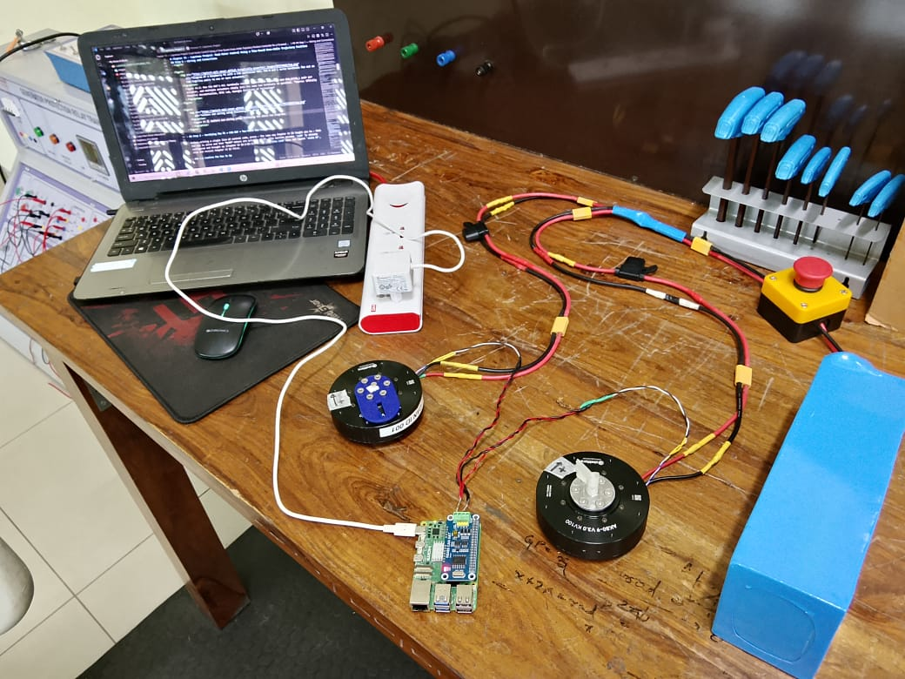
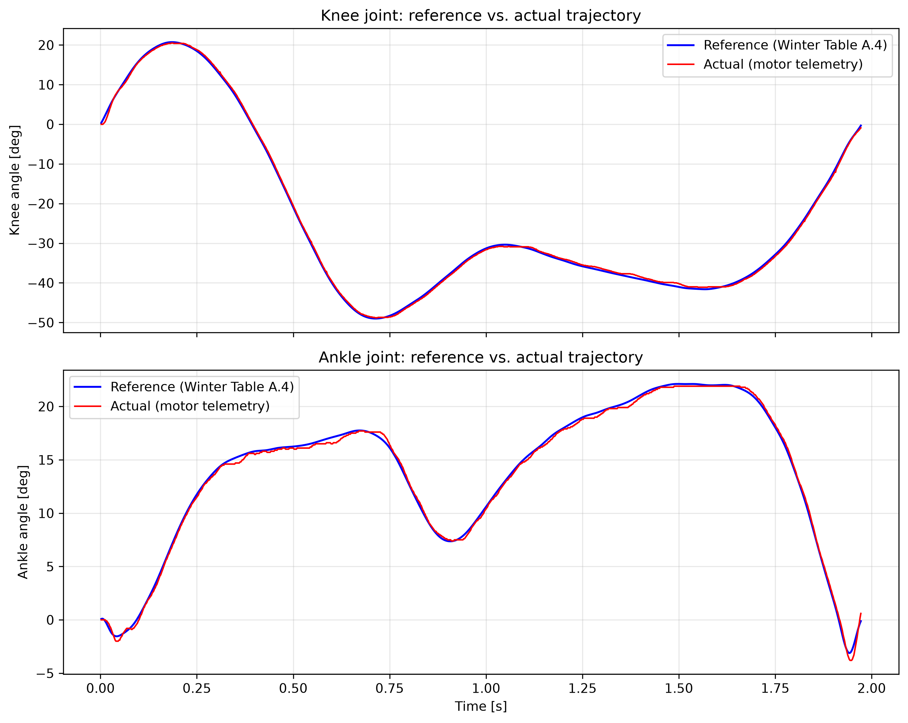

# Chapter 15 — Capstone Project: Dual-Motor Control Using a Time-Based Knee–Ankle Trajectory Position Controller for a Powered Prosthetic Leg

---

**FirstAuthor:** Pritam Ranjan Kalita, Project Assistant, WeRoCon Laboratory, August 2026. <br>
**Disclaimer:** This tutorial was written and reviewed by the author. AI-assisted tools were used to support drafting, editing, and language refinement, with all technical content verified by the author.

---

Fourteen chapters ago, the AK80-9 was a sealed cylinder with three connectors. Thirteen chapters ago, you learned what its numbers meant. In Chapter 13, you gave it a brain — a Raspberry Pi 5 speaking CAN. In Chapter 14, you gave that brain a full vocabulary — every control mode, reachable from Python. This chapter asks you to put all of it together, at once, on **two** motors, doing the one thing this entire series has been quietly building toward since Chapter 12 §7: **powering a joint of a prosthetic leg**.

Here is the brief. A transfemoral (above-knee) or transtibial prosthesis with powered knee and ankle joints needs both joints to move through a *coordinated* trajectory — the way a biological knee and ankle move together through a gait cycle. This capstone builds exactly that: two AK80-9 actuators - one for the knee and another for the ankle joints, one Raspberry Pi 5, one Python control code, each motor tracking its own joint-angle-versus-time curve, in lockstep, on a shared clock. It is deliberately the simplest member of the "trajectory tracking" family that Chapter 11 §12 and Chapter 12 §7.2 pointed toward but never built: no gait-phase detection, no sensors on the wearer, no feedback from the ground — just a clock, two target curves, and Chapter 9's Position Loop Mode asked to follow them, one waypoint at a time -- a *time-based trajectory tracking*. Simple, and still the direct ancestor of every more sophisticated controller this lab will build from here on after.

Four steps take us there:

- **Step 1** — the physical build: two motors, one CAN bus, one Pi. All the Wiring diagrams that helped the author to build this project including author's own final connection setup photograph -- can be found in this section.
- **Step 2** — the simplest possible two-motor program: both actuators spinning, independently commanded, on Chapter 8's Velocity Loop. This is the dual-motor skeleton that Step 3's real controller will be built on top of.
- **Step 3** — the capstone itself: the Time-Based Knee–Ankle Trajectory Impedance Controller.

This chapter assumes everything Chapter 13 assumed, doubled: two motors, each already connected to CubeMarsTool at least once and calibrated (Ch 4), each with a known CAN ID, each in factory **Servo** operating mode. It also assumes Chapter 13's Raspberry Pi is already alive — `can0` configured (Ch 13 §3), EPICally Powerful installed in its virtual environment (Ch 13 §4.3). If any of that is not true yet for your bench, stop and complete Chapter 13 first; nothing here re-teaches it.

**A note on the two motors used in this chapter.** Every earlier chapter's Python demos (Ch 13, Ch 14) used one actuator, CAN ID **100**, feedback rate **200 Hz**. This chapter adds a second actuator, CAN ID **1**, also configured to a feedback rate of **200 Hz** (Ch 13 §4.2's Application Settings procedure, run once on this second motor over the serial cable, exactly as it was run on the first). Nothing about *how* you configure a motor changes — you are simply doing it twice, to two different CAN IDs, so that many actuators can share one bus without ever answering to the wrong name. Throughout this chapter: **CAN ID 100 is the knee actuator, CAN ID 1 is the ankle actuator.** Keep this pairing in your head — it is the pairing Step 3 and Step 4 both build on.

## A Word on `LOOP_HZ`: Command Rate, Sampling Rate, and Why They Should Match the Feedback Rate

Before writing any dual-motor code, it is worth settling a question that Chapter 13 and Chapter 14's scripts never explained out loud: what exactly *is* the `LOOP_HZ` variable at the top of every EP script, and why does the rule of thumb say to match it to the motor's configured feedback rate?

`LOOP_HZ` is the rate of your **Python control loop's iterations** — the `while clock():` loop driven by EP's `TimedLoop` (Ch 13 §5). Inside one iteration of that loop, two different jobs happen, and it helps to see them as separate before treating them as one number:

- **The command rate.** Every iteration calls something like `actuators.set_velocity(...)` or `actuators.set_position(...)`, which builds a fresh CAN frame and puts it on the bus. This is *outgoing* traffic — how often you tell the motor what to do next.
- **The sampling rate.** Every iteration also typically calls `get_position(...)` / `get_velocity(...)` / `get_torque(...)`, which reads whatever the newest value is that EP's background listener thread has cached from the motor's *own* telemetry stream. This is *incoming* traffic — how often you look at what the motor just told you.

Here is the important part: the motor does not wait to be asked. Once its **CAN feedback rate** is configured (Ch 4 §3, Ch 13 §4.2 — "periodic feedback" mode), it broadcasts a telemetry frame on its own clock, at whatever rate you set — in this chapter, **200 Hz** for both motors i.e. once every 5 milliseconds. EP's listener thread is always running in the background, always overwriting its cache with the latest frame it hears. `get_position()` is just a fast, non-blocking read of that cache (Ch 13 §4.5).

So `LOOP_HZ` is really *your* rate of asking two independent questions — "what should I send next?" and "what did I hear last?". Three cases fall out of this cleanly:

| Relationship | What happens | Verdict |
|---|---|---|
| `LOOP_HZ` ≈ feedback rate (this chapter: 200 Hz both) | every loop iteration sees genuinely *new* telemetry, and every command lands close to the motor's own update cadence | the sane default |
| `LOOP_HZ` ≫ feedback rate | most iterations just re-read the *same* cached telemetry value — harmless, but wasted CPU and no extra information | not wrong, just pointless |
| `LOOP_HZ` ≪ feedback rate | you are commanding and sampling *slower* than the motor is willing to update — fast transients are missed between reads, and your control law is reacting to increasingly stale error | can cause real problems — this is the exact mechanism behind Ch 14 §4.2's Video 14.7, where a 200 Hz Pi loop reacting to delayed position information turned an undamped ($K_d = 0$) MIT spring into a wildly overshooting oscillation |

That last row is why the rule of thumb exists, and why it is a *good* rule and not just a convention: matching `LOOP_HZ` to the feedback rate keeps your commands and your telemetry moving at the same cadence, so neither one is quietly stale relative to the other. It is not a protocol requirement — the motor will not complain if you pick a different number — but every example in this series, and every recipe in this chapter, follows it. **Rule for this chapter: both motors are configured for a 200 Hz feedback rate, so every script in this chapter runs its `TimedLoop` at `LOOP_HZ = 200`.**

## Step 1 — Wiring and Connections

<figure>
    
    <figcaption>
      Figure 15.1: Complete Wiring Setup Diagram from the Battery-to-Motors and Battery-to-RPi as shown in Epically Powerful's Offical Website. *Source: EPICally Powerful documentation, EPIC Lab, Georgia Institute of Technology*
    </figcaption>
</figure>

<figure>
    
    <figcaption>
      Figure 15.2: How the HAT's H/L terminals connect towards the actuator: one CAN_H/CAN_L pair per actuator, and multiple actuators simply join the same two terminals in parallel. *Source: EPICally Powerful documentation, EPIC Lab, Georgia Institute of Technology*
    </figcaption>
</figure>

<figure>
    
    <figcaption>
      Figure 15.3: Authors own wiring setup following the above two diagrams.
    </figcaption>
</figure>

<br>

> **⚠️ Important Note:** 
> - Fuse Rating for Motor-to-Power Connections: 20 Amps *(as per epically powerful's website)*
> - Fuse Rating for RPi-to-Power Connection : 5 Amps
> - Buck Converter Rating for RPi-to-Power Connection : 5 Volts
> - Minimum Wire rating for power supply cables used in this setup : 12 AWG *(as per epically powerful's website)*

> **⚠️ Important Note:** For running the below codes, make sure the current going into the RPi is exaclty of 5A - not less not more - if the power supply is of more apms than this then your RPi board will FRY - if it is less than this value then both the motors will stop moving mid execution of the code, the code will keep running but the motors will not.


## Step 2 — Servo Velocity Loop: Both Motors Spinning, Independently Commanded

Step 2 builds the smallest possible *program* that drives two motors at once. It is deliberately not yet a leg controller — it is the dual-motor skeleton, built on Chapter 8's Velocity Loop Mode exactly as Chapter 13 §5's single-motor sine demo was built on it, so that every new idea in Step 4 (streaming two independent position trajectories) has a proven, working two-motor foundation underneath it.

**What this script does.** The knee actuator (CAN ID 100) spins at a steady **1 rad/s**; the ankle actuator (CAN ID 1) spins at a steady **2 rad/s**, at the same time, from the same control loop, on the same `TimedLoop` clock. Both targets are ordinary numbers in a small dictionary at the top of the script — change one value, and that motor's speed changes; make the two values equal, and both motors spin at the same speed, exactly as Chapter 8's single-motor demo did, just twice over.

**Design choices worth noticing before you read the code**, because they are the pattern Step 4 will reuse directly:

- **One `ActuatorGroup`, two dictionary entries.** Exactly the pattern previewed in Chapter 13 §4.5's table and Chapter 14 §1.2's skeleton comments: `ActuatorGroup.from_dict({100: 'AK80-9-V3-servo', 1: 'AK80-9-V3-servo'})`. One object now manages both motors' bus traffic.
- **`lifecycle()` takes a CAN ID.** Rather than writing two near-identical wake-up calls by hand, `lifecycle()` accepts the target CAN ID as an argument (exactly as Chapter 14 §1.2 flags as the multi-motor pattern) and is called once per motor, in a short loop over a list of IDs. This scales to three, four, or more actuators without the function itself changing.
- **Per-motor targets live in one dictionary.** `TARGET_VEL = {100: 1.0, 1: 2.0}` reads directly as "knee at 1 rad/s, ankle at 2 rad/s" and is the natural shape for Step 4's per-motor trajectories to grow into.
- **The command loop iterates over the dictionary**, sending each motor its own `set_velocity` call inside the same 200 Hz tick — both motors are commanded within the same loop iteration, which is what "simultaneously" means in a single-threaded control loop like this one.

**Starting condition:** both motors bench-mounted (or fixture-mounted) and calibrated per Ch 4, both output shafts **unloaded**, both power supplies on with conservative current limits, E-stop(s) within reach; `can0` up (Step 2); `(epenv)` active; Step 2's two-motor smoke test already passed today. All of Ch 4 §6's ground rules in force, for both motors, at once.

```bash
cd ~/ak80-9
nano dual_motor_velocity_demo.py
```

```python
#!/usr/bin/env python3
"""
dual_motor_velocity_demo.py — Chapter 15, Step 3: spin TWO AK80-9 actuators
at the same time, each at its own steady speed, using Servo Velocity Loop
Mode (Ch 8) for both.

WHAT THIS PROGRAM DOES
-----------------------
Two motors share one CAN bus:
    CAN ID 100  →  the KNEE actuator  →  target speed  1.0 rad/s
    CAN ID   1  →  the ANKLE actuator →  target speed  2.0 rad/s

Both targets are commanded from the SAME 200 Hz control loop, so both
motors spin continuously and simultaneously for RUN_S seconds, then both
are brought to a controlled stop together.

This is deliberately the simplest possible two-motor program. Step 4 of
this chapter reuses every pattern here — one ActuatorGroup, lifecycle()
called per motor ID, a small per-motor dictionary of targets — and simply
replaces "constant velocity" with "position read from a time-indexed
trajectory table."

WHAT YOU SHOULD SEE WHEN YOU RUN IT
-------------------------------------
  1. ~0.5 s of stillness while both motors wake up.
  2. Both shafts begin turning at the same moment: the knee motor settles
     into a steady, gentle rotation at 1.0 rad/s (~9.5 rpm); the ankle
     motor settles into a steady rotation at 2.0 rad/s (~19 rpm) — twice
     as fast, running the whole time alongside the knee motor.
  3. The terminal prints one line per motor, ~10 times a second, so you
     can watch both v_cmd/vel pairs track their own targets side by side.
  4. After RUN_S seconds both motors are commanded to zero velocity, given
     a moment to stop, then released ("limp") together, and the program
     prints "Done."

Press Ctrl+C at any moment — the cleanup code still runs, and BOTH motors
are stopped and released safely.

WANT BOTH MOTORS AT THE SAME SPEED INSTEAD? Change TARGET_VEL below so
both dictionary values are equal, e.g. {100: 1.5, 1: 1.5}. Nothing else
in the script needs to change.
"""

# ---------------------------------------------------------------------------
# IMPORTS
# ---------------------------------------------------------------------------
import time                # clocks and sleep()
import can                 # raw CAN messages, needed for the lifecycle() quirk

from epicallypowerful.actuation import ActuatorGroup   # EP's main motor class
from epicallypowerful.toolbox import TimedLoop         # EP's metronome

# ---------------------------------------------------------------------------
# SETTINGS
# ---------------------------------------------------------------------------
MOTOR_TYPE = 'AK80-9-V3-servo'   # both motors are in Servo operating mode
                                 # (Ch 13 §4.1) — same dialect for both

# Every motor on the bus, and the EP model+dialect string it uses.
# This one dictionary is what makes the ActuatorGroup a TWO-motor group.
MOTORS = {
    100: MOTOR_TYPE,   # knee actuator
      1: MOTOR_TYPE,   # ankle actuator
}

# Each motor's target speed, in rad/s at the OUTPUT shaft. Change these two
# numbers to change what each joint does — set them equal to make both
# motors spin at the same speed.
TARGET_VEL = {
    100: 1.0,   # knee:  1.0 rad/s ( ≈  9.5 rpm )
      1: 2.0,   # ankle: 2.0 rad/s ( ≈ 19.1 rpm )
}

LOOP_HZ = 200     # BOTH motors are configured for a 200 Hz feedback rate
                 # (this chapter's opening section) — so the control loop
                 # runs at 200 Hz too, matching command rate to sampling
                 # rate to telemetry rate for both actuators at once.
RUN_S   = 15.0    # total run time, in seconds

# ---------------------------------------------------------------------------
# STEP 1 — Open the CAN bus and register BOTH motors
# ---------------------------------------------------------------------------
# One ActuatorGroup, built from the MOTORS dictionary above, now manages
# bus traffic for CAN ID 100 AND CAN ID 1 together (Ch 13 §4.5, Ch 14 §1.2).
actuators = ActuatorGroup.from_dict(MOTORS)

# ---------------------------------------------------------------------------
# STEP 2 — The firmware power-on / power-off workaround, made multi-motor
# ---------------------------------------------------------------------------
def lifecycle(code, can_id):
    """Send the motor's power-on (0xFC) or power-off (0xFD) message to ONE
    specific CAN ID. Same 8-byte frame as Ch 13 §5 / Ch 14 §1.2 — the only
    change is that the target CAN ID is now a parameter, not a constant,
    so this one function serves every motor on the bus."""
    actuators.bus.send(
        can.Message(
            arbitration_id=can_id,
            data=[0xFF] * 7 + [code],
            is_extended_id=True,
        )
    )

# Wake EVERY motor in the group, one at a time, by its own CAN ID.
for motor_id in MOTORS:
    lifecycle(0xFC, motor_id)
time.sleep(0.5)   # let both motors activate and their first telemetry arrive

print(f"AK80-9 dual-motor demo on can0. Knee (ID 100) -> "
      f"{TARGET_VEL[100]:+.1f} rad/s, Ankle (ID 1) -> "
      f"{TARGET_VEL[1]:+.1f} rad/s, for {RUN_S:.0f}s. Ctrl+C stops.\n")

# ---------------------------------------------------------------------------
# STEP 3 — The control loop: command BOTH motors every tick
# ---------------------------------------------------------------------------
clock = TimedLoop(rate=LOOP_HZ)
t0 = time.perf_counter()
i = 0

try:
    while clock():
        t = time.perf_counter() - t0
        if t > RUN_S:
            break

        # Send every motor its own target velocity, inside the SAME tick.
        # This is what "simultaneous" means here: both commands leave the
        # Pi within the same 5 ms (200 Hz) control-loop iteration.
        for motor_id, v in TARGET_VEL.items():
            actuators.set_velocity(motor_id, v, 0)   # 3rd arg unused in Servo

        # Print one line per motor, ~10 times a second, so both columns
        # of telemetry are readable side by side.
        if i % 20 == 0:
            for motor_id, v in TARGET_VEL.items():
                print(f"t={t:5.2f}s  id={motor_id:3d}  v_cmd={v:+5.2f}  "
                      f"pos={actuators.get_position(motor_id):+7.2f} rad  "
                      f"vel={actuators.get_velocity(motor_id):+5.2f} rad/s  "
                      f"|i|={abs(actuators.get_torque(motor_id)):4.2f} A")
            print()   # blank line between ticks, for readability

        i += 1

        # Same background-thread safety net as Ch 13 §5.
        if getattr(actuators.notifier, "exception", None):
            print("RX thread died:", actuators.notifier.exception)
            break

# ---------------------------------------------------------------------------
# STEP 4 — Cleanup: stop and release BOTH motors, always
# ---------------------------------------------------------------------------
finally:
    for motor_id in MOTORS:
        actuators.set_velocity(motor_id, 0.0, 0)     # controlled stop
    time.sleep(0.3)
    for motor_id in MOTORS:
        actuators.set_torque(motor_id, 0.0)          # 0 A -> limp
    for motor_id in MOTORS:
        lifecycle(0xFD, motor_id)                    # polite power-off, each

print("\nDone.")
```

Save, exit, and run it — with both shafts bare, both E-stops within reach:

```bash
python dual_motor_velocity_demo.py
```

**What you should observe.** After the half-second wake-up pause, both shafts begin turning at essentially the same moment. The knee actuator settles into a calm, steady spin at 1.0 rad/s; the ankle actuator, spinning the whole time alongside it, settles at roughly double that rate — 2.0 rad/s — because that is the number its own dictionary entry asked for. The printed telemetry shows both `id=100` and `id=1` lines every tick, each motor's `v_cmd` matching its own `vel` closely (Chapter 8's PI velocity loop, running independently inside *each* driver — Chapter 12 §1's reminder that every mode ends at the same FOC engine applies twice here, once per motor). At `t = 15 s`, both motors are commanded to zero velocity together, pause briefly, and go limp together — turn either shaft by hand afterward to confirm.

See the above code in action (Video Below):
<div style="display: flex; flex-direction: column; align-items: center; justify-content: center; width: 100%;">
  <figure style="text-align: center; margin: 0;">
      <video src="videos/video26.mp4" width="640" height="360" controls></video>
</figure>
</div>

<br>

> If you have successfully implemented the above code and both the motors are runnig as expected, move to Step 3.

## Step 3 — The Time-Based Knee–Ankle Trajectory Position Controller

Step 2 proved that one Raspberry Pi, one `ActuatorGroup`, and one 200 Hz loop can drive two AK80-9 actuators at once, each obeying its own independent command. This step keeps that exact skeleton and replaces "constant velocity" with something far more interesting: **a real, recorded human gait cycle**, followed by both motors together, joint by joint, instant by instant.

### 3.1 Where the reference trajectory comes from

The reference motion for this controller is not synthetic. It is real motion-capture data of a human walking, taken from **Appendix A, Table A.4** of David A. Winter's classic biomechanics text:

> D. A. Winter, *Biomechanics and Motor Control of Human Movement*, 4th ed., John Wiley & Sons, 2009.

The raw appendix tables in the book are printed, not digital. Researcher **Dustyn Roberts** (dustynrobots.com) transcribed Winter's Appendix A tables into a usable Excel workbook and shared it publicly for exactly this kind of reuse:

> Dustyn Roberts, *"Winter's Gait Data in Excel Form,"* available at: https://dustynrobots.com/academia/research/winters-gait-data-in-excel-form/

**All credit for the underlying motion data belongs to Dr. Winter's original gait study; all credit for digitizing it into the spreadsheet this chapter reads belongs to Dustyn Roberts.** This tutorial only teaches you how to stream that data to a pair of AK80-9 actuators.

Download the file from the link above (it is named something like `AppendixAdata.xls` or `.xlsx` — Dustyn's page may rename it over time, so grab whatever the current filename is) and copy it onto your Raspberry Pi. You do **not** need to open it, clean it, or extract anything by hand — the script below reads the workbook directly.

### 3.2 What is actually inside the sheet we use

Open the workbook and look for the tab named **`A4.RelJointAngularKinematics`** — this is Winter's **Table A.4, "Relative Joint Angular Kinematics — Ankle, Knee, and Hip."** It is a single healthy subject's ankle, knee, and hip angles, angular velocities, and angular accelerations, sampled at roughly 70 Hz while walking. Reading the sheet directly with `openpyxl`, its layout is:

| Column | Content |
|---|---|
| A | `STATE` — a gait-event marker, stamped only on a few rows |
| B | `FRAME` — frame number |
| C | `TIME` — seconds |
| D–F | `ANKLE` — THETA (deg), OMEGA (rad/s), ALPHA (rad/s²) |
| G–I | `KNEE` — THETA (deg), OMEGA (rad/s), ALPHA (rad/s²) |
| J–L | `HIP` — THETA (deg), OMEGA (rad/s), ALPHA (rad/s²) |

with the actual numeric data starting at row 5.

Two things worth explaining before we use this table.

**The `STATE` abbreviations.** Only a handful of rows carry a `STATE` value, and they mark the walking subject's gait events: **`TOR` = Toe-Off, Right**, and **`HCR` = Heel-Contact, Right** (heel-strike). Reading down the column, `TOR` appears at frame 1 (t = 0 s) and again at frame 70 (t = 0.987 s) — which means **frames 1 through 70 form exactly one complete gait cycle** (toe-off to the next toe-off on the same foot), lasting just under one second. That is the window this controller uses. Frames 71 onward are the start of a second stride recorded by the same study and are not needed here.

**The velocity column is a gift, but we still won't use it directly.** OMEGA is already computed for us, in rad/s — you can check this yourself: at frame 1, KNEE THETA goes from 46.7° to 52.1° over one 0.014 s frame, i.e. $(52.1-46.7)\times\pi/180 / 0.014 \approx 6.73$ rad/s, and the sheet's own OMEGA value at that row is 6.74 rad/s. So Winter's OMEGA and ALPHA columns are trustworthy. Even so, §3.3 explains why this controller derives its own velocity reference instead of reading OMEGA straight off the sheet.

### 3.3 From 70 discrete samples to a smooth, continuous reference

Table A.4 gives us the joint angle at 70 discrete instants, about 14 ms apart. Our control loop runs at **200 Hz** — a new command every 5 ms — which is faster than the data was sampled. We need a **position** and a **velocity** target at every one of those 5 ms ticks, not just at the 70 instants Winter's cameras happened to capture.

The clean way to do this is a **cubic spline**. For each joint, we fit one smooth curve $\theta(t)$ through its 70 $(t, \theta)$ points (`scipy.interpolate.CubicSpline`). This single object then gives us everything the impedance law needs, evaluated at *any* instant, not just the recorded ones:

$$
P_d(t) = \theta(t), \qquad V_d(t) = \dot\theta(t) = \frac{d\theta}{dt}(t)
$$

`CubicSpline` computes the derivative analytically once we ask for it — so $P_d$ and $V_d$ are guaranteed to be exactly consistent with each other at every instant, with no separate interpolation error between "where it should be" and "how fast it should be getting there." This is why we don't just read the OMEGA column directly: OMEGA was computed by Winter's own numerical differentiation of *his* 70 raw samples, and using it as-is would mean our $V_d$ and our spline-based $P_d$ are two independently-built curves that don't perfectly agree between sample points. Deriving both from the *same* spline keeps them honest.

Both position and velocity are shifted so the trajectory **starts at zero**, relative to wherever the motor shaft happens to be at power-up — exactly the convention Chapter 14 §4.2's impedance script already used (`DES_POS` "relative to position at startup"). This means you do not need to physically align a leg segment to Winter's exact starting angle before running the script; the motor simply reproduces the *shape* of the recorded motion starting from wherever it currently rests.

### 3.4 The controller

The control law is precisely Chapter 14 §4.2's master equation, run independently for each joint, inside the same shared 200 Hz loop that Step 2 already proved works for two motors at once:

$$
\tau_{\mathrm{knee}}(t) = K_{p,\mathrm{knee}}\big(P_{d,\mathrm{knee}}(t) - P_{\mathrm{knee}}\big) + K_{d,\mathrm{knee}}\big(V_{d,\mathrm{knee}}(t) - V_{\mathrm{knee}}\big)
$$

$$
\tau_{\mathrm{ankle}}(t) = K_{p,\mathrm{ankle}}\big(P_{d,\mathrm{ankle}}(t) - P_{\mathrm{ankle}}\big) + K_{d,\mathrm{ankle}}\big(V_{d,\mathrm{ankle}}(t) - V_{\mathrm{ankle}}\big)
$$

with $\tau_{ff}=0$ for both joints (the bare shaft's own inertia is small enough that a feedforward term isn't needed for this demo). Each torque is converted to a current with the same $K_T = 0.5701$ N·m/A used throughout the series, and sent as a Servo **Current Loop** command (Control Mode ID 1, Ch 6) — exactly the same Servo-dialect trick Chapter 14 §4.2 used to run "MIT-style" impedance control without touching the driver's onboard MIT math.

### 3.5 Dependencies

This script needs three things beyond what Chapter 13 already installed in `epenv`. With `(epenv)` active:

```bash
pip install openpyxl scipy matplotlib
```

- **`openpyxl`** — reads Winter's `.xlsx` workbook directly, no manual extraction.
- **`scipy`** — already pulled in as an EPICally Powerful dependency (Ch 13 §4.3), but listed here in case your environment differs; used for `CubicSpline`.
- **`matplotlib`** — draws the reference-vs-actual comparison plot at the end of the run.

### 3.6 The script

Save this as `knee_ankle_trajectory_controller.py` in the same folder you have been using since Chapter 13 (e.g. `~/ak80-9/`). The four fields you are most likely to change — the workbook's file path, the control-loop rate, and each joint's $K_p$/$K_d$ — are gathered at the very top of the file, exactly where the rest of this series has always kept its "knobs."

```python
#!/usr/bin/env python3
"""
knee_ankle_trajectory_controller.py — Chapter 15, Step 3: a synchronized,
time-based knee-ankle trajectory controller for a powered prosthetic leg
bench, using two AK80-9 V3.0 actuators driven from a Raspberry Pi 5 through
the EPICally Powerful (EP) API.

WHAT THIS PROGRAM DOES
-----------------------
Both motors follow ONE recorded human gait cycle at the same time, on the
same clock:

    CAN ID 100  ->  the KNEE actuator
    CAN ID   1  ->  the ANKLE actuator

The reference motion comes directly from Table A.4 ("Relative Joint Angular
Kinematics -- Ankle, Knee, and Hip") of David A. Winter's book:

    D. A. Winter, "Biomechanics and Motor Control of Human Movement,"
    4th ed., John Wiley & Sons, 2009.

digitized into spreadsheet form by Dustyn Roberts and published at:

    https://dustynrobots.com/academia/research/winters-gait-data-in-excel-form/

Full credit for the original gait-motion data belongs to Dr. Winter's study;
full credit for the spreadsheet transcription belongs to Dustyn Roberts.
This script reads that spreadsheet's "A4.RelJointAngularKinematics" tab
directly -- download the workbook from the link above onto your Pi and
point XLSX_PATH (below) at it. Nothing needs to be pre-processed by hand.

WHAT THE CONTROLLER DOES, IN ONE SENTENCE
------------------------------------------
Both joints run the SAME impedance (MIT-style) law that Chapter 14 Section
4.2 introduced, computed on the Pi and sent as Servo Current Loop commands:

        tau = Kp * (Pd(t) - P) + Kd * (Vd(t) - V)
        current [A] = tau / 0.5701

where Pd(t) and Vd(t) come from a smooth cubic spline fitted through one
full gait cycle's worth of Winter's recorded joint-angle data (frames 1-70
of Table A.4, i.e. one toe-off to the next toe-off on the same foot,
lasting just under one second), and P, V are each motor's own measured
position and velocity.

WHAT YOU SHOULD SEE WHEN YOU RUN IT
-------------------------------------
  1. ~0.5 s of stillness while both motors wake up.
  2. Both shafts begin moving together, tracing out a smooth, human-like
     swinging motion: the knee motor sweeps through a large flexion-
     extension excursion, while the ankle motor makes a smaller
     dorsiflexion/plantarflexion excursion alongside it -- one full
     synchronized gait cycle, repeated REPEAT times, each cycle stretched
     by TIME_SCALE (a TIME_SCALE of 2.0 means the motion takes twice as
     long as real human gait -- start here before ever trying 1.0).
  3. The terminal prints a status line for both joints, several times a
     second, showing the commanded and measured angle/velocity for each.
  4. After the trajectory ends, both motors are stopped and released, and
     a two-subplot figure is drawn: reference trajectory (blue) against
     the actual trajectory the motors achieved (red), one subplot for the
     knee and one for the ankle. This figure is saved into a "results"
     folder next to this script, and also displayed on screen.

Press Ctrl+C at any moment -- the cleanup code still runs, both motors are
stopped and released safely, and the plot (from whatever data was already
logged) is still produced.
"""

# ===========================================================================
#  USER SETTINGS -- the fields you are most likely to want to change
# ===========================================================================

# --- Path to Winter's / Dustyn Roberts' gait-data workbook -----------------
# Download the workbook from the link in the docstring above and place it
# anywhere on your Pi. If you save it under a different name or folder,
# just update this ONE line -- nothing else in the script needs to change.
XLSX_PATH = "/home/pi/ak80-9/Winter_Appendix_data.xlsx"

# --- CAN IDs -----------------------------------------------------------
KNEE_ID  = 100     # knee actuator CAN ID  (Ch 15's convention)
ANKLE_ID = 1       # ankle actuator CAN ID (Ch 15's convention)

# --- Control-loop rate ------------------------------------------------
# Both motors in this chapter are configured for a 500 Hz feedback rate
# (raised from the 200 Hz default used earlier in this chapter) -- keep
# this matched to whatever CubeMarsTool setting your own motors use.
LOOP_HZ = 500

# --- Impedance gains, ONE pair per joint --------------------------------
# Same meaning as Ch 14 Section 4.2's Kp/Kd: Kp is the virtual spring
# (N*m/rad), Kd is the virtual damper (N*m/(rad/s)). The values below are
# NOT the naive LOOP_HZ/100 starting point any more -- they come from an
# automated trajectory-tracking sweep (motor_calibration.py, Section 3.8)
# that ran the real Winter gait spline on both motors together and
# measured RMS tracking error, chatter, and current-clamp fraction across
# a grid of candidates. Re-tune from here if you change the trajectory,
# the loop rate, or anything mechanical on the bench.
KNEE_KP  = 21.0
KNEE_KD  = 0.8

ANKLE_KP = 40.0
ANKLE_KD = 0.8

# --- Trajectory shaping --------------------------------------------------
REPEAT     = 1     # how many gait cycles to run back-to-back
TIME_SCALE = 2.0   # stretches the whole cycle by this factor (2.0 = half
                   # of real walking speed). Use a bigger number for your
                   # very first run; approach 1.0 (real gait speed) only
                   # once you trust your gains and your bench setup.

# --- Safety current clamp -------------------------------------------------
# The impedance law above is NOT internally limited -- a bad Kp or a stuck
# shaft could otherwise ask for more current than is sensible. This clamp
# caps the MAGNITUDE of the current actually sent to each motor, and prints
# a warning the first time either joint hits it. Keep this well inside the
# AK80-9's 12 A continuous rating (Ch 1 Section 2) while learning.
MAX_CURRENT_A = 9.0

# --- Wrap-glitch guard threshold -------------------------------------------
# See Section 3.9. Any single-tick position jump larger than this is
# treated as a telemetry glitch, not real motion, and corrected. 60 deg
# (converted to radians below, once `math` is imported) is far above any
# physically plausible per-tick motion at this loop rate, and far below
# the ~360 deg jumps the glitch actually produces.
GLITCH_JUMP_DEG = 60.0

# --- Torque constant, shared by both joints -------------------------------
KT = 0.5701   # N*m/A, output-shaft torque constant (Ch 2 Section 6)

# ===========================================================================
#  END OF USER SETTINGS
# ===========================================================================

import os
import math
import time
import datetime

import can
import numpy as np
import openpyxl
from scipy.interpolate import CubicSpline
import matplotlib
matplotlib.use("Agg")          # safe for headless / SSH sessions; the
import matplotlib.pyplot as plt  # figure is still saved and can be shown

from epicallypowerful.actuation import ActuatorGroup
from epicallypowerful.toolbox import TimedLoop

GLITCH_JUMP_RAD = math.radians(GLITCH_JUMP_DEG)

MOTOR_TYPE = 'AK80-9-V3-servo'   # both motors run in Servo operating mode
                                 # (Ch 13 Section 4.1) -- same dialect for both

MOTORS = {
    KNEE_ID:  MOTOR_TYPE,
    ANKLE_ID: MOTOR_TYPE,
}


# ---------------------------------------------------------------------------
# STEP 1 -- Load Winter's Table A.4 straight from the downloaded workbook
# ---------------------------------------------------------------------------
def load_gait_cycle(xlsx_path):
    """Read the 'A4.RelJointAngularKinematics' sheet and return one full
    gait cycle (Table A.4's frames 1-70, Toe-Off-Right to the next
    Toe-Off-Right) as plain time / angle arrays, in SECONDS and RADIANS,
    each shifted so the cycle starts at angle 0.

    Returns: t (s), knee_theta (rad), ankle_theta (rad) -- three NumPy
    arrays of equal length, ready to be splined.
    """
    wb = openpyxl.load_workbook(xlsx_path, data_only=True)
    ws = wb["A4.RelJointAngularKinematics"]

    # Data rows start at row 5 (rows 1-4 are the table title and the
    # three-level header: STATE/FRAME/TIME/ANKLE/KNEE/HIP, THETA/OMEGA/
    # ALPHA, and the unit row S/DEG/R-S/R-S-S -- see Section 3.2 above).
    times, knee_deg, ankle_deg, state = [], [], [], []
    for row in ws.iter_rows(min_row=5, max_row=ws.max_row, values_only=True):
        state_val, frame, t_s = row[0], row[1], row[2]
        ankle_theta = row[3]     # column D
        knee_theta  = row[6]     # column G
        if t_s is None or knee_theta is None or ankle_theta is None:
            continue
        state.append(state_val)
        times.append(t_s)
        knee_deg.append(knee_theta)
        ankle_deg.append(ankle_theta)

    # Find frame 1 (TOR) and the SECOND "TOR" state marker -- these bound
    # exactly one gait cycle, toe-off to the next toe-off (Section 3.2).
    tor_indices = [i for i, s in enumerate(state) if s == "TOR"]
    if len(tor_indices) < 2:
        raise ValueError(
            "Could not find two 'TOR' (Toe-Off Right) markers in the "
            "STATE column -- is this really Winter's Table A.4 sheet?"
        )
    i0, i1 = tor_indices[0], tor_indices[1]   # first cycle: TOR -> TOR

    t = np.array(times[i0:i1 + 1], dtype=float)
    knee = np.deg2rad(np.array(knee_deg[i0:i1 + 1], dtype=float))
    ankle = np.deg2rad(np.array(ankle_deg[i0:i1 + 1], dtype=float))

    # Shift so the cycle starts at t = 0 and each joint starts at angle 0
    # -- the trajectory is tracked RELATIVE to wherever the motor shaft
    # happens to be at power-up (same convention as Ch 14 Section 4.2's
    # DES_POS, "relative to position at startup").
    t = t - t[0]
    knee = knee - knee[0]
    ankle = ankle - ankle[0]

    # Force each joint's end-of-cycle angle to exactly equal its start.
    # Winter's real stride data is not perfectly periodic (the subject's
    # two strides differ slightly -- the knee ends ~0.9 deg and the ankle
    # ~4.9 deg away from where they began), so without this, a spline that
    # WRAPS across the cycle boundary (REPEAT > 1) sees a small but real
    # position and velocity discontinuity every time it wraps. Closing the
    # loop here, combined with bc_type='periodic' below, makes REPEAT > 1
    # genuinely seamless instead of re-triggering a step command at every
    # repeat.
    knee[-1] = knee[0]
    ankle[-1] = ankle[0]

    return t, knee, ankle


print(f"Loading gait-cycle reference from: {XLSX_PATH}")
t_raw, knee_theta_raw, ankle_theta_raw = load_gait_cycle(XLSX_PATH)
cycle_duration = t_raw[-1] * TIME_SCALE
print(f"One gait cycle: {len(t_raw)} samples, "
      f"{t_raw[-1]:.3f} s at recorded speed -> "
      f"{cycle_duration:.3f} s at TIME_SCALE={TIME_SCALE:.2f} "
      f"({REPEAT} repeat(s), {REPEAT * cycle_duration:.2f} s total).")

# ---------------------------------------------------------------------------
# STEP 2 -- Fit a cubic spline per joint: Pd(t) and Vd(t) from ONE curve
# ---------------------------------------------------------------------------
# CubicSpline is built on the TIME-SCALED time axis directly, so evaluating
# it at real wall-clock time t (mod cycle_duration) gives Pd(t) in rad, and
# its analytic derivative gives Vd(t) in rad/s -- guaranteed consistent
# with each other at every instant (Section 3.3).
t_scaled = t_raw * TIME_SCALE

knee_pos_spline = CubicSpline(t_scaled, knee_theta_raw, bc_type="periodic")
knee_vel_spline = knee_pos_spline.derivative()

ankle_pos_spline = CubicSpline(t_scaled, ankle_theta_raw, bc_type="periodic")
ankle_vel_spline = ankle_pos_spline.derivative()

TRAJECTORIES = {
    KNEE_ID:  (knee_pos_spline, knee_vel_spline, KNEE_KP,  KNEE_KD),
    ANKLE_ID: (ankle_pos_spline, ankle_vel_spline, ANKLE_KP, ANKLE_KD),
}


# ---------------------------------------------------------------------------
# STEP 3 -- Open the CAN bus and register BOTH motors (Ch 15 Step 2 pattern)
# ---------------------------------------------------------------------------
actuators = ActuatorGroup.from_dict(MOTORS, exit_manually=True)


def lifecycle(code, can_id):
    """Send the motor's power-on (0xFC) or power-off (0xFD) message to ONE
    specific CAN ID -- the same firmware quirk documented in Ch 13 Section 5
    and generalized to multiple motors in Ch 15 Step 2."""
    actuators.bus.send(
        can.Message(arbitration_id=can_id, data=[0xFF] * 7 + [code],
                    is_extended_id=True)
    )


# Each motor's own starting angle, captured once after wake-up (Step 3
# below) -- P is always tracked RELATIVE to this value, matching Pd(0)=0
# (Section 3.3). Filled in just before the control loop starts.
P0 = {mid: 0.0 for mid in MOTORS}

# current-limit warning flags, one per motor
_clamp_warned = {mid: False for mid in MOTORS}

# logging buffers for the final plot: {motor_id: [t, pd_deg, p_deg]}
log = {mid: {"t": [], "pd_deg": [], "p_deg": []} for mid in MOTORS}

try:
    for motor_id in MOTORS:
        lifecycle(0xFC, motor_id)

    # Event-driven start: wait for a few FRESH telemetry frames after the
    # wake-up message, so the firmware has actually processed it before
    # the first control command lands (Ch 14 Section 4.2's bench-learned
    # startup pattern). EACH motor gets its OWN full timeout budget here
    # -- with two motors sharing one wait window, the second motor's wait
    # could otherwise be silently cut short by however long the first
    # motor's wait took.
    for motor_id in MOTORS:
        t_wait0 = time.perf_counter()
        ts0 = actuators.get_data(motor_id).timestamp
        fresh = 0
        while fresh < 5 and time.perf_counter() - t_wait0 < 1.0:
            ts = actuators.get_data(motor_id).timestamp
            if ts > ts0:
                fresh, ts0 = fresh + 1, ts
            time.sleep(0.002)
    for motor_id in MOTORS:
        lifecycle(0xFC, motor_id)   # re-assert wake, belt and braces
    time.sleep(0.02)

    # Capture each motor's starting angle using the SAME high-level
    # getters proven in Ch 15 Step 2's dual-motor demo -- get_position()
    # already returns a continuous, unwrapped output-shaft angle in rad,
    # so no manual multi-turn bookkeeping is needed here.
    for motor_id in MOTORS:
        P0[motor_id] = actuators.get_position(motor_id)

    # Previous-tick position per motor, used only by the glitch guard
    # below (Section 3.9) -- starts at 0 rad, matching P0's convention.
    P_PREV = {motor_id: 0.0 for motor_id in MOTORS}

    print(f"\nRunning knee-ankle trajectory: "
          f"knee Kp={KNEE_KP}, Kd={KNEE_KD}  |  "
          f"ankle Kp={ANKLE_KP}, Kd={ANKLE_KD}  |  "
          f"{LOOP_HZ} Hz. Ctrl+C stops.\n")

    clock = TimedLoop(rate=LOOP_HZ)
    t0 = time.perf_counter()
    total_duration = REPEAT * cycle_duration
    i = 0

    while clock():
        t_wall = time.perf_counter() - t0
        if t_wall > total_duration:
            break
        t_cycle = t_wall % cycle_duration   # where we are inside ONE cycle

        for motor_id, (pos_spl, vel_spl, kp, kd) in TRAJECTORIES.items():
            pd = float(pos_spl(t_cycle))
            vd = float(vel_spl(t_cycle))

            # Same getters as Ch 15 Step 2 -- P is the CURRENT reading
            # minus the STARTING reading captured above, so it starts at
            # 0 rad exactly like Pd does (Section 3.3).
            p = actuators.get_position(motor_id) - P0[motor_id]
            v = actuators.get_velocity(motor_id)

            # --- Wrap-glitch guard (Section 3.9) ------------------------
            # If the loop stutters (heavy CPU load, thermal throttling),
            # position telemetry can arrive in a delayed, bunched burst.
            # The multi-turn unwrap logic can then misjudge which way a
            # large jump wrapped and insert a spurious +-360 deg offset
            # that persists for the rest of the run. No real tick-to-tick
            # motion can plausibly exceed a few degrees (even the AK80-9's
            # rated 570 rpm ceiling is under 7 deg per tick at this loop
            # rate), so any jump past GLITCH_JUMP_RAD is almost certainly
            # this glitch, not real motion -- snap it back to the nearest
            # physically sane value instead of trusting it.
            delta = p - P_PREV[motor_id]
            if abs(delta) > GLITCH_JUMP_RAD:
                p -= round(delta / (2.0 * math.pi)) * 2.0 * math.pi
            P_PREV[motor_id] = p

            tau = kp * (pd - p) + kd * (vd - v)
            current = tau / KT

            if abs(current) > MAX_CURRENT_A:
                current = math.copysign(MAX_CURRENT_A, current)
                if not _clamp_warned[motor_id]:
                    print(f"  [warning] motor {motor_id}: current clamp "
                          f"({MAX_CURRENT_A} A) reached -- consider "
                          f"lowering Kp/Kd for this joint.")
                    _clamp_warned[motor_id] = True

            actuators.set_torque(motor_id, current)

            log[motor_id]["t"].append(t_wall)
            log[motor_id]["pd_deg"].append(math.degrees(pd))
            log[motor_id]["p_deg"].append(math.degrees(p))

        if i % 20 == 0:
            for motor_id, (pos_spl, vel_spl, kp, kd) in TRAJECTORIES.items():
                pd_deg = log[motor_id]["pd_deg"][-1]
                p_deg = log[motor_id]["p_deg"][-1]
                name = "knee " if motor_id == KNEE_ID else "ankle"
                print(f"t={t_wall:5.2f}s  {name} (id={motor_id:3d})  "
                      f"Pd={pd_deg:+7.2f} deg  P={p_deg:+7.2f} deg")
            print()
        i += 1

        if getattr(actuators.notifier, "exception", None):
            print("RX thread died:", actuators.notifier.exception)
            break

    print("\nTrajectory finished.")

except KeyboardInterrupt:
    print("\nCtrl+C -- stopping.")

finally:
    # Stop path: zero current, release the firmware -- same pattern as
    # Ch 14 Section 4.2's impedance script, repeated per motor.
    for _ in range(10):
        for motor_id in MOTORS:
            actuators.set_torque(motor_id, 0.0)
        time.sleep(0.005)
    for motor_id in MOTORS:
        lifecycle(0xFD, motor_id)
    try:
        actuators.disable_actuators()
        actuators.notifier.stop()
        actuators.bus.shutdown()
    except Exception:
        pass
    print("Motors limp; verify by hand before approaching.")

    # -----------------------------------------------------------------
    # STEP 4 -- Plot reference vs. actual, one subplot per joint
    # -----------------------------------------------------------------
    fig, axes = plt.subplots(2, 1, figsize=(10, 8), sharex=True)

    joint_axes = {KNEE_ID: (axes[0], "Knee"), ANKLE_ID: (axes[1], "Ankle")}
    for motor_id, (ax, label) in joint_axes.items():
        data = log[motor_id]
        if not data["t"]:
            continue
        ax.plot(data["t"], data["pd_deg"], color="blue",
                linewidth=1.5, label="Reference (Winter Table A.4)")
        ax.plot(data["t"], data["p_deg"], color="red",
                linewidth=1.2, label="Actual (motor telemetry)")
        ax.set_ylabel(f"{label} angle [deg]")
        ax.set_title(f"{label} joint: reference vs. actual trajectory")
        ax.legend(loc="best")
        ax.grid(True, alpha=0.3)

    axes[-1].set_xlabel("Time [s]")
    fig.tight_layout()

    # Save into a "results" folder next to this script.
    script_dir = os.path.dirname(os.path.abspath(__file__))
    results_dir = os.path.join(script_dir, "results")
    os.makedirs(results_dir, exist_ok=True)
    stamp = datetime.datetime.now().strftime("%Y%m%d_%H%M%S")
    out_path = os.path.join(results_dir, f"code-run-{stamp}.png")
    fig.savefig(out_path, dpi=300, bbox_inches="tight")
    print(f"Plot saved to: {out_path}")

    try:
        matplotlib.use("TkAgg")
        plt.show()
    except Exception:
        pass

print("Done.")
```

### 3.7 What you should observe

After the half-second wake-up pause, both shafts begin moving at the same moment, tracing out one full recorded stride: the knee actuator sweeps through its larger flexion–extension excursion while the ankle actuator makes its smaller dorsiflexion/plantarflexion excursion right alongside it, both finishing their motion together because both are driven from the same `t_cycle` value on the same 500 Hz clock. With `TIME_SCALE = 2.0`, one cycle takes a little under two seconds — noticeably more deliberate than real walking speed, which is exactly why that is the starting value.

The terminal prints `Pd` (where the spline says the joint should be right now) next to `P` (where the motor telemetry says it actually is), for both joints, several times a second — this is the same "commanded vs. measured" pairing every earlier chapter's demos have shown you, just running twice over and driven by a moving target instead of a fixed one. Expect a visible lag between `Pd` and `P` during the fastest parts of the swing (the knee's velocity peaks are the sharpest test of the gains) — this is normal for a proportional–derivative law tracking an aggressive trajectory on an unloaded shaft, and it is precisely what the final plot is built to show you honestly.

At the end of the run, both motors decelerate their commanded torque to zero, go limp, and a window appears with two subplots — knee on top, ankle below — each with the blue reference curve from Winter's Table A.4 and the red curve your motor actually achieved, overlaid on the same time axis. A dated image of that exact figure is also written to a `results/` folder created next to the script (created automatically on first run), named `code-run-<timestamp>.png`, at 300 DPI — good enough to drop directly into a report or a paper.

See the above code in action (Video Below):

<div style="display: flex; flex-direction: column; align-items: center; justify-content: center; width: 100%;">
  <figure style="text-align: center; margin: 0;">
      <video src="videos/video27.mp4" width="640" height="360" controls></video>
      <p>Video 15.2: Knee and Ankle joint motors executing the time-based reference gait trajectory for 3 continuous gait cycles.</p></figure>
</div>

### 3.8 The New Discovered Problem

Below are the knee and ankle joint motor's reference v/s actual trajectory comparison graphs for 1 gait cycle execution.

<figure>
    
    <figcaption>
      Figure 15.1: Knee and Ankle joint motor's reference v/s actual trajectory comparison graphs for 1 gait cycle execution.
    *</figcaption>
</figure>

Now looking at this graph you can notice a very easy visible problem: observe the jitters in both the knee and ankle's actual trajectory lines (red) - very prominent in the ankle motor. What this means is that the rotors of both the motors (more in ankle motor) are although trying to follow the given trajectory but they are not doing this very smoothly i.e. they are executing some sort of vibratory wiggly motion arround the desired postions (from reference trajectory) most of the time. If a real person wears this prosthetic, he will continuosly experience prothesis vibrating. And our next challenge is to solve this problem.

### 3.9 The Solution


### Sources / References

1. **D. A. Winter, *Biomechanics and Motor Control of Human Movement*, 4th ed., John Wiley & Sons, 2009** — Appendix A, Table A.4, "Relative Joint Angular Kinematics — Ankle, Knee, and Hip": the original recorded human gait-kinematics data this controller tracks.
2. **Dustyn Roberts, "Winter's Gait Data in Excel Form,"** https://dustynrobots.com/academia/research/winters-gait-data-in-excel-form/ (accessed August 2026) — the digitized spreadsheet transcription of Winter's Appendix A tables that this chapter's script reads directly; all credit for making this data machine-readable belongs to this work.
3. **This tutorial series, Chapters 13–15** — the Raspberry Pi / CAN / EPICally Powerful stack (Ch 13), the full EP phrasebook and the impedance-control pattern this controller reuses verbatim (Ch 14 §4.2), and the dual-motor `ActuatorGroup` / `lifecycle()` skeleton this step builds on directly (Ch 15 Step 2); Ch 2 §6 (the 0.5701 N·m/A torque constant used here); Ch 6 (Current Loop Mode, the wire-level mode this controller actually commands).
4. **SciPy documentation**, `scipy.interpolate.CubicSpline` — the spline-and-analytic-derivative technique used in §3.3 to generate a smooth, self-consistent $P_d(t)$/$V_d(t)$ pair from Winter's discrete samples.