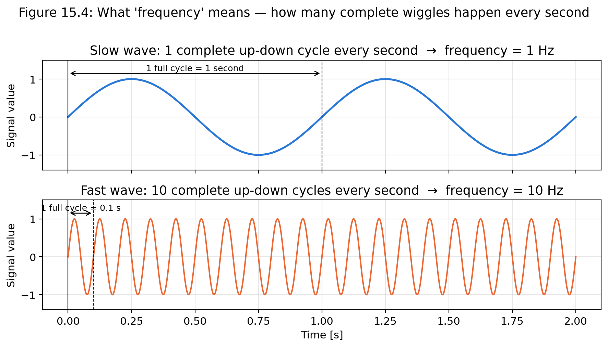
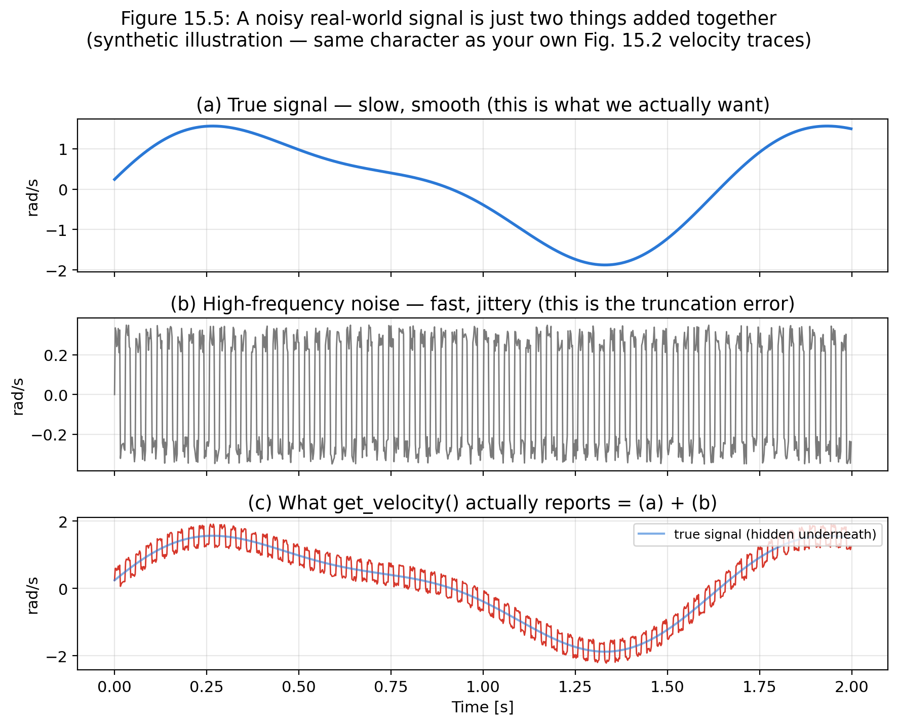
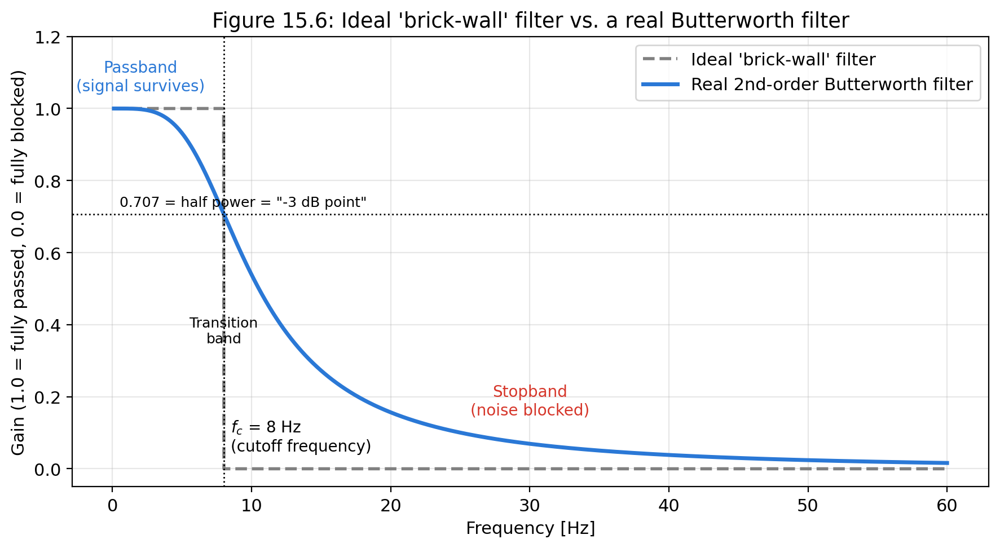
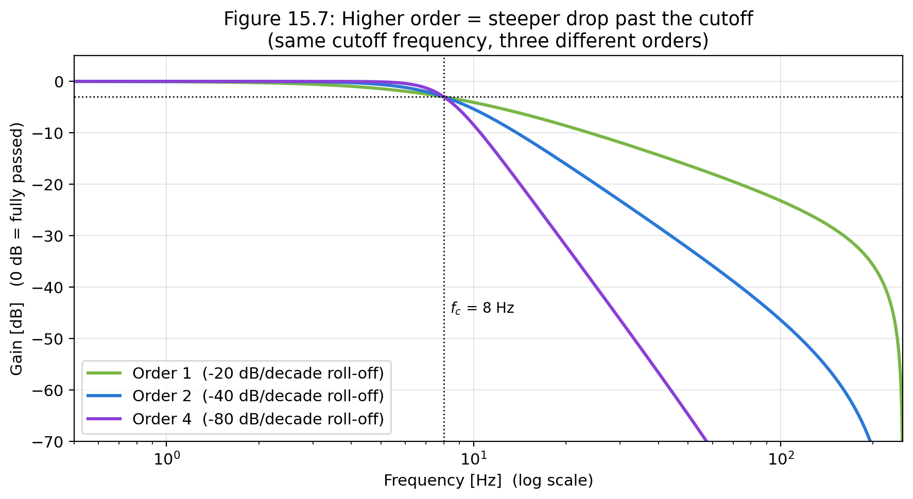
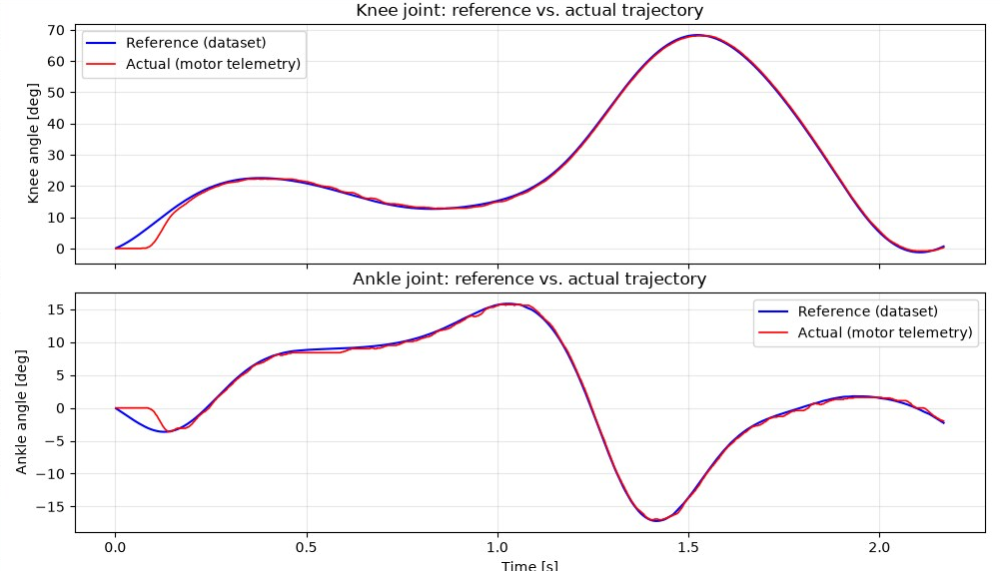
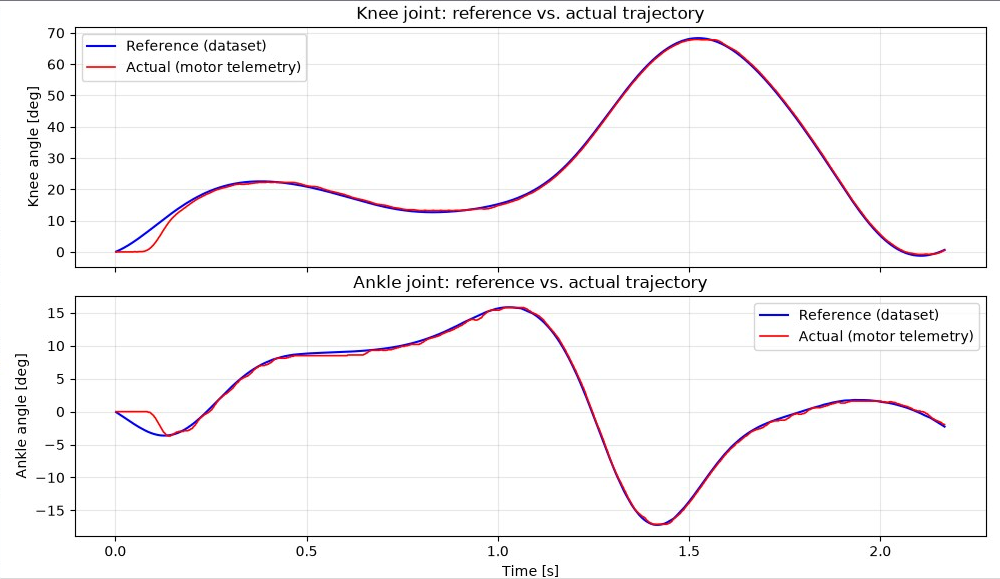

# Chapter 15 — Capstone Project: Dual-Motor Control Using a Time-Based Knee–Ankle Trajectory Position Controller for a Powered Prosthetic Leg

[← Back to Contents](00_Contents.md) | *(End of Series)*

---

**FirstAuthor:** Pritam Ranjan Kalita, Project Assistant, WeRoCon Laboratory, August 2026. <br>
**Disclaimer:** This tutorial was written and reviewed by the author. AI-assisted tools were used to support drafting, editing, and language refinement, with all technical content verified by the author.

---

Fourteen chapters ago, the AK80-9 was a sealed cylinder with three connectors. Thirteen chapters ago, you learned what its numbers meant. In Chapter 13, you gave it a brain — a Raspberry Pi 5 speaking CAN. In Chapter 14, you gave that brain a full vocabulary — every control mode, reachable from Python. This chapter asks you to put all of it together, at once, on **two** motors, doing the one thing this entire series has been quietly building toward since Chapter 12 §7: **powering a joint of a prosthetic leg**.

Here is the brief. A transfemoral (above-knee) or transtibial prosthesis with powered knee and ankle joints needs both joints to move through a *coordinated* trajectory — the way a biological knee and ankle move together through a gait cycle. This capstone builds exactly that: two AK80-9 actuators - one for the knee and another for the ankle joints, one Raspberry Pi 5, one Python control code, each motor tracking its own joint-angle-versus-time curve, in lockstep, on a shared clock. It is deliberately the simplest member of the "trajectory tracking" family that Chapter 11 §12 and Chapter 12 §7.2 pointed toward but never built: no gait-phase detection, no sensors on the wearer, no feedback from the ground — just a clock, two target curves, and Chapter 9's Position Loop Mode asked to follow them, one waypoint at a time -- a *time-based trajectory tracking*. Simple, and still the direct ancestor of every more sophisticated controller this lab will build from here on after.

Three steps take us there:

- **Step 1** — the physical build: two motors, one CAN bus, one Pi. All the Wiring diagrams that helped the author to build this project including author's own final connection setup photograph -- can be found in this section.
- **Step 2** — the simplest possible two-motor program: both actuators spinning, independently commanded, on Chapter 8's Velocity Loop. This is the dual-motor skeleton that Step 3's real controller will be built on top of.
- **Step 3** — the capstone itself: the Time-Based Knee–Ankle Trajectory Impedance Controller.

This chapter assumes everything Chapter 13 assumed, doubled: two motors, each already connected to CubeMarsTool at least once and calibrated (Ch 4), each with a known CAN ID, each in factory **Servo** operating mode. It also assumes Chapter 13's Raspberry Pi is already alive — `can0` configured (Ch 13 §3), EPICally Powerful installed in its virtual environment (Ch 13 §4.3). If any of that is not true yet for your bench, stop and complete Chapter 13 first; nothing here re-teaches it.

**A note on the two motors used in this chapter.** Every earlier chapter's Python demos (Ch 13, Ch 14) used one actuator, CAN ID **100**, feedback rate **200 Hz**. This chapter adds a second actuator, CAN ID **1**, also configured to a feedback rate of **200 Hz** (Ch 13 §4.2's Application Settings procedure, run once on this second motor over the serial cable, exactly as it was run on the first). Nothing about *how* you configure a motor changes — you are simply doing it twice, to two different CAN IDs, so that many actuators can share one bus without ever answering to the wrong name. Throughout this chapter: **CAN ID 100 is the knee actuator, CAN ID 1 is the ankle actuator.** Keep this pairing in your head — it is the pairing Step 2 and Step 3 both build on.

## A Word on `LOOP_HZ`: Command Rate, Sampling Rate, and Why They Should Match the Feedback Rate

Before writing any dual-motor code, it is worth settling a question that Chapter 13 and Chapter 14's scripts never explained out loud: what exactly *is* the `LOOP_HZ` variable at the top of every EP script, and why does the rule of thumb say to match it to the motor's configured feedback rate?

`LOOP_HZ` is the rate of your **Python control loop's iterations** — the `while clock():` loop driven by EP's `TimedLoop` (Ch 13 §5). Inside one iteration of that loop, two different jobs happen, and it helps to see them as separate before treating them as one number:

- **The command rate.** Every iteration calls something like `actuators.set_velocity(...)` or `actuators.set_position(...)`, which builds a fresh CAN frame and puts it on the bus. This is *outgoing* traffic — how often you tell the motor what to do next.
- **The sampling rate.** Every iteration also typically calls `get_position(...)` / `get_velocity(...)` / `get_torque(...)`, which reads whatever the newest value is that EP's background listener thread has cached from the motor's *own* telemetry stream. This is *incoming* traffic — how often you look at what the motor just told you.

Here is the important part: the motor does not wait to be asked. Once its **CAN feedback rate** is configured (Ch 4 §3, Ch 13 §4.2 — "periodic feedback" mode), it broadcasts a telemetry frame on its own clock, at whatever rate you set — in this chapter, **200 Hz** for both motors i.e. once every 5 milliseconds. EP's listener thread is always running in the background, always overwriting its cache with the latest frame it hears. `get_position()` is just a fast, non-blocking read of that cache (Ch 13 §4.5).

So `LOOP_HZ` is really *your* rate of asking two independent questions — "what should I send next?" and "what did I hear last?". Three cases fall out of this cleanly:

| Relationship | What happens | Verdict |
|---|---|---|
| `LOOP_HZ` ≈ feedback rate (this chapter: 200 Hz both) | every loop iteration sees genuinely *new* telemetry, and every command lands close to the motor's own update cadence | the sane default |
| `LOOP_HZ` ≫ feedback rate | most iterations just re-read the *same* cached telemetry value — harmless, but wasted CPU and no extra information | not wrong, just pointless |
| `LOOP_HZ` ≪ feedback rate | you are commanding and sampling *slower* than the motor is willing to update — fast transients are missed between reads, and your control law is reacting to increasingly stale error | can cause real problems — this is the exact mechanism behind Ch 14 §4.2's Video 14.7, where a 200 Hz Pi loop reacting to delayed position information turned an undamped ($K_d = 0$) MIT spring into a wildly overshooting oscillation |

That last row is why the rule of thumb exists, and why it is a *good* rule and not just a convention: matching `LOOP_HZ` to the feedback rate keeps your commands and your telemetry moving at the same cadence, so neither one is quietly stale relative to the other. It is not a protocol requirement — the motor will not complain if you pick a different number — but every example in this series, and every recipe in this chapter, follows it. **Rule for this chapter: both motors are configured for a 200 Hz feedback rate, so every script in this chapter runs its `TimedLoop` at `LOOP_HZ = 200`.**

## Step 1 — Wiring and Connections

<figure>
    
    <figcaption>
      Figure 15.1: Complete Wiring Setup Diagram from the Battery-to-Motors and Battery-to-RPi as shown in Epically Powerful's Offical Website. *Source: EPICally Powerful documentation, EPIC Lab, Georgia Institute of Technology*
    </figcaption>
</figure>

<figure>
    
    <figcaption>
      Figure 15.2: How the HAT's H/L terminals connect towards the actuator: one CAN_H/CAN_L pair per actuator, and multiple actuators simply join the same two terminals in parallel. *Source: EPICally Powerful documentation, EPIC Lab, Georgia Institute of Technology*
    </figcaption>
</figure>

<figure>
    
    <figcaption>
      Figure 15.3: Authors own wiring setup following the above two diagrams.
    </figcaption>
</figure>

<br>

> **⚠️ Important Note:** 
> - Fuse Rating for Motor-to-Power Connections: 20 Amps *(as per epically powerful's website)*
> - Fuse Rating for RPi-to-Power Connection : 5 Amps
> - Buck Converter Rating for RPi-to-Power Connection : 5 Volts
> - Minimum Wire rating for power supply cables used in this setup : 12 AWG *(as per epically powerful's website)*

> **⚠️ Important Note:** For running the below codes, make sure the current going into the RPi is exaclty of 5A - not less not more - if the power supply is of more apms than this then your RPi board will FRY - if it is less than this value then both the motors will stop moving mid execution of the code, the code will keep running but the motors will not.


## Step 2 — Servo Velocity Loop: Both Motors Spinning, Independently Commanded

Step 2 builds the smallest possible *program* that drives two motors at once. It is deliberately not yet a leg controller — it is the dual-motor skeleton, built on Chapter 8's Velocity Loop Mode exactly as Chapter 13 §5's single-motor sine demo was built on it, so that every new idea in Step 3 (streaming two independent position trajectories) has a proven, working two-motor foundation underneath it.

**What this script does.** The knee actuator (CAN ID 100) spins at a steady **1 rad/s**; the ankle actuator (CAN ID 1) spins at a steady **2 rad/s**, at the same time, from the same control loop, on the same `TimedLoop` clock. Both targets are ordinary numbers in a small dictionary at the top of the script — change one value, and that motor's speed changes; make the two values equal, and both motors spin at the same speed, exactly as Chapter 8's single-motor demo did, just twice over.

**Design choices worth noticing before you read the code**, because they are the pattern Step 3 will reuse directly:

- **One `ActuatorGroup`, two dictionary entries.** Exactly the pattern previewed in Chapter 13 §4.5's table and Chapter 14 §1.2's skeleton comments: `ActuatorGroup.from_dict({100: 'AK80-9-V3-servo', 1: 'AK80-9-V3-servo'})`. One object now manages both motors' bus traffic.
- **`lifecycle()` takes a CAN ID.** Rather than writing two near-identical wake-up calls by hand, `lifecycle()` accepts the target CAN ID as an argument (exactly as Chapter 14 §1.2 flags as the multi-motor pattern) and is called once per motor, in a short loop over a list of IDs. This scales to three, four, or more actuators without the function itself changing.
- **Per-motor targets live in one dictionary.** `TARGET_VEL = {100: 1.0, 1: 2.0}` reads directly as "knee at 1 rad/s, ankle at 2 rad/s" and is the natural shape for Step 3's per-motor trajectories to grow into.
- **The command loop iterates over the dictionary**, sending each motor its own `set_velocity` call inside the same 200 Hz tick — both motors are commanded within the same loop iteration, which is what "simultaneously" means in a single-threaded control loop like this one.

**Starting condition:** both motors bench-mounted (or fixture-mounted) and calibrated per Ch 4, both output shafts **unloaded**, both power supplies on with conservative current limits, E-stop(s) within reach; `can0` up (Step 2); `(epenv)` active; Step 2's two-motor smoke test already passed today. All of Ch 4 §6's ground rules in force, for both motors, at once.

```bash
cd ~/ak80-9
nano dual_motor_velocity_demo.py
```

```python
#!/usr/bin/env python3
"""
dual_motor_velocity_demo.py — Chapter 15, Step 3: spin TWO AK80-9 actuators
at the same time, each at its own steady speed, using Servo Velocity Loop
Mode (Ch 8) for both.

WHAT THIS PROGRAM DOES
-----------------------
Two motors share one CAN bus:
    CAN ID 100  →  the KNEE actuator  →  target speed  1.0 rad/s
    CAN ID   1  →  the ANKLE actuator →  target speed  2.0 rad/s

Both targets are commanded from the SAME 200 Hz control loop, so both
motors spin continuously and simultaneously for RUN_S seconds, then both
are brought to a controlled stop together.

This is deliberately the simplest possible two-motor program. Step 4 of
this chapter reuses every pattern here — one ActuatorGroup, lifecycle()
called per motor ID, a small per-motor dictionary of targets — and simply
replaces "constant velocity" with "position read from a time-indexed
trajectory table."

WHAT YOU SHOULD SEE WHEN YOU RUN IT
-------------------------------------
  1. ~0.5 s of stillness while both motors wake up.
  2. Both shafts begin turning at the same moment: the knee motor settles
     into a steady, gentle rotation at 1.0 rad/s (~9.5 rpm); the ankle
     motor settles into a steady rotation at 2.0 rad/s (~19 rpm) — twice
     as fast, running the whole time alongside the knee motor.
  3. The terminal prints one line per motor, ~10 times a second, so you
     can watch both v_cmd/vel pairs track their own targets side by side.
  4. After RUN_S seconds both motors are commanded to zero velocity, given
     a moment to stop, then released ("limp") together, and the program
     prints "Done."

Press Ctrl+C at any moment — the cleanup code still runs, and BOTH motors
are stopped and released safely.

WANT BOTH MOTORS AT THE SAME SPEED INSTEAD? Change TARGET_VEL below so
both dictionary values are equal, e.g. {100: 1.5, 1: 1.5}. Nothing else
in the script needs to change.
"""

# ---------------------------------------------------------------------------
# IMPORTS
# ---------------------------------------------------------------------------
import time                # clocks and sleep()
import can                 # raw CAN messages, needed for the lifecycle() quirk

from epicallypowerful.actuation import ActuatorGroup   # EP's main motor class
from epicallypowerful.toolbox import TimedLoop         # EP's metronome

# ---------------------------------------------------------------------------
# SETTINGS
# ---------------------------------------------------------------------------
MOTOR_TYPE = 'AK80-9-V3-servo'   # both motors are in Servo operating mode
                                 # (Ch 13 §4.1) — same dialect for both

# Every motor on the bus, and the EP model+dialect string it uses.
# This one dictionary is what makes the ActuatorGroup a TWO-motor group.
MOTORS = {
    100: MOTOR_TYPE,   # knee actuator
      1: MOTOR_TYPE,   # ankle actuator
}

# Each motor's target speed, in rad/s at the OUTPUT shaft. Change these two
# numbers to change what each joint does — set them equal to make both
# motors spin at the same speed.
TARGET_VEL = {
    100: 1.0,   # knee:  1.0 rad/s ( ≈  9.5 rpm )
      1: 2.0,   # ankle: 2.0 rad/s ( ≈ 19.1 rpm )
}

LOOP_HZ = 200     # BOTH motors are configured for a 200 Hz feedback rate
                 # (this chapter's opening section) — so the control loop
                 # runs at 200 Hz too, matching command rate to sampling
                 # rate to telemetry rate for both actuators at once.
RUN_S   = 15.0    # total run time, in seconds

# ---------------------------------------------------------------------------
# STEP 1 — Open the CAN bus and register BOTH motors
# ---------------------------------------------------------------------------
# One ActuatorGroup, built from the MOTORS dictionary above, now manages
# bus traffic for CAN ID 100 AND CAN ID 1 together (Ch 13 §4.5, Ch 14 §1.2).
actuators = ActuatorGroup.from_dict(MOTORS)

# ---------------------------------------------------------------------------
# STEP 2 — The firmware power-on / power-off workaround, made multi-motor
# ---------------------------------------------------------------------------
def lifecycle(code, can_id):
    """Send the motor's power-on (0xFC) or power-off (0xFD) message to ONE
    specific CAN ID. Same 8-byte frame as Ch 13 §5 / Ch 14 §1.2 — the only
    change is that the target CAN ID is now a parameter, not a constant,
    so this one function serves every motor on the bus."""
    actuators.bus.send(
        can.Message(
            arbitration_id=can_id,
            data=[0xFF] * 7 + [code],
            is_extended_id=True,
        )
    )

# Wake EVERY motor in the group, one at a time, by its own CAN ID.
for motor_id in MOTORS:
    lifecycle(0xFC, motor_id)
time.sleep(0.5)   # let both motors activate and their first telemetry arrive

print(f"AK80-9 dual-motor demo on can0. Knee (ID 100) -> "
      f"{TARGET_VEL[100]:+.1f} rad/s, Ankle (ID 1) -> "
      f"{TARGET_VEL[1]:+.1f} rad/s, for {RUN_S:.0f}s. Ctrl+C stops.\n")

# ---------------------------------------------------------------------------
# STEP 3 — The control loop: command BOTH motors every tick
# ---------------------------------------------------------------------------
clock = TimedLoop(rate=LOOP_HZ)
t0 = time.perf_counter()
i = 0

try:
    while clock():
        t = time.perf_counter() - t0
        if t > RUN_S:
            break

        # Send every motor its own target velocity, inside the SAME tick.
        # This is what "simultaneous" means here: both commands leave the
        # Pi within the same 5 ms (200 Hz) control-loop iteration.
        for motor_id, v in TARGET_VEL.items():
            actuators.set_velocity(motor_id, v, 0)   # 3rd arg unused in Servo

        # Print one line per motor, ~10 times a second, so both columns
        # of telemetry are readable side by side.
        if i % 20 == 0:
            for motor_id, v in TARGET_VEL.items():
                print(f"t={t:5.2f}s  id={motor_id:3d}  v_cmd={v:+5.2f}  "
                      f"pos={actuators.get_position(motor_id):+7.2f} rad  "
                      f"vel={actuators.get_velocity(motor_id):+5.2f} rad/s  "
                      f"|i|={abs(actuators.get_torque(motor_id)):4.2f} A")
            print()   # blank line between ticks, for readability

        i += 1

        # Same background-thread safety net as Ch 13 §5.
        if getattr(actuators.notifier, "exception", None):
            print("RX thread died:", actuators.notifier.exception)
            break

# ---------------------------------------------------------------------------
# STEP 4 — Cleanup: stop and release BOTH motors, always
# ---------------------------------------------------------------------------
finally:
    for motor_id in MOTORS:
        actuators.set_velocity(motor_id, 0.0, 0)     # controlled stop
    time.sleep(0.3)
    for motor_id in MOTORS:
        actuators.set_torque(motor_id, 0.0)          # 0 A -> limp
    for motor_id in MOTORS:
        lifecycle(0xFD, motor_id)                    # polite power-off, each

print("\nDone.")
```

Save, exit, and run it — with both shafts bare, both E-stops within reach:

```bash
python dual_motor_velocity_demo.py
```

**What you should observe.** After the half-second wake-up pause, both shafts begin turning at essentially the same moment. The knee actuator settles into a calm, steady spin at 1.0 rad/s; the ankle actuator, spinning the whole time alongside it, settles at roughly double that rate — 2.0 rad/s — because that is the number its own dictionary entry asked for. The printed telemetry shows both `id=100` and `id=1` lines every tick, each motor's `v_cmd` matching its own `vel` closely (Chapter 8's PI velocity loop, running independently inside *each* driver — Chapter 12 §1's reminder that every mode ends at the same FOC engine applies twice here, once per motor). At `t = 15 s`, both motors are commanded to zero velocity together, pause briefly, and go limp together — turn either shaft by hand afterward to confirm.

See the above code in action (Video Below):
<div style="display: flex; flex-direction: column; align-items: center; justify-content: center; width: 100%;">
  <figure style="text-align: center; margin: 0;">
      <video src="videos/video26.mp4" width="640" height="360" controls></video>
</figure>
</div>

<br>

> If you have successfully implemented the above code and both the motors are runnig as expected, move to Step 3.

## Step 3 — The Time-Based Knee–Ankle Trajectory Position Controller

Step 2 proved that one Raspberry Pi, one `ActuatorGroup`, and one 200 Hz loop can drive two AK80-9 actuators at once, each obeying its own independent command. This step keeps that exact skeleton and replaces "constant velocity" with something far more interesting: **a real, recorded human gait cycle**, followed by both motors together, joint by joint, instant by instant.

### 3.1 Where the reference trajectory comes from

The reference motion for this controller is real motion-capture data of humans walking, taken from a public, modern gait-biomechanics dataset:

> Scherpereel, K. L., Molinaro, D. D., Inan, O. T., Shepherd, M. & Young, A. J. "A human lower-limb biomechanics and wearable sensors dataset during cyclic and non-cyclic activities." *Scientific Data* **10**, 924 (2023). SMARTech, https://doi.org/10.35090/gatech/70296.

The dataset is published under a **CC BY 4.0** license. **All credit for the underlying motion data belongs to the original authors and to Georgia Tech's EPIC Lab.** This tutorial only teaches you how to stream that data to a pair of AK80-9 actuators.

This chapter's controller uses the dataset's **"Walk" cyclic task, at the 1.2 m/s condition** — to be the closest match among the dataset's fixed treadmill speeds to a comfortable adult walking pace; extremely close to the 1.17 m/s self-selected "normal" walking speed reported by a second, independent study of the same kind of task (Camargo et al., cited in Sources below). 

#### One left leg — and why

Every figure and constant in this chapter comes from the trial's **left** leg, not the right, even though the dataset's own Table 3 column order put the right leg first. This was not a style choice — it was forced by the data itself: every trial's `*_grf.csv` file has its **right-foot force channels (`RForceY_Vertical`, `RForceX`, `RForceZ`) entirely empty (100% NaN)**, verified directly against the real download. Cycle-boundary detection (below) needs real force data to find heel-strikes, and only the left foot has any, so the left knee/ankle angle columns are what this controller tracks.

#### Sign-convention translation

Two different corrections turn the dataset's raw numbers into what this controller actually commands, and it matters to keep them straight:

1. **Dataset-convention correction (applied once, inside the data loader).** The Scherpereel dataset's own summary figures describe the knee column as *extension-positive*. Every other convention in this chapter — and the OSL's own hardware convention (0° = extension, 120° = maximum flexion) — is *flexion-positive*. So the knee angle column is negated, once, at the exact line it is read from the CSV. **The ankle column is confirmed correct as-is, with no negation**: the raw `ankle_angle_l` column peaks at +11.4° right at midstance (47% of the cycle) and bottoms out at −21.6° right around toe-off (62% of the cycle) — textbook dorsiflexion-at-midstance, plantarflexion-at-push-off. That means the column is **already dorsiflexion-positive**, matching both this project's convention and the OSL's own example impedance code.
2. **Physical-mounting correction (`KNEE_SIGN` / `ANKLE_SIGN`, a separate USER SETTING).** Even after the dataset's own sign convention is corrected, the direction a *specific* motor spins depends on how it was physically bolted onto *this* leg — something no paper can tell you. `KNEE_SIGN` and `ANKLE_SIGN` are a single, explicit switch each (+1.0 or −1.0) for exactly this, applied at one point in the script — to the trajectory arrays **and** to the homing start angles together — so the trajectory, the joint-limit check, and the homing target all inherit the correction consistently. Verify each by hand before trusting either switch to +1.0: for the knee, turn the shaft toward more *flexion* (bending the knee) and confirm `get_position()` increases; for the ankle, turn the shaft toward more *dorsiflexion* (toes drawing up toward the shin) and confirm `get_position()` increases.

Keeping these two corrections separate matters: if a joint ever moves the wrong way on the bench, this is what tells you which one to check.

### How to get this dataset

1. Go to this link: https://doi.org/10.35090/gatech/70296.
1. Download the **ProcessedData.zip** folder and unzip it.
1. Upon opening the `ProcessedData` folder, you will see many folders names `AB01`, `AB02` and so on - these are data collected from different test subjects/persons. 
3. Find the **"normal_walk_1_1-2"** trial folder for a subject folder `AB01`— this is the Walk data at 1.2 m/s speed condition this chapter uses (§3.1 explains why 1.2 m/s specifically).
4. Copy the whole **"normal_walk_1_1-2"** folder onto your Pi, and note the paths to its **`*_angle.csv`** and **`*_grf.csv`** files — both are needed (the angle file for the trajectory, the GRF file to find the gait-cycle boundaries inside it, §3.2 below). Point `ANGLE_CSV_PATH` and `GRF_CSV_PATH` (in the script's USER SETTINGS) at these two files.

### 3.2 What is actually inside the data we use

The dataset organizes each subject's recordings by task and condition. For the Walk @1.2 m/s trial, this controller reads two CSVs from the SAME trial folder, both sampled at **200 Hz** with a `time` column that does not start at zero (it is a slice of a longer continuous recording — this particular trial's `time` column runs from 40.000 s to 60.000 s, for example):

- **`*_angle.csv`** — every joint angle, in degrees, with a named header row (verified against the real download, not the dataset's Table 3 alone):

  | Column | Content |
  |---|---|
  | `time` | Time (s) |
  | `hip_flexion_r`, `hip_adduction_r`, `hip_rotation_r` | Right hip |
  | `knee_angle_r` | Right knee flexion/extension |
  | `ankle_angle_r` | Right ankle dorsiflexion/plantarflexion |
  | `subtalar_angle_r` | Right ankle eversion/inversion |
  | `hip_flexion_l`, `hip_adduction_l`, `hip_rotation_l` | Left hip |
  | **`knee_angle_l`** | **Left knee flexion/extension — used by this controller** |
  | **`ankle_angle_l`** | **Left ankle dorsiflexion/plantarflexion — used by this controller** |
  | `subtalar_angle_l` | Left ankle eversion/inversion |

  This controller reads `knee_angle_l` and `ankle_angle_l` by column **name**, not position — column-name access survives a reordered or re-exported CSV; a hard-coded column index does not.

- **`*_grf.csv`** — used only to find where one gait cycle starts and ends (below). Also named-header, same `time` column. `RForceY_Vertical` (right foot, vertical) is entirely NaN in this release; `LForceY_Vertical` (left foot, vertical) is real force data in newtons, real body weight scale (peaks around 1000 N for an average adult), and is what this controller reads.

**Finding the trial's stride boundaries.** This dataset does not ship a separate segmentation file, and does not stamp a `STATE` column with toe-off/heel-strike markers directly in the angle file the way Winter's Table A.4 does. `load_gait_cycle()` instead detects heel-strikes directly from the left foot's vertical ground-reaction force crossing a 20 N threshold — the same method Camargo et al. describe for this family of datasets (Sources, below) — which is self-contained and needs nothing beyond the two CSVs already being read. Verified against the real download: this method finds 18 heel-strikes in the `normal_walk_1_1-2` trial, i.e. **17 available strides**, at a stride period of 1.087 s ± 0.011 s (110 steps/min cadence). `STRIDE_COUNT` (in the script's USER SETTINGS, valid range 1–17 for this trial) picks how many of those strides to send to the motors, always starting from the trial's very first heel-strike and running straight through as recorded — real consecutive strides are already continuous motion, so there is no stride-selection or loop-closing decision to make here.

### 3.3 From discrete samples to a smooth, continuous reference

The dataset gives us the joint angle at discrete, motion-capture-rate instants — not at every 2 ms tick our control loop needs. Our control loop runs at **500 Hz** — a new command every 2 ms — which is faster than the data was sampled. We need a **position** and a **velocity** target at every one of those 2 ms ticks, not just at the instants the motion-capture system happened to record.

The clean way to do this is a **cubic spline**. For each joint, we fit one smooth curve $\theta(t)$ through its recorded $(t, \theta)$ points (`scipy.interpolate.CubicSpline`). This single object then gives us everything the impedance law needs, evaluated at *any* instant, not just the recorded ones:

$$
P_d(t) = \theta(t), \qquad V_d(t) = \dot\theta(t) = \frac{d\theta}{dt}(t)
$$

`CubicSpline` computes the derivative analytically once we ask for it — so $P_d$ and $V_d$ are guaranteed to be exactly consistent with each other at every instant, with no separate interpolation error between "where it should be" and "how fast it should be getting there." Deriving both position and velocity from the *same* spline, instead of reading a separately-computed velocity column, keeps them honest with each other at every instant, not just at the recorded samples.

Both position and velocity are shifted so the trajectory **starts at zero**, relative to wherever the motor shaft happens to be at power-up — exactly the convention Chapter 14 §4.2's impedance script already used (`DES_POS` "relative to position at startup"). Homing (below) is what makes "wherever the motor shaft happens to be" actually equal to the dataset's real starting angle, rather than an arbitrary bench position.

### 3.4 The controller

The control law is precisely Chapter 14 §4.2's master equation, run independently for each joint, inside the same shared 500 Hz loop that Step 2 already proved works for two motors at once (the loop rate was raised from Step 2's 200 Hz to 500 Hz for this controller — see the USER SETTINGS comment on `LOOP_HZ` in the script below for why):

$$
\tau_{\mathrm{knee}}(t) = K_{p,\mathrm{knee}}\big(P_{d,\mathrm{knee}}(t) - P_{\mathrm{knee}}\big) + K_{d,\mathrm{knee}}\big(V_{d,\mathrm{knee}}(t) - V_{\mathrm{knee}}\big)
$$

$$
\tau_{\mathrm{ankle}}(t) = K_{p,\mathrm{ankle}}\big(P_{d,\mathrm{ankle}}(t) - P_{\mathrm{ankle}}\big) + K_{d,\mathrm{ankle}}\big(V_{d,\mathrm{ankle}}(t) - V_{\mathrm{ankle}}\big)
$$

with $\tau_{ff}=0$ for both joints (the bare shaft's own inertia is small enough that a feedforward term isn't needed for this demo). Each torque is converted to a current with the same $K_T = 0.5701$ N·m/A used throughout the series, and sent as a Servo **Current Loop** command (Control Mode ID 1, Ch 6) — exactly the same Servo-dialect trick Chapter 14 §4.2 used to run "MIT-style" impedance control without touching the driver's onboard MIT math.

> **A Note:** The OSL's reference position- and impedance-control examples (Sources, below) run their knee and ankle through a **41.5:1** total gear ratio (`gear_ratio=9 * 83/18` in their own source — a 9:1 actuator stage times an 83:18 belt stage). This bench, by contrast, drives the AK80-9's bare **9:1** output shaft directly, with no belt. That is why this chapter's $K_p$/$K_d$ values (21.0/0.8 knee, 40.0/0.8 ankle) look nothing like the OSL's own impedance numbers (e.g. `KNEE_K_ESTANCE = 99.372`) — gains reflect the mechanism they were tuned on, not just the joint. Never copy a gain number across a gear-ratio change without re-deriving or re-tuning it.

### Keeping Each Joint Inside Its Limits

A trajectory-tracking controller has no idea, on its own, that a real leg's knee and ankle can only move so far. Nothing in the impedance law above checks that $P_d(t)$ stays inside the joint's real mechanical range — it will happily ask a joint to go wherever the spline says, even past a hardstop, if the reference data or a sign mistake ever pointed it there. This chapter adds two checks, both built around the same pair of numbers per joint — `KNEE_LIMIT_MIN_DEG`/`KNEE_LIMIT_MAX_DEG` and `ANKLE_LIMIT_MIN_DEG`/`ANKLE_LIMIT_MAX_DEG` in the script's USER SETTINGS, matching the OSL's own convention (0° = full knee extension, 120° = maximum knee flexion) and the ankle range implied by the OSL's own example impedance state machine (−20° push-off plantarflexion to +25° swing dorsiflexion, given a little headroom below):

1. **Pre-flight check, before any motor is even powered.** The moment the trajectory splines exist, the script works out the full absolute angle range they will command over one gait cycle (dataset start angle plus the spline's own excursion) and compares it against the hardware limits. If the trajectory would ever ask for an angle outside the joint's real range, the script either aborts (see below) or corrects it — before the CAN bus is opened, before any current is ever sent.
2. **Runtime check, every control tick.** The pre-flight check only proves the *intended* trajectory is safe; it says nothing about what the motor is *actually* doing. So the control loop also checks each joint's real, measured absolute position against the same two limits, every tick, and aborts the run the same way the tracking-error guard does (§3.9 below) if either joint would cross its limit — independent of whether tracking error looks fine.

**A real mismatch the pre-flight check actually catches.** This trial's recorded knee angle briefly goes slightly hyperextended — about −6° at its most extended point — one degree short of one full stride. This bench's knee cannot physically go past 0° (full extension), so the pre-flight check, run against the real data, genuinely trips. Two honest ways to handle a mismatch like this:

- **Shift the whole trajectory** so it fits inside the joint's real range. This changes *where* the leg sits throughout the stride (a few degrees more flexed on average) but not the *shape* of the motion — the leg still reproduces the recorded gait, just from a slightly different baseline posture. This is what `AUTO_FIT_TO_LIMITS = True` does automatically, and it prints exactly how far it shifted each joint, every run.
- **Accept that this joint cannot reach this dataset's exact recorded extremes**, run it anyway with `AUTO_FIT_TO_LIMITS = False`, and let the pre-flight check hard-abort — the right choice once you are validating a real leg's real limits and want to be told immediately rather than have the script quietly compensate for you.

> Setting either `LIMIT_MIN_DEG`/`LIMIT_MAX_DEG` pair to `None` disables that joint's checks entirely (loudly, with a printed warning) — useful only for a bare bench shaft with no mechanical stops nearby; never for a leg with real hardstops.

### Homing: Starting From the Right Place

Chapter 14 §4.2's impedance script — and every joint-tracking demo in this series before this one — lets the motor start wherever its shaft happened to be resting, and tracks the trajectory *relative* to that position. That is fine for a bare bench shaft with no mechanical stops nearby. It stops being fine the moment §3.1's dataset start angle and the joint-limit check above are both real, physical facts about a leg with hardstops: if the motor happens to be resting somewhere far from the dataset's real starting angle, the trajectory's *shape* is still correct, but it is being traced out starting from the wrong place — which is exactly the situation the joint-limit check above exists to catch, only after the fact.

**Homing** fixes this by moving each joint, gently, to the dataset's real starting angle *before* the trajectory controller ever takes over. That starting angle is no longer a hand-copied constant — `load_gait_cycle()` reads it directly out of the CSV, at the very first sample of whichever `STRIDE_COUNT` strides were loaded, and the same `KNEE_SIGN`/`ANKLE_SIGN` mounting correction from §3.1 is applied to it automatically, consistently with the trajectory itself:

1. Read the joint's current absolute position.
2. Compare it against the dataset's starting angle for this joint (already carrying the same sign corrections from §3.1, so the comparison is apples-to-apples).
3. If it is farther away than `HOME_TOLERANCE_DEG`, stream **Position–Velocity Mode** commands (Ch 10) toward the target, at a deliberately gentle `HOME_SPEED_ERPM`/`HOME_ACCEL_ERPM_S`, polling the position every tick until it arrives. Homing polls at `HOME_LOOP_HZ = 50` Hz — the same rate Ch 10 §5's and Ch 14 §3.6's own Position–Velocity demos use.
4. If `HOME_TIMEOUT_S` passes without arriving, the script aborts loudly — it never silently enters the trajectory loop from an unhomed position.

Homing uses **Position–Velocity Mode**, not Position Loop Mode's `actuators.set_position()` — Chapter 9's warning about that mode still applies here: Position Loop Mode travels at maximum speed and acceleration to an absolute target, which is exactly wrong for gently walking a joint toward a start position. Position–Velocity Mode's own low-level frame builder, `make_position_velocity_mode_message` (Ch 10, Ch 14 §3.6), is what §3.6's homing code actually calls.

Both joints are homed **one at a time**, not together — if homing ever fails, this keeps the failure isolated to a single joint and a single clear message, instead of two shafts moving toward two different targets at once while a problem is still being diagnosed.

**A real failure mode this catches: a bad reading right at the homing/trajectory handoff.** Once homing reports "reached," the script takes exactly one more reading of each joint's absolute position and stores it as `P0` — every position the control loop uses afterward is computed relative to that one number. Section 3.9's in-loop wrap-glitch guard protects every tick *after* that by comparing it against the tick before it, but that very first `P0` reading has no "previous tick" to check itself against — so if the AK80-9's multi-turn position telemetry happens to glitch on exactly that one read (the same encoder-unwrap hiccup Section 3.9 describes, just landing on this one particular frame instead of a later one), `P0` silently absorbs a spurious ±360° (or more) offset, and *every* position the control loop computes for the rest of the run inherits it from tick one. The controller then sees a joint that appears to be a full turn away from where the trajectory says it should be, commands a correspondingly enormous torque, and the joint-limit guard aborts the run almost immediately — this is exactly what produces a knee (or ankle) reading several hundred degrees out of range in the first fraction of a second of "Running knee-ankle trajectory," even though the shaft itself never physically moved that far. The fix uses the same trick as the in-loop guard, just with a different "known good" reference: since homing just confirmed the joint is within `HOME_TOLERANCE_DEG` of `joint.start_deg`, that target *is* trustworthy ground truth, so the raw `P0` reading is rounded to the nearest whole turn away from it before anything else uses `P0`. If a correction was ever actually needed, the script prints a `[P0 fix]` line saying so, by how many turns, so you can see it happened.

Only once both joints report "homed" does the script capture each motor's absolute starting position (`P0`) — and because homing already put the shaft at the real starting angle, `P0` now equals the dataset's true start position instead of an arbitrary bench position.

> **Commissioning callout:** homing only means what it claims if the one-time **Set Origin** / `zero_encoder()` step (Ch 9 §2, Ch 13 §4.5) was already performed when this motor was physically mounted onto the leg. That is a permanent, flash-written commissioning step done *once*, not something this script can verify or redo per run — confirm it was done before trusting any homing target.

### 3.5 Dependencies

This script needs three things beyond what Chapter 13 already installed in `epenv`. With `(epenv)` active:

```bash
pip install pandas scipy matplotlib
```

- **`pandas`** — reads the dataset's `.csv` files directly (`read_csv`), no manual extraction.
- **`scipy`** — already pulled in as an EPICally Powerful dependency (Ch 13 §4.3), but listed here in case your environment differs; used for `CubicSpline`.
- **`matplotlib`** — draws the reference-vs-actual comparison plots at the end of the run.

### 3.6 The script

Save this as `knee_ankle_trajectory_controller_nofilter.py` in the same folder you have been using since Chapter 13 (e.g. `~/ak80-9/`). The fields you are most likely to change — the dataset file paths, the control-loop rate, each joint's $K_p$/$K_d$, the sign corrections, and the joint limits — are gathered at the very top of the file, exactly where the rest of this series has always kept its "knobs." All values below (joint limits, impedance gains) are the real, verified numbers from the actual downloaded dataset and bench — §3.1–§3.2 explain where each one comes from; start angles are no longer a hand-set value at all — the script reads them directly from the dataset itself (see "Homing," above).

This is deliberately the **simplest** of this chapter's three scripts: it runs the exact impedance law from §3.4 with the velocity term taken straight from `get_velocity()`, no filtering. Run it first — §3.7 through §3.9 below use its own output to diagnose a real problem, which §3.10 then fixes with a Butterworth filter (`knee_ankle_trajectory_controller_blpf_filter.py`, §3.10 Part 8), and §3.11 fixes the same problem a second way with a simpler Exponential Moving Average filter (`knee_ankle_trajectory_controller_ema_filter.py`, §3.11 Part 8).

```python
#!/usr/bin/env python3
"""
knee_ankle_trajectory_controller_nofilter.py — Chapter 15, Step 3: a
synchronized, time-based knee-ankle trajectory controller for a powered
prosthetic leg bench, using two AK80-9 V3.0 actuators driven from a
Raspberry Pi 5 through the EPICally Powerful (EP) API.

WHAT THIS PROGRAM DOES
-----------------------
Both motors follow ONE recorded human gait cycle at the same time, on the
same clock:

    CAN ID 100  ->  the KNEE actuator
    CAN ID   1  ->  the ANKLE actuator

The reference motion comes from the "Walk" cyclic task, 1.2 m/s condition,
of the following public dataset:

    Scherpereel, K. L., Molinaro, D. D., Inan, O. T., Shepherd, M. &
    Young, A. J. "A human lower-limb biomechanics and wearable sensors
    dataset during cyclic and non-cyclic activities." Scientific Data 10,
    924 (2023). SMARTech, https://doi.org/10.35090/gatech/70296.

Licensed CC BY 4.0. Full credit for the underlying motion data belongs to
the original authors and Georgia Tech's EPIC Lab. This script only teaches
you how to stream that data to a pair of AK80-9 actuators.

Download the dataset per Ch 15 "How to get this dataset," copy the
"normal_walk_1_1-2" trial folder onto your Pi, and point ANGLE_CSV_PATH /
GRF_CSV_PATH (below) at its two files. Nothing needs to be pre-processed
by hand.

WHAT THE CONTROLLER DOES, IN ONE SENTENCE
------------------------------------------
Both joints run the SAME impedance (MIT-style) law that Chapter 14 Section
4.2 introduced, computed on the Pi and sent as Servo Current Loop commands:

        tau = Kp * (Pd(t) - P) + Kd * (Vd(t) - V)
        current [A] = tau / 0.5701

where Pd(t) and Vd(t) come from a smooth cubic spline fitted through one
full gait cycle's worth of the dataset's recorded joint-angle data, P is
each motor's own measured position, and V is each motor's measured
velocity, taken STRAIGHT from get_velocity() -- no filtering. (Section 3.9
diagnoses a real problem with that "straight from get_velocity()" choice,
and Ch 15's second script, knee_ankle_trajectory_controller_blpf_filter.py,
fixes it. This is deliberately the simpler, unfixed version first.)

WHAT YOU SHOULD SEE WHEN YOU RUN IT
-------------------------------------
  1. Both motors wake up, then each one homes -- moves gently, on its own,
     to the dataset's real starting angle for this joint -- before anything
     else happens. See "Homing: Starting From the Right Place" for why.
  2. ~0.5 s of stillness once both joints report "homed."
  3. Both shafts begin moving together, tracing out a smooth, human-like
     swinging motion: the knee motor sweeps through a large flexion-
     extension excursion, while the ankle motor makes a smaller
     dorsiflexion/plantarflexion excursion alongside it -- STRIDE_COUNT
     continuous, real recorded strides played back-to-back, stretched by
     TIME_SCALE (a TIME_SCALE of 2.0 means the motion takes twice as long
     as real human gait -- start here before ever trying 1.0).
  4. The terminal prints a status line for both joints, five times a
     second, showing the commanded and measured angle/velocity for each.
  5. After the trajectory ends, both motors are stopped and released, the
     ACHIEVED loop rate is reported, and three two-subplot figures are
     drawn and saved into a "results" folder next to this script: position
     tracking, velocity (desired vs. raw), and the torque decomposition.

Press Ctrl+C at any moment -- the cleanup code still runs, both motors are
stopped and released safely, and the plots (from whatever data was already
logged) are still produced.
"""

# ===========================================================================
#  USER SETTINGS -- the fields you are most likely to want to change
# ===========================================================================

# --- Paths to the Scherpereel et al. (2023) trial files --------------------
# Both files come from the SAME trial folder, "normal_walk_1_1-2" (the
# Walk / 1.2 m/s condition -- Ch 15 §3.1). Verified against the real
# download: this trial's left leg completes one gait cycle (heel-strike to
# heel-strike) in 1.085 s at a 200 Hz sample rate, cadence ~110 steps/min.
ANGLE_CSV_PATH = "AB01_normal_walk_1_1-2_angle.csv"
GRF_CSV_PATH   = "AB01_normal_walk_1_1-2_grf.csv"

# How many CONSECUTIVE strides, starting from the trial's very first
# heel-strike, to send to the motors as one continuous trajectory. There
# is no need to hunt for a stride that "closes" cleanly -- real
# consecutive strides in this dataset are already continuous, recorded
# motion, so STRIDE_COUNT strides are simply played back-to-back exactly
# as recorded, with no artificial loop-closing math needed.
#
# Verified against the real download (Ch 15 §3.2): the normal_walk_1_1-2
# trial contains 18 heel-strikes, i.e. 17 available strides -- valid
# range for THIS dataset is 1 to 17. The script also checks this at load
# time and raises a clear error if STRIDE_COUNT falls outside what the
# downloaded trial actually contains.
STRIDE_COUNT = 1

# --- CAN IDs -----------------------------------------------------------
KNEE_ID  = 100     # knee actuator CAN ID  (Ch 15's convention)
ANKLE_ID = 1       # ankle actuator CAN ID (Ch 15's convention)

# --- Control-loop rate ------------------------------------------------
# Both motors in this chapter are configured for a 500 Hz feedback rate -- 
# keep this matched to whatever CubeMarsTool setting your own motors use.
LOOP_HZ = 500

# --- Impedance gains, ONE pair per joint --------------------------------
# Same meaning as Ch 14 Section 4.2's Kp/Kd: Kp is the virtual spring
# (N*m/rad), Kd is the virtual damper (N*m/(rad/s)). These are the values
# verified stable on the bench for THIS script --
KNEE_KP  = 21.0
KNEE_KD  = 0.8

ANKLE_KP = 40.0
ANKLE_KD = 0.8

# --- Reference-trajectory sign correction ---------------------------------
# The dataset's own positive direction for "more flexion" (knee) or "more
# dorsiflexion" (ankle) may not match this motor's positive direction once
# it's mounted on the leg. Rather than guessing, this is a single, explicit
# switch per joint: +1.0 keeps the dataset's sign as-is, -1.0 flips it.
#
# Verify against the real hardware before trusting either switch to +1.0:
#   KNEE_SIGN:  turn the KNEE shaft by hand toward more FLEXION (bending
#               the knee) and confirm get_position() increases.
#   ANKLE_SIGN: turn the ANKLE shaft by hand toward more DORSIFLEXION
#               (toes drawing up toward the shin) and confirm
#               get_position() increases.
#
# This is NOT the same correction as the knee-extension-positive negation
# already applied inside load_gait_cycle() below -- that one fixes the
# DATASET's own published sign convention to a common flexion-positive
# convention, before this trajectory is ever loaded onto a real leg. This
# pair of switches fixes the MOUNTING direction of THIS motor on THIS leg,
# which can only be confirmed by hand on real hardware, never from a paper.
# Keep both corrections distinct -- if a joint ever moves backwards on the
# bench, this is the one line to check first.
KNEE_SIGN  = +1.0
ANKLE_SIGN = +1.0

# --- Joint hardware limits (OSL v2 mechanical range), degrees --------------
# Matches the OSL's own convention : 0 deg = full extension, 120 deg = max
# flexion for the knee and +30 deg = full dorsiflexion to -30 deg = full plantarflexion. If your own leg's real
# hardstops differ, update these to match -- these bound BOTH the
# pre-flight trajectory check below AND the runtime limit guard inside the
# control loop.
KNEE_LIMIT_MIN_DEG  = 0.0
KNEE_LIMIT_MAX_DEG  = 115.0
ANKLE_LIMIT_MIN_DEG = -25.0
ANKLE_LIMIT_MAX_DEG = 25.0

# --- Dataset start angle -------------------------------------------------
# No manual constant here: this used to be a pair of hardcoded literals
# (KNEE_START_DEG / ANKLE_START_DEG) that had to be kept in sync with
# whichever stride was selected. Since STRIDE_COUNT (above) always starts
# from the trial's first heel-strike, the script now reads each joint's
# true starting angle directly out of the CSV inside load_gait_cycle()
# below -- one less number to maintain by hand.

# --- What to do if the trajectory doesn't fit inside the joint limits -----
# If lets say, the recorded knee angle briefly goes slightly hyperextended (about -6
# deg), just past this joint's 0 deg hardware limit -- a real mismatch
# between the recorded human's knee and this leg's mechanical range, not a
# bug. AUTO_FIT_TO_LIMITS = True shifts the WHOLE trajectory (not its
# shape) up or down by just enough to bring it inside the hardware limits,
# and prints exactly how much it moved. Set to False to instead hard-abort
# whenever the raw trajectory doesn't fit -- useful once you are tuning
# against your own leg's real limits and want to be told immediately
# rather than have the script quietly compensate.
AUTO_FIT_TO_LIMITS = True

# --- Homing --------------------------------------------------------------
# Before the trajectory controller takes over, each joint is walked gently
# to the dataset's real starting angle (auto-detected from the CSV -- see
# "Dataset start angle" above), using Position-Velocity Mode (Ch 10) -- NOT
# Position Loop Mode's actuators.set_position(), which travels at maximum
# speed/acceleration
# (Ch 9's warning) and is the wrong tool for approaching a target gently.
# HOME_LOOP_HZ is deliberately the same 50 Hz Ch 10 §5 and Ch 14 §3.6 both
# use for Position-Velocity Mode demos, not the trajectory loop's 500 Hz --
# homing has no reason to hammer the bus ten times faster than every other
# Position-Velocity example in this series.
HOME_LOOP_HZ       = 50
HOME_SPEED_ERPM    = 1500    # cruise speed while homing, wire units (Ch 10 §5)
HOME_ACCEL_ERPM_S  = 3000    # ramp rate while homing
HOME_TOLERANCE_DEG = 1.0     # "close enough" -- stop polling once within this
HOME_TIMEOUT_S     = 8.0     # SECONDS (not milliseconds). If a joint has not
                              # reached its start angle within this many
                              # seconds, home_joint() raises RuntimeError and
                              # the script aborts before the control loop
                              # ever starts -- it never enters the trajectory
                              # loop from an unhomed position.

# --- Trajectory shaping --------------------------------------------------
TIME_SCALE = 2.0   # stretches the whole trajectory by this factor (2.0 =
                   # half of real walking speed). Use a bigger number for
                   # your very first run; approach 1.0 (real gait speed)
                   # only once you trust your gains and your bench setup.

# --- Startup torque ramp --------------------------------------------------
# The gait cycle begins mid-motion, so Vd(0) is NOT zero. The shaft,
# however, IS stationary at t=0, so on the very first tick the damper term
# alone asks for Kd*Vd(0) of torque -- a real, audible bang on a bench with
# two motors if left uneased.
#
# STARTUP_RAMP_S is a DURATION in seconds, NOT a slope. It is how long the
# ease-in period lasts: the commanded torque is scaled by a factor that
# rises from 0 -> 1 over exactly this many seconds, then stays at 1 for
# the rest of the run. The shape of that rise is a smoothstep S-curve
# (3u^2 - 2u^3, u = t/STARTUP_RAMP_S going from 0 to 1) -- NOT a straight
# ramp. A straight line has a slope corner at the moment it hits 1.0, and
# that corner is itself a small impulse that rings the joint's resonance;
# the smoothstep arrives at 1.0 with zero slope, so there is no corner to
# ring. Set to 0.0 to disable the ease-in entirely (and hear what it was
# doing).
STARTUP_RAMP_S = 0.25

# --- Runaway guards --------------------------------------------------------
# These guards abort the run
# instead of riding out a runaway joint.
#
#   ABORT_ERROR_DEG      -- tracking error past which the joint is clearly
#                            not following the trajectory any more.
#
# Set ABORT_ERROR_DEG to 0 to disable that guard (not recommended on
# hardware). There IS a software current clamp -- see MAX_CURRENT_A below.
ABORT_ERROR_DEG = 20.0

# --- Python-side current clamp -------------------------------------------
# The impedance law above is NOT internally limited -- a bad Kp/Kd, a unit
# mistake, or a stuck shaft could otherwise ask for far more current than
# is sensible, and the joint-limit/tracking-error guards above only react
# AFTER a bad command has already been sent for at least one tick.
# MAX_CURRENT_A clamps the MAGNITUDE of every current value computed from
# the impedance law, every single tick, before it is ever sent to the
# motor -- a hard backstop against exactly that class of mistake.
#
# This project's AK80-9 V3.0 has a 60 A firmware max-current parameter
# (CubeMarsTool -> Basic Settings, set during Ch 4 calibration); 50 A here
# leaves deliberate margin below that firmware ceiling. If you are running
# a DIFFERENT motor, or changed your own firmware limit, check YOUR OWN
# motor's datasheet / CubeMarsTool setting and set MAX_CURRENT_A to a value
# safely AT OR BELOW it -- never above it.
#
# This clamp is a backstop, not a substitute for validating Kp/Kd on the
# bench: if it engages during normal operation (a summary is printed at
# the end of the run), treat that as a sign your gains or units need a
# second look, not as the clamp "doing its job" as intended.
MAX_CURRENT_A = 50.0   # amperes -- keep at/below your own motor's firmware limit

# --- Wrap-glitch guard threshold -------------------------------------------
# See Section 3.9. Any single-tick position jump larger than this is
# treated as a telemetry glitch, not real motion, and corrected. 60 deg
# (converted to radians below, once `math` is imported) is far above any
# physically plausible per-tick motion at this loop rate, and far below
# the ~360 deg jumps the glitch actually produces.
GLITCH_JUMP_DEG = 60.0

# --- Torque constant, shared by both joints -------------------------------
KT = 0.5701   # N*m/A, output-shaft torque constant (Ch 2 Section 6)

# --- Plotting -------------------------------------------------------------
# GENERATE_PLOTS controls whether ANY plot is produced or saved to disk at
# all. Set to False for real/repeated runs on a Raspberry Pi where you do
# NOT want "results/" filling up the SD card with PNGs every run -- all
# terminal telemetry (status lines, achieved loop rate, clamp warnings)
# still prints either way. Default True for the desktop-analysis workflow
# this chapter otherwise assumes.
GENERATE_PLOTS = True

# SHOW_PLOTS only matters when GENERATE_PLOTS is True: whether to also pop
# the figures up on screen once they're saved, in addition to writing them
# to disk. The backend has to be chosen ONCE, BEFORE any figure is
# created: calling matplotlib.use() after figures exist triggers a backend
# switch that CLOSES every existing figure, so a later plt.show() silently
# displays nothing.
SHOW_PLOTS = True

# ===========================================================================
#  END OF USER SETTINGS
# ===========================================================================

import os
import math
import time
import datetime
from dataclasses import dataclass, field

import can
import numpy as np
import pandas as pd
from scipy.interpolate import CubicSpline

import matplotlib
# Backend decided up front (see SHOW_PLOTS above), never after figures exist.
if SHOW_PLOTS and os.environ.get("DISPLAY"):
    try:
        matplotlib.use("TkAgg")
    except Exception:
        matplotlib.use("Agg")
else:
    matplotlib.use("Agg")          # safe for headless / SSH sessions
import matplotlib.pyplot as plt

from epicallypowerful.actuation import ActuatorGroup
from epicallypowerful.actuation.cubemars.cubemars_servo import (
    make_position_velocity_mode_message,
)
from epicallypowerful.toolbox import TimedLoop

GLITCH_JUMP_RAD = math.radians(GLITCH_JUMP_DEG)

MOTOR_TYPE = 'AK80-9-V3-servo'   # both motors run in Servo operating mode
                                 # (Ch 13 Section 4.1) -- same dialect for both


# ---------------------------------------------------------------------------
# STEP 1 -- Load the Scherpereel et al. (2023) gait cycle from the CSVs
# ---------------------------------------------------------------------------
def _find_heel_strikes_from_grf(grf_csv_path, angle_t):
    """Detect ALL heel-strike indices from the LEFT foot's vertical
    ground-reaction force crossing a threshold. Returns the full strikes
    array -- the caller decides how many consecutive strides to slice out
    of it and validates STRIDE_COUNT against how many the trial actually
    contains.

    Why the LEFT foot: this dataset's RIGHT-side force channels
    (RForceY_Vertical in the *_grf.csv, and RVerticalF in *_insole_sim.csv)
    are 100% NaN in every trial shipped with this release -- verified
    directly against the download, not assumed. The LEFT foot's
    LForceY_Vertical is real, complete data. That is why this whole
    controller tracks the LEFT knee/ankle angle columns instead of the
    right ones (see knee_angle_l / ankle_angle_l in load_gait_cycle()
    below) -- the angle data and the force data used to segment it into
    strides have to come from the same leg.
    """
    grf = pd.read_csv(grf_csv_path)
    if len(grf) != len(angle_t):
        raise ValueError(
            f"{grf_csv_path} has {len(grf)} rows but the angle file has "
            f"{len(angle_t)} rows -- they must share the same time base "
            f"for this stride-boundary detection to be valid. Are these "
            f"really two files from the SAME trial folder?"
        )
    fz = grf["LForceY_Vertical"].to_numpy(dtype=float)
    if np.all(np.isnan(fz)):
        raise ValueError(
            f"{grf_csv_path}'s LForceY_Vertical column is entirely NaN -- "
            f"this trial has no usable force data on the left foot either. "
            f"Pick a different trial."
        )
    THRESHOLD_N = 20.0   # "foot is on the ground" once vertical force
                          # exceeds this -- generous margin above sensor
                          # noise at swing phase, well below body weight
    # nan_to_num maps any stray NaN sample to -1.0 N (i.e. "not on the
    # ground") rather than letting `NaN > THRESHOLD_N` silently evaluate
    # to False and pass a dead sensor off as "foot in the air."
    on_ground = np.nan_to_num(fz, nan=-1.0) > THRESHOLD_N
    return np.flatnonzero(np.diff(on_ground.astype(int)) == 1) + 1


def load_gait_cycle(angle_csv_path, grf_csv_path, stride_count):
    """Read the dataset's per-trial angle CSV and return STRIDE_COUNT
    CONSECUTIVE strides, starting from the trial's very first left
    heel-strike, as plain time / angle arrays, in SECONDS and RADIANS,
    each shifted so the trajectory starts at angle 0.

    Real consecutive strides are already continuous, recorded motion --
    there is no seam between them, so no loop-closing math is needed
    (unlike an earlier draft of this script, which had to hand-pick a
    single stride that "closed" cleanly for repeating).

    Returns: t (s), knee_theta (rad), ankle_theta (rad), knee_start_deg,
    ankle_start_deg -- the first three are NumPy arrays of equal length,
    ready to be splined; the last two are each joint's absolute starting
    angle (deg, this project's sign convention, NOT yet KNEE_SIGN/
    ANKLE_SIGN mounting-corrected) at the very first sample -- the homing
    target.
    """
    df = pd.read_csv(angle_csv_path)
    t = df["time"].to_numpy(dtype=float)

    # Verified against the real download (Ch 15 §3.1): the dataset's own
    # summary figures call the knee column extension-positive; this
    # project (and the OSL's own 0deg=extension convention) is
    # flexion-positive, so the raw column is negated here, once, right
    # where it is read.
    knee_deg = -df["knee_angle_l"].to_numpy(dtype=float)

    # CONFIRMED against the real download (Ch 15 §3.1), not an assumption:
    # plotted against known gait-phase landmarks, this column peaks
    # positive (~+11 deg) at midstance -- dorsiflexion -- and goes most
    # negative (~-22 deg) right around toe-off -- plantarflexion. That is
    # already this project's dorsiflexion-positive convention (and matches
    # the OSL's own example FSM code: ANKLE_THETA_ESWING=+25 for swing
    # dorsiflexion clearance, ANKLE_THETA_LSTANCE=-20 for push-off
    # plantarflexion). No negation needed.
    ankle_deg = df["ankle_angle_l"].to_numpy(dtype=float)

    strikes = _find_heel_strikes_from_grf(grf_csv_path, t)
    max_strides = len(strikes) - 1
    print(f"  Found {len(strikes)} heel-strike(s) in {grf_csv_path} -> "
          f"up to {max_strides} continuous stride(s) available "
          f"(STRIDE_COUNT may range from 1 to {max_strides} for this "
          f"trial).")
    if max_strides < 1 or not (1 <= stride_count <= max_strides):
        raise ValueError(
            f"STRIDE_COUNT={stride_count} is out of range for this trial "
            f"-- valid range is 1 to {max_strides}."
        )

    i0, i1 = int(strikes[0]), int(strikes[stride_count])

    knee_start_deg = float(knee_deg[i0])
    ankle_start_deg = float(ankle_deg[i0])

    t = t[i0:i1 + 1] - t[i0]
    knee = np.deg2rad(knee_deg[i0:i1 + 1] - knee_deg[i0])
    ankle = np.deg2rad(ankle_deg[i0:i1 + 1] - ankle_deg[i0])

    return t, knee, ankle, knee_start_deg, ankle_start_deg


print(f"Loading gait-cycle reference from: {ANGLE_CSV_PATH}")
t_raw, knee_theta_raw, ankle_theta_raw, knee_start_deg_raw, ankle_start_deg_raw = (
    load_gait_cycle(ANGLE_CSV_PATH, GRF_CSV_PATH, STRIDE_COUNT))

# Physical-mounting sign correction (§ USER SETTINGS above), applied at the
# single point where every downstream consumer -- the spline, the joint-
# limit check, and the homing target -- inherits it consistently. Note
# this applies to the START angles too, not just the trajectory shape --
# an earlier draft of this script applied it only to the trajectory arrays
# and left the homing target uncorrected, which would silently home to the
# WRONG absolute angle whenever either sign switch was -1.0.
knee_theta_raw  = KNEE_SIGN * knee_theta_raw
ankle_theta_raw = ANKLE_SIGN * ankle_theta_raw
knee_start_deg  = KNEE_SIGN * knee_start_deg_raw
ankle_start_deg = ANKLE_SIGN * ankle_start_deg_raw
print(f"  Knee start (auto-detected from dataset @ t=0):  "
      f"{knee_start_deg:+.2f} deg")
print(f"  Ankle start (auto-detected from dataset @ t=0): "
      f"{ankle_start_deg:+.2f} deg")

traj_duration = t_raw[-1] * TIME_SCALE
print(f"Loaded {STRIDE_COUNT} continuous stride(s): {len(t_raw)} samples, "
      f"{t_raw[-1]:.3f} s of recorded data at real speed -> "
      f"{traj_duration:.3f} s at TIME_SCALE={TIME_SCALE:.2f}.")

# ---------------------------------------------------------------------------
# STEP 2 -- Fit a cubic spline per joint: Pd(t) and Vd(t) from ONE curve
# ---------------------------------------------------------------------------
# CubicSpline is built on the TIME-SCALED time axis directly, so evaluating
# it at real wall-clock time t gives Pd(t) in rad, and its analytic
# derivative gives Vd(t) in rad/s -- guaranteed consistent with each other
# at every instant (Section 3.3). bc_type="not-a-knot" is unconditional now
# -- STRIDE_COUNT strides are played once, not repeated, so there is no
# cycle to close and "periodic" would only impose an artificial constraint
# tying the start and end derivatives together.
t_scaled = t_raw * TIME_SCALE

knee_pos_spline = CubicSpline(t_scaled, knee_theta_raw, bc_type="not-a-knot")
knee_vel_spline = knee_pos_spline.derivative()

ankle_pos_spline = CubicSpline(t_scaled, ankle_theta_raw, bc_type="not-a-knot")
ankle_vel_spline = ankle_pos_spline.derivative()


# ---------------------------------------------------------------------------
# STEP 3 -- One Joint object per actuator, keeping every per-joint value
# (gains, sign-corrected start angle, hardware limits, splines, logging)
# together instead of several parallel dictionaries.
# ---------------------------------------------------------------------------
@dataclass
class Joint:
    """Everything one joint needs, in one place. Static configuration (id,
    label, gains, start angle, hardware limits, splines) is set once at
    construction; the rest (starting position, previous-tick position,
    logging buffers) is runtime state that fills in as the script
    proceeds."""
    id: int
    label: str
    kp: float
    kd: float
    start_deg: float
    limit_min_deg: float
    limit_max_deg: float
    pos_spline: CubicSpline
    vel_spline: CubicSpline
    P0: float = 0.0        # motor's absolute starting angle, rad -- filled
                            # in once the motor is awake (Step 5 below)
    P_prev: float = 0.0    # previous-tick relative position, rad -- used
                            # only by the wrap-glitch guard (Section 3.9)
    clamp_count: int = 0   # ticks where MAX_CURRENT_A had to clip the
                            # commanded current -- reported at the end
    log: dict = field(default_factory=lambda: {k: [] for k in (
        "t", "pd_deg", "p_deg", "vd_rads", "v_raw",
        "tau_position", "tau_velocity", "tau_total", "current")})


JOINTS = [
    Joint(KNEE_ID, "Knee", KNEE_KP, KNEE_KD,
          knee_start_deg, KNEE_LIMIT_MIN_DEG, KNEE_LIMIT_MAX_DEG,
          knee_pos_spline, knee_vel_spline),
    Joint(ANKLE_ID, "Ankle", ANKLE_KP, ANKLE_KD,
          ankle_start_deg, ANKLE_LIMIT_MIN_DEG, ANKLE_LIMIT_MAX_DEG,
          ankle_pos_spline, ankle_vel_spline),
]
JOINTS_BY_ID = {j.id: j for j in JOINTS}
MOTORS = {j.id: MOTOR_TYPE for j in JOINTS}

# Vd(0) is NOT zero -- the gait cycle begins mid-motion. The shaft, however,
# IS stationary at t=0, so the damper term contributes Kd*Vd(0) of torque
# on the very first tick. It is small at these gains, but it is real, and
# it is worth knowing about before it surprises you (see STARTUP_RAMP_S).
for joint in JOINTS:
    vd0 = float(joint.vel_spline(0.0))
    print(f"  {joint.label:5s}: Vd(0) = {vd0:+.3f} rad/s -> "
          f"startup damper torque {joint.kd * vd0:+.3f} N*m "
          f"({joint.kd * vd0 / KT:+.2f} A) before the "
          f"{STARTUP_RAMP_S:.2f} s ease-in ramp")


# ---------------------------------------------------------------------------
# STEP 4 -- Pre-flight joint-limit check, BEFORE any motor is powered
# ---------------------------------------------------------------------------
def check_joint_limits():
    """Compare the trajectory's full absolute range of motion (dataset
    start angle + the spline's own excursion) against each joint's real
    mechanical limits. If it doesn't fit and AUTO_FIT_TO_LIMITS is True,
    shift the WHOLE trajectory (joint.start_deg only -- the spline's own
    shape never changes) by just enough to bring it inside the limits, and
    say so loudly. If it still doesn't fit -- the excursion itself is
    wider than the joint's range -- no shift can fix that, and the script
    aborts either way.

    This is pure math against the spline -- it runs before the CAN bus is
    even opened, so a bad number here aborts before any current is ever
    sent, not after.
    """
    t_check = np.linspace(0.0, traj_duration, 500)
    for joint in JOINTS:
        rel_deg = np.degrees(joint.pos_spline(t_check))
        abs_min = joint.start_deg + rel_deg.min()
        abs_max = joint.start_deg + rel_deg.max()
        span = abs_max - abs_min
        limit_span = joint.limit_max_deg - joint.limit_min_deg

        if abs_min < joint.limit_min_deg or abs_max > joint.limit_max_deg:
            if not AUTO_FIT_TO_LIMITS:
                raise ValueError(
                    f"{joint.label} trajectory would command "
                    f"[{abs_min:+.1f}, {abs_max:+.1f}] deg, which falls "
                    f"outside the joint's hardware limits "
                    f"[{joint.limit_min_deg:+.1f}, "
                    f"{joint.limit_max_deg:+.1f}] deg, and "
                    f"AUTO_FIT_TO_LIMITS is False. Aborting before any "
                    f"motor moves."
                )
            if span > limit_span:
                raise ValueError(
                    f"{joint.label} trajectory spans {span:.1f} deg, wider "
                    f"than the joint's own {limit_span:.1f} deg range "
                    f"[{joint.limit_min_deg:+.1f}, "
                    f"{joint.limit_max_deg:+.1f}] -- no shift can make "
                    f"this fit. Aborting before any motor moves."
                )
            shift = (joint.limit_min_deg - abs_min if abs_min < joint.limit_min_deg
                     else joint.limit_max_deg - abs_max)
            print(f"  [auto-fit] {joint.label}: reference shifted "
                  f"{shift:+.2f} deg to fit inside "
                  f"[{joint.limit_min_deg:+.1f}, {joint.limit_max_deg:+.1f}] "
                  f"deg (was [{abs_min:+.1f}, {abs_max:+.1f}] deg).")
            joint.start_deg += shift
            abs_min += shift
            abs_max += shift

        print(f"  [limit-check] {joint.label}: trajectory range "
              f"[{abs_min:+.1f}, {abs_max:+.1f}] deg is within hardware "
              f"limits [{joint.limit_min_deg:+.1f}, "
              f"{joint.limit_max_deg:+.1f}] deg.")


check_joint_limits()


# ---------------------------------------------------------------------------
# STEP 5 -- Open the CAN bus and register BOTH motors (Ch 15 Step 2 pattern)
# ---------------------------------------------------------------------------
actuators = ActuatorGroup.from_dict(MOTORS, exit_manually=True)


def lifecycle(code, can_id):
    """Send the motor's power-on (0xFC) or power-off (0xFD) message to ONE
    specific CAN ID -- the same firmware quirk documented in Ch 13 Section 5
    and generalized to multiple motors in Ch 15 Step 2."""
    actuators.bus.send(
        can.Message(arbitration_id=can_id, data=[0xFF] * 7 + [code],
                    is_extended_id=True)
    )


def send_pos_vel(can_id, pos_deg, speed_erpm, accel_erpm_s2):
    """Engineering units in, wire counts (1 count = 10 ERPM) out -- same
    conversion Ch 10 §5 and Ch 14 §3.6 already use. Used only for homing
    below; the trajectory loop itself commands current, not position."""
    actuators.bus.send(make_position_velocity_mode_message(
        can_id, pos_deg, int(speed_erpm / 10), int(accel_erpm_s2 / 10)))


def home_joint(joint):
    """Walk ONE joint gently to its dataset starting angle using
    Position-Velocity Mode, polling position every tick, before the
    trajectory controller ever takes over. Raises if it doesn't arrive
    within HOME_TIMEOUT_S -- the control loop below must never start with
    a joint sitting somewhere other than where its trajectory assumes.

    Joints are homed ONE AT A TIME, not together: if homing fails, this
    keeps the failure isolated to a single joint and message instead of
    two shafts moving toward two different targets at once while a
    problem is still being diagnosed.
    """
    clock_h = TimedLoop(rate=HOME_LOOP_HZ)
    t_home0 = time.perf_counter()
    while clock_h():
        now_deg = actuators.get_position(joint.id, degrees=True)
        err = joint.start_deg - now_deg
        if abs(err) <= HOME_TOLERANCE_DEG:
            print(f"  [home] {joint.label}: reached {now_deg:+.2f} deg "
                  f"(target {joint.start_deg:+.2f} deg).")
            return
        if time.perf_counter() - t_home0 > HOME_TIMEOUT_S:
            raise RuntimeError(
                f"{joint.label} failed to home within {HOME_TIMEOUT_S:.1f} "
                f"s (still {abs(err):.2f} deg from "
                f"{joint.start_deg:+.2f} deg) -- aborting before the "
                f"control loop starts."
            )
        send_pos_vel(joint.id, joint.start_deg, HOME_SPEED_ERPM,
                     HOME_ACCEL_ERPM_S)


try:
    for motor_id in MOTORS:
        lifecycle(0xFC, motor_id)

    # Event-driven start: wait for a few FRESH telemetry frames after the
    # wake-up message, so the firmware has actually processed it before
    # the first control command lands (Ch 14 Section 4.2's bench-learned
    # startup pattern). EACH motor gets its OWN full timeout budget here
    # -- with two motors sharing one wait window, the second motor's wait
    # could otherwise be silently cut short by however long the first
    # motor's wait took.
    for motor_id in MOTORS:
        t_wait0 = time.perf_counter()
        ts0 = actuators.get_data(motor_id).timestamp
        fresh = 0
        while fresh < 5 and time.perf_counter() - t_wait0 < 1.0:
            ts = actuators.get_data(motor_id).timestamp
            if ts > ts0:
                fresh, ts0 = fresh + 1, ts
            time.sleep(0.002)
    for motor_id in MOTORS:
        lifecycle(0xFC, motor_id)   # re-assert wake, belt and braces
    time.sleep(0.02)

    # Homing only means what it claims if the one-time Set Origin /
    # zero_encoder() commissioning step (Ch 9 §2 / Ch 13 §4.5) was already
    # done when this motor was mounted to the leg -- confirm that once,
    # not per-run, before trusting these targets.
    print("\nHoming both joints to the dataset's start angle...")
    for joint in JOINTS:
        home_joint(joint)
    time.sleep(0.5)   # settle before the trajectory controller takes over

    # Capture each motor's starting angle using the SAME high-level
    # getters proven in Ch 15 Step 2's dual-motor demo -- get_position()
    # already returns a continuous, unwrapped output-shaft angle in rad,
    # so no manual multi-turn bookkeeping is needed here. Read AFTER
    # homing, so P0 reflects where each joint actually ended up, not just
    # the target it was aiming for.
    #
    # KNOWN-GOOD-REFERENCE CORRECTION: home_joint() just confirmed the
    # joint is within HOME_TOLERANCE_DEG of joint.start_deg, so that
    # target IS a trustworthy ground truth for what this read SHOULD say.
    # The same multi-turn unwrap glitch that the in-loop wrap-glitch guard
    # (Section 3.9) protects against can also strike this ONE-OFF read --
    # a single bad telemetry frame right at the homing/current-mode
    # handoff can silently bake a spurious +-360 deg (or more) offset into
    # P0 itself, with no "previous tick" for the in-loop guard to compare
    # against and catch it. Left uncorrected, EVERY p = get_position() -
    # P0 computed for the rest of the run inherits that offset from tick
    # zero -- the controller sees a huge phantom error immediately and
    # commands a huge torque in response, exactly the "knee ran to +319
    # deg and aborted within the first tick or two" failure this fixes.
    # Rounding the raw reading to the nearest whole turn away from the
    # known target removes exactly that offset before P0 is ever used.
    for joint in JOINTS:
        raw_p0 = actuators.get_position(joint.id)
        target_rad = math.radians(joint.start_deg)
        turns_off = round((raw_p0 - target_rad) / (2.0 * math.pi))
        joint.P0 = raw_p0 - turns_off * 2.0 * math.pi
        if turns_off != 0:
            print(f"  [P0 fix] {joint.label}: raw P0 reading was "
                  f"{turns_off:+d} full turn(s) off from the just-homed "
                  f"target ({math.degrees(raw_p0):+.1f} deg vs "
                  f"{joint.start_deg:+.1f} deg) -- corrected before the "
                  f"control loop starts.")

    print(f"\nRunning knee-ankle trajectory: "
          f"knee Kp={KNEE_KP}, Kd={KNEE_KD}  |  "
          f"ankle Kp={ANKLE_KP}, Kd={ANKLE_KD}  |  "
          f"{LOOP_HZ} Hz. Ctrl+C stops.\n")

    clock = TimedLoop(rate=LOOP_HZ)
    t0 = time.perf_counter()
    loop_t_start = t0
    total_duration = traj_duration
    i = 0
    abort_reason = None

    # Status print divisor: 500 Hz / 100 = 5 status blocks per second.
    # This used to be every 20 ticks (25 blocks/s). At that rate the
    # stdout flushes -- especially over SSH -- were themselves stalling
    # the control loop, producing exactly the timing stutter that the
    # wrap-glitch guard below exists to clean up after. Printing is not
    # free inside a 2 ms budget.
    PRINT_EVERY = max(1, LOOP_HZ // 5)

    while clock():
        t_wall = time.perf_counter() - t0
        if t_wall > total_duration:
            break
        t_traj = t_wall   # position along the whole (non-repeating) trajectory

        # Ease-in factor: 0 -> 1 over STARTUP_RAMP_S, then constant at 1.
        # Smoothstep (3u^2 - 2u^3) rather than a straight line, so the ramp
        # arrives at 1.0 with zero slope and does not kick the resonance on
        # its way out. Applied identically to both joints so they stay
        # synchronized.
        if STARTUP_RAMP_S > 0.0 and t_wall < STARTUP_RAMP_S:
            u = t_wall / STARTUP_RAMP_S
            ramp = u * u * (3.0 - 2.0 * u)
        else:
            ramp = 1.0

        for joint in JOINTS:
            pd = float(joint.pos_spline(t_traj))
            vd = float(joint.vel_spline(t_traj))

            # Same getters as Ch 15 Step 2 -- P is the CURRENT reading
            # minus the STARTING reading captured above, so it starts at
            # 0 rad exactly like Pd does (Section 3.3).
            p = actuators.get_position(joint.id) - joint.P0
            v_raw = actuators.get_velocity(joint.id)

            # --- Wrap-glitch guard (Section 3.9) ------------------------
            # If the loop stutters (heavy CPU load, thermal throttling),
            # position telemetry can arrive in a delayed, bunched burst.
            # The multi-turn unwrap logic can then misjudge which way a
            # large jump wrapped and insert a spurious +-360 deg offset
            # that persists for the rest of the run. No real tick-to-tick
            # motion can plausibly exceed a few degrees (even the AK80-9's
            # rated 570 rpm ceiling is under 7 deg per tick at this loop
            # rate), so any jump past GLITCH_JUMP_RAD is almost certainly
            # this glitch, not real motion -- snap it back to the nearest
            # physically sane value instead of trusting it.
            delta = p - joint.P_prev
            if abs(delta) > GLITCH_JUMP_RAD:
                p -= round(delta / (2.0 * math.pi)) * 2.0 * math.pi
            joint.P_prev = p

            # v_raw goes STRAIGHT into the Kd term here -- no filtering.
            # Section 3.9 diagnoses exactly what this costs.
            tau_position = joint.kp * (pd - p)
            tau_velocity = joint.kd * (vd - v_raw)
            tau = (tau_position + tau_velocity) * ramp
            current = tau / KT   # see MAX_CURRENT_A in USER SETTINGS
            if abs(current) > MAX_CURRENT_A:
                current = math.copysign(MAX_CURRENT_A, current)
                joint.clamp_count += 1

            actuators.set_torque(joint.id, current)   # amperes (Ch 13 4.5)

            # --- Runaway guards ----------------------------------------
            # Checked AFTER the command is sent, so the joint is never
            # left holding a bad torque while we decide whether to abort.
            err_deg = abs(math.degrees(pd - p))
            if ABORT_ERROR_DEG > 0.0 and err_deg > ABORT_ERROR_DEG:
                abort_reason = (
                    f"{joint.label} tracking error reached {err_deg:.1f} "
                    f"deg (limit {ABORT_ERROR_DEG:.1f} deg) -- the joint "
                    f"is no longer following the trajectory."
                )

            abs_deg = math.degrees(joint.P0 + p)
            if abs_deg < joint.limit_min_deg or abs_deg > joint.limit_max_deg:
                abort_reason = (
                    f"{joint.label} reached {abs_deg:+.1f} deg, "
                    f"outside its hardware limits "
                    f"[{joint.limit_min_deg:+.1f}, "
                    f"{joint.limit_max_deg:+.1f}] deg -- stopping "
                    f"before the joint reaches its hardstop."
                )

            joint.log["t"].append(t_wall)
            joint.log["pd_deg"].append(math.degrees(pd))
            joint.log["p_deg"].append(math.degrees(p))
            joint.log["vd_rads"].append(vd)
            joint.log["v_raw"].append(v_raw)
            joint.log["tau_position"].append(tau_position)
            joint.log["tau_velocity"].append(tau_velocity)
            joint.log["tau_total"].append(tau)
            joint.log["current"].append(current)

        if abort_reason is not None:
            print(f"\n  [ABORT] {abort_reason}")
            print("  Stopping the trajectory now. The plots below still "
                  "show everything logged up to this point -- the torque "
                  "decomposition will tell you which term ran away.")
            break

        if i % PRINT_EVERY == 0:
            for joint in JOINTS:
                d = joint.log
                print(f"t={t_wall:5.2f}s  {joint.label:5s} (id={joint.id:3d})  "
                      f"Pd={d['pd_deg'][-1]:+7.2f} deg  "
                      f"P={d['p_deg'][-1]:+7.2f} deg  "
                      f"Vd={d['vd_rads'][-1]:+6.3f}  "
                      f"Vraw={d['v_raw'][-1]:+6.3f} rad/s  "
                      f"tau_p={d['tau_position'][-1]:+6.3f}  "
                      f"tau_v={d['tau_velocity'][-1]:+6.3f}  "
                      f"tau={d['tau_total'][-1]:+6.3f} N*m  "
                      f"I={d['current'][-1]:+5.2f} A")
            print()
        i += 1

        if getattr(actuators.notifier, "exception", None):
            print("RX thread died:", actuators.notifier.exception)
            break

    print("\nTrajectory finished.")

except KeyboardInterrupt:
    print("\nCtrl+C -- stopping.")

finally:
    loop_t_end = time.perf_counter()

    # Stop path: zero current, release the firmware -- same pattern as
    # Ch 14 Section 4.2's impedance script, repeated per motor.
    for _ in range(10):
        for motor_id in MOTORS:
            actuators.set_torque(motor_id, 0.0)
        time.sleep(0.005)
    for motor_id in MOTORS:
        lifecycle(0xFD, motor_id)
    try:
        actuators.disable_actuators()
        actuators.notifier.stop()
        actuators.bus.shutdown()
    except Exception:
        pass
    print("Motors limp; verify by hand before approaching.")

    # -----------------------------------------------------------------
    # ACHIEVED loop rate.
    # -----------------------------------------------------------------
    n_ticks = len(JOINTS[0].log["t"])
    if n_ticks > 1:
        elapsed = JOINTS[0].log["t"][-1] - JOINTS[0].log["t"][0]
        achieved = (n_ticks - 1) / elapsed if elapsed > 0 else float("nan")
        print(f"Achieved loop rate: {achieved:.1f} Hz "
              f"(nominal {LOOP_HZ} Hz, {100.0 * achieved / LOOP_HZ:.1f}%)")

    for joint in JOINTS:
        if joint.clamp_count > 0:
            print(f"  [warning] {joint.label}: current clamp engaged on "
                  f"{joint.clamp_count}/{n_ticks} ticks "
                  f"({100.0 * joint.clamp_count / n_ticks:.1f}%) -- "
                  f"consider revisiting Kp/Kd if this seems large.")

    if not GENERATE_PLOTS:
        print("Plot generation disabled (GENERATE_PLOTS = False) -- no "
              "figures were produced.")
    elif not any(joint.log["t"] for joint in JOINTS):
        # Nothing was logged (e.g. the bus never came up) -- do not save
        # three empty figures and pretend they are results.
        print("No telemetry was logged, so no plots were produced.")
    else:
        # Save into a "results" folder next to this script.
        script_dir = os.path.dirname(os.path.abspath(__file__))
        results_dir = os.path.join(script_dir, "results")
        os.makedirs(results_dir, exist_ok=True)
        stamp = datetime.datetime.now().strftime("%Y%m%d_%H%M%S")

        def plot_two_panel(traces, ylabel, title_suffix, filename_suffix):
            """One consolidated plotting helper for all three figures below
            -- `traces` is the only part that actually differs between
            them.

            traces: list of (log_key, color, linewidth, alpha, legend_label)
            """
            fig, axes = plt.subplots(2, 1, figsize=(10, 8), sharex=True)
            for ax, joint in zip(axes, JOINTS):
                data = joint.log
                if not data["t"]:
                    continue
                for log_key, color, lw, alpha, legend_label in traces:
                    ax.plot(data["t"], data[log_key], color=color,
                            linewidth=lw, alpha=alpha, label=legend_label)
                ax.set_ylabel(f"{joint.label} {ylabel}")
                ax.set_title(f"{joint.label} joint: {title_suffix}")
                ax.legend(loc="best")
                ax.grid(True, alpha=0.3)
            axes[-1].set_xlabel("Time [s]")
            fig.tight_layout()
            out_path = os.path.join(results_dir,
                                    f"code-run-{stamp}{filename_suffix}.png")
            fig.savefig(out_path, dpi=300, bbox_inches="tight")
            print(f"Plot saved to: {out_path}")
            return fig

        # STEP 6a -- reference vs. actual POSITION, one panel per joint
        plot_two_panel(
            [("pd_deg", "blue", 1.5, 1.0, "Reference (dataset)"),
             ("p_deg", "red", 1.2, 1.0, "Actual (motor telemetry)")],
            ylabel="angle [deg]",
            title_suffix="reference vs. actual trajectory",
            filename_suffix="",
        )

        # STEP 6b -- desired vs. RAW velocity (Section 3.9's central
        # figure: the raw get_velocity() staircase against the smooth
        # reference).
        plot_two_panel(
            [("vd_rads", "blue", 1.5, 1.0, "Desired velocity (spline derivative)"),
             ("v_raw", "red", 1.0, 0.9, "Actual velocity (get_velocity())")],
            ylabel="velocity [rad/s]",
            title_suffix="desired vs. actual velocity",
            filename_suffix="-velocity",
        )

        # STEP 6c -- spring torque term vs. damper torque term, to show
        # WHICH term carries the quantization noise (Section 3.9.1).
        plot_two_panel(
            [("tau_position", "green", 1.0, 0.8, "tau_position = Kp*(Pd-P)"),
             ("tau_velocity", "orange", 1.0, 0.8, "tau_velocity = Kd*(Vd-V)")],
            ylabel="torque [N*m]",
            title_suffix="torque decomposition",
            filename_suffix="-torque",
        )

        # The backend was already chosen at import time, so this either
        # opens windows (TkAgg) or does nothing at all (Agg) -- either
        # way the PNGs above are already on disk.
        if SHOW_PLOTS:
            try:
                plt.show()
            except Exception:
                pass

print("Done.")
```

### 3.7 What you should observe

After the wake-up pause, each joint homes first — you will see (and can watch on the position readout) the shaft moving gently, on its own, toward the dataset's real starting angle, well before the trajectory itself begins. If the pre-flight check auto-fits the any of the trajectories (§"Keeping Each Joint Inside Its Limits," above), the `[auto-fit]` line printed at startup tells you by how much — that shift has taken place. Once both joints report "homed," both shafts begin moving at the same moment, tracing out `STRIDE_COUNT` full, continuous, recorded strides from the dataset: the knee actuator sweeps through its larger flexion–extension excursion while the ankle actuator makes its smaller dorsiflexion/plantarflexion excursion right alongside it, both finishing their motion together because both are driven from the same `t_traj` value on the same 500 Hz clock. With `TIME_SCALE = 2.0`, each stride takes a little over two seconds — noticeably more deliberate than real walking speed, which is exactly why that is the starting value.

The terminal prints `Pd` (where the spline says the joint should be right now) next to `P` (where the motor telemetry says it actually is), for both joints, several times a second — this is the same "commanded vs. measured" pairing every earlier chapter's demos have shown you, just running twice over and driven by a moving target instead of a fixed one. Expect a visible lag between `Pd` and `P` during the fastest parts of the swing.

**Also expect some roughness in the motion itself, especially at the ankle** — a faint, high-frequency wobble riding on top of the otherwise-correct trajectory. That is not a mistake in this script; it is a real, physical consequence of feeding `get_velocity()`'s raw output straight into the `Kd` term, and §3.8 through §3.9 below diagnose exactly where it comes from before §3.10 and §3.11 each fix it a different way, in the chapter's other two scripts. Watching for it here, honestly, on real hardware, is the whole point of running this simpler version first.

At the end of the run, both motors decelerate their commanded torque to zero, go limp, and three figures are produced — position tracking, velocity, and torque decomposition, each with knee on top and ankle below. The position figure overlays the blue reference curve from the dataset against the red curve your motor actually achieved, on the same time axis. Dated images of all three figures are written to a `results/` folder created next to the script (created automatically on first run), named `code-run-<timestamp>.png` and friends, at 300 DPI — good enough to drop directly into a report or a paper.

See the above code in action (Video Below):

<div style="display: flex; flex-direction: column; align-items: center; justify-content: center; width: 100%;">
  <figure style="text-align: center; margin: 0;">
      <video src="videos/video27.mp4" width="640" height="360" controls></video>
      <p>Video 15.2: Knee and Ankle joint motors executing the time-based reference gait trajectory for 3 continuous gait cycles.</p></figure>
</div>

<br>

### 3.8 A Newly Discovered Problem

Below are the knee and ankle joint motor's reference v/s actual trajectory comparison graphs for 1 gait cycle execution.

<figure>
    
    <figcaption>
      Figure 15.4: Knee Trajectory Following Using Impedance Control Without Velocity Filter : Best Results in No-Load Condition (Knee Kp = 21.0, Knee Kd =.0.8 , Ankle Kp = 40.0, Ankle Kd = 0.8). Comparison graphs for 1 gait cycle execution.
    </figcaption>
</figure>

<br>

Now looking at this graph you can notice a very easy visible problem: observe the jitters in both the knee and ankle's actual trajectory lines (red) - very prominent in the ankle motor. What this means is that the rotors of both the motors (more in ankle motor) are although trying to follow the given trajectory but they are not doing this very smoothly i.e. they are executing some sort of vibratory wiggly motion arround the desired postions (from reference trajectory) most of the time. If a real person wears this prosthetic, he will continuosly experience prothesis vibrating. 

Aesthetically speaking:

> The ankle actuator exhibits a small high-frequency oscillatory tracking behavior, with the measured position repeatedly crossing around the desired trajectory. This effect is considerably more pronounced in the ankle than in the knee.

And our next challenge is to solve this problem.

### 3.9 Understanding the Problem — Where the Jitter Actually Comes From

Before fixing the jitter seen in Figure 15.4, it's worth understanding exactly where it comes from — because the fix only makes sense once you see the mechanism clearly.

**Step 1: There is no separate "speed sensor" inside the AK80-9**

The AK80-9 has only **one** physical sensor: a position encoder on the rotor shaft. There is no dedicated speed sensor. What you see as "velocity" in the telemetry is *calculated*, not directly measured, by the motor's own driver firmware. What the motor driver does internally is this:

1. Reads the raw encoder position count.
2. Every feedback cycle, checks how many *whole* encoder counts occurred since the last cycle.
3. Divides that count by the elapsed time to get a speed number.
4. Packages that speed number into the telemetry frame and sends it over the CAN bus.

The EPICally Powerful (EP) API receives this speed in ERPM, converts it internally (÷189, Ch 3 §2) to rad/s, and hands it to you through `get_velocity()`.

**Step 2: That calculated speed can only take discrete "steps" — and it can only round down, never up**

Because it's built by counting *whole* encoder events inside a fixed time window, the reported speed cannot be continuous. If the shaft's true motion produced, say, 2.3 or even 2.9 encoder "counts" within one tick, the driver still only observed **2 complete counts** — it has no way to see the partial 0.3 or 0.9, so it reports exactly what 2 whole counts correspond to. It can never round up to a count it never actually saw. This is called **truncation** — the reported number is always equal to or *behind* the true speed, never ahead of it.

From Chapter 3 §6's reference table, the smallest count the AK80-9's telemetry velocity field can represent is:

$$
1 \text{ LSB} = 10 \text{ ERPM}
$$

> "LSB" (least significant bit) is just the formal way of saying "smallest step the number can move by."

Converting that to real output-shaft speed, using the same ÷189 formula from Ch 3 §2:

$$
10 \text{ ERPM} \div 189 = 0.0529 \text{ output rpm} \approx 0.00554 \text{ rad/s}
$$

So **every value `get_velocity()` returns is truncated down to the nearest lower multiple of 0.00554 rad/s.** The true shaft speed might be smoothly gliding from 1.4321 → 1.4322 → 1.4323 rad/s, but the number you read stays pinned at whichever rung of a 0.00554 rad/s ladder sits at or just below the true value — and the gap between them (0 up to just under one full step, worst case ≈0.00554 rad/s) is the "noise" sitting inside `V`. 

**An everyday picture of the same idea:** Imagine you have been given the task of counting how many cars are passing through a gate per minute. Now lets say at the end of one minute, 3 full cars passed through the gate and the 4th car was just 3/4th inside of the gate. Your boss asks you the count and you report as 3 cars/minute, but actually it was 3+(3/4) cars !  The motor driver's velocity calculation has the same property: it can only count the completed encoder ticks within the time frame and divides it with the total time gap, so it reports a *stair-stepped* value of velocity, which is always-at-or-behind the actual velocity, even though the real shaft motion underneath is perfectly smooth. This is not a bug and not something your Python code introduces — it's the resolution limit of counting whole events in a short slice of time.

This truncation doesn't care which way the shaft is going: whether true velocity is smoothly *rising* or smoothly *falling*, the reported value still has to land on the nearest step at-or-below it either way — so the same stair-step noise shows up during acceleration and deceleration alike, any time the shaft is actually moving.

**Step 3: How that velocity noise turns into real, physical wiggling**

Recall the impedance law driving both motors (Section 3.4):

$$
\tau = K_p(P_d - P) + K_d(V_d - V)
$$

`V` is the stair-stepped, always-at-or-behind the actual velocity — call the true velocity $V_{true}$ and the truncation gap $V_{noise} \ge 0$, so $V_{Step} = V_{true} - V_{noise}$. The damping term becomes:

$$
K_d(V_d - V_{step}) = K_d(V_d - (V_{true}- V_{noise})) =  K_d(V_d - V_{true}) + K_d V_{noise}
$$

Even when the joint is tracking the reference trajectory perfectly ($V_d \approx V_{true}$), that leftover $K_d \cdot V_{noise}$ piece doesn't vanish — it changes size, tick to tick, as `noise` grows toward a full step and then resets. And this term isn't just a number on screen — it's converted straight to a commanded current (Ch 6, via $\tau_{out} \approx 0.5701\, I_q$) and sent to the motor *every single loop iteration*. The motor obeys instantly, so a fake wobble in the *measurement* becomes a real, physical wobble in the *shaft* — closing a small feedback loop that manufactures exactly the buzzing seen in Figure 15.4. This general phenomenon has a name in controls literature: **derivative kick from noisy velocity feedback**, and it is a well-known issue in any PD or impedance controller that differentiates a quantized position signal to get velocity.


**Step 4: Why the ankle is affected more than the knee**

> **A note on the numbers below.** Figure 15.4 and the specific speeds/ranges quoted in this step come from a real bench session recorded before this chapter switched its reference dataset (§3.1) from Winter's Table A.4 to the Scherpereel et al. dataset — they have not been re-measured against the new `normal_walk_1_1-2` trial. The *mechanism* this step describes (quantization noise turning into a bigger disturbance at lower joint speed) is a property of the AK80-9's encoder and this impedance law, not of any one dataset, so the reasoning still holds — but treat the exact numbers here as illustrative of that earlier run, not a live measurement of the script you just read in §3.6. If you re-run this diagnosis on the current dataset, expect broadly the same conclusion (the ankle's excursion, ±21.6°/+11.4° vs. the knee's [0°, +69.6°] range from §3.1–§3.2, is again the smaller of the two, so the same "lower average speed → noise matters more" argument applies) but different exact figures.

The noise floor is basically the same size for both joints -- Same motor model, same firmware, same 
LSB = 0.00554 rad/s, and in this exact run even the same 𝐾𝑑 =0.8 for both joints. So the raw disturbance being injected is comparable in size at both joints. What differs is the average speed of both the motors. As per the velocity graphs of the above code, the knee's desired speed averages 1.45 rad/s (peaking at 3.65 rad/s), while the ankle's averages only 0.68 rad/s — about half; The knee spends only 28% of the stride below 0.5 rad/s, but the ankle spends 58% of the stride there — roughly double. Below 1.0 rad/s it's 44% vs. 74%.

That matches the biomechanics directly: the ankle's dorsi/plantarflexion excursion is tiny compared to the knee's flexion/extension sweep (you can see it in your own trajectory plot — ankle ranges roughly −4° to +22°, about 26° total, while the knee swings from −49° to +20°, about 69° — nearly 2.7× more travel). Less angular travel per stride means lower angular speed for longer, which is exactly the regime where a fixed-size quantization step hurts the most.

**Straight Answer:** Since the velocity noise being produced for both the joints is comparable in size, the extra noisy torque $$\tau_{noisy} = K_d * V_{noise}$$ getting produced because of this is also comparable for both the joints. But the since the velocity of the ankle joint is lower than that if the knee joint, these noisy torque affects the motion of the ankle (and hence the ankle trajectory) more than the knee joint motion. A simple analogy can be : Imagine two persons standing side by side. Then one starts to walk and the other starts to run, then you give an equal push of 2N to both the person's from behind. Who's velocity is gonna see more change more ? And more imporatantly, whose postion trajectory graph is gonna show a more steeper climb ?

### 3.10 Implementing the Butterworth Low-Pass Filter

In §3.9 we understood exactly *why* `get_velocity()` returns a stair-stepped, noisy number instead of the true smooth velocity, and *why* that noise turns into real physical buzzing through the $K_d(V_d - V)$ term. In this section, we will be using the **Butterworth low-pass filter** to clean up `V` before it ever reaches the $K_d$ term.

This section assumes you know nothing about filters, frequency, or signal processing. We will build every idea from the ground up, one small step at a time, using graphs to see each idea before we touch any math. By the end, you will have a single, exact equation — derived by us, not copied blindly from a library — that you can paste directly into the controller code.


#### Part 1: What Do We Actually Mean By "Frequency"?

Every signal that changes over time — your velocity readings, a sound wave, the vibration of the ankle motor — can be described by how *fast* it wiggles up and down. **Frequency** is simply a count: *how many complete up-down cycles happen in one second.* The unit is **Hertz (Hz)**, and 1 Hz just means "1 complete cycle every second."

<figure>
    
    <figcaption>
      Figure 15.5: What "frequency" means — how many complete wiggles happen every second.
    </figcaption>
</figure>

<br>

Look at the top wave in Figure 15.5. It goes up, comes back down, and returns to where it started — exactly once every second. So we say its frequency is **1 Hz**. The bottom wave repeats the same up-down motion **10 times** in that same one second, so its frequency is **10 Hz**. That is the entire idea. A "high frequency" signal just means something that is wiggling very fast; a "low frequency" signal is something changing slowly.

> **Why this matters for us:** Your desired gait trajectory (a full stride) takes about 1–2 seconds to complete one cycle. That means the real, useful motion you're trying to track lives at a *very low* frequency — well under 5–10 Hz. The quantization jitter you diagnosed in §3.9, on the other hand, changes almost every single 2 ms control tick (500 Hz loop rate) — that is a *much higher* frequency event. This gap between "how fast the real motion changes" and "how fast the noise changes" is the single fact that makes filtering possible at all.

<br>

#### Part 2: A Real Signal Is Usually Two Signals Added Together

Here is the key mental model for the rest of this section: **any noisy real-world signal can be thought of as a slow, smooth "true" signal, with a fast, jittery "noise" signal added on top of it.** Nothing more complicated than plain addition.

<figure>
    
    <figcaption>
      Figure 15.6: A noisy real-world signal is just two things added together (synthetic illustration — same character as your own Fig. 15.4 velocity traces).
    </figcaption>
</figure>

<br>

Panel (a) is the slow signal we actually care about. Panel (b) is fast, jittery noise — in our real problem, this is exactly the truncation error $V_{noise}$ from §3.9, Step 2. Panel (c) is simply (a) + (b) added together, sample by sample — and notice how similar its shape is to your real `V` trace in Figure 15.4. That confirms our mental model is the right one for this problem.

If a *slow* signal and a *fast* signal are simply added together, then logically: **if we can build a tool that removes fast wiggles while leaving slow wiggles alone, we can recover something very close to panel (a) starting only from panel (c).** That tool is exactly what a low-pass filter is.

#### Part 3: What Is a "Low-Pass Filter"?

A **low-pass filter** is a mathematical tool that:
- **passes** (keeps, unchanged) any part of a signal that is changing *slowly* (low frequency), and
- **blocks** (removes, attenuates) any part of a signal that is changing *fast* (high frequency).

"Low-pass" literally means "low frequencies pass through." Think of it as a sieve for frequencies, not for physical objects — sand (slow, low frequency) passes through easily, but pebbles (fast, high frequency) get caught and stopped.

An ideal filter would be a perfectly sharp cutoff — everything below some frequency passes 100%, everything above is blocked 100%. Real filters cannot do this instantly; they transition smoothly instead. Figure 15.7 shows both:

<figure>
    
    <figcaption>
      Figure 15.7: Ideal "brick-wall" filter vs. a real Butterworth filter.
    </figcaption>
</figure>

<br>

Three regions to know, all labeled on the graph above:
- **Passband** — the low-frequency region where the filter's gain is close to 1.0 (the signal passes through almost untouched).
- **Stopband** — the high-frequency region where the gain is close to 0.0 (the signal is almost completely blocked).
- **Transition band** — the region in between, where the filter is neither fully open nor fully closed. Every real filter has one; only an imaginary "ideal" filter does not.

<br>

#### Part 4: What Is "Cutoff Frequency"?

The **cutoff frequency**, written $f_c$, is the single number that tells the filter *where* to place that transition. Formally, it is defined as the frequency at which the filter's output power has dropped to exactly **half** of the input power. Dotted onto Figure 15.7, this is marked as the **"−3 dB point"**, and it corresponds to a gain value of $1/\sqrt2 \approx 0.707$ (this is the exact same "half-power point" language Winter's textbook itself uses — see the Sources at the end of this chapter).

In plain words: **at the cutoff frequency, the filter lets through about 70% of the signal's amplitude (half its power); well below $f_c$, almost all of the signal survives; well above $f_c$, almost all of it is blocked.**

Choosing $f_c$ is always a trade-off, and it is worth stating plainly before you tune anything:
- Set $f_c$ **too high** → too much of the fast noise still gets through, and jitter remains.
- Set $f_c$ **too low** → you start blocking part of your *real* gait signal too, which shows up as **lag** — the filtered value trails behind the true value by a small delay.

#### Part 5: What Is the "Order" of a Filter?

**Order** ($N$) controls *how steep* the transition band is — how quickly the filter goes from "fully open" to "fully closed" once you cross $f_c$. A higher order means a sharper, more decisive cutoff.

<figure>
    
    <figcaption>
      Figure 15.8: Higher order = steeper drop past the cutoff (same cutoff frequency, three different orders).
    </figcaption>
</figure>

<br>

Notice all three curves agree almost exactly up to $f_c$ — order does not change *where* the cutoff is, only *how sharply* the filter commits to blocking everything past it. Each extra order buys roughly another **20 dB per decade** of extra attenuation (a "decade" here means a 10× change in frequency) — this is a standard, named result in filter theory, not something you need to re-derive.

The catch: a steeper, higher-order filter also reacts more slowly to sudden real changes in the signal — it introduces more **lag** (delay) and, if pushed too high relative to the sampling rate, can even **overshoot/ring** slightly on sudden step-like inputs. More poles buy a steeper cutoff, but they also buy more delay right around that cutoff — and for a filter sitting *inside* a feedback loop, that delay is not a cosmetic side effect. It changes how the whole loop behaves.

**Why this project's code uses order 1, not order 2 — a real lesson learned on this exact bench.** An earlier version of this controller used an order-2 filter, on the reasoning above: steeper is better, so more poles should be strictly an improvement. On the bench, it was not. Both joints fell into a fast, buzzing back-and-forth motion at almost exactly **16 Hz** — a **limit cycle**, not the smooth tracking the plots earlier in this chapter showed. Measuring the filter's own phase lag at that specific frequency explained why:

| Filter | Cutoff $f_c$ | Phase lag at 16 Hz |
|---|---|---|
| Order 2 | 25 Hz | 56.6° — caused the limit cycle |
| Order 2 | 40 Hz | 33.3° — caused the limit cycle |
| Order 1 | 60 Hz | 14.3° |
| Order 1 | 80 Hz | 10.4° |
| Order 1 | 140 Hz | 4.8° |

The mechanism, in plain words: the whole *job* of the $K_d$ term is to act like a damper — a shock absorber — that removes energy from the joint's own natural bounce (every spring-mass system, including a $K_p$-driven joint, has one). A damper can only do that job if the velocity number it is using arrives **at roughly the right instant**, in step with the real motion. A filter's phase lag is exactly a *delay* — and a big enough delay means the "damper" is reacting to where the joint *used to be*, not where it *is now*. Past about 90° of total delay, a damper stops removing energy from the resonance and starts **adding** energy to it instead — which is precisely a limit cycle: the joint feeding its own oscillation.

The order-2 filter's 56.6° and 33.3° of lag, added to the small delay already present from telemetry and computation (roughly 23° more at 16 Hz, which no filter choice can remove), is enough on its own to explain the buzzing. The fix was not a smarter order-2 cutoff — it was recognizing that **order 1 buys far more stopband attenuation per degree of phase lag spent** than order 2 does. Order 1 at 80 Hz costs only 10° of lag and still cuts the noise energy at 125 Hz in half; order 2 at 150 Hz costs a similar 6° but barely removes any noise at all. For a filter living inside a torque-control feedback loop — as opposed to cleaning up a recording after the fact — that trade strongly favors fewer poles. This is why the code in this chapter no longer even offers an order-2 option: it was tried, it broke a real joint's stability, and order 1 measurably does the job better for this specific use.

#### Part 6: The Complete Mathematical Derivation

This is the heart of the section. We will go from the standard 1st-order Butterworth formula all the way to the exact recursive equation that your Python code will run, every single control tick. Every step below states *why* it is being done before it is done, so nothing appears out of nowhere — and, at each step, we will point out how much simpler this is than the 2-pole version some of you may have seen elsewhere, precisely because there is only one pole to carry through the algebra.

**Step 1 — Start from the known, standard 1st-order Butterworth formula**

The standard continuous-time (i.e. before we adapt it for our discrete, sampled computer world) transfer function of a 1st-order Butterworth low-pass filter, scaled so its cutoff sits exactly at $\omega_c$, is:

$$
H(s) = \frac{\omega_c}{s + \omega_c}
$$

Here $s$ is just the standard mathematical variable used to represent "continuous-time frequency" in filter theory (you do not need its full formal definition — just treat it as a placeholder that lets us write down the filter's shape algebraically). $H(s)$ is called the filter's **transfer function**: conceptually, it's the algebraic recipe that says "output = (this expression) × input," in the frequency domain instead of the time domain. $\omega_c$ is the cutoff, expressed in radians/second instead of Hz.

Compare this against the 2-pole version's denominator, $s^2 + \sqrt2\,\omega_c\,s + \omega_c^2$ — this is exactly the same idea, with one fewer pole: one power of $s$ in the denominator instead of two, and nothing squared. Every step below inherits that simplicity.

**Step 2 — Understand why this formula cannot be used directly in our code**

The equation above describes an **analog** (continuous-time) filter — the kind you'd build out of real resistors and capacitors. Our velocity readings, however, are not continuous; they arrive as individual, separated numbers, once every control tick ($\Delta t = 1/500$ s apart). We are working in **discrete time**. So before we can turn this formula into Python code, we must convert it from the continuous-time world ($s$) into the discrete-time, sampled world ($z$). The standard, well-tested way to do this conversion is called the **bilinear transform**.

**Step 3 — The bilinear transform: the substitution rule**

The bilinear transform says: wherever you see $s$ in a continuous-time formula, replace it with this expression, to get the equivalent discrete-time formula in terms of a new variable $z$:

$$
s \;\rightarrow\; \frac{z-1}{z+1}
$$

Here $z$ is the discrete-time equivalent of $s$ — it is a placeholder that represents "one sample" in our sequence of readings. You do not need the formal definition of the z-transform to use this rule; the only fact you need for the rest of this derivation is this:

$$
z^{-1} \cdot x[n] \;=\; x[n-1]
$$

In plain words: **multiplying by $z^{-1}$ simply means "take this value from one sample ago."** That single fact is what lets us turn the final algebraic formula (Step 7 below) into a line of runnable code.

**Step 4 — Frequency pre-warping (why we can't just plug in $f_c$ directly)**

The bilinear transform substitution above is not perfectly linear in frequency — it slightly bends/distorts the frequency axis as it maps continuous frequencies onto the discrete world. If we designed our filter using the plain cutoff frequency $f_c$, the *actual* cutoff we'd get after the transform would land at a slightly different frequency than intended.

The fix, called **pre-warping**, is simple: before designing the filter, we deliberately "pre-bend" our target cutoff using the **tangent** function, so that after the bilinear transform bends it again, it lands exactly back where we wanted it:

$$
\omega_c = \tan\!\left(\frac{\pi f_c}{f_s}\right)
$$

where $f_s = 500$ Hz is our loop rate (the sampling frequency), and $f_c$ is the cutoff frequency we actually want, in Hz. This $\omega_c$ is the exact same $\omega_c$ symbol used inside the Step 1 formula — we are simply plugging in this pre-warped value instead of the raw $2\pi f_c$ you might have expected, precisely so the digital filter's real cutoff lands where we want.

**Step 5 — Substitute Step 3 into Step 1, and clear the fraction — one pole this time**

Substituting $s = \dfrac{z-1}{z+1}$ into $H(s)$ from Step 1:

$$
H(z) = \frac{\omega_c}{\dfrac{z-1}{z+1} + \omega_c}
$$

To clear the fraction-inside-a-fraction, multiply both the numerator and the denominator of the whole expression by $(z+1)$ — legal because we're multiplying top and bottom by the exact same thing:

$$
H(z) = \frac{\omega_c\,(z+1)}{(z-1) + \omega_c\,(z+1)}
$$

This is genuinely simpler than the 2-pole case: there is only one bracket to expand in the denominator, not three. Expanding it:

$$
H(z) = \frac{\omega_c\,z + \omega_c}{(1+\omega_c)\,z + (\omega_c - 1)}
$$

**Step 6 — Read off the coefficients**

To get this into the standard code-ready form, divide numerator and denominator through by $z$ (turning positive powers of $z$ into $z^{-1}$ terms), then divide every term by $(1+\omega_c)$ so the denominator's leading term is exactly 1. Calling that quantity $D = \omega_c + 1$:

$$
H(z) = \frac{\dfrac{\omega_c}{D} + \dfrac{\omega_c}{D}\,z^{-1}}{1 + \dfrac{\omega_c - 1}{D}\,z^{-1}}
$$

Reading the coefficients straight off:

$$
\boxed{b_0 = b_1 = \frac{\omega_c}{\omega_c+1}, \qquad a_1 = \frac{\omega_c-1}{\omega_c+1}}
$$

(using $\omega_c$ here as shorthand for the pre-warped value from Step 4). Compare this against the 2-pole case's three $b$'s and two $a$'s — one pole really does mean fewer numbers to track.

**Step 7 — Turn the algebra into a runnable equation, using the $z^{-1}$ fact from Step 3**

Our transfer function is now in the standard form:

$$
H(z) = \frac{Y(z)}{X(z)} = \frac{b_0 + b_1 z^{-1}}{1 + a_1 z^{-1}}
$$

$X(z)$ represents our raw noisy input sequence ($V_{raw}$ over time) and $Y(z)$ represents our clean filtered output sequence ($V_{filtered}$ over time) — both written in the $z$-domain. Cross-multiplying:

$$
Y(z)\,(1 + a_1 z^{-1}) = X(z)\,(b_0 + b_1 z^{-1})
$$

Now we use the single fact from Step 3 — that multiplying by $z^{-1}$ means "one sample ago" — to convert every term directly into ordinary time-domain samples:

$$
V_{filt}[n] + a_1\,V_{filt}[n-1] \;=\; b_0\,V_{raw}[n] + b_1\,V_{raw}[n-1]
$$

Finally, rearranging to solve for the one thing we actually want — today's filtered value, $V_{filt}[n]$ — gives us the final equation:

$$
\boxed{V_{filt}[n] = b_0\,V_{raw}[n] + b_1\,V_{raw}[n-1] \;-\; a_1\,V_{filt}[n-1]}
$$

In plain words, each term is: **today's raw reading** ($V_{raw}[n]$), **yesterday's raw reading** ($V_{raw}[n-1]$), and **yesterday's filtered output** ($V_{filt}[n-1]$). **This is the exact equation your code will run, once per motor, every control tick.** It needs to remember only 2 numbers between calls per motor — one raw reading and one filtered output — half of what the 2-pole version needed.

**Step 8 — The sanity check**

Just as before, a correctly designed low-pass filter must have unity gain at zero frequency (a steady, unchanging input must pass through completely unchanged): $b_0 + b_1$ must exactly equal $1 + a_1$. Worth stating honestly: this identity holds for *any* value of $\omega_c$ you plug in — it checks that the *formula itself* was implemented correctly, not that you *chose* a good cutoff. A wrong cutoff can still pass this check cleanly. Keep the check in the code regardless — it is cheap, and it does catch a real class of bug (a transcription error in the formula) even though it can't catch every kind of mistake.

#### Part 7: The Values Actually Used In This Chapter's Code

Using the formulas derived in Step 6, with our loop rate $f_s = 500$ Hz, plugging in $f_c=100$ Hz (knee) and $f_c=140$ Hz (ankle) gives the exact numeric coefficients used in the code below:

$$
\textbf{Knee } (f_c=100\text{ Hz}): \quad b_0=b_1\approx0.420808,\ \ a_1\approx-0.158384
$$

$$
\textbf{Ankle } (f_c=140\text{ Hz}): \quad b_0=b_1\approx0.547264,\ \ a_1\approx0.094528
$$

Sanity check: $b_0+b_1$ must equal $1+a_1$. Knee: $0.841616 = 0.841616$. Ankle: $1.094528 = 1.094528$. Both hold, as Step 8 above says they must for *any* correctly-implemented $\omega_c$ — so this confirms the formula was coded correctly, not that 100 Hz and 140 Hz are the right cutoffs. That confirmation came from the bench, not from algebra:

**Why these two numbers, specifically.** As Part 5 above described, both joints limit-cycled at about 16 Hz once an order-2 filter's phase lag pushed the $K_d$ damper into adding energy instead of removing it. The rule that followed from that bench measurement was: put the cutoff **5–10× above** the resonance you are trying to damp, not just above the trajectory's own bandwidth (which would have let a cutoff as low as ~20 Hz look "safe" on paper). $100$ Hz and $140$ Hz sit comfortably inside that 5–10× band above the measured 16 Hz resonance, while an order-1 filter at either number still only costs a few degrees of phase lag (compare the table in Part 5 — 100 Hz sits between the 80 Hz and 140 Hz rows shown there, at roughly 7.9° of lag; 140 Hz is that table's own bottom row, at 4.8°).

The ankle uses the higher of the two cutoffs (140 Hz vs. the knee's 100 Hz) because the ankle turned out to be the more delicate joint on this bench — it has less resonance margin, and it was the first joint to go unstable when the filter was too aggressive, so it gets the gentlest (least phase-lag) filter of the two.

**If you are tuning this on your own bench, start higher and step down, one joint at a time:**
1. Run at 140 Hz first on both joints, and confirm the trajectory tracks as well as it did with no filter at all — this is your stable baseline.
2. Step down one joint at a time: 140 → 100 → 80 → 60 Hz, one run per step.
3. After each run, look at the postion-trajectory plot (§3.6/§3.7). Watch  for its ripple to **shrink**. The moment it starts **growing**, or a periodic wobble appears in it, you have crossed the phase-margin limit for that joint — go back one step and stop there.

Do the ankle last — it is the more delicate joint, and it is the one you most want to have already practiced the procedure on the knee before touching.

#### Part 8: The Complete, Filtered Controller

This is the full `knee_ankle_trajectory_controller_blpf_filter.py` -- everything from `knee_ankle_trajectory_controller_nofilter.py` (§3.6) unchanged, plus the order-1 Butterworth filter this section just derived. Diff the two files and there are exactly two kinds of difference: the `_check_cutoff()` / `design_butterworth_1st_order()` / `RealtimeButterworthLPF` block (new), and the single line inside the control loop where `v_filt = joint.filt.update(v_raw)` replaces the raw reading in the `Kd` term -- everything else, including the dataset loader, the sign correction, the joint-limit check, homing, the startup ramp, and the wrap-glitch guard, is byte-for-byte the same script you already read in §3.6. Save this as `knee_ankle_trajectory_controller_blpf_filter.py`; it uses no `FILTER_ORDER` selector -- the order-2 path an earlier draft of this chapter tried has been deleted from the code entirely, not just left unused, since the bench result in Part 5 above showed it actively causing instability rather than merely being unnecessary.

```python
#!/usr/bin/env python3
"""
knee_ankle_trajectory_controller_blpf_filter.py — Chapter 15, Step 3: the
SAME synchronized knee-ankle trajectory controller as
knee_ankle_trajectory_controller_nofilter.py, with exactly one addition: a
real-time, 1st-order Butterworth low-pass filter (Ch 15 §3.9.2) cleaning up
the velocity signal before it reaches the Kd term.

WHY THIS FILE EXISTS
---------------------
knee_ankle_trajectory_controller_nofilter.py works, but Section 3.8/3.9.1
show it produces a visible, physical buzzing in both joints -- worse in
the ankle -- caused by quantization noise in get_velocity() being amplified
through the Kd term. Section 3.9.2 derives, from first principles, a
1st-order Butterworth filter that fixes this. This file is that fix,
applied: diff it against knee_ankle_trajectory_controller_nofilter.py and
every difference is either the filter itself (the
RealtimeButterworthLPF class and its supporting functions) or the single
line inside the control loop where v_filt replaces v_raw in the Kd term.
Everything else -- dataset loader, sign correction, joint limits, homing,
startup ramp, wrap-glitch guard, tracking-error guard, logging, and
plotting -- is unchanged on purpose.

WHAT THIS PROGRAM DOES
-----------------------
Both motors follow ONE recorded human gait cycle at the same time, on the
same clock:

    CAN ID 100  ->  the KNEE actuator
    CAN ID   1  ->  the ANKLE actuator

The reference motion comes from the "Walk" cyclic task, 1.2 m/s condition,
of the following public dataset:

    Scherpereel, K. L., Molinaro, D. D., Inan, O. T., Shepherd, M. &
    Young, A. J. "A human lower-limb biomechanics and wearable sensors
    dataset during cyclic and non-cyclic activities." Scientific Data 10,
    924 (2023). SMARTech, https://doi.org/10.35090/gatech/70296.

Licensed CC BY 4.0. Full credit for the underlying motion data belongs to
the original authors and Georgia Tech's EPIC Lab. This script only teaches
you how to stream that data to a pair of AK80-9 actuators.

Download the dataset per Ch 15 "How to get this dataset," copy the
"normal_walk_1_1-2" trial folder onto your Pi, and point ANGLE_CSV_PATH /
GRF_CSV_PATH (below) at its two files. Nothing needs to be pre-processed
by hand.

WHAT THE CONTROLLER DOES, IN ONE SENTENCE
------------------------------------------
Both joints run the SAME impedance (MIT-style) law that Chapter 14 Section
4.2 introduced, computed on the Pi and sent as Servo Current Loop commands:

        tau = Kp * (Pd(t) - P) + Kd * (Vd(t) - V_filtered)
        current [A] = tau / 0.5701

where Pd(t) and Vd(t) come from a smooth cubic spline fitted through one
full gait cycle's worth of the dataset's recorded joint-angle data, P is
each motor's own measured position, and V_filtered is each motor's measured
velocity after a real-time Butterworth low-pass filter (Section 3.9.2).

WHAT YOU SHOULD SEE WHEN YOU RUN IT
-------------------------------------
  1. Both motors wake up, then each one homes -- moves gently, on its own,
     to the dataset's real starting angle for this joint -- before anything
     else happens. See "Homing: Starting From the Right Place" for why.
  2. ~0.5 s of stillness once both joints report "homed."
  3. Both shafts begin moving together, tracing out a smooth, human-like
     swinging motion -- the SAME trajectory
     knee_ankle_trajectory_controller_nofilter.py produces, but with the
     buzzing described in Section 3.8/3.9.1 audibly and visibly reduced --
     STRIDE_COUNT continuous, real recorded strides played back-to-back,
     stretched by TIME_SCALE (a TIME_SCALE of 2.0 means the motion takes
     twice as long as real human gait -- start here before ever trying 1.0).
  4. The terminal prints a status line for both joints, five times a
     second, showing the commanded and measured angle/velocity for each.
  5. After the trajectory ends, both motors are stopped and released, the
     ACHIEVED loop rate is reported (this matters -- see Section 3.9.2),
     and three two-subplot figures are drawn and saved into a "results"
     folder next to this script: position tracking, velocity (raw AND
     filtered against the reference), and the torque decomposition.

Press Ctrl+C at any moment -- the cleanup code still runs, both motors are
stopped and released safely, and the plots (from whatever data was already
logged) are still produced.
"""

# ===========================================================================
#  USER SETTINGS -- the fields you are most likely to want to change
# ===========================================================================

# --- Paths to the Scherpereel et al. (2023) trial files --------------------
# Both files come from the SAME trial folder, "normal_walk_1_1-2" (the
# Walk / 1.2 m/s condition -- Ch 15 §3.1). Verified against the real
# download: this trial's left leg completes one gait cycle (heel-strike to
# heel-strike) in 1.085 s at a 200 Hz sample rate, cadence ~110 steps/min.
ANGLE_CSV_PATH = "AB01_normal_walk_1_1-2_angle.csv"
GRF_CSV_PATH   = "AB01_normal_walk_1_1-2_grf.csv"

# How many CONSECUTIVE strides, starting from the trial's very first
# heel-strike, to send to the motors as one continuous trajectory. There
# is no need to hunt for a stride that "closes" cleanly -- real
# consecutive strides in this dataset are already continuous, recorded
# motion, so STRIDE_COUNT strides are simply played back-to-back exactly
# as recorded, with no artificial loop-closing math needed.
#
# Verified against the real download (Ch 15 §3.2): the normal_walk_1_1-2
# trial contains 18 heel-strikes, i.e. 17 available strides -- valid
# range for THIS dataset is 1 to 17. The script also checks this at load
# time and raises a clear error if STRIDE_COUNT falls outside what the
# downloaded trial actually contains.
STRIDE_COUNT = 1

# --- CAN IDs -----------------------------------------------------------
KNEE_ID  = 100     # knee actuator CAN ID  (Ch 15's convention)
ANKLE_ID = 1       # ankle actuator CAN ID (Ch 15's convention)

# --- Control-loop rate ------------------------------------------------
# Both motors in this chapter are configured for a 500 Hz feedback rate
# (raised from the 200 Hz default used earlier in this chapter) -- keep
# this matched to whatever CubeMarsTool setting your own motors use.
#
# NOTE: this number is also the sampling rate the velocity filter below is
# designed around. If the loop cannot actually keep up (heavy CPU load,
# thermal throttling), every filter cutoff shifts DOWN in proportion. The
# script measures and prints the achieved rate at the end for exactly this
# reason -- if it is more than a few percent below LOOP_HZ, the filter is
# not the filter you designed.
LOOP_HZ = 500

# --- Impedance gains, ONE pair per joint --------------------------------
# Same meaning as Ch 14 Section 4.2's Kp/Kd: Kp is the virtual spring
# (N*m/rad), Kd is the virtual damper (N*m/(rad/s)).
#
# These are the values that were VERIFIED STABLE ON THE BENCH, tracking
# the full gait cycle cleanly on both joints WITH this filter in the loop.
# They are the SAME numbers knee_ankle_trajectory_controller_nofilter.py
# uses -- but that is not a coincidence to take for granted: a Kd tuned
# against UNFILTERED velocity is not automatically valid once a filter
# with its own phase lag sits in the same path (an order-2 filter tried
# earlier on this exact bench pushed the ankle straight into a 16 Hz limit
# cycle at these same gains -- see Section 3.9.2, Part 5). Re-validate
# after changing ONE of {Kp, Kd, cutoff} at a time.
KNEE_KP  = 21.0
KNEE_KD  = 0.8

ANKLE_KP = 40.0
ANKLE_KD = 0.8

# --- Reference-trajectory sign correction ---------------------------------
# The dataset's own positive direction for "more flexion" (knee) or "more
# dorsiflexion" (ankle) may not match this motor's positive direction once
# it's mounted on the leg. Rather than guessing, this is a single, explicit
# switch per joint: +1.0 keeps the dataset's sign as-is, -1.0 flips it.
#
# Verify against the real hardware before trusting either switch to +1.0:
#   KNEE_SIGN:  turn the KNEE shaft by hand toward more FLEXION (bending
#               the knee) and confirm get_position() increases.
#   ANKLE_SIGN: turn the ANKLE shaft by hand toward more DORSIFLEXION
#               (toes drawing up toward the shin) and confirm
#               get_position() increases.
#
# This is NOT the same correction as the knee-extension-positive negation
# already applied inside load_gait_cycle() below -- that one fixes the
# DATASET's own published sign convention to a common flexion-positive
# convention, before this trajectory is ever loaded onto a real leg. This
# pair of switches fixes the MOUNTING direction of THIS motor on THIS leg,
# which can only be confirmed by hand on real hardware, never from a paper.
# Keep both corrections distinct -- if a joint ever moves backwards on the
# bench, this is the one line to check first.
KNEE_SIGN  = +1.0
ANKLE_SIGN = +1.0

# --- Joint hardware limits (OSL v2 mechanical range), degrees --------------
# Matches the OSL's own convention (0 deg = full extension, 120 deg = max
# flexion for the knee) and the OSL's own example impedance-control state
# machine, whose ankle setpoints range from -20 deg (push-off
# plantarflexion) to +25 deg (swing dorsiflexion clearance) -- the ankle
# limits below give that a little headroom. If your own leg's real
# hardstops differ, update these to match -- these bound BOTH the
# pre-flight trajectory check below AND the runtime limit guard inside the
# control loop.
KNEE_LIMIT_MIN_DEG  = 0.0
KNEE_LIMIT_MAX_DEG  = 120.0
ANKLE_LIMIT_MIN_DEG = -25.0
ANKLE_LIMIT_MAX_DEG = 25.0

# --- Dataset start angle -------------------------------------------------
# No manual constant here: this used to be a pair of hardcoded literals
# (KNEE_START_DEG / ANKLE_START_DEG) that had to be kept in sync with
# whichever stride was selected. Since STRIDE_COUNT (above) always starts
# from the trial's first heel-strike, the script now reads each joint's
# true starting angle directly out of the CSV inside load_gait_cycle()
# below -- one less number to maintain by hand.

# --- What to do if the trajectory doesn't fit inside the joint limits -----
# The recorded knee angle briefly goes slightly hyperextended (about -6
# deg), just past this joint's 0 deg hardware limit -- a real mismatch
# between the recorded human's knee and this leg's mechanical range, not a
# bug. AUTO_FIT_TO_LIMITS = True shifts the WHOLE trajectory (not its
# shape) up or down by just enough to bring it inside the hardware limits,
# and prints exactly how much it moved. Set to False to instead hard-abort
# whenever the raw trajectory doesn't fit -- useful once you are tuning
# against your own leg's real limits and want to be told immediately
# rather than have the script quietly compensate.
AUTO_FIT_TO_LIMITS = True

# --- Homing --------------------------------------------------------------
# Before the trajectory controller takes over, each joint is walked gently
# to the dataset's real starting angle (auto-detected from the CSV -- see
# "Dataset start angle" above), using Position-Velocity Mode (Ch 10) -- NOT
# Position Loop Mode's actuators.set_position(), which travels at maximum
# speed/acceleration
# (Ch 9's warning) and is the wrong tool for approaching a target gently.
# HOME_LOOP_HZ is deliberately the same 50 Hz Ch 10 §5 and Ch 14 §3.6 both
# use for Position-Velocity Mode demos, not the trajectory loop's 500 Hz --
# homing has no reason to hammer the bus ten times faster than every other
# Position-Velocity example in this series.
HOME_LOOP_HZ       = 50
HOME_SPEED_ERPM    = 1500    # cruise speed while homing, wire units (Ch 10 §5)
HOME_ACCEL_ERPM_S  = 3000    # ramp rate while homing
HOME_TOLERANCE_DEG = 1.0     # "close enough" -- stop polling once within this
HOME_TIMEOUT_S     = 8.0     # SECONDS (not milliseconds). If a joint has not
                              # reached its start angle within this many
                              # seconds, home_joint() raises RuntimeError and
                              # the script aborts before the control loop
                              # ever starts -- it never enters the trajectory
                              # loop from an unhomed position.

# --- Trajectory shaping --------------------------------------------------
TIME_SCALE = 2.0   # stretches the whole trajectory by this factor (2.0 =
                   # half of real walking speed). Use a bigger number for
                   # your very first run; approach 1.0 (real gait speed)
                   # only once you trust your gains and your bench setup.

# --- Startup torque ramp --------------------------------------------------
# The gait cycle begins mid-motion, so Vd(0) is NOT zero. The shaft,
# however, IS stationary at t=0, so on the very first tick the damper term
# alone asks for Kd*Vd(0) of torque -- a real, audible bang on a bench with
# two motors if left uneased.
#
# STARTUP_RAMP_S is a DURATION in seconds, NOT a slope. It is how long the
# ease-in period lasts: the commanded torque is scaled by a factor that
# rises from 0 -> 1 over exactly this many seconds, then stays at 1 for
# the rest of the run. The shape of that rise is a smoothstep S-curve
# (3u^2 - 2u^3, u = t/STARTUP_RAMP_S going from 0 to 1) -- NOT a straight
# ramp. A straight line has a slope corner at the moment it hits 1.0, and
# that corner is itself a small impulse that rings the joint's resonance;
# the smoothstep arrives at 1.0 with zero slope, so there is no corner to
# ring. Set to 0.0 to disable the ease-in entirely (and hear what it was
# doing).
STARTUP_RAMP_S = 0.25

# --- Runaway guards --------------------------------------------------------
# A phase-margin mistake in the Kd path does not fail gracefully: it builds
# into a limit cycle that saturates the current and stays there, slamming
# the joint back and forth at its resonance for as long as the run lasts.
# That is how hardware gets damaged. These guards abort the run instead of
# riding it out.
#
#   ABORT_ERROR_DEG      -- tracking error past which the joint is clearly
#                            not following the trajectory any more.
#   the joint-limit pair -- (KNEE/ANKLE)_LIMIT_(MIN/MAX)_DEG above, checked
#                            every tick against the joint's actual absolute
#                            position, independent of tracking error.
#
# Set ABORT_ERROR_DEG to 0 to disable that guard (not recommended on
# hardware). There IS a software current clamp -- see MAX_CURRENT_A below.
ABORT_ERROR_DEG = 20.0

# --- Python-side current clamp -------------------------------------------
# The impedance law above is NOT internally limited -- a bad Kp/Kd, a unit
# mistake, or a stuck shaft could otherwise ask for far more current than
# is sensible, and the joint-limit/tracking-error guards above only react
# AFTER a bad command has already been sent for at least one tick.
# MAX_CURRENT_A clamps the MAGNITUDE of every current value computed from
# the impedance law, every single tick, before it is ever sent to the
# motor -- a hard backstop against exactly that class of mistake.
#
# This project's AK80-9 V3.0 has a 60 A firmware max-current parameter
# (CubeMarsTool -> Basic Settings, set during Ch 4 calibration); 50 A here
# leaves deliberate margin below that firmware ceiling. If you are running
# a DIFFERENT motor, or changed your own firmware limit, check YOUR OWN
# motor's datasheet / CubeMarsTool setting and set MAX_CURRENT_A to a value
# safely AT OR BELOW it -- never above it.
#
# This clamp is a backstop, not a substitute for validating Kp/Kd on the
# bench: if it engages during normal operation (a summary is printed at
# the end of the run), treat that as a sign your gains or units need a
# second look, not as the clamp "doing its job" as intended.
MAX_CURRENT_A = 50.0   # amperes -- keep at/below your own motor's firmware limit

# --- Wrap-glitch guard threshold -------------------------------------------
# See Section 3.9. Any single-tick position jump larger than this is
# treated as a telemetry glitch, not real motion, and corrected. 60 deg
# (converted to radians below, once `math` is imported) is far above any
# physically plausible per-tick motion at this loop rate, and far below
# the ~360 deg jumps the glitch actually produces.
GLITCH_JUMP_DEG = 60.0

# --- Torque constant, shared by both joints -------------------------------
KT = 0.5701   # N*m/A, output-shaft torque constant (Ch 2 Section 6)

# --- Velocity low-pass filter settings ------------------------------------
# Section 3.9.2. Three separate constraints bound these numbers, and the
# BINDING one is the third. Getting this wrong is not a cosmetic mistake:
# it turns a stable joint into an oscillator.
#
#   (a) NYQUIST = LOOP_HZ / 2 = 250 Hz. A cutoff at or near Nyquist is not
#       a gentle filter -- it is a broken one. At exactly 250 Hz the design
#       math collapses (tan(pi/2) -> infinity), the coefficients become
#       b = [1, 1] / a = [1], and the filter becomes an exact pass-through
#       with its one pole on the unit circle. The unity-DC-gain check still
#       passes, so it fails SILENTLY. _check_cutoff() below refuses this
#       outright.
#
#   (b) The bandwidth of the signal to KEEP. From the FFT of Vd(t) on the
#       real gait spline at TIME_SCALE = 2.0, 99.9% of velocity energy is
#       below about 9-13 Hz for these two joints. This sets a FLOOR of
#       about 20 Hz -- but it is NOT the constraint that matters.
#
#   (c) *** PHASE MARGIN AT THE JOINT'S CLOSED-LOOP RESONANCE. ***
#       This filter does not sit on a recording being cleaned up offline.
#       It sits INSIDE the feedback loop, in the Kd path. The whole job of
#       the Kd term is to damp the joint's mechanical resonance at
#       omega_n = sqrt(Kp / J). To damp a resonance, the velocity signal
#       must arrive roughly IN PHASE with the true velocity at that
#       frequency. Phase lag rotates the damper toward being a spring, and
#       past ~90 deg of TOTAL lag it becomes negative damping -- it pumps
#       energy INTO the resonance instead of removing it.
#
#       Measured on this bench: both joints limit-cycled at ~16 Hz, which
#       back-solves to an effective output-shaft inertia J ~ 0.002 kg*m^2.
#       Phase lag contributed by the filter AT 16 Hz:
#
#           order 2, fc =  25 Hz  ->  56.6 deg    <-- caused the limit cycle
#           order 2, fc =  40 Hz  ->  33.3 deg    <-- caused the limit cycle
#           order 1, fc =  60 Hz  ->  14.3 deg
#           order 1, fc =  80 Hz  ->  10.4 deg
#           order 1, fc = 140 Hz  ->   4.8 deg
#
#       And that is ON TOP of the transport lag already present (telemetry
#       age plus one tick of compute, roughly 4 ms = ~23 deg at 16 Hz),
#       which no filter choice can remove.
#
# CONCLUSION: put the cutoff 5-10x ABOVE the resonance (~16 Hz here), not
# just above the trajectory bandwidth, and use ORDER 1 -- per degree of
# phase lag spent it delivers far more stopband attenuation than order 2,
# which is exactly why this script no longer offers an order-2 path at
# all (Ch 15 §3.9.2). Order 1 at 80 Hz costs 10 deg and halves the energy
# at 125 Hz; order 2 at 150 Hz costs 6 deg and removes almost nothing.
#
# TUNING PROCEDURE (do not skip this):
#   1. Run at 224 Hz (Nyquist Frequency - 1) first and confirm the trajectory still tracks as well
#      as it did with no filter at all (knee_ankle_trajectory_controller_
#      nofilter.py). This is your stable baseline.
#   2. Step DOWN: 224 -> 200 -> 150 -> 140 -> 100 -> 80 -> 60, one run at a time, one joint at
#      a time.
#   3. After each run, look at the position tracking plot. The moment the ripples/periodic oscillation starts growing in it, you have crossed
#      the phase-margin limit -- go back one step and stop.
# The ankle is the more delicate of the two: it has the lower resonance
# margin and it was the first to go unstable, so step it down last.
# Author has found the ankle cutoff frequency of 140 hz and knee cutoff frquency of 100 hz as best performing values under no-load conditions through manual tuning process (hit and trial)
CUTOFF_KNEE_HZ  = 100.0
CUTOFF_ANKLE_HZ = 140.0

# --- Plotting -------------------------------------------------------------
# GENERATE_PLOTS controls whether ANY plot is produced or saved to disk at
# all. Set to False for real/repeated runs on a Raspberry Pi where you do
# NOT want "results/" filling up the SD card with PNGs every run -- all
# terminal telemetry (status lines, achieved loop rate, clamp warnings)
# still prints either way. Default True for the desktop-analysis workflow
# this chapter otherwise assumes.
GENERATE_PLOTS = True

# SHOW_PLOTS only matters when GENERATE_PLOTS is True: whether to also pop
# the figures up on screen once they're saved, in addition to writing them
# to disk. The backend has to be chosen ONCE, BEFORE any figure is
# created: calling matplotlib.use() after figures exist triggers a backend
# switch that CLOSES every existing figure, so a later plt.show() silently
# displays nothing.
SHOW_PLOTS = True

# ===========================================================================
#  END OF USER SETTINGS
# ===========================================================================

import os
import math
import time
import datetime
from dataclasses import dataclass, field

import can
import numpy as np
import pandas as pd
from scipy.interpolate import CubicSpline

import matplotlib
# Backend decided up front (see SHOW_PLOTS above), never after figures exist.
if SHOW_PLOTS and os.environ.get("DISPLAY"):
    try:
        matplotlib.use("TkAgg")
    except Exception:
        matplotlib.use("Agg")
else:
    matplotlib.use("Agg")          # safe for headless / SSH sessions
import matplotlib.pyplot as plt

from epicallypowerful.actuation import ActuatorGroup
from epicallypowerful.actuation.cubemars.cubemars_servo import (
    make_position_velocity_mode_message,
)
from epicallypowerful.toolbox import TimedLoop

GLITCH_JUMP_RAD = math.radians(GLITCH_JUMP_DEG)

MOTOR_TYPE = 'AK80-9-V3-servo'   # both motors run in Servo operating mode
                                 # (Ch 13 Section 4.1) -- same dialect for both


# ------------------------------------------------------------------
# BUTTERWORTH FILTER FUNCTIONS AND CLASS (order 1 only -- Ch 15 §3.9.2)
# ------------------------------------------------------------------

def _check_cutoff(fc_hz, fs_hz):
    """Refuse a cutoff that is at, above, or uselessly close to Nyquist.

    This is a real `raise`, not an `assert`, because asserts are stripped
    out when Python runs with -O -- and a silently degenerate velocity
    filter is exactly the kind of bug that only shows up as a buzzing
    motor on the bench.
    """
    if fs_hz <= 0.0:
        raise ValueError(f"sample rate must be positive, got {fs_hz}")
    if not 0.0 < fc_hz < 0.45 * fs_hz:
        raise ValueError(
            f"cutoff {fc_hz} Hz is not comfortably below Nyquist "
            f"({fs_hz / 2.0} Hz) for fs = {fs_hz} Hz. At or near Nyquist "
            f"the bilinear design degenerates into a pass-through with a "
            f"pole on the unit circle -- it filters nothing. Keep the "
            f"cutoff below {0.45 * fs_hz} Hz."
        )


def design_butterworth_1st_order(fc_hz, fs_hz):
    """
    Computes (b0, b1, a1) for a single-pass, 1st-order Butterworth low-pass
    filter -- continuous-time Butterworth -> bilinear transform with
    frequency pre-warping -> difference-equation coefficients (Ch 15
    §3.9.2, the one-pole derivation):
        H(s) = wc / (s + wc)   ->   bilinear substitution s = (z-1)/(z+1)
    """
    _check_cutoff(fc_hz, fs_hz)
    wc = math.tan(math.pi * fc_hz / fs_hz)
    D  = wc + 1.0
    b0 = wc / D
    b1 = b0
    a1 = (wc - 1.0) / D
    if abs((b0 + b1) - (1.0 + a1)) > 1e-9:
        raise ValueError("Butterworth design failed the unity-DC-gain check")
    return b0, b1, a1


class RealtimeButterworthLPF:
    """
    Streaming, single-motor, 1st-order Butterworth low-pass filter (Ch 15
    §3.9.2). Implements the boxed equation:

        V_filt[n] = b0*V_raw[n] + b1*V_raw[n-1] - a1*V_filt[n-1]

    Also warm-starts on the first sample (assumes the signal had already
    been sitting at that value, rather than assuming a resting history of
    zero) -- removes an artificial cold-start transient that otherwise
    shows up as an instant current spike at t=0.
    """
    def __init__(self, fc_hz, fs_hz):
        self.b0, self.b1, self.a1 = design_butterworth_1st_order(fc_hz, fs_hz)
        self._warmed = False
        self.x1 = 0.0
        self.y1 = 0.0

    def update(self, v_raw):
        if not self._warmed:
            self.x1 = self.y1 = v_raw
            self._warmed = True
        y = self.b0 * v_raw + self.b1 * self.x1 - self.a1 * self.y1
        self.x1, self.y1 = v_raw, y
        return y


# ---------------------------------------------------------------------------
# STEP 1 -- Load the Scherpereel et al. (2023) gait cycle from the CSVs
# ---------------------------------------------------------------------------
def _find_heel_strikes_from_grf(grf_csv_path, angle_t):
    """Detect ALL heel-strike indices from the LEFT foot's vertical
    ground-reaction force crossing a threshold. Returns the full strikes
    array -- the caller decides how many consecutive strides to slice out
    of it and validates STRIDE_COUNT against how many the trial actually
    contains.

    Why the LEFT foot: this dataset's RIGHT-side force channels
    (RForceY_Vertical in the *_grf.csv, and RVerticalF in *_insole_sim.csv)
    are 100% NaN in every trial shipped with this release -- verified
    directly against the download, not assumed. The LEFT foot's
    LForceY_Vertical is real, complete data. That is why this whole
    controller tracks the LEFT knee/ankle angle columns instead of the
    right ones (see knee_angle_l / ankle_angle_l in load_gait_cycle()
    below) -- the angle data and the force data used to segment it into
    strides have to come from the same leg.
    """
    grf = pd.read_csv(grf_csv_path)
    if len(grf) != len(angle_t):
        raise ValueError(
            f"{grf_csv_path} has {len(grf)} rows but the angle file has "
            f"{len(angle_t)} rows -- they must share the same time base "
            f"for this stride-boundary detection to be valid. Are these "
            f"really two files from the SAME trial folder?"
        )
    fz = grf["LForceY_Vertical"].to_numpy(dtype=float)
    if np.all(np.isnan(fz)):
        raise ValueError(
            f"{grf_csv_path}'s LForceY_Vertical column is entirely NaN -- "
            f"this trial has no usable force data on the left foot either. "
            f"Pick a different trial."
        )
    THRESHOLD_N = 20.0   # "foot is on the ground" once vertical force
                          # exceeds this -- generous margin above sensor
                          # noise at swing phase, well below body weight
    # nan_to_num maps any stray NaN sample to -1.0 N (i.e. "not on the
    # ground") rather than letting `NaN > THRESHOLD_N` silently evaluate
    # to False and pass a dead sensor off as "foot in the air."
    on_ground = np.nan_to_num(fz, nan=-1.0) > THRESHOLD_N
    return np.flatnonzero(np.diff(on_ground.astype(int)) == 1) + 1


def load_gait_cycle(angle_csv_path, grf_csv_path, stride_count):
    """Read the dataset's per-trial angle CSV and return STRIDE_COUNT
    CONSECUTIVE strides, starting from the trial's very first left
    heel-strike, as plain time / angle arrays, in SECONDS and RADIANS,
    each shifted so the trajectory starts at angle 0.

    Real consecutive strides are already continuous, recorded motion --
    there is no seam between them, so no loop-closing math is needed
    (unlike an earlier draft of this script, which had to hand-pick a
    single stride that "closed" cleanly for repeating).

    Returns: t (s), knee_theta (rad), ankle_theta (rad), knee_start_deg,
    ankle_start_deg -- the first three are NumPy arrays of equal length,
    ready to be splined; the last two are each joint's absolute starting
    angle (deg, this project's sign convention, NOT yet KNEE_SIGN/
    ANKLE_SIGN mounting-corrected) at the very first sample -- the homing
    target.
    """
    df = pd.read_csv(angle_csv_path)
    t = df["time"].to_numpy(dtype=float)

    # Verified against the real download (Ch 15 §3.1): the dataset's own
    # summary figures call the knee column extension-positive; this
    # project (and the OSL's own 0deg=extension convention) is
    # flexion-positive, so the raw column is negated here, once, right
    # where it is read.
    knee_deg = -df["knee_angle_l"].to_numpy(dtype=float)

    # CONFIRMED against the real download (Ch 15 §3.1), not an assumption:
    # plotted against known gait-phase landmarks, this column peaks
    # positive (~+11 deg) at midstance -- dorsiflexion -- and goes most
    # negative (~-22 deg) right around toe-off -- plantarflexion. That is
    # already this project's dorsiflexion-positive convention (and matches
    # the OSL's own example FSM code: ANKLE_THETA_ESWING=+25 for swing
    # dorsiflexion clearance, ANKLE_THETA_LSTANCE=-20 for push-off
    # plantarflexion). No negation needed.
    ankle_deg = df["ankle_angle_l"].to_numpy(dtype=float)

    strikes = _find_heel_strikes_from_grf(grf_csv_path, t)
    max_strides = len(strikes) - 1
    print(f"  Found {len(strikes)} heel-strike(s) in {grf_csv_path} -> "
          f"up to {max_strides} continuous stride(s) available "
          f"(STRIDE_COUNT may range from 1 to {max_strides} for this "
          f"trial).")
    if max_strides < 1 or not (1 <= stride_count <= max_strides):
        raise ValueError(
            f"STRIDE_COUNT={stride_count} is out of range for this trial "
            f"-- valid range is 1 to {max_strides}."
        )

    i0, i1 = int(strikes[0]), int(strikes[stride_count])

    knee_start_deg = float(knee_deg[i0])
    ankle_start_deg = float(ankle_deg[i0])

    t = t[i0:i1 + 1] - t[i0]
    knee = np.deg2rad(knee_deg[i0:i1 + 1] - knee_deg[i0])
    ankle = np.deg2rad(ankle_deg[i0:i1 + 1] - ankle_deg[i0])

    return t, knee, ankle, knee_start_deg, ankle_start_deg


print(f"Loading gait-cycle reference from: {ANGLE_CSV_PATH}")
t_raw, knee_theta_raw, ankle_theta_raw, knee_start_deg_raw, ankle_start_deg_raw = (
    load_gait_cycle(ANGLE_CSV_PATH, GRF_CSV_PATH, STRIDE_COUNT))

# Physical-mounting sign correction (§ USER SETTINGS above), applied at the
# single point where every downstream consumer -- the spline, the joint-
# limit check, and the homing target -- inherits it consistently. Note
# this applies to the START angles too, not just the trajectory shape --
# an earlier draft of this script applied it only to the trajectory arrays
# and left the homing target uncorrected, which would silently home to the
# WRONG absolute angle whenever either sign switch was -1.0.
knee_theta_raw  = KNEE_SIGN * knee_theta_raw
ankle_theta_raw = ANKLE_SIGN * ankle_theta_raw
knee_start_deg  = KNEE_SIGN * knee_start_deg_raw
ankle_start_deg = ANKLE_SIGN * ankle_start_deg_raw
print(f"  Knee start (auto-detected from dataset @ t=0):  "
      f"{knee_start_deg:+.2f} deg")
print(f"  Ankle start (auto-detected from dataset @ t=0): "
      f"{ankle_start_deg:+.2f} deg")

traj_duration = t_raw[-1] * TIME_SCALE
print(f"Loaded {STRIDE_COUNT} continuous stride(s): {len(t_raw)} samples, "
      f"{t_raw[-1]:.3f} s of recorded data at real speed -> "
      f"{traj_duration:.3f} s at TIME_SCALE={TIME_SCALE:.2f}.")

# ---------------------------------------------------------------------------
# STEP 2 -- Fit a cubic spline per joint: Pd(t) and Vd(t) from ONE curve
# ---------------------------------------------------------------------------
# CubicSpline is built on the TIME-SCALED time axis directly, so evaluating
# it at real wall-clock time t gives Pd(t) in rad, and its analytic
# derivative gives Vd(t) in rad/s -- guaranteed consistent with each other
# at every instant (Section 3.3). bc_type="not-a-knot" is unconditional now
# -- STRIDE_COUNT strides are played once, not repeated, so there is no
# cycle to close and "periodic" would only impose an artificial constraint
# tying the start and end derivatives together.
t_scaled = t_raw * TIME_SCALE

knee_pos_spline = CubicSpline(t_scaled, knee_theta_raw, bc_type="not-a-knot")
knee_vel_spline = knee_pos_spline.derivative()

ankle_pos_spline = CubicSpline(t_scaled, ankle_theta_raw, bc_type="not-a-knot")
ankle_vel_spline = ankle_pos_spline.derivative()


# ---------------------------------------------------------------------------
# STEP 3 -- One Joint object per actuator, replacing the parallel
# TRAJECTORIES / JOINT_LABELS / log / P0 / P_PREV / vel_filter dictionaries
# earlier drafts of this script kept in sync by hand.
# ---------------------------------------------------------------------------
@dataclass
class Joint:
    """Everything one joint needs, in one place. Static configuration (id,
    label, gains, sign-corrected start angle, filter cutoff, hardware
    limits, splines) is set once at construction; the rest (filter
    instance, starting position, previous-tick position, logging buffers)
    is runtime state that fills in as the script proceeds."""
    id: int
    label: str
    kp: float
    kd: float
    cutoff_hz: float
    start_deg: float
    limit_min_deg: float
    limit_max_deg: float
    pos_spline: CubicSpline
    vel_spline: CubicSpline
    filt: "RealtimeButterworthLPF" = field(init=False, default=None)
    P0: float = 0.0        # motor's absolute starting angle, rad -- filled
                            # in once the motor is awake (Step 5 below)
    P_prev: float = 0.0    # previous-tick relative position, rad -- used
                            # only by the wrap-glitch guard (Section 3.9)
    clamp_count: int = 0   # ticks where MAX_CURRENT_A had to clip the
                            # commanded current -- reported at the end
    log: dict = field(default_factory=lambda: {k: [] for k in (
        "t", "pd_deg", "p_deg", "vd_rads", "v_raw", "v_filt",
        "tau_position", "tau_velocity", "tau_total", "current")})

    def __post_init__(self):
        self.filt = RealtimeButterworthLPF(self.cutoff_hz, LOOP_HZ)


JOINTS = [
    Joint(KNEE_ID, "Knee", KNEE_KP, KNEE_KD, CUTOFF_KNEE_HZ,
          knee_start_deg, KNEE_LIMIT_MIN_DEG, KNEE_LIMIT_MAX_DEG,
          knee_pos_spline, knee_vel_spline),
    Joint(ANKLE_ID, "Ankle", ANKLE_KP, ANKLE_KD, CUTOFF_ANKLE_HZ,
          ankle_start_deg, ANKLE_LIMIT_MIN_DEG, ANKLE_LIMIT_MAX_DEG,
          ankle_pos_spline, ankle_vel_spline),
]
JOINTS_BY_ID = {j.id: j for j in JOINTS}
MOTORS = {j.id: MOTOR_TYPE for j in JOINTS}

print(f"Velocity filter: order 1 Butterworth, "
      f"knee fc={CUTOFF_KNEE_HZ} Hz, ankle fc={CUTOFF_ANKLE_HZ} Hz, "
      f"fs={LOOP_HZ} Hz (Nyquist {LOOP_HZ / 2} Hz).")

# Vd(0) is NOT zero -- the gait cycle begins mid-motion. The shaft, however,
# IS stationary at t=0, so the damper term contributes Kd*Vd(0) of torque
# on the very first tick. It is small at these gains, but it is real, and
# it is worth knowing about before it surprises you (see STARTUP_RAMP_S).
for joint in JOINTS:
    vd0 = float(joint.vel_spline(0.0))
    print(f"  {joint.label:5s}: Vd(0) = {vd0:+.3f} rad/s -> "
          f"startup damper torque {joint.kd * vd0:+.3f} N*m "
          f"({joint.kd * vd0 / KT:+.2f} A) before the "
          f"{STARTUP_RAMP_S:.2f} s ease-in ramp")


# ---------------------------------------------------------------------------
# STEP 4 -- Pre-flight joint-limit check, BEFORE any motor is powered
# ---------------------------------------------------------------------------
def check_joint_limits():
    """Compare the trajectory's full absolute range of motion (dataset
    start angle + the spline's own excursion) against each joint's real
    mechanical limits. If it doesn't fit and AUTO_FIT_TO_LIMITS is True,
    shift the WHOLE trajectory (joint.start_deg only -- the spline's own
    shape never changes) by just enough to bring it inside the limits, and
    say so loudly. If it still doesn't fit -- the excursion itself is
    wider than the joint's range -- no shift can fix that, and the script
    aborts either way.

    This is pure math against the spline -- it runs before the CAN bus is
    even opened, so a bad number here aborts before any current is ever
    sent, not after.
    """
    t_check = np.linspace(0.0, traj_duration, 500)
    for joint in JOINTS:
        rel_deg = np.degrees(joint.pos_spline(t_check))
        abs_min = joint.start_deg + rel_deg.min()
        abs_max = joint.start_deg + rel_deg.max()
        span = abs_max - abs_min
        limit_span = joint.limit_max_deg - joint.limit_min_deg

        if abs_min < joint.limit_min_deg or abs_max > joint.limit_max_deg:
            if not AUTO_FIT_TO_LIMITS:
                raise ValueError(
                    f"{joint.label} trajectory would command "
                    f"[{abs_min:+.1f}, {abs_max:+.1f}] deg, which falls "
                    f"outside the joint's hardware limits "
                    f"[{joint.limit_min_deg:+.1f}, "
                    f"{joint.limit_max_deg:+.1f}] deg, and "
                    f"AUTO_FIT_TO_LIMITS is False. Aborting before any "
                    f"motor moves."
                )
            if span > limit_span:
                raise ValueError(
                    f"{joint.label} trajectory spans {span:.1f} deg, wider "
                    f"than the joint's own {limit_span:.1f} deg range "
                    f"[{joint.limit_min_deg:+.1f}, "
                    f"{joint.limit_max_deg:+.1f}] -- no shift can make "
                    f"this fit. Aborting before any motor moves."
                )
            shift = (joint.limit_min_deg - abs_min if abs_min < joint.limit_min_deg
                     else joint.limit_max_deg - abs_max)
            print(f"  [auto-fit] {joint.label}: reference shifted "
                  f"{shift:+.2f} deg to fit inside "
                  f"[{joint.limit_min_deg:+.1f}, {joint.limit_max_deg:+.1f}] "
                  f"deg (was [{abs_min:+.1f}, {abs_max:+.1f}] deg).")
            joint.start_deg += shift
            abs_min += shift
            abs_max += shift

        print(f"  [limit-check] {joint.label}: trajectory range "
              f"[{abs_min:+.1f}, {abs_max:+.1f}] deg is within hardware "
              f"limits [{joint.limit_min_deg:+.1f}, "
              f"{joint.limit_max_deg:+.1f}] deg.")


check_joint_limits()


# ---------------------------------------------------------------------------
# STEP 5 -- Open the CAN bus and register BOTH motors (Ch 15 Step 2 pattern)
# ---------------------------------------------------------------------------
actuators = ActuatorGroup.from_dict(MOTORS, exit_manually=True)


def lifecycle(code, can_id):
    """Send the motor's power-on (0xFC) or power-off (0xFD) message to ONE
    specific CAN ID -- the same firmware quirk documented in Ch 13 Section 5
    and generalized to multiple motors in Ch 15 Step 2."""
    actuators.bus.send(
        can.Message(arbitration_id=can_id, data=[0xFF] * 7 + [code],
                    is_extended_id=True)
    )


def send_pos_vel(can_id, pos_deg, speed_erpm, accel_erpm_s2):
    """Engineering units in, wire counts (1 count = 10 ERPM) out -- same
    conversion Ch 10 §5 and Ch 14 §3.6 already use. Used only for homing
    below; the trajectory loop itself commands current, not position."""
    actuators.bus.send(make_position_velocity_mode_message(
        can_id, pos_deg, int(speed_erpm / 10), int(accel_erpm_s2 / 10)))


def home_joint(joint):
    """Walk ONE joint gently to its dataset starting angle using
    Position-Velocity Mode, polling position every tick, before the
    trajectory controller ever takes over. Raises if it doesn't arrive
    within HOME_TIMEOUT_S -- the control loop below must never start with
    a joint sitting somewhere other than where its trajectory assumes.

    Joints are homed ONE AT A TIME, not together: if homing fails, this
    keeps the failure isolated to a single joint and message instead of
    two shafts moving toward two different targets at once while a
    problem is still being diagnosed.
    """
    clock_h = TimedLoop(rate=HOME_LOOP_HZ)
    t_home0 = time.perf_counter()
    while clock_h():
        now_deg = actuators.get_position(joint.id, degrees=True)
        err = joint.start_deg - now_deg
        if abs(err) <= HOME_TOLERANCE_DEG:
            print(f"  [home] {joint.label}: reached {now_deg:+.2f} deg "
                  f"(target {joint.start_deg:+.2f} deg).")
            return
        if time.perf_counter() - t_home0 > HOME_TIMEOUT_S:
            raise RuntimeError(
                f"{joint.label} failed to home within {HOME_TIMEOUT_S:.1f} "
                f"s (still {abs(err):.2f} deg from "
                f"{joint.start_deg:+.2f} deg) -- aborting before the "
                f"control loop starts."
            )
        send_pos_vel(joint.id, joint.start_deg, HOME_SPEED_ERPM,
                     HOME_ACCEL_ERPM_S)


try:
    for motor_id in MOTORS:
        lifecycle(0xFC, motor_id)

    # Event-driven start: wait for a few FRESH telemetry frames after the
    # wake-up message, so the firmware has actually processed it before
    # the first control command lands (Ch 14 Section 4.2's bench-learned
    # startup pattern). EACH motor gets its OWN full timeout budget here
    # -- with two motors sharing one wait window, the second motor's wait
    # could otherwise be silently cut short by however long the first
    # motor's wait took.
    for motor_id in MOTORS:
        t_wait0 = time.perf_counter()
        ts0 = actuators.get_data(motor_id).timestamp
        fresh = 0
        while fresh < 5 and time.perf_counter() - t_wait0 < 1.0:
            ts = actuators.get_data(motor_id).timestamp
            if ts > ts0:
                fresh, ts0 = fresh + 1, ts
            time.sleep(0.002)
    for motor_id in MOTORS:
        lifecycle(0xFC, motor_id)   # re-assert wake, belt and braces
    time.sleep(0.02)

    # Homing only means what it claims if the one-time Set Origin /
    # zero_encoder() commissioning step (Ch 9 §2 / Ch 13 §4.5) was already
    # done when this motor was mounted to the leg -- confirm that once,
    # not per-run, before trusting these targets.
    print("\nHoming both joints to the dataset's start angle...")
    for joint in JOINTS:
        home_joint(joint)
    time.sleep(0.5)   # settle before the trajectory controller takes over

    # Capture each motor's starting angle using the SAME high-level
    # getters proven in Ch 15 Step 2's dual-motor demo -- get_position()
    # already returns a continuous, unwrapped output-shaft angle in rad,
    # so no manual multi-turn bookkeeping is needed here. Read AFTER
    # homing, so P0 reflects where each joint actually ended up, not just
    # the target it was aiming for.
    #
    # KNOWN-GOOD-REFERENCE CORRECTION: home_joint() just confirmed the
    # joint is within HOME_TOLERANCE_DEG of joint.start_deg, so that
    # target IS a trustworthy ground truth for what this read SHOULD say.
    # The same multi-turn unwrap glitch that the in-loop wrap-glitch guard
    # (Section 3.9) protects against can also strike this ONE-OFF read --
    # a single bad telemetry frame right at the homing/current-mode
    # handoff can silently bake a spurious +-360 deg (or more) offset into
    # P0 itself, with no "previous tick" for the in-loop guard to compare
    # against and catch it. Left uncorrected, EVERY p = get_position() -
    # P0 computed for the rest of the run inherits that offset from tick
    # zero -- the controller sees a huge phantom error immediately and
    # commands a huge torque in response, exactly the "knee ran to +319
    # deg and aborted within the first tick or two" failure this fixes.
    # Rounding the raw reading to the nearest whole turn away from the
    # known target removes exactly that offset before P0 is ever used.
    for joint in JOINTS:
        raw_p0 = actuators.get_position(joint.id)
        target_rad = math.radians(joint.start_deg)
        turns_off = round((raw_p0 - target_rad) / (2.0 * math.pi))
        joint.P0 = raw_p0 - turns_off * 2.0 * math.pi
        if turns_off != 0:
            print(f"  [P0 fix] {joint.label}: raw P0 reading was "
                  f"{turns_off:+d} full turn(s) off from the just-homed "
                  f"target ({math.degrees(raw_p0):+.1f} deg vs "
                  f"{joint.start_deg:+.1f} deg) -- corrected before the "
                  f"control loop starts.")

    print(f"\nRunning knee-ankle trajectory: "
          f"knee Kp={KNEE_KP}, Kd={KNEE_KD}  |  "
          f"ankle Kp={ANKLE_KP}, Kd={ANKLE_KD}  |  "
          f"{LOOP_HZ} Hz. Ctrl+C stops.\n")

    clock = TimedLoop(rate=LOOP_HZ)
    t0 = time.perf_counter()
    loop_t_start = t0
    total_duration = traj_duration
    i = 0
    abort_reason = None

    # Status print divisor: 500 Hz / 100 = 5 status blocks per second.
    # This used to be every 20 ticks (25 blocks/s). At that rate the
    # stdout flushes -- especially over SSH -- were themselves stalling
    # the control loop, producing exactly the timing stutter that the
    # wrap-glitch guard below exists to clean up after. Printing is not
    # free inside a 2 ms budget.
    PRINT_EVERY = max(1, LOOP_HZ // 5)

    while clock():
        t_wall = time.perf_counter() - t0
        if t_wall > total_duration:
            break
        t_traj = t_wall   # position along the whole (non-repeating) trajectory

        # Ease-in factor: 0 -> 1 over STARTUP_RAMP_S, then constant at 1.
        # Smoothstep (3u^2 - 2u^3) rather than a straight line, so the ramp
        # arrives at 1.0 with zero slope and does not kick the resonance on
        # its way out. Applied identically to both joints so they stay
        # synchronized.
        if STARTUP_RAMP_S > 0.0 and t_wall < STARTUP_RAMP_S:
            u = t_wall / STARTUP_RAMP_S
            ramp = u * u * (3.0 - 2.0 * u)
        else:
            ramp = 1.0

        for joint in JOINTS:
            pd = float(joint.pos_spline(t_traj))
            vd = float(joint.vel_spline(t_traj))

            # Same getters as Ch 15 Step 2 -- P is the CURRENT reading
            # minus the STARTING reading captured above, so it starts at
            # 0 rad exactly like Pd does (Section 3.3).
            p = actuators.get_position(joint.id) - joint.P0
            v_raw = actuators.get_velocity(joint.id)
            v_filt = joint.filt.update(v_raw)

            # --- Wrap-glitch guard (Section 3.9) ------------------------
            # If the loop stutters (heavy CPU load, thermal throttling),
            # position telemetry can arrive in a delayed, bunched burst.
            # The multi-turn unwrap logic can then misjudge which way a
            # large jump wrapped and insert a spurious +-360 deg offset
            # that persists for the rest of the run. No real tick-to-tick
            # motion can plausibly exceed a few degrees (even the AK80-9's
            # rated 570 rpm ceiling is under 7 deg per tick at this loop
            # rate), so any jump past GLITCH_JUMP_RAD is almost certainly
            # this glitch, not real motion -- snap it back to the nearest
            # physically sane value instead of trusting it.
            delta = p - joint.P_prev
            if abs(delta) > GLITCH_JUMP_RAD:
                p -= round(delta / (2.0 * math.pi)) * 2.0 * math.pi
            joint.P_prev = p

            # The damper term uses the FILTERED velocity; the raw value is
            # logged but never fed to the controller (Section 3.9.2). This
            # is the ONE functional line that differs from
            # knee_ankle_trajectory_controller_nofilter.py.
            tau_position = joint.kp * (pd - p)
            tau_velocity = joint.kd * (vd - v_filt)
            tau = (tau_position + tau_velocity) * ramp
            current = tau / KT   # see MAX_CURRENT_A in USER SETTINGS
            if abs(current) > MAX_CURRENT_A:
                current = math.copysign(MAX_CURRENT_A, current)
                joint.clamp_count += 1

            actuators.set_torque(joint.id, current)   # amperes (Ch 13 4.5)

            # --- Runaway guards ----------------------------------------
            # Checked AFTER the command is sent, so the joint is never
            # left holding a bad torque while we decide whether to abort.
            err_deg = abs(math.degrees(pd - p))
            if ABORT_ERROR_DEG > 0.0 and err_deg > ABORT_ERROR_DEG:
                abort_reason = (
                    f"{joint.label} tracking error reached {err_deg:.1f} "
                    f"deg (limit {ABORT_ERROR_DEG:.1f} deg) -- the joint "
                    f"is no longer following the trajectory."
                )

            abs_deg = math.degrees(joint.P0 + p)
            if abs_deg < joint.limit_min_deg or abs_deg > joint.limit_max_deg:
                abort_reason = (
                    f"{joint.label} reached {abs_deg:+.1f} deg, "
                    f"outside its hardware limits "
                    f"[{joint.limit_min_deg:+.1f}, "
                    f"{joint.limit_max_deg:+.1f}] deg -- stopping "
                    f"before the joint reaches its hardstop."
                )

            joint.log["t"].append(t_wall)
            joint.log["pd_deg"].append(math.degrees(pd))
            joint.log["p_deg"].append(math.degrees(p))
            joint.log["vd_rads"].append(vd)
            joint.log["v_raw"].append(v_raw)
            joint.log["v_filt"].append(v_filt)
            joint.log["tau_position"].append(tau_position)
            joint.log["tau_velocity"].append(tau_velocity)
            joint.log["tau_total"].append(tau)
            joint.log["current"].append(current)

        if abort_reason is not None:
            print(f"\n  [ABORT] {abort_reason}")
            print("  Stopping the trajectory now. The plots below still "
                  "show everything logged up to this point -- the torque "
                  "decomposition will tell you which term ran away.")
            break

        if i % PRINT_EVERY == 0:
            for joint in JOINTS:
                d = joint.log
                print(f"t={t_wall:5.2f}s  {joint.label:5s} (id={joint.id:3d})  "
                      f"Pd={d['pd_deg'][-1]:+7.2f} deg  "
                      f"P={d['p_deg'][-1]:+7.2f} deg  "
                      f"Vd={d['vd_rads'][-1]:+6.3f}  "
                      f"Vraw={d['v_raw'][-1]:+6.3f}  "
                      f"Vfilt={d['v_filt'][-1]:+6.3f} rad/s  "
                      f"tau_p={d['tau_position'][-1]:+6.3f}  "
                      f"tau_v={d['tau_velocity'][-1]:+6.3f}  "
                      f"tau={d['tau_total'][-1]:+6.3f} N*m  "
                      f"I={d['current'][-1]:+5.2f} A")
            print()
        i += 1

        if getattr(actuators.notifier, "exception", None):
            print("RX thread died:", actuators.notifier.exception)
            break

    print("\nTrajectory finished.")

except KeyboardInterrupt:
    print("\nCtrl+C -- stopping.")

finally:
    loop_t_end = time.perf_counter()

    # Stop path: zero current, release the firmware -- same pattern as
    # Ch 14 Section 4.2's impedance script, repeated per motor.
    for _ in range(10):
        for motor_id in MOTORS:
            actuators.set_torque(motor_id, 0.0)
        time.sleep(0.005)
    for motor_id in MOTORS:
        lifecycle(0xFD, motor_id)
    try:
        actuators.disable_actuators()
        actuators.notifier.stop()
        actuators.bus.shutdown()
    except Exception:
        pass
    print("Motors limp; verify by hand before approaching.")

    # -----------------------------------------------------------------
    # ACHIEVED loop rate -- the filter was designed for LOOP_HZ, so if
    # the loop actually ran slower, every cutoff scaled down with it.
    # -----------------------------------------------------------------
    n_ticks = len(JOINTS[0].log["t"])
    if n_ticks > 1:
        elapsed = JOINTS[0].log["t"][-1] - JOINTS[0].log["t"][0]
        achieved = (n_ticks - 1) / elapsed if elapsed > 0 else float("nan")
        print(f"Achieved loop rate: {achieved:.1f} Hz "
              f"(nominal {LOOP_HZ} Hz, {100.0 * achieved / LOOP_HZ:.1f}%)")
        if achieved < 0.95 * LOOP_HZ:
            print(f"  [warning] the loop ran below its nominal rate, so the "
                  f"velocity filter's EFFECTIVE cutoffs were roughly "
                  f"{CUTOFF_KNEE_HZ * achieved / LOOP_HZ:.1f} Hz (knee) and "
                  f"{CUTOFF_ANKLE_HZ * achieved / LOOP_HZ:.1f} Hz (ankle), "
                  f"not the designed values.")

    for joint in JOINTS:
        if joint.clamp_count > 0:
            print(f"  [warning] {joint.label}: current clamp engaged on "
                  f"{joint.clamp_count}/{n_ticks} ticks "
                  f"({100.0 * joint.clamp_count / n_ticks:.1f}%) -- "
                  f"consider revisiting Kp/Kd if this seems large.")

    if not GENERATE_PLOTS:
        print("Plot generation disabled (GENERATE_PLOTS = False) -- no "
              "figures were produced.")
    elif not any(joint.log["t"] for joint in JOINTS):
        # Nothing was logged (e.g. the bus never came up) -- do not save
        # three empty figures and pretend they are results.
        print("No telemetry was logged, so no plots were produced.")
    else:
        # Save into a "results" folder next to this script.
        script_dir = os.path.dirname(os.path.abspath(__file__))
        results_dir = os.path.join(script_dir, "results")
        os.makedirs(results_dir, exist_ok=True)
        stamp = datetime.datetime.now().strftime("%Y%m%d_%H%M%S")

        def plot_two_panel(traces, ylabel, title_suffix, filename_suffix):
            """One consolidated plotting helper for all three figures below
            -- STEP 6a/b/c used to be three near-identical copies of this
            same subplot/label/save boilerplate; `traces` is the only part
            that actually differs between them.

            traces: list of (log_key, color, linewidth, alpha, legend_label)
            """
            fig, axes = plt.subplots(2, 1, figsize=(10, 8), sharex=True)
            for ax, joint in zip(axes, JOINTS):
                data = joint.log
                if not data["t"]:
                    continue
                for log_key, color, lw, alpha, legend_label in traces:
                    ax.plot(data["t"], data[log_key], color=color,
                            linewidth=lw, alpha=alpha, label=legend_label)
                ax.set_ylabel(f"{joint.label} {ylabel}")
                ax.set_title(f"{joint.label} joint: {title_suffix}")
                ax.legend(loc="best")
                ax.grid(True, alpha=0.3)
            axes[-1].set_xlabel("Time [s]")
            fig.tight_layout()
            out_path = os.path.join(results_dir,
                                    f"code-run-{stamp}{filename_suffix}.png")
            fig.savefig(out_path, dpi=300, bbox_inches="tight")
            print(f"Plot saved to: {out_path}")
            return fig

        # STEP 6a -- reference vs. actual POSITION, one panel per joint
        plot_two_panel(
            [("pd_deg", "blue", 1.5, 1.0, "Reference (dataset)"),
             ("p_deg", "red", 1.2, 1.0, "Actual (motor telemetry)")],
            ylabel="angle [deg]",
            title_suffix="reference vs. actual trajectory",
            filename_suffix="",
        )

        # STEP 6b -- desired vs. RAW vs. FILTERED velocity (Section 3.9's
        # central figure: grey is the quantized get_velocity() staircase,
        # red is what the filter hands to the Kd term, blue is the smooth
        # reference).
        plot_two_panel(
            [("v_raw", "grey", 0.7, 0.7, "Raw velocity (get_velocity())"),
             ("vd_rads", "blue", 1.5, 1.0, "Desired velocity (spline derivative)"),
             ("v_filt", "red", 1.2, 1.0, "Filtered velocity (Butterworth, order 1)")],
            ylabel="velocity [rad/s]",
            title_suffix="desired vs. raw vs. filtered velocity",
            filename_suffix="-velocity",
        )

        # STEP 6c -- spring torque term vs. damper torque term, to show
        # WHICH term carries the quantization noise from Section 3.9.1.
        plot_two_panel(
            [("tau_position", "green", 1.0, 0.8, "tau_position = Kp*(Pd-P)"),
             ("tau_velocity", "orange", 1.0, 0.8, "tau_velocity = Kd*(Vd-V)")],
            ylabel="torque [N*m]",
            title_suffix="torque decomposition",
            filename_suffix="-torque",
        )

        # The backend was already chosen at import time, so this either
        # opens windows (TkAgg) or does nothing at all (Agg) -- either
        # way the PNGs above are already on disk.
        if SHOW_PLOTS:
            try:
                plt.show()
            except Exception:
                pass

print("Done.")
```

Nothing else in the impedance law, gain values, or loop structure changes between the two scripts. Only the source of `V` changes: from the raw, noisy `get_velocity()` call, to the output of `RealtimeButterworthLPF.update()`.


<figure>
    
    <figcaption>
      Figure 15.9: Knee Trajectory Following Using Impedance Control & Butterworth Low-Pass Velocity Filter : In No-Load Condition (Controller Kp-Kd values same as above; Filter Order = 1, Knee Cutoff = 100Hz, Ankle Cutoff = 140 Hz). Best results achieved through manual tuning.
    </figcaption>
</figure>


### 3.11 Implementing the Exponential Moving Average (EMA) Low-Pass Filter

§3.10 solved the noise problem from §3.9 with a Butterworth filter — real filter theory, a bilinear transform, and a pre-warping correction, all to arrive at one small recursive equation. That equation works well, but it took real machinery to derive. This section builds a second filter for the exact same job — cleaning up `V` before it reaches the $K_d$ term — starting from an idea so simple you have probably already used it without a name: when a new number comes in and you don't want to overreact to it, you nudge your current belief a little bit toward it instead of jumping straight to it. That is the whole idea behind the **Exponential Moving Average (EMA)** filter, and it needs none of §3.10's transform machinery to derive.

This section again assumes no prior filter knowledge, builds every idea from scratch, and ends with a full script — `knee_ankle_trajectory_controller_ema_filter.py` — that is identical to `knee_ankle_trajectory_controller_blpf_filter.py` (§3.10 Part 8) everywhere except the one class that turns `v_raw` into `v_filt`. You can drop it straight onto your RPi + dual-motor bench exactly as it stands.

#### Part 1: A Different, Simpler Idea — Blending "Now" With "A Moment Ago"

Instead of Butterworth's `b0`, `b1`, `a1` triplet, the EMA filter needs exactly **one** number, usually called $\alpha$ (alpha), between 0 and 1. Every tick, the new filtered value is just a weighted blend of the newest raw reading and the filter's own last output:

$$
V_{filt}[n] = \alpha \, V_{raw}[n] + (1-\alpha)\, V_{filt}[n-1]
$$

Read this in plain words: **"the new filtered value is $\alpha$ parts brand-new reading, and $(1-\alpha)$ parts what the filter already believed a moment ago."** Two extreme cases make the picture obvious:

- $\alpha = 1$: $V_{filt}[n] = V_{raw}[n]$ every time — no filtering at all, the raw signal passes straight through.
- $\alpha \to 0$: $V_{filt}[n] \approx V_{filt}[n-1]$ every time — the filter almost freezes, barely reacting to anything new, extremely laggy.

Everything in between is a dial between "trust the newest reading" and "trust the filter's own memory." A *small* $\alpha$ means heavy smoothing (and more lag); a *large* $\alpha$ means light smoothing (and less lag) — exactly the same trade-off §3.10 Part 4 described for cutoff frequency, just phrased as a single blending weight instead of a frequency.

#### Part 2: Why It Is Called "Exponential"

The name is not decoration — it describes exactly how much influence each past sample has, and that falls straight out of unrolling the one-line recursion above. Substitute the formula into itself, one step at a time:

$$
V_{filt}[n] = \alpha V_{raw}[n] + (1-\alpha)\big[\alpha V_{raw}[n-1] + (1-\alpha)V_{filt}[n-2]\big]
$$

$$
= \alpha V_{raw}[n] + \alpha(1-\alpha) V_{raw}[n-1] + (1-\alpha)^2 V_{filt}[n-2]
$$

Keep substituting, and a pattern emerges: the weight given to the raw sample from $k$ ticks ago is $\alpha(1-\alpha)^k$. Since $0 < (1-\alpha) < 1$, that weight shrinks **geometrically** the further back you go — a discrete-time cousin of continuous exponential decay. A sample from a moment ago matters a lot; a sample from a hundred ticks ago has almost no influence left. That geometric (exponential-shaped) fade in influence is exactly what "Exponential" in the filter's name refers to.

#### Part 3: Where the Blend Comes From — A Simple RC Circuit

$\alpha$ is not a free-floating tuning knob picked by feel — like Butterworth's $\omega_c$, it comes directly from a real, physical low-pass filter: an ordinary resistor-capacitor (RC) circuit, the simplest analog low-pass filter that exists. Its governing differential equation, in continuous time, is:

$$
RC\,\frac{dy}{dt} + y(t) = x(t)
$$

Call $\tau = RC$ the filter's **time constant** — the same physical quantity every RC low-pass filter is characterized by. Its cutoff frequency (the same "−3 dB, half-power point" idea from §3.10 Part 4) relates to $\tau$ by:

$$
f_c = \frac{1}{2\pi\tau} \qquad \Longleftrightarrow \qquad \tau = \frac{1}{2\pi f_c}
$$

This is the exact same continuous-time starting point as any 1-pole filter — the EMA filter and the Butterworth filter both begin life as the same kind of single-pole low-pass. What differs is only the *next* step: how each one gets converted from continuous time into the discrete, sampled ticks our Python loop actually runs.

#### Part 4: From Continuous to Discrete — Deriving $\alpha$

§3.10 converted its continuous formula into discrete time using the bilinear transform plus pre-warping — exact, but algebra-heavy. Here we use the simplest possible discretization instead: approximate the derivative $dy/dt$ directly by the difference between this tick's value and last tick's value, divided by the tick period $\Delta t = 1/f_s$:

$$
\frac{dy}{dt} \;\approx\; \frac{y[n] - y[n-1]}{\Delta t}
$$

This is called the **backward-Euler approximation**, and it is exactly the same "go from a smooth curve to a step-by-step update rule" idea used throughout basic numerical methods — no transform, no substitution trick, just replacing a derivative with a difference. Substitute it into Part 3's equation:

$$
\tau\,\frac{y[n]-y[n-1]}{\Delta t} + y[n] = x[n]
$$

Multiply through by $\Delta t$ and collect every $y[n]$ term on one side:

$$
\tau\big(y[n]-y[n-1]\big) + \Delta t\, y[n] = \Delta t\, x[n]
$$

$$
y[n]\,(\tau + \Delta t) = \Delta t\, x[n] + \tau\, y[n-1]
$$

Divide both sides by $(\tau + \Delta t)$:

$$
y[n] = \frac{\Delta t}{\tau+\Delta t}\,x[n] \;+\; \frac{\tau}{\tau+\Delta t}\,y[n-1]
$$

This is *already* Part 1's boxed equation, with the two blend weights read straight off:

$$
\boxed{\alpha = \frac{\Delta t}{\tau+\Delta t}, \qquad 1-\alpha = \frac{\tau}{\tau+\Delta t}}
$$

Substituting $\tau = 1/(2\pi f_c)$ from Part 3 and multiplying top and bottom by $2\pi f_c$ turns this into the single, compact, code-ready formula, in terms of the two numbers we actually have — cutoff frequency and sample rate:

$$
\boxed{\alpha = \dfrac{2\pi f_c\,\Delta t}{1+2\pi f_c\,\Delta t}, \qquad \Delta t = \dfrac{1}{f_s}}
$$

**That is the entire derivation.** Compare it against §3.10's eight-step journey through the bilinear transform and pre-warping — this one is four short algebra steps starting from a circuit equation almost everyone has seen before. This is the whole appeal of the EMA filter: a much shorter path to a working recursive filter, at the cost of the honest caveat in Part 6 below.

#### Part 5: A Sanity Check

§3.10's Butterworth derivation ended with a unity-DC-gain check: a steady, unchanging input must pass through completely unchanged. The EMA filter passes the same test, and it is even easier to see why. If the raw input has been sitting at a constant value $X$ for a while, then $V_{filt}$ must have settled to $X$ too (call it the steady state). Plugging $V_{filt}[n]=V_{filt}[n-1]=X$ and $V_{raw}[n]=X$ into the boxed equation:

$$
X = \alpha X + (1-\alpha)X = X
$$

This holds for **any** $\alpha$ between 0 and 1 — not because the formula was designed cleverly, but because it falls straight out of the weights in the equation always summing to 1 ($\alpha + (1-\alpha) = 1$). Worth noting too: unlike Butterworth's $\omega_c = \tan(\pi f_c/f_s)$, which blows up to infinity as $f_c$ approaches Nyquist ($f_s/2$), $\alpha$ here never blows up, never goes negative, and never divides by zero for *any* positive $f_c$ and $f_s$ — there is no Nyquist collapse to guard against in this formula the way §3.10 Part 8's `_check_cutoff()` had to guard against for Butterworth. That does not mean any cutoff is a *good* cutoff — the phase-margin reasoning that picked 100 Hz/140 Hz in §3.10 still applies here (Part 6 below) — it just means this particular formula cannot silently degenerate into a broken filter the way the Butterworth one could.

#### Part 6: EMA vs. Butterworth — What Is Different, What Is Not

Both filters are honestly compared side by side, since you now have both derivations in front of you:

| | Butterworth (§3.10) | EMA (this section) |
|---|---|---|
| Stored numbers needed per motor | 2 (`x1`, `y1`) | 1 (`y1` only) |
| Derivation path | Continuous transfer function → bilinear transform → pre-warping → coefficients | Continuous RC equation → backward-Euler difference → coefficient |
| Coefficient formula | $\omega_c=\tan(\pi f_c/f_s)$, then $b_0,b_1,a_1$ | $\alpha = \dfrac{2\pi f_c/f_s}{1+2\pi f_c/f_s}$ |
| Behavior right at Nyquist | Degenerates (§3.10 Part 8's `_check_cutoff()` refuses it) | Never blows up (Part 5 above) |
| Cutoff-frequency accuracy | Exact at any $f_c$ below Nyquist, by construction (pre-warping's whole job) | An *approximation* — the backward-Euler step is only exact as $f_c/f_s \to 0$; at this chapter's ankle cutoff (120 Hz out of a 500 Hz loop, almost half of the 250 Hz Nyquist frequency) the filter's *actual* −3 dB point drifts somewhat below the target 120 Hz |
| Rolloff shape past cutoff | Standard 1-pole Butterworth rolloff | Standard 1-pole RC rolloff — same *family* of behavior, not numerically identical |

The honest takeaway from that last row: this filter's simplicity is a real trade, not a free upgrade. Because it skips pre-warping, the EMA filter's cutoff number is a close approximation rather than an exact guarantee, and that approximation gets looser the larger $f_c/f_s$ is. For this chapter's numbers that is not a disqualifying problem — the phase-margin rule from §3.10 Part 5/Part 7 ("put the cutoff 5–10× above the ~16 Hz resonance, not just above the trajectory bandwidth") leaves enough margin either way — but if you ever need a cutoff placed with the same precision Butterworth's pre-warping guarantees, §3.10's filter remains the more exact tool of the two. What does **not** change between the two filters is the physics they are both fighting: the same joint resonance, sitting in the same $K_d$ feedback path, obeying the same "past ~90° of total phase lag, a damper starts adding energy instead of removing it" rule from §3.10 Part 6c. That is why the tuning procedure in Part 7 below, and in the code's own comments, is the same step-down-from-a-high-cutoff procedure §3.10 already taught — the resonance does not know or care which filter formula is protecting it.

#### Part 7: The Values Actually Used In This Chapter's Code

Using the boxed formula from Part 4, with the loop rate $f_s = 500$ Hz: the knee reuses the exact same $f_c=100$ Hz cutoff §3.10 settled on for Butterworth, but the ankle uses a different, **lower** cutoff here — $f_c=120$ Hz, against Butterworth's 140 Hz — found independently stable for this filter on this bench:

$$
\textbf{Knee } (f_c=100\text{ Hz}): \quad \alpha \approx 0.556886, \qquad 1-\alpha \approx 0.443114
$$

$$
\textbf{Ankle } (f_c=120\text{ Hz}): \quad \alpha \approx 0.601270, \qquad 1-\alpha \approx 0.398730
$$

The knee's cutoff carries over unchanged because §3.10's reasoning for it — 5–10× above the ~16 Hz resonance, comfortably inside the trajectory's own bandwidth floor — is a property of the joint and its resonance, not of which filter is doing the damping (Part 6 above). The ankle's cutoff did **not** carry over, and that is expected rather than a mistake: Part 6 already showed these two filters are not numerically identical, and because the EMA filter's cutoff is only ever an approximation (no pre-warping correction, Part 4 above), its real behavior at a given nominal $f_c$ does not match Butterworth's at that same $f_c$. Verifying each filter's own stable cutoff independently — rather than assuming one number can be shared — is exactly why the ankle lands on a different value here.

If you are tuning this on your own bench, follow the exact same procedure §3.10 Part 7 already taught, just starting from this filter's own numbers: run the ankle at 120 Hz first (knee at 100 Hz) as a stable baseline, then step the ankle down one stage at a time (120 → 100 → 80 → 60 Hz), watching the torque-decomposition plot's `tau_velocity` ripple after each run — the moment it stops shrinking and starts growing (or a periodic wobble appears), you have crossed the phase-margin limit for that joint and should go back one step. Do the ankle last, exactly as before — it is the more delicate joint on this bench, and now also the one whose cutoff needs re-verifying for this specific filter rather than borrowed wholesale from §3.10.

#### Part 8: The Complete, Filtered Controller (Using EMA)

This is the full `knee_ankle_trajectory_controller_ema_filter.py`. It is `knee_ankle_trajectory_controller_blpf_filter.py` (§3.10 Part 8) with exactly one thing swapped: the `design_butterworth_1st_order()` / `RealtimeButterworthLPF` pair is replaced by `design_ema_alpha()` / `RealtimeEMALPF`, and every place the old class was referenced now names the new one. Diff the two files and, other than that filter block and its docstring/comment references, they are byte-for-byte identical — same dataset loader, same sign correction, same joint-limit check, same homing routine, same startup ramp, same wrap-glitch guard, same tracking-error and current-clamp guards, same logging, same three plots. Save this as `knee_ankle_trajectory_controller_ema_filter.py` in the same folder you have been using since Chapter 13 (e.g. `~/ak80-9/`), right alongside the other two scripts from this chapter — you can take it straight to your RPi + dual-motor bench and run it exactly as it stands.

```python
#!/usr/bin/env python3
"""
knee_ankle_trajectory_controller_ema_filter.py — Chapter 15, Step 3: the
SAME synchronized knee-ankle trajectory controller as
knee_ankle_trajectory_controller_nofilter.py, with exactly one addition: a
real-time Exponential Moving Average (EMA) low-pass filter (Ch 15 §3.11)
cleaning up the velocity signal before it reaches the Kd term.

WHY THIS FILE EXISTS
---------------------
knee_ankle_trajectory_controller_nofilter.py works, but Section 3.8/3.9.1
show it produces a visible, physical buzzing in both joints -- worse in
the ankle -- caused by quantization noise in get_velocity() being amplified
through the Kd term. Section 3.10 fixed this with a 1st-order Butterworth
filter (knee_ankle_trajectory_controller_blpf_filter.py). Section 3.11
derives, from first principles, a second, simpler way to do the exact same
job: an Exponential Moving Average filter. This file is that second fix,
applied: diff it against knee_ankle_trajectory_controller_nofilter.py and
every difference is either the filter itself (the RealtimeEMALPF class and
its supporting function) or the single line inside the control loop where
v_filt replaces v_raw in the Kd term. Everything else -- dataset loader,
sign correction, joint limits, homing, startup ramp, wrap-glitch guard,
tracking-error guard, logging, and plotting -- is unchanged on purpose,
and is in fact byte-for-byte identical to
knee_ankle_trajectory_controller_blpf_filter.py as well: the ONLY
difference between THIS file and the Butterworth one is which class turns
v_raw into v_filt.

WHAT THIS PROGRAM DOES
-----------------------
Both motors follow ONE recorded human gait cycle at the same time, on the
same clock:

    CAN ID 100  ->  the KNEE actuator
    CAN ID   1  ->  the ANKLE actuator

The reference motion comes from the "Walk" cyclic task, 1.2 m/s condition,
of the following public dataset:

    Scherpereel, K. L., Molinaro, D. D., Inan, O. T., Shepherd, M. &
    Young, A. J. "A human lower-limb biomechanics and wearable sensors
    dataset during cyclic and non-cyclic activities." Scientific Data 10,
    924 (2023). SMARTech, https://doi.org/10.35090/gatech/70296.

Licensed CC BY 4.0. Full credit for the underlying motion data belongs to
the original authors and Georgia Tech's EPIC Lab. This script only teaches
you how to stream that data to a pair of AK80-9 actuators.

Download the dataset per Ch 15 "How to get this dataset," copy the
"normal_walk_1_1-2" trial folder onto your Pi, and point ANGLE_CSV_PATH /
GRF_CSV_PATH (below) at its two files. Nothing needs to be pre-processed
by hand.

WHAT THE CONTROLLER DOES, IN ONE SENTENCE
------------------------------------------
Both joints run the SAME impedance (MIT-style) law that Chapter 14 Section
4.2 introduced, computed on the Pi and sent as Servo Current Loop commands:

        tau = Kp * (Pd(t) - P) + Kd * (Vd(t) - V_filtered)
        current [A] = tau / 0.5701

where Pd(t) and Vd(t) come from a smooth cubic spline fitted through one
full gait cycle's worth of the dataset's recorded joint-angle data, P is
each motor's own measured position, and V_filtered is each motor's measured
velocity after a real-time Exponential Moving Average low-pass filter
(Section 3.11).

WHAT YOU SHOULD SEE WHEN YOU RUN IT
-------------------------------------
  1. Both motors wake up, then each one homes -- moves gently, on its own,
     to the dataset's real starting angle for this joint -- before anything
     else happens. See "Homing: Starting From the Right Place" for why.
  2. ~0.5 s of stillness once both joints report "homed."
  3. Both shafts begin moving together, tracing out a smooth, human-like
     swinging motion -- the SAME trajectory
     knee_ankle_trajectory_controller_nofilter.py produces, but with the
     buzzing described in Section 3.8/3.9.1 audibly and visibly reduced --
     STRIDE_COUNT continuous, real recorded strides played back-to-back,
     stretched by TIME_SCALE (a TIME_SCALE of 2.0 means the motion takes
     twice as long as real human gait -- start here before ever trying 1.0).
  4. The terminal prints a status line for both joints, five times a
     second, showing the commanded and measured angle/velocity for each.
  5. After the trajectory ends, both motors are stopped and released, the
     ACHIEVED loop rate is reported (this matters -- see Section 3.11),
     and three two-subplot figures are drawn and saved into a "results"
     folder next to this script: position tracking, velocity (raw AND
     filtered against the reference), and the torque decomposition.

Press Ctrl+C at any moment -- the cleanup code still runs, both motors are
stopped and released safely, and the plots (from whatever data was already
logged) are still produced.
"""

# ===========================================================================
#  USER SETTINGS -- the fields you are most likely to want to change
# ===========================================================================

# --- Paths to the Scherpereel et al. (2023) trial files --------------------
# Both files come from the SAME trial folder, "normal_walk_1_1-2" (the
# Walk / 1.2 m/s condition -- Ch 15 §3.1). Verified against the real
# download: this trial's left leg completes one gait cycle (heel-strike to
# heel-strike) in 1.085 s at a 200 Hz sample rate, cadence ~110 steps/min.
ANGLE_CSV_PATH = "AB01_normal_walk_1_1-2_angle.csv"
GRF_CSV_PATH   = "AB01_normal_walk_1_1-2_grf.csv"

# How many CONSECUTIVE strides, starting from the trial's very first
# heel-strike, to send to the motors as one continuous trajectory. There
# is no need to hunt for a stride that "closes" cleanly -- real
# consecutive strides in this dataset are already continuous, recorded
# motion, so STRIDE_COUNT strides are simply played back-to-back exactly
# as recorded, with no artificial loop-closing math needed.
#
# Verified against the real download (Ch 15 §3.2): the normal_walk_1_1-2
# trial contains 18 heel-strikes, i.e. 17 available strides -- valid
# range for THIS dataset is 1 to 17. The script also checks this at load
# time and raises a clear error if STRIDE_COUNT falls outside what the
# downloaded trial actually contains.
STRIDE_COUNT = 1

# --- CAN IDs -----------------------------------------------------------
KNEE_ID  = 100     # knee actuator CAN ID  (Ch 15's convention)
ANKLE_ID = 1       # ankle actuator CAN ID (Ch 15's convention)

# --- Control-loop rate ------------------------------------------------
# Both motors in this chapter are configured for a 500 Hz feedback rate
# (raised from the 200 Hz default used earlier in this chapter) -- keep
# this matched to whatever CubeMarsTool setting your own motors use.
#
# NOTE: this number is also the sampling rate the velocity filter below is
# designed around. If the loop cannot actually keep up (heavy CPU load,
# thermal throttling), every filter cutoff shifts DOWN in proportion. The
# script measures and prints the achieved rate at the end for exactly this
# reason -- if it is more than a few percent below LOOP_HZ, the filter is
# not the filter you designed.
LOOP_HZ = 500

# --- Impedance gains, ONE pair per joint --------------------------------
# Same meaning as Ch 14 Section 4.2's Kp/Kd: Kp is the virtual spring
# (N*m/rad), Kd is the virtual damper (N*m/(rad/s)).
#
# These are the values that were VERIFIED STABLE ON THE BENCH, tracking
# the full gait cycle cleanly on both joints WITH this filter in the loop.
# They are the SAME numbers knee_ankle_trajectory_controller_nofilter.py
# uses -- but that is not a coincidence to take for granted: a Kd tuned
# against UNFILTERED velocity is not automatically valid once a filter
# with its own phase lag sits in the same path (an order-2 Butterworth
# filter tried earlier on this exact bench pushed the ankle straight into
# a 16 Hz limit cycle at these same gains -- see Ch 15 §3.10 Part 5; the
# EMA filter derived in §3.11 has its own, different phase-lag numbers, so
# do not assume it is automatically safe either). Re-validate
# after changing ONE of {Kp, Kd, cutoff} at a time.
KNEE_KP  = 21.0
KNEE_KD  = 0.8

ANKLE_KP = 40.0
ANKLE_KD = 0.8

# --- Reference-trajectory sign correction ---------------------------------
# The dataset's own positive direction for "more flexion" (knee) or "more
# dorsiflexion" (ankle) may not match this motor's positive direction once
# it's mounted on the leg. Rather than guessing, this is a single, explicit
# switch per joint: +1.0 keeps the dataset's sign as-is, -1.0 flips it.
#
# Verify against the real hardware before trusting either switch to +1.0:
#   KNEE_SIGN:  turn the KNEE shaft by hand toward more FLEXION (bending
#               the knee) and confirm get_position() increases.
#   ANKLE_SIGN: turn the ANKLE shaft by hand toward more DORSIFLEXION
#               (toes drawing up toward the shin) and confirm
#               get_position() increases.
#
# This is NOT the same correction as the knee-extension-positive negation
# already applied inside load_gait_cycle() below -- that one fixes the
# DATASET's own published sign convention to a common flexion-positive
# convention, before this trajectory is ever loaded onto a real leg. This
# pair of switches fixes the MOUNTING direction of THIS motor on THIS leg,
# which can only be confirmed by hand on real hardware, never from a paper.
# Keep both corrections distinct -- if a joint ever moves backwards on the
# bench, this is the one line to check first.
KNEE_SIGN  = +1.0
ANKLE_SIGN = +1.0

# --- Joint hardware limits (OSL v2 mechanical range), degrees --------------
# Matches the OSL's own convention (0 deg = full extension, 120 deg = max
# flexion for the knee) and the OSL's own example impedance-control state
# machine, whose ankle setpoints range from -20 deg (push-off
# plantarflexion) to +25 deg (swing dorsiflexion clearance) -- the ankle
# limits below give that a little headroom. If your own leg's real
# hardstops differ, update these to match -- these bound BOTH the
# pre-flight trajectory check below AND the runtime limit guard inside the
# control loop.
KNEE_LIMIT_MIN_DEG  = 0.0
KNEE_LIMIT_MAX_DEG  = 120.0
ANKLE_LIMIT_MIN_DEG = -25.0
ANKLE_LIMIT_MAX_DEG = 25.0

# --- Dataset start angle -------------------------------------------------
# No manual constant here: this used to be a pair of hardcoded literals
# (KNEE_START_DEG / ANKLE_START_DEG) that had to be kept in sync with
# whichever stride was selected. Since STRIDE_COUNT (above) always starts
# from the trial's first heel-strike, the script now reads each joint's
# true starting angle directly out of the CSV inside load_gait_cycle()
# below -- one less number to maintain by hand.

# --- What to do if the trajectory doesn't fit inside the joint limits -----
# The recorded knee angle briefly goes slightly hyperextended (about -6
# deg), just past this joint's 0 deg hardware limit -- a real mismatch
# between the recorded human's knee and this leg's mechanical range, not a
# bug. AUTO_FIT_TO_LIMITS = True shifts the WHOLE trajectory (not its
# shape) up or down by just enough to bring it inside the hardware limits,
# and prints exactly how much it moved. Set to False to instead hard-abort
# whenever the raw trajectory doesn't fit -- useful once you are tuning
# against your own leg's real limits and want to be told immediately
# rather than have the script quietly compensate.
AUTO_FIT_TO_LIMITS = True

# --- Homing --------------------------------------------------------------
# Before the trajectory controller takes over, each joint is walked gently
# to the dataset's real starting angle (auto-detected from the CSV -- see
# "Dataset start angle" above), using Position-Velocity Mode (Ch 10) -- NOT
# Position Loop Mode's actuators.set_position(), which travels at maximum
# speed/acceleration
# (Ch 9's warning) and is the wrong tool for approaching a target gently.
# HOME_LOOP_HZ is deliberately the same 50 Hz Ch 10 §5 and Ch 14 §3.6 both
# use for Position-Velocity Mode demos, not the trajectory loop's 500 Hz --
# homing has no reason to hammer the bus ten times faster than every other
# Position-Velocity example in this series.
HOME_LOOP_HZ       = 50
HOME_SPEED_ERPM    = 1500    # cruise speed while homing, wire units (Ch 10 §5)
HOME_ACCEL_ERPM_S  = 3000    # ramp rate while homing
HOME_TOLERANCE_DEG = 1.0     # "close enough" -- stop polling once within this
HOME_TIMEOUT_S     = 8.0     # SECONDS (not milliseconds). If a joint has not
                              # reached its start angle within this many
                              # seconds, home_joint() raises RuntimeError and
                              # the script aborts before the control loop
                              # ever starts -- it never enters the trajectory
                              # loop from an unhomed position.

# --- Trajectory shaping --------------------------------------------------
TIME_SCALE = 2.0   # stretches the whole trajectory by this factor (2.0 =
                   # half of real walking speed). Use a bigger number for
                   # your very first run; approach 1.0 (real gait speed)
                   # only once you trust your gains and your bench setup.

# --- Startup torque ramp --------------------------------------------------
# The gait cycle begins mid-motion, so Vd(0) is NOT zero. The shaft,
# however, IS stationary at t=0, so on the very first tick the damper term
# alone asks for Kd*Vd(0) of torque -- a real, audible bang on a bench with
# two motors if left uneased.
#
# STARTUP_RAMP_S is a DURATION in seconds, NOT a slope. It is how long the
# ease-in period lasts: the commanded torque is scaled by a factor that
# rises from 0 -> 1 over exactly this many seconds, then stays at 1 for
# the rest of the run. The shape of that rise is a smoothstep S-curve
# (3u^2 - 2u^3, u = t/STARTUP_RAMP_S going from 0 to 1) -- NOT a straight
# ramp. A straight line has a slope corner at the moment it hits 1.0, and
# that corner is itself a small impulse that rings the joint's resonance;
# the smoothstep arrives at 1.0 with zero slope, so there is no corner to
# ring. Set to 0.0 to disable the ease-in entirely (and hear what it was
# doing).
STARTUP_RAMP_S = 0.25

# --- Runaway guards --------------------------------------------------------
# A phase-margin mistake in the Kd path does not fail gracefully: it builds
# into a limit cycle that saturates the current and stays there, slamming
# the joint back and forth at its resonance for as long as the run lasts.
# That is how hardware gets damaged. These guards abort the run instead of
# riding it out.
#
#   ABORT_ERROR_DEG      -- tracking error past which the joint is clearly
#                            not following the trajectory any more.
#   the joint-limit pair -- (KNEE/ANKLE)_LIMIT_(MIN/MAX)_DEG above, checked
#                            every tick against the joint's actual absolute
#                            position, independent of tracking error.
#
# Set ABORT_ERROR_DEG to 0 to disable that guard (not recommended on
# hardware). There IS a software current clamp -- see MAX_CURRENT_A below.
ABORT_ERROR_DEG = 20.0

# --- Python-side current clamp -------------------------------------------
# The impedance law above is NOT internally limited -- a bad Kp/Kd, a unit
# mistake, or a stuck shaft could otherwise ask for far more current than
# is sensible, and the joint-limit/tracking-error guards above only react
# AFTER a bad command has already been sent for at least one tick.
# MAX_CURRENT_A clamps the MAGNITUDE of every current value computed from
# the impedance law, every single tick, before it is ever sent to the
# motor -- a hard backstop against exactly that class of mistake.
#
# This project's AK80-9 V3.0 has a 60 A firmware max-current parameter
# (CubeMarsTool -> Basic Settings, set during Ch 4 calibration); 50 A here
# leaves deliberate margin below that firmware ceiling. If you are running
# a DIFFERENT motor, or changed your own firmware limit, check YOUR OWN
# motor's datasheet / CubeMarsTool setting and set MAX_CURRENT_A to a value
# safely AT OR BELOW it -- never above it.
#
# This clamp is a backstop, not a substitute for validating Kp/Kd on the
# bench: if it engages during normal operation (a summary is printed at
# the end of the run), treat that as a sign your gains or units need a
# second look, not as the clamp "doing its job" as intended.
MAX_CURRENT_A = 50.0   # amperes -- keep at/below your own motor's firmware limit

# --- Wrap-glitch guard threshold -------------------------------------------
# See Section 3.9. Any single-tick position jump larger than this is
# treated as a telemetry glitch, not real motion, and corrected. 60 deg
# (converted to radians below, once `math` is imported) is far above any
# physically plausible per-tick motion at this loop rate, and far below
# the ~360 deg jumps the glitch actually produces.
GLITCH_JUMP_DEG = 60.0

# --- Torque constant, shared by both joints -------------------------------
KT = 0.5701   # N*m/A, output-shaft torque constant (Ch 2 Section 6)

# --- Velocity low-pass filter settings ------------------------------------
# Section 3.11. The KNEE cutoff (100 Hz) is the exact same number
# knee_ankle_trajectory_controller_blpf_filter.py's Butterworth filter uses
# -- that number is a property of the knee's own ~16 Hz resonance, not of
# which filter is damping it (§3.11 Part 6). The ANKLE cutoff is NOT the
# same as the Butterworth script's 140 Hz: this EMA filter was verified
# independently stable at 120 Hz on this bench, lower than Butterworth's
# value, because the two filters' cutoff numbers are not numerically
# interchangeable even when solving the same problem (§3.11 Part 6/7).
#
#   (a) UNLIKE the Butterworth design, the EMA filter's alpha formula
#       (§3.11 Part 4) never blows up or goes negative at ANY cutoff
#       frequency -- there is no Nyquist collapse to guard against here.
#       That does NOT mean any cutoff is safe -- see (c) below.
#
#   (b) The bandwidth of the signal to KEEP. From the FFT of Vd(t) on the
#       real gait spline at TIME_SCALE = 2.0, 99.9% of velocity energy is
#       below about 9-13 Hz for these two joints. This sets a FLOOR of
#       about 20 Hz -- but it is NOT the constraint that matters.
#
#   (c) *** PHASE MARGIN AT THE JOINT'S CLOSED-LOOP RESONANCE. ***
#       This filter does not sit on a recording being cleaned up offline.
#       It sits INSIDE the feedback loop, in the Kd path. The whole job of
#       the Kd term is to damp the joint's mechanical resonance at
#       omega_n = sqrt(Kp / J). To damp a resonance, the velocity signal
#       must arrive roughly IN PHASE with the true velocity at that
#       frequency. Phase lag rotates the damper toward being a spring, and
#       past ~90 deg of TOTAL lag it becomes negative damping -- it pumps
#       energy INTO the resonance instead of removing it. This is exactly
#       the mechanism that limit-cycled both joints at ~16 Hz during this
#       chapter's Butterworth prototyping (§3.10 Part 5) -- the EMA filter
#       sits in the exact same Kd path, so the same physics applies here,
#       even though its own exact phase-lag numbers differ from the
#       Butterworth table in §3.10.
#
# CONCLUSION: put the cutoff 5-10x ABOVE the resonance (~16 Hz here), not
# just above the trajectory bandwidth -- exactly the same rule §3.10 used
# for the Butterworth filter, because it comes from the joint's physics,
# not from either filter's particular math.
#
# TUNING PROCEDURE (do not skip this):
#   1. Run at 224 Hz (Nyquist Frequency - 1) first and confirm the trajectory still tracks as well
#      as it did with no filter at all (knee_ankle_trajectory_controller_
#      nofilter.py). This is your stable baseline.
#   2. Step DOWN: 224 -> 200 -> 150 -> 140 -> 120 -> 100 -> 80 -> 60, one run at a time, one joint at
#      a time.
#   3. After each run, look at the position tracking plot. The moment the ripples/periodic oscillation starts growing in it, you have crossed
#      the phase-margin limit -- go back one step and stop.
# The ankle is the more delicate of the two: it has the lower resonance
# margin and it was the first to go unstable, so step it down last.
# Author has found the ankle cutoff frequency of 120 hz and knee cutoff frquency of 100 hz as best performing values under no-load conditions through manual tuning process (hit and trial)
CUTOFF_KNEE_HZ  = 100.0
CUTOFF_ANKLE_HZ = 120.0

# --- Plotting -------------------------------------------------------------
# GENERATE_PLOTS controls whether ANY plot is produced or saved to disk at
# all. Set to False for real/repeated runs on a Raspberry Pi where you do
# NOT want "results/" filling up the SD card with PNGs every run -- all
# terminal telemetry (status lines, achieved loop rate, clamp warnings)
# still prints either way. Default True for the desktop-analysis workflow
# this chapter otherwise assumes.
GENERATE_PLOTS = True

# SHOW_PLOTS only matters when GENERATE_PLOTS is True: whether to also pop
# the figures up on screen once they're saved, in addition to writing them
# to disk. The backend has to be chosen ONCE, BEFORE any figure is
# created: calling matplotlib.use() after figures exist triggers a backend
# switch that CLOSES every existing figure, so a later plt.show() silently
# displays nothing.
SHOW_PLOTS = True

# ===========================================================================
#  END OF USER SETTINGS
# ===========================================================================

import os
import math
import time
import datetime
from dataclasses import dataclass, field

import can
import numpy as np
import pandas as pd
from scipy.interpolate import CubicSpline

import matplotlib
# Backend decided up front (see SHOW_PLOTS above), never after figures exist.
if SHOW_PLOTS and os.environ.get("DISPLAY"):
    try:
        matplotlib.use("TkAgg")
    except Exception:
        matplotlib.use("Agg")
else:
    matplotlib.use("Agg")          # safe for headless / SSH sessions
import matplotlib.pyplot as plt

from epicallypowerful.actuation import ActuatorGroup
from epicallypowerful.actuation.cubemars.cubemars_servo import (
    make_position_velocity_mode_message,
)
from epicallypowerful.toolbox import TimedLoop

GLITCH_JUMP_RAD = math.radians(GLITCH_JUMP_DEG)

MOTOR_TYPE = 'AK80-9-V3-servo'   # both motors run in Servo operating mode
                                 # (Ch 13 Section 4.1) -- same dialect for both


# ------------------------------------------------------------------
# EXPONENTIAL MOVING AVERAGE (EMA) FILTER FUNCTION AND CLASS (Ch 15 §3.11)
# ------------------------------------------------------------------

def design_ema_alpha(fc_hz, fs_hz):
    """
    Computes the single smoothing coefficient alpha for a 1-pole
    Exponential Moving Average low-pass filter, from a desired cutoff
    frequency and sample rate (Ch 15 §3.11, Part 4 -- the backward-Euler
    discretization of a continuous RC low-pass filter):
        alpha = (2*pi*fc*dt) / (1 + 2*pi*fc*dt),   dt = 1/fs
    Raises if the result would fall outside the open interval (0, 1) --
    physically impossible for any fc_hz > 0 and fs_hz > 0, so this only
    ever fires on a genuine unit/sign mistake by the caller.
    """
    if fs_hz <= 0.0:
        raise ValueError(f"sample rate must be positive, got {fs_hz}")
    if fc_hz <= 0.0:
        raise ValueError(f"cutoff frequency must be positive, got {fc_hz}")
    dt = 1.0 / fs_hz
    x = 2.0 * math.pi * fc_hz * dt
    alpha = x / (1.0 + x)
    if not 0.0 < alpha < 1.0:
        raise ValueError(
            f"alpha={alpha} fell outside (0, 1) for fc={fc_hz} Hz, "
            f"fs={fs_hz} Hz -- check these values."
        )
    return alpha


class RealtimeEMALPF:
    """
    Streaming, single-motor Exponential Moving Average low-pass filter
    (Ch 15 §3.11). Implements the boxed equation:

        V_filt[n] = alpha*V_raw[n] + (1 - alpha)*V_filt[n-1]

    Needs only ONE stored number between calls (the previous filtered
    output) -- one fewer than the Butterworth filter's two, since this
    filter has no V_raw[n-1] term at all.

    Also warm-starts on the first sample (assumes the signal had already
    been sitting at that value, rather than assuming a resting history of
    zero) -- removes an artificial cold-start transient that otherwise
    shows up as an instant current spike at t=0.
    """
    def __init__(self, fc_hz, fs_hz):
        self.alpha = design_ema_alpha(fc_hz, fs_hz)
        self._warmed = False
        self.y1 = 0.0

    def update(self, v_raw):
        if not self._warmed:
            self.y1 = v_raw
            self._warmed = True
        y = self.alpha * v_raw + (1.0 - self.alpha) * self.y1
        self.y1 = y
        return y


# ---------------------------------------------------------------------------
# STEP 1 -- Load the Scherpereel et al. (2023) gait cycle from the CSVs
# ---------------------------------------------------------------------------
def _find_heel_strikes_from_grf(grf_csv_path, angle_t):
    """Detect ALL heel-strike indices from the LEFT foot's vertical
    ground-reaction force crossing a threshold. Returns the full strikes
    array -- the caller decides how many consecutive strides to slice out
    of it and validates STRIDE_COUNT against how many the trial actually
    contains.

    Why the LEFT foot: this dataset's RIGHT-side force channels
    (RForceY_Vertical in the *_grf.csv, and RVerticalF in *_insole_sim.csv)
    are 100% NaN in every trial shipped with this release -- verified
    directly against the download, not assumed. The LEFT foot's
    LForceY_Vertical is real, complete data. That is why this whole
    controller tracks the LEFT knee/ankle angle columns instead of the
    right ones (see knee_angle_l / ankle_angle_l in load_gait_cycle()
    below) -- the angle data and the force data used to segment it into
    strides have to come from the same leg.
    """
    grf = pd.read_csv(grf_csv_path)
    if len(grf) != len(angle_t):
        raise ValueError(
            f"{grf_csv_path} has {len(grf)} rows but the angle file has "
            f"{len(angle_t)} rows -- they must share the same time base "
            f"for this stride-boundary detection to be valid. Are these "
            f"really two files from the SAME trial folder?"
        )
    fz = grf["LForceY_Vertical"].to_numpy(dtype=float)
    if np.all(np.isnan(fz)):
        raise ValueError(
            f"{grf_csv_path}'s LForceY_Vertical column is entirely NaN -- "
            f"this trial has no usable force data on the left foot either. "
            f"Pick a different trial."
        )
    THRESHOLD_N = 20.0   # "foot is on the ground" once vertical force
                          # exceeds this -- generous margin above sensor
                          # noise at swing phase, well below body weight
    # nan_to_num maps any stray NaN sample to -1.0 N (i.e. "not on the
    # ground") rather than letting `NaN > THRESHOLD_N` silently evaluate
    # to False and pass a dead sensor off as "foot in the air."
    on_ground = np.nan_to_num(fz, nan=-1.0) > THRESHOLD_N
    return np.flatnonzero(np.diff(on_ground.astype(int)) == 1) + 1


def load_gait_cycle(angle_csv_path, grf_csv_path, stride_count):
    """Read the dataset's per-trial angle CSV and return STRIDE_COUNT
    CONSECUTIVE strides, starting from the trial's very first left
    heel-strike, as plain time / angle arrays, in SECONDS and RADIANS,
    each shifted so the trajectory starts at angle 0.

    Real consecutive strides are already continuous, recorded motion --
    there is no seam between them, so no loop-closing math is needed
    (unlike an earlier draft of this script, which had to hand-pick a
    single stride that "closed" cleanly for repeating).

    Returns: t (s), knee_theta (rad), ankle_theta (rad), knee_start_deg,
    ankle_start_deg -- the first three are NumPy arrays of equal length,
    ready to be splined; the last two are each joint's absolute starting
    angle (deg, this project's sign convention, NOT yet KNEE_SIGN/
    ANKLE_SIGN mounting-corrected) at the very first sample -- the homing
    target.
    """
    df = pd.read_csv(angle_csv_path)
    t = df["time"].to_numpy(dtype=float)

    # Verified against the real download (Ch 15 §3.1): the dataset's own
    # summary figures call the knee column extension-positive; this
    # project (and the OSL's own 0deg=extension convention) is
    # flexion-positive, so the raw column is negated here, once, right
    # where it is read.
    knee_deg = -df["knee_angle_l"].to_numpy(dtype=float)

    # CONFIRMED against the real download (Ch 15 §3.1), not an assumption:
    # plotted against known gait-phase landmarks, this column peaks
    # positive (~+11 deg) at midstance -- dorsiflexion -- and goes most
    # negative (~-22 deg) right around toe-off -- plantarflexion. That is
    # already this project's dorsiflexion-positive convention (and matches
    # the OSL's own example FSM code: ANKLE_THETA_ESWING=+25 for swing
    # dorsiflexion clearance, ANKLE_THETA_LSTANCE=-20 for push-off
    # plantarflexion). No negation needed.
    ankle_deg = df["ankle_angle_l"].to_numpy(dtype=float)

    strikes = _find_heel_strikes_from_grf(grf_csv_path, t)
    max_strides = len(strikes) - 1
    print(f"  Found {len(strikes)} heel-strike(s) in {grf_csv_path} -> "
          f"up to {max_strides} continuous stride(s) available "
          f"(STRIDE_COUNT may range from 1 to {max_strides} for this "
          f"trial).")
    if max_strides < 1 or not (1 <= stride_count <= max_strides):
        raise ValueError(
            f"STRIDE_COUNT={stride_count} is out of range for this trial "
            f"-- valid range is 1 to {max_strides}."
        )

    i0, i1 = int(strikes[0]), int(strikes[stride_count])

    knee_start_deg = float(knee_deg[i0])
    ankle_start_deg = float(ankle_deg[i0])

    t = t[i0:i1 + 1] - t[i0]
    knee = np.deg2rad(knee_deg[i0:i1 + 1] - knee_deg[i0])
    ankle = np.deg2rad(ankle_deg[i0:i1 + 1] - ankle_deg[i0])

    return t, knee, ankle, knee_start_deg, ankle_start_deg


print(f"Loading gait-cycle reference from: {ANGLE_CSV_PATH}")
t_raw, knee_theta_raw, ankle_theta_raw, knee_start_deg_raw, ankle_start_deg_raw = (
    load_gait_cycle(ANGLE_CSV_PATH, GRF_CSV_PATH, STRIDE_COUNT))

# Physical-mounting sign correction (§ USER SETTINGS above), applied at the
# single point where every downstream consumer -- the spline, the joint-
# limit check, and the homing target -- inherits it consistently. Note
# this applies to the START angles too, not just the trajectory shape --
# an earlier draft of this script applied it only to the trajectory arrays
# and left the homing target uncorrected, which would silently home to the
# WRONG absolute angle whenever either sign switch was -1.0.
knee_theta_raw  = KNEE_SIGN * knee_theta_raw
ankle_theta_raw = ANKLE_SIGN * ankle_theta_raw
knee_start_deg  = KNEE_SIGN * knee_start_deg_raw
ankle_start_deg = ANKLE_SIGN * ankle_start_deg_raw
print(f"  Knee start (auto-detected from dataset @ t=0):  "
      f"{knee_start_deg:+.2f} deg")
print(f"  Ankle start (auto-detected from dataset @ t=0): "
      f"{ankle_start_deg:+.2f} deg")

traj_duration = t_raw[-1] * TIME_SCALE
print(f"Loaded {STRIDE_COUNT} continuous stride(s): {len(t_raw)} samples, "
      f"{t_raw[-1]:.3f} s of recorded data at real speed -> "
      f"{traj_duration:.3f} s at TIME_SCALE={TIME_SCALE:.2f}.")

# ---------------------------------------------------------------------------
# STEP 2 -- Fit a cubic spline per joint: Pd(t) and Vd(t) from ONE curve
# ---------------------------------------------------------------------------
# CubicSpline is built on the TIME-SCALED time axis directly, so evaluating
# it at real wall-clock time t gives Pd(t) in rad, and its analytic
# derivative gives Vd(t) in rad/s -- guaranteed consistent with each other
# at every instant (Section 3.3). bc_type="not-a-knot" is unconditional now
# -- STRIDE_COUNT strides are played once, not repeated, so there is no
# cycle to close and "periodic" would only impose an artificial constraint
# tying the start and end derivatives together.
t_scaled = t_raw * TIME_SCALE

knee_pos_spline = CubicSpline(t_scaled, knee_theta_raw, bc_type="not-a-knot")
knee_vel_spline = knee_pos_spline.derivative()

ankle_pos_spline = CubicSpline(t_scaled, ankle_theta_raw, bc_type="not-a-knot")
ankle_vel_spline = ankle_pos_spline.derivative()


# ---------------------------------------------------------------------------
# STEP 3 -- One Joint object per actuator, replacing the parallel
# TRAJECTORIES / JOINT_LABELS / log / P0 / P_PREV / vel_filter dictionaries
# earlier drafts of this script kept in sync by hand.
# ---------------------------------------------------------------------------
@dataclass
class Joint:
    """Everything one joint needs, in one place. Static configuration (id,
    label, gains, sign-corrected start angle, filter cutoff, hardware
    limits, splines) is set once at construction; the rest (filter
    instance, starting position, previous-tick position, logging buffers)
    is runtime state that fills in as the script proceeds."""
    id: int
    label: str
    kp: float
    kd: float
    cutoff_hz: float
    start_deg: float
    limit_min_deg: float
    limit_max_deg: float
    pos_spline: CubicSpline
    vel_spline: CubicSpline
    filt: "RealtimeEMALPF" = field(init=False, default=None)
    P0: float = 0.0        # motor's absolute starting angle, rad -- filled
                            # in once the motor is awake (Step 5 below)
    P_prev: float = 0.0    # previous-tick relative position, rad -- used
                            # only by the wrap-glitch guard (Section 3.9)
    clamp_count: int = 0   # ticks where MAX_CURRENT_A had to clip the
                            # commanded current -- reported at the end
    log: dict = field(default_factory=lambda: {k: [] for k in (
        "t", "pd_deg", "p_deg", "vd_rads", "v_raw", "v_filt",
        "tau_position", "tau_velocity", "tau_total", "current")})

    def __post_init__(self):
        self.filt = RealtimeEMALPF(self.cutoff_hz, LOOP_HZ)


JOINTS = [
    Joint(KNEE_ID, "Knee", KNEE_KP, KNEE_KD, CUTOFF_KNEE_HZ,
          knee_start_deg, KNEE_LIMIT_MIN_DEG, KNEE_LIMIT_MAX_DEG,
          knee_pos_spline, knee_vel_spline),
    Joint(ANKLE_ID, "Ankle", ANKLE_KP, ANKLE_KD, CUTOFF_ANKLE_HZ,
          ankle_start_deg, ANKLE_LIMIT_MIN_DEG, ANKLE_LIMIT_MAX_DEG,
          ankle_pos_spline, ankle_vel_spline),
]
JOINTS_BY_ID = {j.id: j for j in JOINTS}
MOTORS = {j.id: MOTOR_TYPE for j in JOINTS}

print(f"Velocity filter: Exponential Moving Average (EMA), "
      f"knee fc={CUTOFF_KNEE_HZ} Hz, ankle fc={CUTOFF_ANKLE_HZ} Hz, "
      f"fs={LOOP_HZ} Hz (Nyquist {LOOP_HZ / 2} Hz).")

# Vd(0) is NOT zero -- the gait cycle begins mid-motion. The shaft, however,
# IS stationary at t=0, so the damper term contributes Kd*Vd(0) of torque
# on the very first tick. It is small at these gains, but it is real, and
# it is worth knowing about before it surprises you (see STARTUP_RAMP_S).
for joint in JOINTS:
    vd0 = float(joint.vel_spline(0.0))
    print(f"  {joint.label:5s}: Vd(0) = {vd0:+.3f} rad/s -> "
          f"startup damper torque {joint.kd * vd0:+.3f} N*m "
          f"({joint.kd * vd0 / KT:+.2f} A) before the "
          f"{STARTUP_RAMP_S:.2f} s ease-in ramp")


# ---------------------------------------------------------------------------
# STEP 4 -- Pre-flight joint-limit check, BEFORE any motor is powered
# ---------------------------------------------------------------------------
def check_joint_limits():
    """Compare the trajectory's full absolute range of motion (dataset
    start angle + the spline's own excursion) against each joint's real
    mechanical limits. If it doesn't fit and AUTO_FIT_TO_LIMITS is True,
    shift the WHOLE trajectory (joint.start_deg only -- the spline's own
    shape never changes) by just enough to bring it inside the limits, and
    say so loudly. If it still doesn't fit -- the excursion itself is
    wider than the joint's range -- no shift can fix that, and the script
    aborts either way.

    This is pure math against the spline -- it runs before the CAN bus is
    even opened, so a bad number here aborts before any current is ever
    sent, not after.
    """
    t_check = np.linspace(0.0, traj_duration, 500)
    for joint in JOINTS:
        rel_deg = np.degrees(joint.pos_spline(t_check))
        abs_min = joint.start_deg + rel_deg.min()
        abs_max = joint.start_deg + rel_deg.max()
        span = abs_max - abs_min
        limit_span = joint.limit_max_deg - joint.limit_min_deg

        if abs_min < joint.limit_min_deg or abs_max > joint.limit_max_deg:
            if not AUTO_FIT_TO_LIMITS:
                raise ValueError(
                    f"{joint.label} trajectory would command "
                    f"[{abs_min:+.1f}, {abs_max:+.1f}] deg, which falls "
                    f"outside the joint's hardware limits "
                    f"[{joint.limit_min_deg:+.1f}, "
                    f"{joint.limit_max_deg:+.1f}] deg, and "
                    f"AUTO_FIT_TO_LIMITS is False. Aborting before any "
                    f"motor moves."
                )
            if span > limit_span:
                raise ValueError(
                    f"{joint.label} trajectory spans {span:.1f} deg, wider "
                    f"than the joint's own {limit_span:.1f} deg range "
                    f"[{joint.limit_min_deg:+.1f}, "
                    f"{joint.limit_max_deg:+.1f}] -- no shift can make "
                    f"this fit. Aborting before any motor moves."
                )
            shift = (joint.limit_min_deg - abs_min if abs_min < joint.limit_min_deg
                     else joint.limit_max_deg - abs_max)
            print(f"  [auto-fit] {joint.label}: reference shifted "
                  f"{shift:+.2f} deg to fit inside "
                  f"[{joint.limit_min_deg:+.1f}, {joint.limit_max_deg:+.1f}] "
                  f"deg (was [{abs_min:+.1f}, {abs_max:+.1f}] deg).")
            joint.start_deg += shift
            abs_min += shift
            abs_max += shift

        print(f"  [limit-check] {joint.label}: trajectory range "
              f"[{abs_min:+.1f}, {abs_max:+.1f}] deg is within hardware "
              f"limits [{joint.limit_min_deg:+.1f}, "
              f"{joint.limit_max_deg:+.1f}] deg.")


check_joint_limits()


# ---------------------------------------------------------------------------
# STEP 5 -- Open the CAN bus and register BOTH motors (Ch 15 Step 2 pattern)
# ---------------------------------------------------------------------------
actuators = ActuatorGroup.from_dict(MOTORS, exit_manually=True)


def lifecycle(code, can_id):
    """Send the motor's power-on (0xFC) or power-off (0xFD) message to ONE
    specific CAN ID -- the same firmware quirk documented in Ch 13 Section 5
    and generalized to multiple motors in Ch 15 Step 2."""
    actuators.bus.send(
        can.Message(arbitration_id=can_id, data=[0xFF] * 7 + [code],
                    is_extended_id=True)
    )


def send_pos_vel(can_id, pos_deg, speed_erpm, accel_erpm_s2):
    """Engineering units in, wire counts (1 count = 10 ERPM) out -- same
    conversion Ch 10 §5 and Ch 14 §3.6 already use. Used only for homing
    below; the trajectory loop itself commands current, not position."""
    actuators.bus.send(make_position_velocity_mode_message(
        can_id, pos_deg, int(speed_erpm / 10), int(accel_erpm_s2 / 10)))


def home_joint(joint):
    """Walk ONE joint gently to its dataset starting angle using
    Position-Velocity Mode, polling position every tick, before the
    trajectory controller ever takes over. Raises if it doesn't arrive
    within HOME_TIMEOUT_S -- the control loop below must never start with
    a joint sitting somewhere other than where its trajectory assumes.

    Joints are homed ONE AT A TIME, not together: if homing fails, this
    keeps the failure isolated to a single joint and message instead of
    two shafts moving toward two different targets at once while a
    problem is still being diagnosed.
    """
    clock_h = TimedLoop(rate=HOME_LOOP_HZ)
    t_home0 = time.perf_counter()
    while clock_h():
        now_deg = actuators.get_position(joint.id, degrees=True)
        err = joint.start_deg - now_deg
        if abs(err) <= HOME_TOLERANCE_DEG:
            print(f"  [home] {joint.label}: reached {now_deg:+.2f} deg "
                  f"(target {joint.start_deg:+.2f} deg).")
            return
        if time.perf_counter() - t_home0 > HOME_TIMEOUT_S:
            raise RuntimeError(
                f"{joint.label} failed to home within {HOME_TIMEOUT_S:.1f} "
                f"s (still {abs(err):.2f} deg from "
                f"{joint.start_deg:+.2f} deg) -- aborting before the "
                f"control loop starts."
            )
        send_pos_vel(joint.id, joint.start_deg, HOME_SPEED_ERPM,
                     HOME_ACCEL_ERPM_S)


try:
    for motor_id in MOTORS:
        lifecycle(0xFC, motor_id)

    # Event-driven start: wait for a few FRESH telemetry frames after the
    # wake-up message, so the firmware has actually processed it before
    # the first control command lands (Ch 14 Section 4.2's bench-learned
    # startup pattern). EACH motor gets its OWN full timeout budget here
    # -- with two motors sharing one wait window, the second motor's wait
    # could otherwise be silently cut short by however long the first
    # motor's wait took.
    for motor_id in MOTORS:
        t_wait0 = time.perf_counter()
        ts0 = actuators.get_data(motor_id).timestamp
        fresh = 0
        while fresh < 5 and time.perf_counter() - t_wait0 < 1.0:
            ts = actuators.get_data(motor_id).timestamp
            if ts > ts0:
                fresh, ts0 = fresh + 1, ts
            time.sleep(0.002)
    for motor_id in MOTORS:
        lifecycle(0xFC, motor_id)   # re-assert wake, belt and braces
    time.sleep(0.02)

    # Homing only means what it claims if the one-time Set Origin /
    # zero_encoder() commissioning step (Ch 9 §2 / Ch 13 §4.5) was already
    # done when this motor was mounted to the leg -- confirm that once,
    # not per-run, before trusting these targets.
    print("\nHoming both joints to the dataset's start angle...")
    for joint in JOINTS:
        home_joint(joint)
    time.sleep(0.5)   # settle before the trajectory controller takes over

    # Capture each motor's starting angle using the SAME high-level
    # getters proven in Ch 15 Step 2's dual-motor demo -- get_position()
    # already returns a continuous, unwrapped output-shaft angle in rad,
    # so no manual multi-turn bookkeeping is needed here. Read AFTER
    # homing, so P0 reflects where each joint actually ended up, not just
    # the target it was aiming for.
    #
    # KNOWN-GOOD-REFERENCE CORRECTION: home_joint() just confirmed the
    # joint is within HOME_TOLERANCE_DEG of joint.start_deg, so that
    # target IS a trustworthy ground truth for what this read SHOULD say.
    # The same multi-turn unwrap glitch that the in-loop wrap-glitch guard
    # (Section 3.9) protects against can also strike this ONE-OFF read --
    # a single bad telemetry frame right at the homing/current-mode
    # handoff can silently bake a spurious +-360 deg (or more) offset into
    # P0 itself, with no "previous tick" for the in-loop guard to compare
    # against and catch it. Left uncorrected, EVERY p = get_position() -
    # P0 computed for the rest of the run inherits that offset from tick
    # zero -- the controller sees a huge phantom error immediately and
    # commands a huge torque in response, exactly the "knee ran to +319
    # deg and aborted within the first tick or two" failure this fixes.
    # Rounding the raw reading to the nearest whole turn away from the
    # known target removes exactly that offset before P0 is ever used.
    for joint in JOINTS:
        raw_p0 = actuators.get_position(joint.id)
        target_rad = math.radians(joint.start_deg)
        turns_off = round((raw_p0 - target_rad) / (2.0 * math.pi))
        joint.P0 = raw_p0 - turns_off * 2.0 * math.pi
        if turns_off != 0:
            print(f"  [P0 fix] {joint.label}: raw P0 reading was "
                  f"{turns_off:+d} full turn(s) off from the just-homed "
                  f"target ({math.degrees(raw_p0):+.1f} deg vs "
                  f"{joint.start_deg:+.1f} deg) -- corrected before the "
                  f"control loop starts.")

    print(f"\nRunning knee-ankle trajectory: "
          f"knee Kp={KNEE_KP}, Kd={KNEE_KD}  |  "
          f"ankle Kp={ANKLE_KP}, Kd={ANKLE_KD}  |  "
          f"{LOOP_HZ} Hz. Ctrl+C stops.\n")

    clock = TimedLoop(rate=LOOP_HZ)
    t0 = time.perf_counter()
    loop_t_start = t0
    total_duration = traj_duration
    i = 0
    abort_reason = None

    # Status print divisor: 500 Hz / 100 = 5 status blocks per second.
    # This used to be every 20 ticks (25 blocks/s). At that rate the
    # stdout flushes -- especially over SSH -- were themselves stalling
    # the control loop, producing exactly the timing stutter that the
    # wrap-glitch guard below exists to clean up after. Printing is not
    # free inside a 2 ms budget.
    PRINT_EVERY = max(1, LOOP_HZ // 5)

    while clock():
        t_wall = time.perf_counter() - t0
        if t_wall > total_duration:
            break
        t_traj = t_wall   # position along the whole (non-repeating) trajectory

        # Ease-in factor: 0 -> 1 over STARTUP_RAMP_S, then constant at 1.
        # Smoothstep (3u^2 - 2u^3) rather than a straight line, so the ramp
        # arrives at 1.0 with zero slope and does not kick the resonance on
        # its way out. Applied identically to both joints so they stay
        # synchronized.
        if STARTUP_RAMP_S > 0.0 and t_wall < STARTUP_RAMP_S:
            u = t_wall / STARTUP_RAMP_S
            ramp = u * u * (3.0 - 2.0 * u)
        else:
            ramp = 1.0

        for joint in JOINTS:
            pd = float(joint.pos_spline(t_traj))
            vd = float(joint.vel_spline(t_traj))

            # Same getters as Ch 15 Step 2 -- P is the CURRENT reading
            # minus the STARTING reading captured above, so it starts at
            # 0 rad exactly like Pd does (Section 3.3).
            p = actuators.get_position(joint.id) - joint.P0
            v_raw = actuators.get_velocity(joint.id)
            v_filt = joint.filt.update(v_raw)

            # --- Wrap-glitch guard (Section 3.9) ------------------------
            # If the loop stutters (heavy CPU load, thermal throttling),
            # position telemetry can arrive in a delayed, bunched burst.
            # The multi-turn unwrap logic can then misjudge which way a
            # large jump wrapped and insert a spurious +-360 deg offset
            # that persists for the rest of the run. No real tick-to-tick
            # motion can plausibly exceed a few degrees (even the AK80-9's
            # rated 570 rpm ceiling is under 7 deg per tick at this loop
            # rate), so any jump past GLITCH_JUMP_RAD is almost certainly
            # this glitch, not real motion -- snap it back to the nearest
            # physically sane value instead of trusting it.
            delta = p - joint.P_prev
            if abs(delta) > GLITCH_JUMP_RAD:
                p -= round(delta / (2.0 * math.pi)) * 2.0 * math.pi
            joint.P_prev = p

            # The damper term uses the FILTERED velocity; the raw value is
            # logged but never fed to the controller (Section 3.11). This
            # is the ONE functional line that differs from
            # knee_ankle_trajectory_controller_nofilter.py.
            tau_position = joint.kp * (pd - p)
            tau_velocity = joint.kd * (vd - v_filt)
            tau = (tau_position + tau_velocity) * ramp
            current = tau / KT   # see MAX_CURRENT_A in USER SETTINGS
            if abs(current) > MAX_CURRENT_A:
                current = math.copysign(MAX_CURRENT_A, current)
                joint.clamp_count += 1

            actuators.set_torque(joint.id, current)   # amperes (Ch 13 4.5)

            # --- Runaway guards ----------------------------------------
            # Checked AFTER the command is sent, so the joint is never
            # left holding a bad torque while we decide whether to abort.
            err_deg = abs(math.degrees(pd - p))
            if ABORT_ERROR_DEG > 0.0 and err_deg > ABORT_ERROR_DEG:
                abort_reason = (
                    f"{joint.label} tracking error reached {err_deg:.1f} "
                    f"deg (limit {ABORT_ERROR_DEG:.1f} deg) -- the joint "
                    f"is no longer following the trajectory."
                )

            abs_deg = math.degrees(joint.P0 + p)
            if abs_deg < joint.limit_min_deg or abs_deg > joint.limit_max_deg:
                abort_reason = (
                    f"{joint.label} reached {abs_deg:+.1f} deg, "
                    f"outside its hardware limits "
                    f"[{joint.limit_min_deg:+.1f}, "
                    f"{joint.limit_max_deg:+.1f}] deg -- stopping "
                    f"before the joint reaches its hardstop."
                )

            joint.log["t"].append(t_wall)
            joint.log["pd_deg"].append(math.degrees(pd))
            joint.log["p_deg"].append(math.degrees(p))
            joint.log["vd_rads"].append(vd)
            joint.log["v_raw"].append(v_raw)
            joint.log["v_filt"].append(v_filt)
            joint.log["tau_position"].append(tau_position)
            joint.log["tau_velocity"].append(tau_velocity)
            joint.log["tau_total"].append(tau)
            joint.log["current"].append(current)

        if abort_reason is not None:
            print(f"\n  [ABORT] {abort_reason}")
            print("  Stopping the trajectory now. The plots below still "
                  "show everything logged up to this point -- the torque "
                  "decomposition will tell you which term ran away.")
            break

        if i % PRINT_EVERY == 0:
            for joint in JOINTS:
                d = joint.log
                print(f"t={t_wall:5.2f}s  {joint.label:5s} (id={joint.id:3d})  "
                      f"Pd={d['pd_deg'][-1]:+7.2f} deg  "
                      f"P={d['p_deg'][-1]:+7.2f} deg  "
                      f"Vd={d['vd_rads'][-1]:+6.3f}  "
                      f"Vraw={d['v_raw'][-1]:+6.3f}  "
                      f"Vfilt={d['v_filt'][-1]:+6.3f} rad/s  "
                      f"tau_p={d['tau_position'][-1]:+6.3f}  "
                      f"tau_v={d['tau_velocity'][-1]:+6.3f}  "
                      f"tau={d['tau_total'][-1]:+6.3f} N*m  "
                      f"I={d['current'][-1]:+5.2f} A")
            print()
        i += 1

        if getattr(actuators.notifier, "exception", None):
            print("RX thread died:", actuators.notifier.exception)
            break

    print("\nTrajectory finished.")

except KeyboardInterrupt:
    print("\nCtrl+C -- stopping.")

finally:
    loop_t_end = time.perf_counter()

    # Stop path: zero current, release the firmware -- same pattern as
    # Ch 14 Section 4.2's impedance script, repeated per motor.
    for _ in range(10):
        for motor_id in MOTORS:
            actuators.set_torque(motor_id, 0.0)
        time.sleep(0.005)
    for motor_id in MOTORS:
        lifecycle(0xFD, motor_id)
    try:
        actuators.disable_actuators()
        actuators.notifier.stop()
        actuators.bus.shutdown()
    except Exception:
        pass
    print("Motors limp; verify by hand before approaching.")

    # -----------------------------------------------------------------
    # ACHIEVED loop rate -- the filter was designed for LOOP_HZ, so if
    # the loop actually ran slower, every cutoff scaled down with it.
    # -----------------------------------------------------------------
    n_ticks = len(JOINTS[0].log["t"])
    if n_ticks > 1:
        elapsed = JOINTS[0].log["t"][-1] - JOINTS[0].log["t"][0]
        achieved = (n_ticks - 1) / elapsed if elapsed > 0 else float("nan")
        print(f"Achieved loop rate: {achieved:.1f} Hz "
              f"(nominal {LOOP_HZ} Hz, {100.0 * achieved / LOOP_HZ:.1f}%)")
        if achieved < 0.95 * LOOP_HZ:
            print(f"  [warning] the loop ran below its nominal rate, so the "
                  f"velocity filter's EFFECTIVE cutoffs were roughly "
                  f"{CUTOFF_KNEE_HZ * achieved / LOOP_HZ:.1f} Hz (knee) and "
                  f"{CUTOFF_ANKLE_HZ * achieved / LOOP_HZ:.1f} Hz (ankle), "
                  f"not the designed values.")

    for joint in JOINTS:
        if joint.clamp_count > 0:
            print(f"  [warning] {joint.label}: current clamp engaged on "
                  f"{joint.clamp_count}/{n_ticks} ticks "
                  f"({100.0 * joint.clamp_count / n_ticks:.1f}%) -- "
                  f"consider revisiting Kp/Kd if this seems large.")

    if not GENERATE_PLOTS:
        print("Plot generation disabled (GENERATE_PLOTS = False) -- no "
              "figures were produced.")
    elif not any(joint.log["t"] for joint in JOINTS):
        # Nothing was logged (e.g. the bus never came up) -- do not save
        # three empty figures and pretend they are results.
        print("No telemetry was logged, so no plots were produced.")
    else:
        # Save into a "results" folder next to this script.
        script_dir = os.path.dirname(os.path.abspath(__file__))
        results_dir = os.path.join(script_dir, "results")
        os.makedirs(results_dir, exist_ok=True)
        stamp = datetime.datetime.now().strftime("%Y%m%d_%H%M%S")

        def plot_two_panel(traces, ylabel, title_suffix, filename_suffix):
            """One consolidated plotting helper for all three figures below
            -- STEP 6a/b/c used to be three near-identical copies of this
            same subplot/label/save boilerplate; `traces` is the only part
            that actually differs between them.

            traces: list of (log_key, color, linewidth, alpha, legend_label)
            """
            fig, axes = plt.subplots(2, 1, figsize=(10, 8), sharex=True)
            for ax, joint in zip(axes, JOINTS):
                data = joint.log
                if not data["t"]:
                    continue
                for log_key, color, lw, alpha, legend_label in traces:
                    ax.plot(data["t"], data[log_key], color=color,
                            linewidth=lw, alpha=alpha, label=legend_label)
                ax.set_ylabel(f"{joint.label} {ylabel}")
                ax.set_title(f"{joint.label} joint: {title_suffix}")
                ax.legend(loc="best")
                ax.grid(True, alpha=0.3)
            axes[-1].set_xlabel("Time [s]")
            fig.tight_layout()
            out_path = os.path.join(results_dir,
                                    f"code-run-{stamp}{filename_suffix}.png")
            fig.savefig(out_path, dpi=300, bbox_inches="tight")
            print(f"Plot saved to: {out_path}")
            return fig

        # STEP 6a -- reference vs. actual POSITION, one panel per joint
        plot_two_panel(
            [("pd_deg", "blue", 1.5, 1.0, "Reference (dataset)"),
             ("p_deg", "red", 1.2, 1.0, "Actual (motor telemetry)")],
            ylabel="angle [deg]",
            title_suffix="reference vs. actual trajectory",
            filename_suffix="",
        )

        # STEP 6b -- desired vs. RAW vs. FILTERED velocity (Section 3.9's
        # central figure: grey is the quantized get_velocity() staircase,
        # red is what the filter hands to the Kd term, blue is the smooth
        # reference).
        plot_two_panel(
            [("v_raw", "grey", 0.7, 0.7, "Raw velocity (get_velocity())"),
             ("vd_rads", "blue", 1.5, 1.0, "Desired velocity (spline derivative)"),
             ("v_filt", "red", 1.2, 1.0, "Filtered velocity (EMA)")],
            ylabel="velocity [rad/s]",
            title_suffix="desired vs. raw vs. filtered velocity",
            filename_suffix="-velocity",
        )

        # STEP 6c -- spring torque term vs. damper torque term, to show
        # WHICH term carries the quantization noise from Section 3.9.1.
        plot_two_panel(
            [("tau_position", "green", 1.0, 0.8, "tau_position = Kp*(Pd-P)"),
             ("tau_velocity", "orange", 1.0, 0.8, "tau_velocity = Kd*(Vd-V)")],
            ylabel="torque [N*m]",
            title_suffix="torque decomposition",
            filename_suffix="-torque",
        )

        # The backend was already chosen at import time, so this either
        # opens windows (TkAgg) or does nothing at all (Agg) -- either
        # way the PNGs above are already on disk.
        if SHOW_PLOTS:
            try:
                plt.show()
            except Exception:
                pass

print("Done.")
```

<figure>
    
    <figcaption>
      Figure 15.10: Knee Trajectory Following Using Impedance Control With Exponential Moving Average Low-Pass Velocity Filter : In No-Load Condition (Controller Kp-Kd values same as above; Filter Order = 1, Knee Cutoff = 100Hz, Ankle Cutoff = 120 Hz). Best results achieved through manual tuning.
    </figcaption>
</figure>

Nothing else in the impedance law, gain values, or loop structure changes between the three scripts in this chapter. Only the source of `V` changes: from the raw, noisy `get_velocity()` call (`knee_ankle_trajectory_controller_nofilter.py`), to `RealtimeButterworthLPF.update()` (§3.10), to `RealtimeEMALPF.update()` (this section). Run this script the same way you ran §3.10's — both shafts bare, both E-stops within reach — and compare its three saved plots against Figure 15.9 above: the position-tracking plot should look essentially the same as the no-filter baseline, and the velocity plot should show the same kind of raw/filtered/desired triplet, with the EMA trace taking the place of the Butterworth one.


### Sources / References

1. **Scherpereel, K. L., Molinaro, D. D., Inan, O. T., Shepherd, M. & Young, A. J.** "A human lower-limb biomechanics and wearable sensors dataset during cyclic and non-cyclic activities." *Scientific Data* **10**, 924 (2023). SMARTech, https://doi.org/10.35090/gatech/70296 — licensed CC BY 4.0; the recorded human gait-kinematics data this controller tracks (the "Walk," 1.2 m/s task). All credit for the underlying motion data belongs to the original authors and Georgia Tech's EPIC Lab.
2. **Camargo, J., Ramanathan, A., Flanagan, W. & Young, A.** "A comprehensive, open-source dataset of lower limb biomechanics in multiple conditions of stairs, ramps, and level-ground ambulation and transitions." *Journal of Biomechanics* **119**, 110320 (2021) — the self-selected "normal" walking-speed reference used to choose the 1.2 m/s condition in §3.1, and the origin of the vertical-GRF heel-strike detection method this chapter's `load_gait_cycle()` reuses.
3. **D. A. Winter, *Biomechanics and Motor Control of Human Movement*, 4th ed., John Wiley & Sons, 2009** — the original source of this chapter's "half-power point" cutoff-frequency language (§3.10 Part 4), and the dataset an earlier draft of this chapter tracked directly (§3.1).
4. **This tutorial series, Chapters 13–15** — the Raspberry Pi / CAN / EPICally Powerful stack (Ch 13), the full EP phrasebook and the impedance-control pattern this controller reuses verbatim (Ch 14 §4.2), the dual-motor `ActuatorGroup` / `lifecycle()` skeleton this step builds on directly (Ch 15 Step 2), and Position–Velocity Mode's `make_position_velocity_mode_message` builder used for homing (Ch 10, Ch 14 §3.6); Ch 2 §6 (the 0.5701 N·m/A torque constant used here); Ch 6 (Current Loop Mode, the wire-level mode this controller actually commands).
5. **SciPy documentation**, `scipy.interpolate.CubicSpline` — the spline-and-analytic-derivative technique used in §3.3 to generate a smooth, self-consistent $P_d(t)$/$V_d(t)$ pair from the dataset's discrete samples.
6. **The Open-Source Leg (OSL) project, opensourceleg.readthedocs.io** — the reference knee/ankle position and impedance control examples this chapter's joint-limit constants and gear-ratio callout (§3.4) are checked against.
4. **SciPy documentation**, `scipy.interpolate.CubicSpline` and `scipy.io.loadmat` — the spline-and-analytic-derivative technique used in §3.3 to generate a smooth, self-consistent $P_d(t)$/$V_d(t)$ pair, and the segmentation-file reader used in §3.2's cycle-boundary detection.

---

[← Back to Contents](00_Contents.md) | *(End of Series)*
