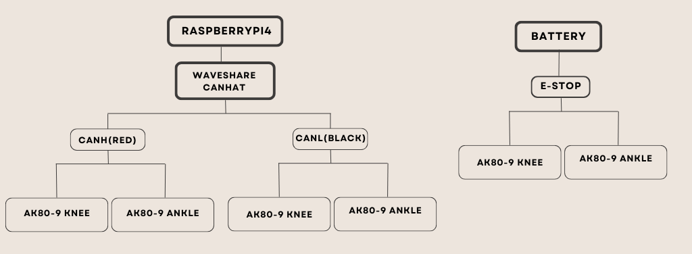

# Simultaneous Knee and Ankle Trajectory Tracking

## Overview

This document demonstrates simultaneous trajectory tracking of the knee and ankle joints using two CubeMars AK80-9 actuators connected through a CAN bus.

Each actuator follows its own predefined gait trajectory while both motors are controlled within the same synchronized control loop. The knee and ankle joints execute coordinated gait cycles simultaneously, enabling synchronized lower-limb motion.
## Hardware Requirements

- Raspberry Pi 4
- Waveshare CAN Hat
- Two CubeMars AK80-9 Actuators
- 40 V Power Supply
- Emergency Stop Switch
- CAN Bus Wiring

## Software Requirements

- Linux (Raspberry Pi OS)
- Python 3
- OpenSourceLeg (CubeMars) Python Library
- python-can
- Git
- GitHub Desktop
- Visual Studio Code
- PuTTY
- NumPy
- Pandas

  ## Circuit Diagram

The following wiring diagram shows the hardware setup used for simultaneous knee and ankle trajectory tracking.




## Running the Program

### 1. Connect the Hardware

- Connect both CubeMars AK80-9 actuators to the CAN bus.
- Verify that each actuator has a unique CAN ID.
- Power the system using the 40 V power supply.
- Ensure the Emergency Stop switch is connected and functional.

### 2. Enable the CAN Interface

```bash
sudo ip link set can0 up type can bitrate 1000000
```

Verify that the CAN interface is active:

```bash
ip link show can0
```

### 3. Run the Simultaneous Trajectory Tracking Program

```bash
python3 kneeankle_101.py
```

The program simultaneously controls the knee and ankle actuators by executing their respective trajectories. During execution, the script continuously logs motor position, velocity, current, and torque data while monitoring safety limits for both joints. :contentReference[oaicite:1]{index=1}


## Source Code

The complete Python implementation used for simultaneous knee and ankle trajectory tracking is provided below.

<details>
<summary><b>Click to expand the source code</b></summary>

```python
from opensourceleg.actuators.tmotor import TMotorServoActuator
import pandas as pd
import numpy as np
import time
import matplotlib
matplotlib.use("Agg")
import matplotlib.pyplot as plt
import matplotlib.gridspec as gridspec


# ==================================
# Motor constants  (AK80-9)
# ==================================

KT_MOTOR = 0.091   # Nm/A  — torque constant

# CAN IDs -- knee and ankle motors on the same bus/battery
KNEE_ID  = 100
ANKLE_ID = 1


# ==================================
# Helper functions (shared)
# ==================================

def make_cycle_continuous(t_one, q_one, target_rad, smooth_window=21):
    """
    Circular smoothing:
    removes start-end gait discontinuity
    while keeping peak exactly at target_rad.
    """
    q = q_one.copy()

    if smooth_window % 2 == 0:
        smooth_window += 1

    pad = smooth_window // 2

    q_pad = np.r_[q[-pad:], q, q[:pad]]
    kernel = np.ones(smooth_window) / smooth_window
    q_smooth = np.convolve(q_pad, kernel, mode="valid")
    q_smooth = q_smooth[:len(q)]

    q_smooth[-1] = q_smooth[0]

    q_smooth = q_smooth - np.min(q_smooth)
    q_smooth = target_rad * q_smooth / np.max(q_smooth)
    q_smooth[-1] = q_smooth[0]

    qd_smooth  = np.gradient(q_smooth, t_one)
    qdd_smooth = np.gradient(qd_smooth, t_one)

    return q_smooth, qd_smooth, qdd_smooth


def smooth_signal_circular(signal, smooth_window=21):
    """
    Apply the same circular smoothing to an arbitrary 1-D signal
    (used for torque) and force start == end closure.
    """
    if smooth_window % 2 == 0:
        smooth_window += 1

    pad = smooth_window // 2
    sig_pad = np.r_[signal[-pad:], signal, signal[:pad]]
    kernel  = np.ones(smooth_window) / smooth_window
    smoothed = np.convolve(sig_pad, kernel, mode="valid")[:len(signal)]
    smoothed[-1] = smoothed[0]
    return smoothed


def ema_filter(prev_filtered, new_value, alpha):
    """
    Simple exponential moving-average low-pass filter.
    alpha closer to 1 -> trusts new_value more (less smoothing, less lag).
    alpha closer to 0 -> heavier smoothing, more lag.
    """
    if prev_filtered is None:
        return new_value
    return alpha * new_value + (1.0 - alpha) * prev_filtered


def unwrap_motor_position(raw_pos, prev_raw_pos, unwrapped_pos):
    if prev_raw_pos is None:
        return raw_pos, raw_pos

    delta = raw_pos - prev_raw_pos

    if delta > np.pi:
        delta -= 2 * np.pi
    elif delta < -np.pi:
        delta += 2 * np.pi

    unwrapped_pos += delta
    return raw_pos, unwrapped_pos


def lead_interp(t_now, lead_time, t_full, q_full, qd_full, qdd_full):
    future_t = t_now + lead_time
    if future_t > t_full[-1]:
        future_t = t_full[-1]

    q_future   = np.interp(future_t, t_full, q_full)
    qd_future  = np.interp(future_t, t_full, qd_full)
    qdd_future = np.interp(future_t, t_full, qdd_full)

    return q_future, qd_future, qdd_future


# ==================================
# Plot function -- KNEE (v21 style)
# ==================================

def plot_tracking_knee(df, csv_path, n_cycles=3, target_deg=64.7):
    t    = df["time"].values
    dp   = df["desired_position"].values
    ap   = df["actual_position"].values
    dv   = df["desired_velocity"].values
    av   = df["actual_velocity"].values
    pe   = df["position_error"].values
    cmd  = df["velocity_command"].values
    cyc  = df["cycle"].values
    curr = df["motor_current"].values
    torq = df["output_torque"].values

    des_torq = df["desired_torque"].values
    des_curr = df["desired_current"].values

    dp_deg = np.degrees(dp - dp[0])
    ap_deg = np.degrees(ap - dp[0])
    pe_deg = np.degrees(pe)

    PANEL_BG = "#1a1d27"
    GRID_CLR = "#2e3147"
    TEXT_CLR = "#c8ccd8"

    BLUE   = "#4fa3e0"
    RED    = "#e05f4f"
    GREEN  = "#4fce82"
    ORANGE = "#f0a050"
    PURPLE = "#b07fff"
    CYAN   = "#4fefef"
    YELLOW = "#f0e050"

    CYCLE_COLORS = ["#4fa3e0", "#4fce82", "#f0a050"]

    fig = plt.figure(figsize=(14, 16))
    fig.patch.set_facecolor("#0f1117")

    fig.suptitle(
        f"Knee Motor Tracking — v21  ({n_cycles} Continuous Gait Cycles, {target_deg}°)  [CAN ID {KNEE_ID}]",
        fontsize=13,
        fontweight="bold",
        color="white",
        y=0.99
    )

    gs = gridspec.GridSpec(5, 1, hspace=0.55)

    def style_ax(ax, title, ylabel):
        ax.set_facecolor(PANEL_BG)
        ax.spines[:].set_color(GRID_CLR)
        ax.tick_params(colors=TEXT_CLR)
        ax.xaxis.label.set_color(TEXT_CLR)
        ax.yaxis.label.set_color(TEXT_CLR)
        ax.set_title(title, color=TEXT_CLR, fontsize=10, pad=6)
        ax.set_ylabel(ylabel, color=TEXT_CLR)
        ax.grid(True, color=GRID_CLR, lw=0.8)

    cycle_dur = t[-1] / n_cycles

    def shade_cycles(ax):
        for c in range(n_cycles):
            t0 = c * cycle_dur
            t1 = (c + 1) * cycle_dur
            ax.axvspan(t0, t1, alpha=0.04, color=CYCLE_COLORS[c % len(CYCLE_COLORS)])
            ax.axvline(t0, color="white", lw=0.5, alpha=0.3, ls="--")

    ax1 = fig.add_subplot(gs[0])
    style_ax(ax1, "Position Tracking  (relative to motor start)", "Position (°)")

    ax1.plot(t, dp_deg, color=BLUE, lw=1.8, label="Desired")
    ax1.plot(t, ap_deg, color=RED,  lw=1.5, ls="--", label="Actual")
    ax1.fill_between(t, dp_deg, ap_deg, alpha=0.15, color=ORANGE)
    ax1.axhline(target_deg, color=CYAN, lw=0.8, ls=":", alpha=0.7, label=f"{target_deg}° target")
    ax1.axhline(0, color=GRID_CLR, lw=0.8)

    shade_cycles(ax1)

    for c in range(n_cycles):
        ax1.text(
            c * cycle_dur + 0.05, 1.0, f"C{c + 1}",
            color=CYCLE_COLORS[c % len(CYCLE_COLORS)],
            fontsize=8, transform=ax1.get_xaxis_transform()
        )

    peak_idx = np.argmax(np.abs(pe))
    ax1.annotate(
        f"Peak error\n{np.degrees(pe[peak_idx]):.1f}°",
        xy=(t[peak_idx], ap_deg[peak_idx]),
        xytext=(t[peak_idx] - 0.35, ap_deg[peak_idx] - 8),
        color=ORANGE, fontsize=8,
        arrowprops=dict(arrowstyle="->", color=ORANGE)
    )

    ax1.legend(fontsize=9, facecolor=PANEL_BG, labelcolor=TEXT_CLR)

    ax2 = fig.add_subplot(gs[1])
    style_ax(ax2, "Velocity Tracking & Command", "rad/s  /  cmd units")

    ax2.plot(t, dv,  color=BLUE,  lw=1.8, label="Desired vel")
    ax2.plot(t, av,  color=RED,   lw=1.5, ls="--", label="Actual vel")
    ax2.plot(t, cmd, color=GREEN, lw=1.2, ls=":",  label="Velocity command")
    ax2.axhline( 100, color="white", lw=0.8, ls="--", alpha=0.4, label="±VEL_LIMIT")
    ax2.axhline(-100, color="white", lw=0.8, ls="--", alpha=0.4)
    ax2.fill_between(t,  100, np.clip(cmd,  100, 200), alpha=0.25, color="red")
    ax2.fill_between(t, -100, np.clip(cmd, -200,-100), alpha=0.25, color="red")

    shade_cycles(ax2)
    ax2.legend(fontsize=8, facecolor=PANEL_BG, labelcolor=TEXT_CLR)

    ax3 = fig.add_subplot(gs[2])

    rms_all  = np.sqrt(np.mean(pe_deg**2))
    peak_all = np.max(np.abs(pe_deg))

    cycle_rms_parts = []
    for c in range(n_cycles):
        mask  = cyc == (c + 1)
        rms_c = np.sqrt(np.mean(pe_deg[mask]**2)) if mask.any() else 0
        cycle_rms_parts.append(f"C{c + 1}:{rms_c:.1f}°")

    cycle_rms_str = "  ".join(cycle_rms_parts)

    style_ax(
        ax3,
        f"Position Error  │  RMS={rms_all:.2f}°  Peak={peak_all:.2f}°"
        f"  │  Per-cycle:  {cycle_rms_str}",
        "Error (°)"
    )

    ax3.plot(t, pe_deg,       color=PURPLE,  lw=1.8, label="Position error")
    ax3.plot(t, np.abs(pe_deg), color="white", lw=0.9, ls=":", alpha=0.6, label="|error|")
    ax3.axhline(0, color=GRID_CLR, lw=1.0)
    ax3.fill_between(t, 0, pe_deg, where=(pe_deg > 0), alpha=0.2, color=BLUE, label="Lagging")
    ax3.fill_between(t, 0, pe_deg, where=(pe_deg < 0), alpha=0.2, color=RED,  label="Overshooting")

    shade_cycles(ax3)
    ax3.legend(fontsize=8, facecolor=PANEL_BG, labelcolor=TEXT_CLR)

    ax4 = fig.add_subplot(gs[3])

    peak_curr     = np.max(np.abs(curr))
    rms_curr      = np.sqrt(np.mean(curr**2))
    peak_des_curr = np.max(np.abs(des_curr))

    style_ax(
        ax4,
        f"Motor Current  │  Actual: Peak={peak_curr:.2f} A  RMS={rms_curr:.2f} A"
        f"  │  Desired Peak={peak_des_curr:.2f} A  (Winter gait / Kt)",
        "Current (A)"
    )

    ax4.plot(t, des_curr, color=BLUE,   lw=1.5, ls="--", label="Desired current (Winter/Kt)")
    ax4.plot(t, curr,     color=YELLOW, lw=1.5,           label="Actual current")
    ax4.axhline(0, color=GRID_CLR, lw=0.8)
    ax4.fill_between(t, 0, curr,     where=(curr > 0),     alpha=0.15, color=YELLOW)
    ax4.fill_between(t, 0, curr,     where=(curr < 0),     alpha=0.15, color=RED)
    ax4.fill_between(t, 0, des_curr, where=(des_curr > 0), alpha=0.08, color=BLUE)
    ax4.fill_between(t, 0, des_curr, where=(des_curr < 0), alpha=0.08, color=BLUE)

    shade_cycles(ax4)
    ax4.legend(fontsize=8, facecolor=PANEL_BG, labelcolor=TEXT_CLR)

    ax5 = fig.add_subplot(gs[4])

    peak_torq     = np.max(np.abs(torq))
    rms_torq      = np.sqrt(np.mean(torq**2))
    peak_des_torq = np.max(np.abs(des_torq))

    style_ax(
        ax5,
        f"Output Torque  │  Actual: Peak={peak_torq:.2f} Nm  RMS={rms_torq:.2f} Nm"
        f"  │  Desired Peak={peak_des_torq:.2f} Nm  (Winter gait)",
        "Torque (Nm)"
    )

    ax5.plot(t, des_torq, color=BLUE, lw=1.5, ls="--", label="Desired torque (Winter gait)")
    ax5.plot(t, torq,     color=CYAN, lw=1.5,           label="Actual torque")
    ax5.axhline(0, color=GRID_CLR, lw=0.8)
    ax5.fill_between(t, 0, torq,     where=(torq > 0),     alpha=0.15, color=CYAN)
    ax5.fill_between(t, 0, torq,     where=(torq < 0),     alpha=0.15, color=RED)
    ax5.fill_between(t, 0, des_torq, where=(des_torq > 0), alpha=0.08, color=BLUE)
    ax5.fill_between(t, 0, des_torq, where=(des_torq < 0), alpha=0.08, color=BLUE)

    shade_cycles(ax5)
    ax5.set_xlabel("Time (s)", color=TEXT_CLR)
    ax5.legend(fontsize=8, facecolor=PANEL_BG, labelcolor=TEXT_CLR)

    param_txt = (
        "v21 (knee): KP=50, KI=3, KD=0.9, VEL_SCALE=18, ACC_SCALE=0.35, "
        "VEL_LIMIT=100, LEAD_TIME=0.10, TIME_SCALE=2.0 | "
        "circular smoothing + peak fixed | desired τ/I from Winter gait CSV"
    )

    fig.text(
        0.13, 0.005, param_txt,
        fontsize=7.5, color=TEXT_CLR, family="monospace",
        bbox=dict(boxstyle="round", fc=PANEL_BG, ec=GRID_CLR, alpha=0.9)
    )

    png_path = csv_path.replace(".csv", ".png")
    plt.savefig(png_path, dpi=150, bbox_inches="tight", facecolor=fig.get_facecolor())
    print(f"Saved: {png_path}")
    plt.close()


# ==================================
# Plot function -- ANKLE (v24 style)
# ==================================

def plot_tracking_ankle(df, csv_path, n_cycles=3, target_deg=29.5):
    t    = df["time"].values
    dp   = df["desired_position"].values
    ap   = df["actual_position"].values
    dv   = df["desired_velocity"].values
    av   = df["actual_velocity"].values
    av_f = df["actual_velocity_filtered"].values
    pe   = df["position_error"].values
    cmd  = df["velocity_command"].values
    cmd_raw = df["velocity_command_raw"].values
    cyc  = df["cycle"].values
    curr = df["motor_current"].values
    torq = df["output_torque"].values

    des_torq = df["desired_torque"].values
    des_curr = df["desired_current"].values

    dp_deg = np.degrees(dp - dp[0])
    ap_deg = np.degrees(ap - dp[0])
    pe_deg = np.degrees(pe)

    PANEL_BG = "#1a1d27"
    GRID_CLR = "#2e3147"
    TEXT_CLR = "#c8ccd8"

    BLUE   = "#4fa3e0"
    RED    = "#e05f4f"
    GREEN  = "#4fce82"
    ORANGE = "#f0a050"
    PURPLE = "#b07fff"
    CYAN   = "#4fefef"
    YELLOW = "#f0e050"

    CYCLE_COLORS = ["#4fa3e0", "#4fce82", "#f0a050"]

    fig = plt.figure(figsize=(14, 16))
    fig.patch.set_facecolor("#0f1117")

    fig.suptitle(
        f"Ankle Motor Tracking — v24  ({n_cycles} Continuous Gait Cycles, {target_deg}°)  [CAN ID {ANKLE_ID}]",
        fontsize=13,
        fontweight="bold",
        color="white",
        y=0.99
    )

    gs = gridspec.GridSpec(5, 1, hspace=0.55)

    def style_ax(ax, title, ylabel):
        ax.set_facecolor(PANEL_BG)
        ax.spines[:].set_color(GRID_CLR)
        ax.tick_params(colors=TEXT_CLR)
        ax.xaxis.label.set_color(TEXT_CLR)
        ax.yaxis.label.set_color(TEXT_CLR)
        ax.set_title(title, color=TEXT_CLR, fontsize=10, pad=6)
        ax.set_ylabel(ylabel, color=TEXT_CLR)
        ax.grid(True, color=GRID_CLR, lw=0.8)

    cycle_dur = t[-1] / n_cycles

    def shade_cycles(ax):
        for c in range(n_cycles):
            t0 = c * cycle_dur
            t1 = (c + 1) * cycle_dur
            ax.axvspan(t0, t1, alpha=0.04, color=CYCLE_COLORS[c % len(CYCLE_COLORS)])
            ax.axvline(t0, color="white", lw=0.5, alpha=0.3, ls="--")

    ax1 = fig.add_subplot(gs[0])
    style_ax(ax1, "Position Tracking  (relative to motor start)", "Position (°)")

    ax1.plot(t, dp_deg, color=BLUE, lw=1.8, label="Desired")
    ax1.plot(t, ap_deg, color=RED,  lw=1.5, ls="--", label="Actual")
    ax1.fill_between(t, dp_deg, ap_deg, alpha=0.15, color=ORANGE)
    ax1.axhline(target_deg, color=CYAN, lw=0.8, ls=":", alpha=0.7, label=f"{target_deg}° target")
    ax1.axhline(0, color=GRID_CLR, lw=0.8)

    shade_cycles(ax1)

    for c in range(n_cycles):
        ax1.text(
            c * cycle_dur + 0.05, 1.0, f"C{c + 1}",
            color=CYCLE_COLORS[c % len(CYCLE_COLORS)],
            fontsize=8, transform=ax1.get_xaxis_transform()
        )

    peak_idx = np.argmax(np.abs(pe))
    ax1.annotate(
        f"Peak error\n{np.degrees(pe[peak_idx]):.1f}°",
        xy=(t[peak_idx], ap_deg[peak_idx]),
        xytext=(t[peak_idx] - 0.35, ap_deg[peak_idx] - 8),
        color=ORANGE, fontsize=8,
        arrowprops=dict(arrowstyle="->", color=ORANGE)
    )

    ax1.legend(fontsize=9, facecolor=PANEL_BG, labelcolor=TEXT_CLR)

    ax2 = fig.add_subplot(gs[1])
    style_ax(ax2, "Velocity Tracking & Command", "rad/s  /  cmd units")

    ax2.plot(t, dv,  color=BLUE,  lw=1.8, label="Desired vel")
    ax2.plot(t, av,  color=RED,   lw=0.8, alpha=0.35, label="Actual vel (raw)")
    ax2.plot(t, av_f, color=RED,  lw=1.5, ls="--", label="Actual vel (filtered)")
    ax2.plot(t, cmd_raw, color=GREEN, lw=0.8, alpha=0.3, label="Velocity cmd (raw)")
    ax2.plot(t, cmd, color=GREEN, lw=1.4, ls=":",  label="Velocity cmd (filtered/slewed)")
    ax2.axhline( 100, color="white", lw=0.8, ls="--", alpha=0.4, label="±VEL_LIMIT")
    ax2.axhline(-100, color="white", lw=0.8, ls="--", alpha=0.4)
    ax2.fill_between(t,  100, np.clip(cmd,  100, 200), alpha=0.25, color="red")
    ax2.fill_between(t, -100, np.clip(cmd, -200,-100), alpha=0.25, color="red")

    shade_cycles(ax2)
    ax2.legend(fontsize=8, facecolor=PANEL_BG, labelcolor=TEXT_CLR)

    ax3 = fig.add_subplot(gs[2])

    rms_all  = np.sqrt(np.mean(pe_deg**2))
    peak_all = np.max(np.abs(pe_deg))

    cycle_rms_parts = []
    for c in range(n_cycles):
        mask  = cyc == (c + 1)
        rms_c = np.sqrt(np.mean(pe_deg[mask]**2)) if mask.any() else 0
        cycle_rms_parts.append(f"C{c + 1}:{rms_c:.1f}°")

    cycle_rms_str = "  ".join(cycle_rms_parts)

    style_ax(
        ax3,
        f"Position Error  │  RMS={rms_all:.2f}°  Peak={peak_all:.2f}°"
        f"  │  Per-cycle:  {cycle_rms_str}",
        "Error (°)"
    )

    ax3.plot(t, pe_deg,       color=PURPLE,  lw=1.8, label="Position error")
    ax3.plot(t, np.abs(pe_deg), color="white", lw=0.9, ls=":", alpha=0.6, label="|error|")
    ax3.axhline(0, color=GRID_CLR, lw=1.0)
    ax3.fill_between(t, 0, pe_deg, where=(pe_deg > 0), alpha=0.2, color=BLUE, label="Lagging")
    ax3.fill_between(t, 0, pe_deg, where=(pe_deg < 0), alpha=0.2, color=RED,  label="Overshooting")

    shade_cycles(ax3)
    ax3.legend(fontsize=8, facecolor=PANEL_BG, labelcolor=TEXT_CLR)

    ax4 = fig.add_subplot(gs[3])

    peak_curr     = np.max(np.abs(curr))
    rms_curr      = np.sqrt(np.mean(curr**2))
    peak_des_curr = np.max(np.abs(des_curr))

    style_ax(
        ax4,
        f"Motor Current  │  Actual: Peak={peak_curr:.2f} A  RMS={rms_curr:.2f} A"
        f"  │  Desired Peak={peak_des_curr:.2f} A  (Winter gait / Kt)",
        "Current (A)"
    )

    ax4.plot(t, des_curr, color=BLUE,   lw=1.5, ls="--", label="Desired current (Winter/Kt)")
    ax4.plot(t, curr,     color=YELLOW, lw=1.5,           label="Actual current")
    ax4.axhline(0, color=GRID_CLR, lw=0.8)
    ax4.fill_between(t, 0, curr,     where=(curr > 0),     alpha=0.15, color=YELLOW)
    ax4.fill_between(t, 0, curr,     where=(curr < 0),     alpha=0.15, color=RED)
    ax4.fill_between(t, 0, des_curr, where=(des_curr > 0), alpha=0.08, color=BLUE)
    ax4.fill_between(t, 0, des_curr, where=(des_curr < 0), alpha=0.08, color=BLUE)

    shade_cycles(ax4)
    ax4.legend(fontsize=8, facecolor=PANEL_BG, labelcolor=TEXT_CLR)

    ax5 = fig.add_subplot(gs[4])

    peak_torq     = np.max(np.abs(torq))
    rms_torq      = np.sqrt(np.mean(torq**2))
    peak_des_torq = np.max(np.abs(des_torq))

    style_ax(
        ax5,
        f"Output Torque  │  Actual: Peak={peak_torq:.2f} Nm  RMS={rms_torq:.2f} Nm"
        f"  │  Desired Peak={peak_des_torq:.2f} Nm  (Winter gait)",
        "Torque (Nm)"
    )

    ax5.plot(t, des_torq, color=BLUE, lw=1.5, ls="--", label="Desired torque (Winter gait)")
    ax5.plot(t, torq,     color=CYAN, lw=1.5,           label="Actual torque")
    ax5.axhline(0, color=GRID_CLR, lw=0.8)
    ax5.fill_between(t, 0, torq,     where=(torq > 0),     alpha=0.15, color=CYAN)
    ax5.fill_between(t, 0, torq,     where=(torq < 0),     alpha=0.15, color=RED)
    ax5.fill_between(t, 0, des_torq, where=(des_torq > 0), alpha=0.08, color=BLUE)
    ax5.fill_between(t, 0, des_torq, where=(des_torq < 0), alpha=0.08, color=BLUE)

    shade_cycles(ax5)
    ax5.set_xlabel("Time (s)", color=TEXT_CLR)
    ax5.legend(fontsize=8, facecolor=PANEL_BG, labelcolor=TEXT_CLR)

    param_txt = (
        "v24 (ankle): KP=55, KI=3, KD=1.1, VEL_SCALE=16.5, ACC_SCALE=0.28, "
        "VEL_LIMIT=100, LEAD_TIME=0.13, TIME_SCALE=2.0 | "
        "VEL_FILTER=0.45, CMD_FILTER=0.45, SLEW=600/s | "
        "circular smoothing + peak fixed | desired τ/I from Winter ankle gait CSV"
    )

    fig.text(
        0.13, 0.005, param_txt,
        fontsize=7.5, color=TEXT_CLR, family="monospace",
        bbox=dict(boxstyle="round", fc=PANEL_BG, ec=GRID_CLR, alpha=0.9)
    )

    png_path = csv_path.replace(".csv", ".png")
    plt.savefig(png_path, dpi=150, bbox_inches="tight", facecolor=fig.get_facecolor())
    print(f"Saved: {png_path}")
    plt.close()


# ==================================
# Load and downsample trajectory data
# (single source file, both joints' columns)
# ==================================

traj = pd.read_csv("walk_Winter1.csv")
traj = traj.iloc[::4].reset_index(drop=True)


def build_trajectory(t_col, q_col, tau_col, target_deg, time_scale=2.0,
                      n_cycles=3, smooth_window=21):
    """Builds a continuous multi-cycle (q, qd, qdd, tau) trajectory from
    one joint's columns in the Winter gait CSV, exactly as each of the
    original single-joint scripts did."""

    t_raw   = traj[t_col].values
    q_raw   = traj[q_col].values
    tau_raw = traj[tau_col].values

    target_rad = np.radians(target_deg)

    q_min = q_raw.min()
    q_max = q_raw.max()
    scale_factor = target_rad / (q_max - q_min)

    t_one = (t_raw - t_raw[0]) * time_scale
    q_one = scale_factor * (q_raw - q_min)

    q_one, qd_one, qdd_one = make_cycle_continuous(
        t_one, q_one, target_rad=target_rad, smooth_window=smooth_window
    )
    tau_one = smooth_signal_circular(tau_raw, smooth_window=smooth_window)

    cycle_dur = t_one[-1]

    t_cycle   = t_one[:-1]
    q_cycle   = q_one[:-1]
    qd_cycle  = qd_one[:-1]
    qdd_cycle = qdd_one[:-1]
    tau_cycle = tau_one[:-1]

    t_full   = np.concatenate([t_cycle   + c * cycle_dur for c in range(n_cycles)])
    q_full   = np.concatenate([q_cycle   for _ in range(n_cycles)])
    qd_full  = np.concatenate([qd_cycle  for _ in range(n_cycles)])
    qdd_full = np.concatenate([qdd_cycle for _ in range(n_cycles)])
    tau_full = np.concatenate([tau_cycle for _ in range(n_cycles)])

    cycle_label = np.concatenate([
        np.full(len(t_cycle), c + 1) for c in range(n_cycles)
    ])

    return {
        "t_full": t_full, "q_full": q_full, "qd_full": qd_full,
        "qdd_full": qdd_full, "tau_full": tau_full,
        "cycle_label": cycle_label, "cycle_dur": cycle_dur,
        "n_cycles": n_cycles, "target_deg": target_deg,
    }


N_CYCLES        = 3
TARGET_DEG_KNEE  = 64.7
TARGET_DEG_ANKLE = 29.5

knee_traj = build_trajectory(
    "knee_time", "knee_position", "knee_torque",
    target_deg=TARGET_DEG_KNEE, n_cycles=N_CYCLES
)
ankle_traj = build_trajectory(
    "ankle_time", "ankle_position", "ankle_torque",
    target_deg=TARGET_DEG_ANKLE, n_cycles=N_CYCLES
)

print(f"Knee  trajectory : {len(knee_traj['t_full'])} samples, "
      f"{knee_traj['t_full'][-1]:.3f} s total, target {TARGET_DEG_KNEE}°")
print(f"Ankle trajectory : {len(ankle_traj['t_full'])} samples, "
      f"{ankle_traj['t_full'][-1]:.3f} s total, target {TARGET_DEG_ANKLE}°")


# ==================================
# Connect both motors
# ==================================

motor_knee  = TMotorServoActuator(motor_type="AK80-9", motor_id=KNEE_ID)
motor_knee.start()
motor_knee.set_control_mode(type(motor_knee.mode).VELOCITY)
motor_knee.update()

motor_ankle = TMotorServoActuator(motor_type="AK80-9", motor_id=ANKLE_ID)
motor_ankle.start()
motor_ankle.set_control_mode(type(motor_ankle.mode).VELOCITY)
motor_ankle.update()

print(f"Connected knee motor  (CAN ID {KNEE_ID})")
print(f"Connected ankle motor (CAN ID {ANKLE_ID})")


# ==================================
# Reference alignment (per motor)
# ==================================

q0_motor_knee  = motor_knee.output_position
q0_traj_knee   = knee_traj["q_full"][0]

q0_motor_ankle = motor_ankle.output_position
q0_traj_ankle  = ankle_traj["q_full"][0]

print(f"Knee  motor shaft at start : {q0_motor_knee:.4f} rad ({np.degrees(q0_motor_knee):.2f}°)")
print(f"Ankle motor shaft at start : {q0_motor_ankle:.4f} rad ({np.degrees(q0_motor_ankle):.2f}°)")


# ==================================
# Controller parameters -- KNEE (v21, no filtering)
# ==================================

KP_POS_KNEE = 50.0
KI_POS_KNEE = 3.0
KD_VEL_KNEE = 0.9

VEL_SCALE_KNEE = 18.0
ACC_SCALE_KNEE = 0.35

VEL_LIMIT_KNEE = 100.0
LEAD_TIME_KNEE = 0.10

INTEGRAL_CMD_CAP_KNEE = 5.0


# ==================================
# Controller parameters -- ANKLE (v24, with filtering/slew)
# ==================================

KP_POS_ANKLE = 55.0
KI_POS_ANKLE = 3.0
KD_VEL_ANKLE = 1.1

VEL_SCALE_ANKLE = 16.5
ACC_SCALE_ANKLE = 0.28

VEL_LIMIT_ANKLE = 100.0
LEAD_TIME_ANKLE = 0.13

INTEGRAL_CMD_CAP_ANKLE = 5.0

VEL_FILTER_ALPHA = 0.45
CMD_FILTER_ALPHA = 0.45
CMD_SLEW_RATE     = 600.0


# ==================================
# Safety: runaway / over-rotation cutoff (both joints)
# ==================================
# If EITHER motor's actual position strays more than SAFETY_LIMIT_DEG from
# its own start position (q0_motor_knee / q0_motor_ankle), something is
# wrong (bad tracking, sensor glitch, runaway command, etc). Targets here
# are only ~64.7deg (knee) and ~29.5deg (ankle), so 100.9deg is a generous
# margin that should only trip on a real fault. Tripping either joint stops
# BOTH motors -- a fault on one joint isn't safe to run alongside on a leg.
SAFETY_LIMIT_DEG = 100.9   # trip strictly below 101deg
SAFETY_LIMIT_RAD = np.radians(SAFETY_LIMIT_DEG)

# Gentle P-controller used to bring both motors back to zero after a trip.
RETURN_KP        = 20.0   # rad -> velocity-cmd units
RETURN_VEL_LIMIT = 30.0   # cap return speed well below normal VEL_LIMIT
RETURN_TOL_RAD   = np.radians(1.0)   # close enough to call it "home"
RETURN_TIMEOUT_S = 10.0   # safety net so the return routine can't hang forever

safety_triggered = False
safety_reason    = ""


# ==================================
# Per-motor control-loop state
# ==================================

class KneeState:
    def __init__(self):
        self.integral_error      = 0.0
        self.prev_cycle          = 1
        self.prev_raw_actual_pos  = None
        self.actual_pos_unwrapped = None

        self.log_time        = []
        self.log_cycle       = []
        self.log_des_pos     = []
        self.log_act_pos     = []
        self.log_des_vel     = []
        self.log_act_vel     = []
        self.log_des_acc     = []
        self.log_pos_err     = []
        self.log_vel_err     = []
        self.log_cmd_vel     = []
        self.log_integral    = []
        self.log_current     = []
        self.log_torque      = []
        self.log_des_torque  = []
        self.log_des_current = []


class AnkleState:
    def __init__(self):
        self.integral_error      = 0.0
        self.prev_cycle          = 1
        self.filtered_actual_vel = None
        self.prev_sent_cmd       = 0.0

        self.prev_raw_actual_pos  = None
        self.actual_pos_unwrapped = None

        self.log_time         = []
        self.log_cycle        = []
        self.log_des_pos      = []
        self.log_act_pos      = []
        self.log_des_vel      = []
        self.log_act_vel      = []
        self.log_act_vel_filt = []
        self.log_des_acc      = []
        self.log_pos_err      = []
        self.log_vel_err      = []
        self.log_cmd_vel      = []
        self.log_cmd_vel_raw  = []
        self.log_integral     = []
        self.log_current      = []
        self.log_torque       = []
        self.log_des_torque   = []
        self.log_des_current  = []


knee_state  = KneeState()
ankle_state = AnkleState()


def step_knee(motor, state, traj, t_now, dt):
    """v21 control law -- no velocity/command filtering, no slew limit."""

    current_cycle = min(int(t_now // traj["cycle_dur"]) + 1, traj["n_cycles"])
    if current_cycle != state.prev_cycle:
        state.prev_cycle = current_cycle
        print(f"\n--- [KNEE  ID{KNEE_ID}] Cycle {current_cycle} start  t={t_now:.3f} s ---\n")

    motor.update()

    raw_actual_pos = motor.output_position
    actual_vel     = motor.output_velocity
    actual_current = motor.motor_current
    actual_torque  = motor.output_torque

    state.prev_raw_actual_pos, actual_pos = unwrap_motor_position(
        raw_actual_pos, state.prev_raw_actual_pos, state.actual_pos_unwrapped
    )
    state.actual_pos_unwrapped = actual_pos

    q_ref, qd_ref, qdd_ref = lead_interp(
        t_now, LEAD_TIME_KNEE,
        traj["t_full"], traj["q_full"], traj["qd_full"], traj["qdd_full"]
    )

    future_t = min(t_now + LEAD_TIME_KNEE, traj["t_full"][-1])
    tau_ref  = np.interp(future_t, traj["t_full"], traj["tau_full"])
    i_ref    = tau_ref / KT_MOTOR

    desired_pos = q0_motor_knee + (q_ref - q0_traj_knee)
    desired_vel = qd_ref
    desired_acc = qdd_ref

    pos_error = desired_pos - actual_pos
    vel_error = desired_vel - actual_vel

    cmd_pd = (
        ACC_SCALE_KNEE * desired_acc
        + VEL_SCALE_KNEE * desired_vel
        + KP_POS_KNEE * pos_error
        + KD_VEL_KNEE * vel_error
    )

    if abs(cmd_pd) < VEL_LIMIT_KNEE:
        state.integral_error += pos_error * dt

    state.integral_error = np.clip(
        state.integral_error,
        -INTEGRAL_CMD_CAP_KNEE / KI_POS_KNEE,
        INTEGRAL_CMD_CAP_KNEE / KI_POS_KNEE
    )

    velocity_cmd = np.clip(
        cmd_pd + KI_POS_KNEE * state.integral_error,
        -VEL_LIMIT_KNEE, VEL_LIMIT_KNEE
    )
    velocity_cmd = float(velocity_cmd)

    motor.set_motor_velocity(velocity_cmd)

    des_deg = np.degrees(desired_pos - q0_motor_knee)
    act_deg = np.degrees(actual_pos  - q0_motor_knee)

    state.log_time.append(t_now)
    state.log_cycle.append(current_cycle)
    state.log_des_pos.append(desired_pos)
    state.log_act_pos.append(actual_pos)
    state.log_des_vel.append(desired_vel)
    state.log_act_vel.append(actual_vel)
    state.log_des_acc.append(desired_acc)
    state.log_pos_err.append(pos_error)
    state.log_vel_err.append(vel_error)
    state.log_cmd_vel.append(velocity_cmd)
    state.log_integral.append(state.integral_error)
    state.log_current.append(actual_current)
    state.log_torque.append(actual_torque)
    state.log_des_torque.append(tau_ref)
    state.log_des_current.append(i_ref)

    print(
        f"[KNEE  ID{KNEE_ID}] t={t_now:.3f}  C{current_cycle}"
        f"  des={des_deg:6.2f}°  act={act_deg:6.2f}°"
        f"  err={np.degrees(pos_error):+6.2f}°"
        f"  cmd={velocity_cmd:6.1f}"
        f"  I_act={actual_current:5.2f}A  I_des={i_ref:5.2f}A"
        f"  τ_act={actual_torque:5.2f}Nm  τ_des={tau_ref:5.2f}Nm"
    )

    return actual_pos


def step_ankle(motor, state, traj, t_now, dt):
    """v24 control law -- velocity feedback filtering, command filtering + slew."""

    current_cycle = min(int(t_now // traj["cycle_dur"]) + 1, traj["n_cycles"])
    if current_cycle != state.prev_cycle:
        state.prev_cycle = current_cycle
        print(f"\n--- [ANKLE ID{ANKLE_ID}] Cycle {current_cycle} start  t={t_now:.3f} s ---\n")

    motor.update()

    raw_actual_pos = motor.output_position
    actual_vel     = motor.output_velocity
    actual_current = motor.motor_current
    actual_torque  = motor.output_torque

    state.prev_raw_actual_pos, actual_pos = unwrap_motor_position(
        raw_actual_pos, state.prev_raw_actual_pos, state.actual_pos_unwrapped
    )
    state.actual_pos_unwrapped = actual_pos

    state.filtered_actual_vel = ema_filter(
        state.filtered_actual_vel, actual_vel, VEL_FILTER_ALPHA
    )

    q_ref, qd_ref, qdd_ref = lead_interp(
        t_now, LEAD_TIME_ANKLE,
        traj["t_full"], traj["q_full"], traj["qd_full"], traj["qdd_full"]
    )

    future_t = min(t_now + LEAD_TIME_ANKLE, traj["t_full"][-1])
    tau_ref  = np.interp(future_t, traj["t_full"], traj["tau_full"])
    i_ref    = tau_ref / KT_MOTOR

    desired_pos = q0_motor_ankle + (q_ref - q0_traj_ankle)
    desired_vel = qd_ref
    desired_acc = qdd_ref

    pos_error = desired_pos - actual_pos
    vel_error = desired_vel - state.filtered_actual_vel

    cmd_pd = (
        ACC_SCALE_ANKLE * desired_acc
        + VEL_SCALE_ANKLE * desired_vel
        + KP_POS_ANKLE * pos_error
        + KD_VEL_ANKLE * vel_error
    )

    if abs(cmd_pd) < VEL_LIMIT_ANKLE:
        state.integral_error += pos_error * dt

    state.integral_error = np.clip(
        state.integral_error,
        -INTEGRAL_CMD_CAP_ANKLE / KI_POS_ANKLE,
        INTEGRAL_CMD_CAP_ANKLE / KI_POS_ANKLE
    )

    velocity_cmd_raw = np.clip(
        cmd_pd + KI_POS_ANKLE * state.integral_error,
        -VEL_LIMIT_ANKLE, VEL_LIMIT_ANKLE
    )

    max_step = CMD_SLEW_RATE * dt
    velocity_cmd_rl = np.clip(
        velocity_cmd_raw,
        state.prev_sent_cmd - max_step,
        state.prev_sent_cmd + max_step
    )
    velocity_cmd = ema_filter(state.prev_sent_cmd, velocity_cmd_rl, CMD_FILTER_ALPHA)
    velocity_cmd = float(np.clip(velocity_cmd, -VEL_LIMIT_ANKLE, VEL_LIMIT_ANKLE))
    state.prev_sent_cmd = velocity_cmd

    motor.set_motor_velocity(velocity_cmd)

    des_deg = np.degrees(desired_pos - q0_motor_ankle)
    act_deg = np.degrees(actual_pos  - q0_motor_ankle)

    state.log_time.append(t_now)
    state.log_cycle.append(current_cycle)
    state.log_des_pos.append(desired_pos)
    state.log_act_pos.append(actual_pos)
    state.log_des_vel.append(desired_vel)
    state.log_act_vel.append(actual_vel)
    state.log_act_vel_filt.append(state.filtered_actual_vel)
    state.log_des_acc.append(desired_acc)
    state.log_pos_err.append(pos_error)
    state.log_vel_err.append(vel_error)
    state.log_cmd_vel.append(velocity_cmd)
    state.log_cmd_vel_raw.append(velocity_cmd_raw)
    state.log_integral.append(state.integral_error)
    state.log_current.append(actual_current)
    state.log_torque.append(actual_torque)
    state.log_des_torque.append(tau_ref)
    state.log_des_current.append(i_ref)

    print(
        f"[ANKLE ID{ANKLE_ID}] t={t_now:.3f}  C{current_cycle}"
        f"  des={des_deg:6.2f}°  act={act_deg:6.2f}°"
        f"  err={np.degrees(pos_error):+6.2f}°"
        f"  cmd={velocity_cmd:6.1f} (raw={velocity_cmd_raw:6.1f})"
        f"  I_act={actual_current:5.2f}A  I_des={i_ref:5.2f}A"
        f"  τ_act={actual_torque:5.2f}Nm  τ_des={tau_ref:5.2f}Nm"
    )

    return actual_pos


# ==================================
# Master timing loop
# ==================================
# Knee and ankle trajectories can have slightly different total durations.
# We pace the real-time loop off whichever trajectory is *longer*, so both
# motors get to run their full trajectory; the shorter one's reference just
# holds at its final sample (via lead_interp/np.interp clamping) once it's done.

if knee_traj["t_full"][-1] >= ankle_traj["t_full"][-1]:
    master_t = knee_traj["t_full"]
    print("Pacing master clock off KNEE trajectory (longer duration)")
else:
    master_t = ankle_traj["t_full"]
    print("Pacing master clock off ANKLE trajectory (longer duration)")

try:
    start_time = time.time()

    for i in range(len(master_t)):

        target_time = start_time + master_t[i]
        while time.time() < target_time:
            pass

        t_now = master_t[i]
        dt = master_t[i] - master_t[i - 1] if i > 0 else 1e-4
        dt = max(dt, 1e-4)

        knee_pos  = step_knee(motor_knee, knee_state, knee_traj, t_now, dt)
        ankle_pos = step_ankle(motor_ankle, ankle_state, ankle_traj, t_now, dt)

        # --- Safety check: has either joint rotated too far from start? ---
        knee_dev_rad  = knee_pos  - q0_motor_knee
        ankle_dev_rad = ankle_pos - q0_motor_ankle

        if abs(knee_dev_rad) > SAFETY_LIMIT_RAD or abs(ankle_dev_rad) > SAFETY_LIMIT_RAD:
            safety_triggered = True
            safety_reason = (
                f"KNEE={np.degrees(knee_dev_rad):.2f}°"
                if abs(knee_dev_rad) > SAFETY_LIMIT_RAD
                else f"ANKLE={np.degrees(ankle_dev_rad):.2f}°"
            )
            print(
                f"\n!!! SAFETY LIMIT TRIPPED at t={t_now:.3f}s !!!\n"
                f"    knee={np.degrees(knee_dev_rad):.2f}°  "
                f"ankle={np.degrees(ankle_dev_rad):.2f}°  "
                f"limit=±{SAFETY_LIMIT_DEG:.1f}°  (tripped: {safety_reason})\n"
                f"    Stopping trajectory tracking on BOTH motors and returning to zero.\n"
            )
            motor_knee.set_motor_velocity(0)
            motor_ankle.set_motor_velocity(0)
            break

    motor_knee.set_motor_velocity(0)
    motor_ankle.set_motor_velocity(0)

    # --- If the safety limit tripped, drive both motors gently back to zero ---
    if safety_triggered:
        print("Returning both motors to zero position...")
        return_start = time.time()

        knee_done  = False
        ankle_done = False

        while True:
            motor_knee.update()
            motor_ankle.update()

            knee_state.prev_raw_actual_pos, knee_actual_pos = unwrap_motor_position(
                motor_knee.output_position,
                knee_state.prev_raw_actual_pos,
                knee_state.actual_pos_unwrapped
            )
            knee_state.actual_pos_unwrapped = knee_actual_pos

            ankle_state.prev_raw_actual_pos, ankle_actual_pos = unwrap_motor_position(
                motor_ankle.output_position,
                ankle_state.prev_raw_actual_pos,
                ankle_state.actual_pos_unwrapped
            )
            ankle_state.actual_pos_unwrapped = ankle_actual_pos

            knee_err  = q0_motor_knee  - knee_actual_pos
            ankle_err = q0_motor_ankle - ankle_actual_pos

            knee_done  = abs(knee_err)  < RETURN_TOL_RAD
            ankle_done = abs(ankle_err) < RETURN_TOL_RAD

            if knee_done and ankle_done:
                print(f"Both joints reached zero (within {np.degrees(RETURN_TOL_RAD):.1f}°). Holding.")
                break

            if time.time() - return_start > RETURN_TIMEOUT_S:
                print("Return-to-zero timed out -- stopping motors for safety.")
                break

            knee_cmd  = 0.0 if knee_done  else np.clip(RETURN_KP * knee_err,  -RETURN_VEL_LIMIT, RETURN_VEL_LIMIT)
            ankle_cmd = 0.0 if ankle_done else np.clip(RETURN_KP * ankle_err, -RETURN_VEL_LIMIT, RETURN_VEL_LIMIT)

            motor_knee.set_motor_velocity(float(knee_cmd))
            motor_ankle.set_motor_velocity(float(ankle_cmd))

            print(
                f"  returning: knee={np.degrees(knee_actual_pos - q0_motor_knee):+6.2f}° "
                f"(cmd={knee_cmd:6.1f})   "
                f"ankle={np.degrees(ankle_actual_pos - q0_motor_ankle):+6.2f}° "
                f"(cmd={ankle_cmd:6.1f})"
            )
            time.sleep(0.01)

        motor_knee.set_motor_velocity(0)
        motor_ankle.set_motor_velocity(0)

except KeyboardInterrupt:
    print("\nStopped by user")
    motor_knee.set_motor_velocity(0)
    motor_ankle.set_motor_velocity(0)

finally:
    motor_knee.set_motor_velocity(0)
    motor_ankle.set_motor_velocity(0)

    # ---- Knee CSV + plot ----
    df_knee = pd.DataFrame({
        "time":                 knee_state.log_time,
        "cycle":                knee_state.log_cycle,
        "desired_position":     knee_state.log_des_pos,
        "actual_position":      knee_state.log_act_pos,
        "desired_deg":          np.degrees(np.array(knee_state.log_des_pos) - q0_motor_knee),
        "actual_deg":           np.degrees(np.array(knee_state.log_act_pos) - q0_motor_knee),
        "desired_velocity":     knee_state.log_des_vel,
        "actual_velocity":      knee_state.log_act_vel,
        "desired_acceleration": knee_state.log_des_acc,
        "position_error":       knee_state.log_pos_err,
        "position_error_deg":   np.degrees(knee_state.log_pos_err),
        "velocity_error":       knee_state.log_vel_err,
        "velocity_command":     knee_state.log_cmd_vel,
        "integral_error":       knee_state.log_integral,
        "motor_current":        knee_state.log_current,
        "output_torque":        knee_state.log_torque,
        "desired_torque":       knee_state.log_des_torque,
        "desired_current":      knee_state.log_des_current,
    })
    csv_out_knee = f"tracking_log_v21_knee_id{KNEE_ID}.csv"
    df_knee.to_csv(csv_out_knee, index=False)
    motor_knee.stop()
    print(f"\nSaved: {csv_out_knee}")
    plot_tracking_knee(df_knee, csv_path=csv_out_knee, n_cycles=N_CYCLES, target_deg=TARGET_DEG_KNEE)

    # ---- Ankle CSV + plot ----
    df_ankle = pd.DataFrame({
        "time":                 ankle_state.log_time,
        "cycle":                ankle_state.log_cycle,
        "desired_position":     ankle_state.log_des_pos,
        "actual_position":      ankle_state.log_act_pos,
        "desired_deg":          np.degrees(np.array(ankle_state.log_des_pos) - q0_motor_ankle),
        "actual_deg":           np.degrees(np.array(ankle_state.log_act_pos) - q0_motor_ankle),
        "desired_velocity":     ankle_state.log_des_vel,
        "actual_velocity":      ankle_state.log_act_vel,
        "actual_velocity_filtered": ankle_state.log_act_vel_filt,
        "desired_acceleration": ankle_state.log_des_acc,
        "position_error":       ankle_state.log_pos_err,
        "position_error_deg":   np.degrees(ankle_state.log_pos_err),
        "velocity_error":       ankle_state.log_vel_err,
        "velocity_command":     ankle_state.log_cmd_vel,
        "velocity_command_raw": ankle_state.log_cmd_vel_raw,
        "integral_error":       ankle_state.log_integral,
        "motor_current":        ankle_state.log_current,
        "output_torque":        ankle_state.log_torque,
        "desired_torque":       ankle_state.log_des_torque,
        "desired_current":      ankle_state.log_des_current,
    })
    csv_out_ankle = f"tracking_log_v24_ankle_id{ANKLE_ID}.csv"
    df_ankle.to_csv(csv_out_ankle, index=False)
    motor_ankle.stop()
    print(f"\nSaved: {csv_out_ankle}")
    plot_tracking_ankle(df_ankle, csv_path=csv_out_ankle, n_cycles=N_CYCLES, target_deg=TARGET_DEG_ANKLE)

```

</details>

## Results

The simultaneous trajectory tracking program was successfully executed on two CubeMars AK80-9 actuators connected over a CAN bus.

### Observations

- Both motors initialized successfully.
- Knee and ankle trajectories were executed simultaneously.
- Both actuators remained synchronized throughout the experiment.
- Safety monitoring was active during trajectory execution.
- Separate tracking logs and plots were generated for both joints.

## Features

- Simultaneous control of knee and ankle actuators.
- Independent trajectory generation for each joint.
- Synchronized real-time control loop.
- Continuous monitoring of motor position, velocity, current, and output torque.
- Built-in safety mechanism for excessive joint rotation.
- Automatic generation of tracking logs and plots.


  ## Conclusion

The simultaneous trajectory tracking of the knee and ankle joints was successfully implemented using two CubeMars AK80-9 actuators connected over a CAN bus.

Both actuators executed their respective trajectories simultaneously using a synchronized control loop. During execution, the controller continuously monitored motor position, velocity, current, and output torque while enforcing safety limits to prevent excessive joint rotation.

Separate tracking logs and plots were generated for both the knee and ankle joints to evaluate the tracking performance.


