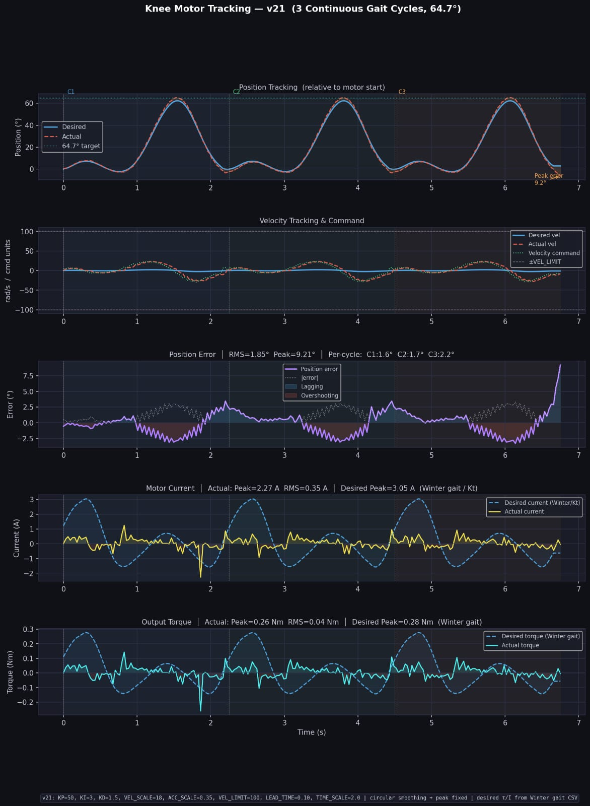

# Knee Trajectory Tracking Using AK80-9 Actuator

## Overview

This project implements real-time tracking of a human knee gait trajectory using a CubeMars AK80-9 actuator controlled through CAN communication.

The trajectory is obtained from Winter gait data and scaled to a peak flexion angle of 64.7°.

## Hardware Used

- CubeMars AK80-9 V3
- Raspberry Pi 4
- Waveshare CAN Hat
- 40V Battery
- Emergency Stop

## Software

- Python
- OpenSourceLeg
- NumPy
- Pandas
- Matplotlib

## Controller Parameters

| Parameter | Value |
|------------|---------|
| KP | 50 |
| KI | 3 |
| KD | 0.9 |
| Velocity Scale | 18 |
| Acceleration Scale | 0.35 |
| Velocity Limit | 100 |

## Results

| Metric | Value |
|----------|---------|
| Peak Flexion | 64.7° |
| RMS Error | 1.85° |
| Peak Error | 9.21° |
| Peak Current | 2.27 A |
| Peak Torque | 0.26 Nm |

## Tracking Results

## Source Code

Located in:

Motor Control/Codes/knee_trajectory.py
