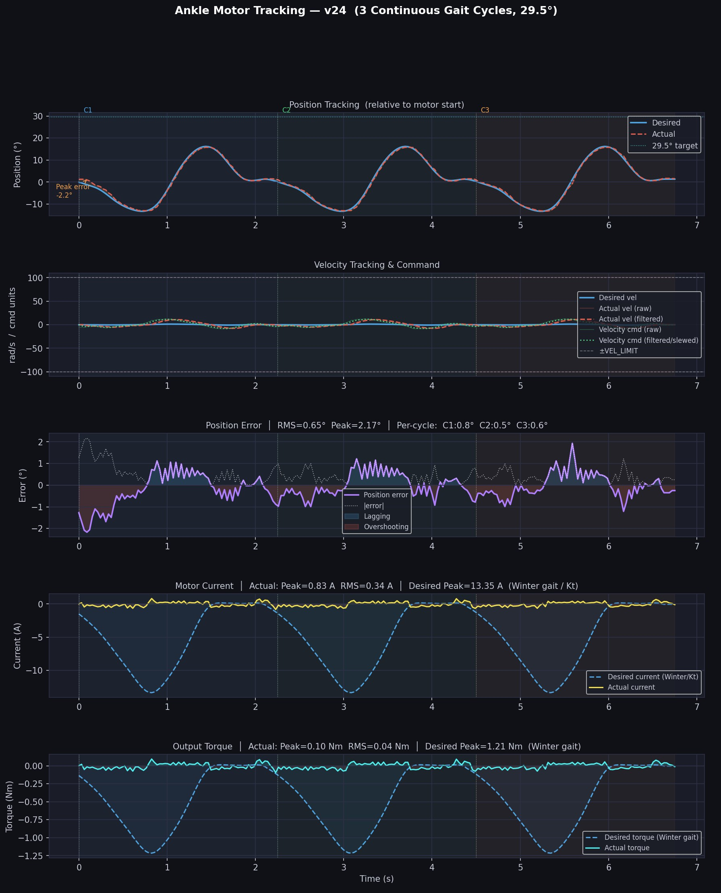

# Ankle Trajectory Tracking

## Objective

The objective of this experiment is to make the Cubemars AK80-9 actuator follow an ankle gait trajectory obtained from the Winter gait dataset.

The trajectory was scaled to a range of motion of 29.5° and executed for three continuous gait cycles using velocity control.

## Hardware Used

| Component | Description |
|------------|------------|
| Actuator | Cubemars AK80-9 |
| Controller | Raspberry Pi 4 |
| Communication | CAN Bus (Waveshare CAN HAT) |
| Dataset | Winter Gait Dataset |
| Battery | 40 V Battery |

## Trajectory Information

| Parameter | Value |
|------------|------------|
| Range of Motion | 29.5° |
| Number of Cycles | 3 |
| Time Scaling | 2.0 |
| Control Mode | Velocity |
| Motor ID | 100 |

## Controller Parameters

| Parameter | Value |
|------------|------------|
| KP | 55 |
| KI | 3 |
| KD | 1.1 |
| Velocity Scale | 16.5 |
| Acceleration Scale | 0.28 |
| Velocity Limit | 100 |
| Lead Time | 0.13 s |

## Source Code

To be added.

## Tracking Results

The figure below shows the desired and actual ankle trajectories over three continuous gait cycles along with velocity tracking, position error, motor current, and output torque.

## Performance Summary

| Metric | Value |
|----------|----------|
| Target ROM | 29.5° |
| RMS Position Error | 1.85° |
| Peak Position Error | 9.21° |
| Actual Peak Current | 2.27 A |
| Actual RMS Current | 0.35 A |
| Actual Peak Torque | 0.26 Nm |
| Actual RMS Torque | 0.04 Nm |

## Dataset

Winter gait ankle trajectory dataset.

## Note

Current and torque values shown are measured under no-load conditions.
