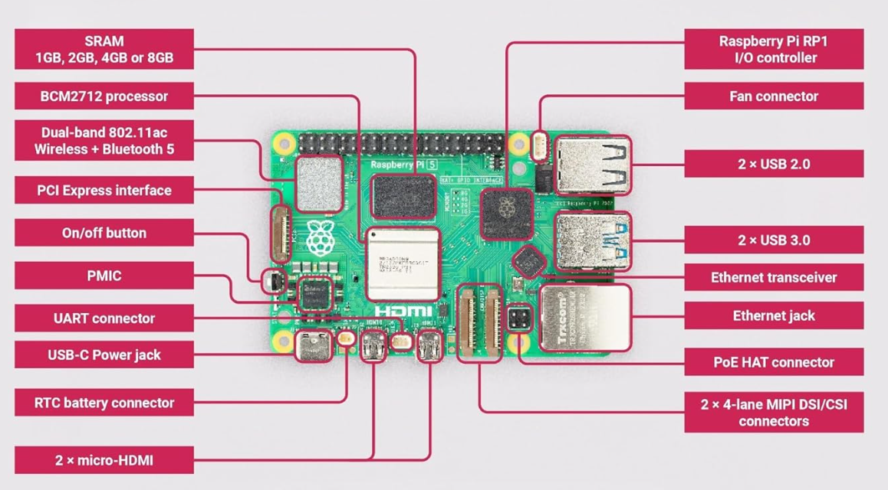
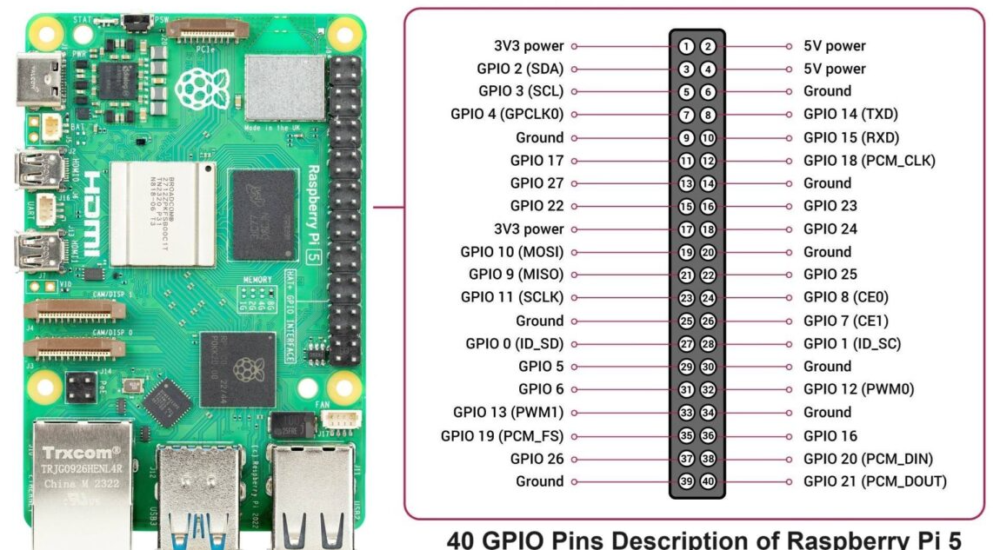

# Lesson 1: Introduction to Raspberry Pi 5

@FirstAuthor: Pritam Ranjan Kalita, Project Assitant, WeRoCon Laboratory, July 2026.

## What is Raspberry Pi 5?

The **Raspberry Pi 5** is a small, affordable single-board computer (SBC) developed by the Raspberry Pi Foundation. Despite its compact size, it is a fully functional computer capable of running Linux-based operating systems, connecting to the internet, and interfacing with a wide range of electronic hardware.

Compared to previous Raspberry Pi models, the Raspberry Pi 5 offers a significantly faster processor, improved graphics performance, faster USB and storage interfaces, and better support for robotics, computer vision, and embedded system applications.

### Common Applications

The Raspberry Pi 5 can be used for:

- Robotics Applications
- IoT (Internet of Things) projects
- Home automation systems
- Computer vision and AI applications
- Embedded systems development
- Media servers and network applications
- Programming and Linux learning
- Sensor data acquisition and control
- Educational electronics projects

---

# Raspberry Pi 5 Hardware Overview

The figure below shows the major components and connectors available on the Raspberry Pi 5. While not every connector is required in every project, understanding their purpose makes it much easier to build hardware systems.

<figure>
  
  <figcaption>Figure: Components of Raspberry Pi 5 of Raspberry Pi 5.   <i>Source: https://techtonics.in/product/raspberry-pi-5-model-8gb/</i></figcaption>
</figure>

<figure>
  
  <figcaption>Figure: 40 GPIO Pin Description of Raspberry Pi 5.   <i>Source: https://www.hackatronic.com/raspberry-pi-5-pinout-specifications-pricing-a-complete-guide/</i></figcaption>
</figure>

## 1. BCM2712 Processor (CPU)

This is the **main processor** of the Raspberry Pi 5. It performs all computations, runs the operating system, and executes your programs.

**Used for:** Everything the Raspberry Pi does.

---

## 2. RAM (1GB / 2GB / 4GB / 8GB)

The RAM stores data that is currently being used by the operating system and running applications.

More RAM allows the Raspberry Pi to run larger and multiple programs simultaneously.

---

## 3. USB-C Power Connector

This connector supplies power to the Raspberry Pi.

**Connect here:**

- USB-C power adapter (recommended 5V, 5A for Raspberry Pi 5)

---

## 4. Micro-HDMI Ports

The Raspberry Pi 5 includes **two micro-HDMI ports** for video output.

**Connect here:**

- Monitor
- HDMI display
- TV (using a micro-HDMI to HDMI cable)

---

## 5. USB 3.0 Ports (Blue)

These high-speed USB ports are used for devices requiring faster data transfer.

**Common devices connected:**

- USB camera
- External SSD
- Flash drive
- High-speed sensors
- USB Ethernet adapters

---

## 6. USB 2.0 Ports (Black)

These ports are suitable for general USB peripherals.

**Common devices connected:**

- Keyboard
- Mouse
- USB game controller
- Serial adapters
- Low-speed USB devices

---

## 7. Ethernet Port

Provides wired network connectivity.

**Connect here:**

- Ethernet cable connected to a router or switch

Useful for robotics, remote control, and stable internet connectivity.

---

## 8. Wireless Wi-Fi and Bluetooth

The onboard wireless module provides:

- Wi-Fi
- Bluetooth 5

Used to connect wirelessly to:

- Internet
- Mobile devices
- Bluetooth keyboard/mouse
- Wireless sensors

---

## 9. 40-Pin GPIO Header

This is one of the **most important connectors** on the Raspberry Pi.

The GPIO (General Purpose Input/Output) pins allow the Raspberry Pi to communicate directly with electronic hardware.

**Common hardware connected here:**

- LEDs
- Push buttons
- Ultrasonic sensors
- IR sensors
- Temperature sensors
- IMU sensors
- Servo motors
- Relay modules
- Motor driver boards
- Encoders
- I2C devices
- SPI devices
- UART devices

> **Note:** Motors are **not connected directly** to the GPIO pins. Instead, the GPIO pins control a **motor driver**, which supplies power to the motors.

---

## 10. Dual MIPI CSI/DSI Connectors

The Raspberry Pi 5 has two high-speed MIPI connectors.

These connectors can be configured for either:

- CSI (Camera)
- DSI (Display)

**Connect here:**

- Raspberry Pi Camera Module
- Touchscreen display
- Machine vision cameras

These connectors are preferred over USB cameras when using official Raspberry Pi cameras.

---

## 11. PCI Express (PCIe) Connector

Provides a high-speed expansion interface.

**Common expansion devices:**

- NVMe SSD storage
- AI accelerators
- High-speed networking cards

Mostly used in advanced projects.

---

## 12. Ethernet Transceiver

This chip manages communication between the processor and the Ethernet port.

Normally, users do not connect anything directly to this component.

---

## 13. RP1 I/O Controller

The RP1 chip manages many of the Raspberry Pi's input/output interfaces such as:

- USB
- GPIO
- SPI
- I2C
- UART

It improves overall I/O performance compared to previous Raspberry Pi models.

---

## 14. Fan Connector

A dedicated connector for the official Raspberry Pi cooling fan.

**Connect here:**

- Raspberry Pi Active Cooler

Useful when running CPU-intensive applications.

---

## 15. RTC Battery Connector

Allows connection of a small battery for the Real-Time Clock (RTC).

This keeps track of the current date and time even when the Raspberry Pi is powered off.

---

## 16. UART Connector

Provides a serial communication interface.

Typically used for:

- Debugging
- Serial console
- Communication with microcontrollers

---

## 17. PoE HAT Connector

Used with a Power over Ethernet (PoE) HAT.

Allows both power and network data to be supplied through a single Ethernet cable.

---

## 18. PMIC (Power Management IC)

Regulates and distributes power to the Raspberry Pi's internal components.

This is an onboard component and does not require any user connection.

---

## 19. Power Button

Allows the Raspberry Pi 5 to be powered on or shut down safely without unplugging the power cable.

---

# Where Do We Connect Common Hardware?

| Hardware | Connection |
|-----------|------------|
| Power Supply | USB-C Power Connector |
| Monitor / TV | Micro-HDMI Port |
| Keyboard | USB 2.0 or USB 3.0 |
| Mouse | USB 2.0 or USB 3.0 |
| USB Camera | USB 3.0 |
| Raspberry Pi Camera Module | MIPI CSI Connector |
| Official Touch Display | MIPI DSI Connector |
| Ethernet Cable | Ethernet Port |
| Wi-Fi Devices | Built-in Wi-Fi |
| Bluetooth Devices | Built-in Bluetooth |
| Sensors | GPIO Header |
| Motor Driver | GPIO Header |
| Servo Motor | GPIO Header (through appropriate power supply) |
| DC Motors | Motor Driver controlled by GPIO |
| Relay Module | GPIO Header |
| External SSD | USB 3.0 or PCIe (NVMe) |
| Cooling Fan | Fan Connector |

---

## Summary

The Raspberry Pi 5 combines the functionality of a desktop computer with dedicated hardware interfaces for electronics projects. In most robotics and embedded applications, you will primarily use the **USB-C port for power**, **HDMI for display**, **GPIO header for sensors and motor drivers**, **MIPI connector for cameras**, **USB ports for peripherals**, and **Ethernet or Wi-Fi for communication**. Understanding these connectors is the first step toward building reliable Raspberry Pi-based systems.