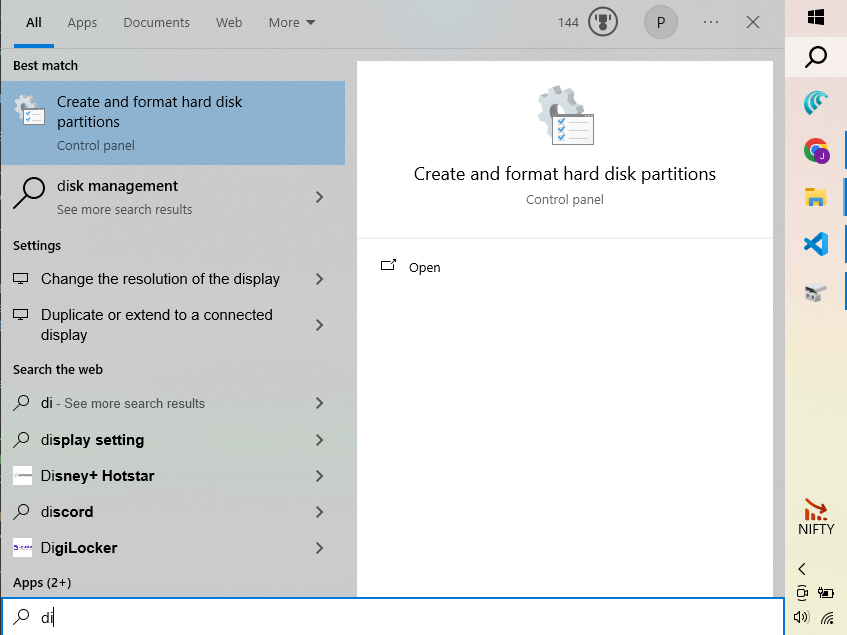
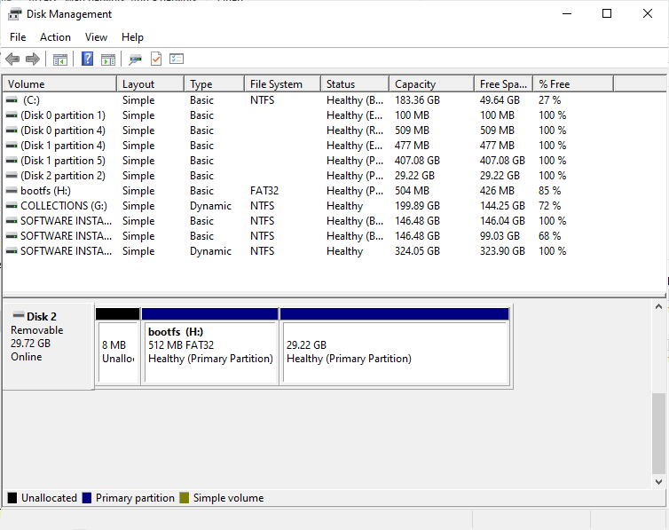
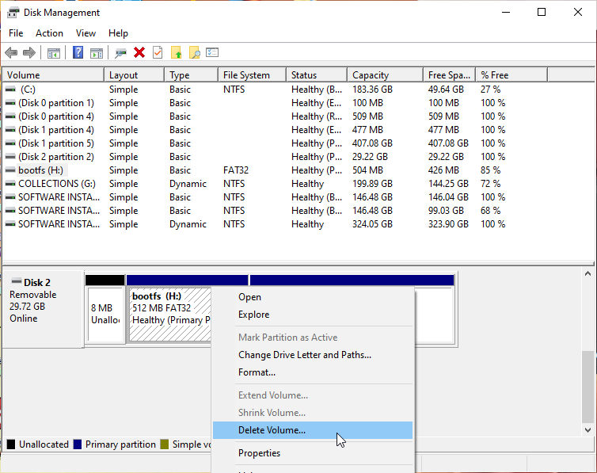
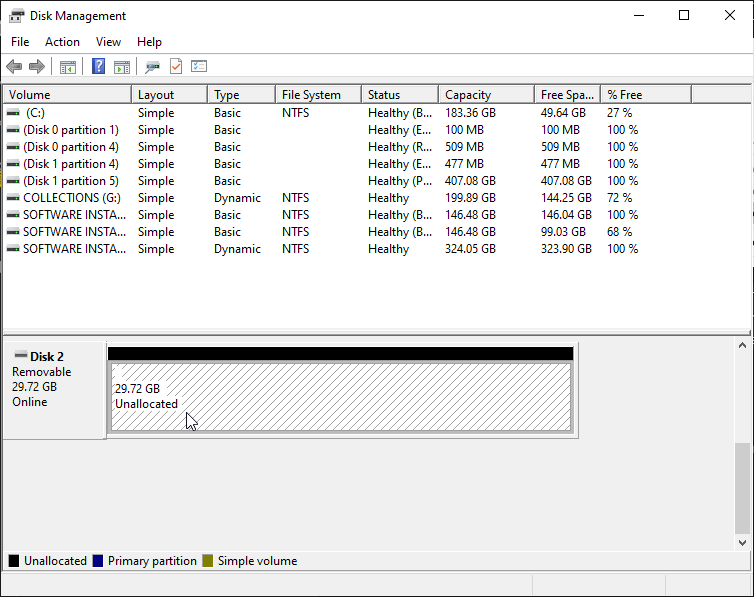

# Lesson 2: Clean Formatting An SD Card Previously Used In A Raspberry Pi

@FirstAuthor: Pritam Ranjan Kalita, Project Assistant, WeRoCon Laboratory, July 2026.
@Credits: How to Format and Reuse a Raspberry Pi SD Card | Coding With Ashwin YT Channel

> Skip this lesson if you're using a brand-new microSD card — go straight to Lesson 3

1. Mount the SD Card into your computer/laptop using a SD Card Reader.

1. Click on the Windows Search Button (the Magnifying Glass at the bottom bar of the Windows Home Screen) and type **"di"**.

    

1. Click on the ***Create and Format Hard Disk Partitions*** option. This opens up the **Disk Manangement** Window. 

    

1. At the bottom of the *Disk Manangement* Window, you can see the list of all the disks/drives that are currently connected to your computer/laptop's Motherboard. Locate the Removable SD Card's disk in that list. (*Hint: Its name will start with "Removable".*)

1. Righ-Click on each of the partitions that you can see inside the Removable SD Card's disk panel (only the ones with Blue Ribbon Bars) and select the **Delete Volume**.

    

    > 📝 **Note**: Make sure to select the correct disk/drive from the Disk Management Window. If you choose and format a wrong drive, it will lead to loss of potentially important infomation stored on your computer/laptop's hard disk or can also lead to the damage of the OS installation in your computer/laptop.

1. After all the partition of your SD card's disk are deleted, you will see the space inside the SD card's disk shown as Unallocated (*With Black Ribbon Bar*).

 

Now the SD Card cleaning is complete. Safely eject it from your system.