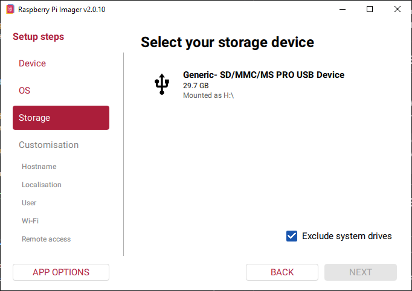
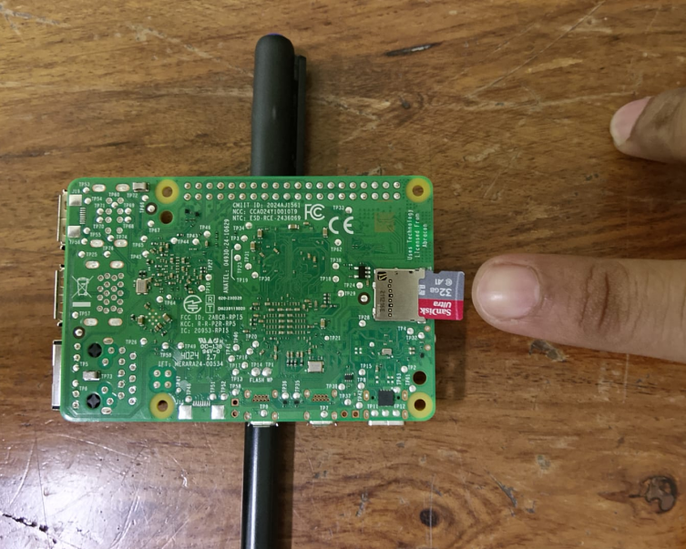

# Lesson 3: Installing Raspberry Pi OS and Connecting via SSH

@FirstAuthor: Pritam Ranjan Kalita, Project Assistant, WeRoCon Laboratory, July 2026. <br>
@Credits: Install Raspberry Pi OS without a Monitor (Part 1) - Raspberry Pi 5 Tutorial (#2) | Robotics Backend YT Channel

**This tutorial is majorly inspired from the lesson 2 of *Raspberry Pi 5 Tutorials for Beginners* YouTube Series. It is recomended that you watch the video first and then come to this written lesson for following the steps properly.** 

## Learning Objectives

By the end of this lesson, you will be able to:

- Install the Raspberry Pi Imager software.
- Flash the Raspberry Pi OS onto a microSD card.
- Configure your Raspberry Pi before its first boot.
- Boot the Raspberry Pi for the first time.
- Find the Raspberry Pi's IP address on your local network.
- Connect to the Raspberry Pi remotely using SSH.

---

# Prerequisites

Before starting, ensure you have the following:

- Raspberry Pi 5
- MicroSD card (16 GB or larger recommended)
- MicroSD card reader or USB adapter
- A Computer/Laptop (Windows, macOS, or Linux)
- Stable Wi-Fi network
- Raspberry Pi power supply (5V, 5A recommended)
- Internet connection

---

# Step 1: Download Raspberry Pi Imager

The easiest way to install an operating system on a Raspberry Pi is by using the **Raspberry Pi Imager** software.

1. Open your web browser.
2. Visit the Raspberry Pi Software page:

   https://www.raspberrypi.com/software/

3. Download **Raspberry Pi Imager** for your operating system.
   - Windows
   - macOS
   - Linux

4. Install the software like any normal desktop application.

Once installed, launch **Raspberry Pi Imager**.

---

# Step 2: Connect Your Computer to Wi-Fi

Before configuring the Raspberry Pi, connect **your computer** to the Wi-Fi network that you want the Raspberry Pi to use.

This is important because during setup, Raspberry Pi Imager automatically detects your current Wi-Fi network and can configure the Raspberry Pi to connect to it.

> **Important:** Your computer and Raspberry Pi should be connected to the **same Wi-Fi network**. Otherwise, you may not be able to discover the Raspberry Pi on the network later.

---

# Step 3: Insert the MicroSD Card

Insert your microSD card into your computer using:

- Built-in SD card slot
- USB card reader
- SD card adapter

Wait until the operating system detects the storage device.

---

# Step 4: Select the Raspberry Pi Device

1. Go to **Raspberry Pi Imager Window**. 

1. Inside Raspberry Pi Imager:
   - Select Your ***Raspberry Pi Device***. In our case it is ***Raspberry Pi 5***

If you own another Raspberry Pi model, choose the corresponding device instead.

---

# Step 5: Select the Operating System

Select:

```
Raspberry Pi OS (64-bit)
```

This is the official operating system provided by the Raspberry Pi Foundation and is recommended for most users.

---

# Step 6: Select the Storage Device


If you have already connected the SD card to your computer previously (Step 3), the *Raspberry Pi Imager* Software will automatically detect it and show you its name.



---

# Step 7: Configure Raspberry Pi OS

After selecting the device, operating system, and storage, click **Next**.

Next configure the following options.

---

## 7.1 Set the Hostname

Example:

```
rpi1
```

The hostname identifies your Raspberry Pi on the local network.

> **Tip:** If you own multiple Raspberry Pi boards, give each one a unique hostname.

Click **Next**.

---
## 7.2 Select Your City/Time Zone/Keyboard Layout

```
City: New Delhi
```

```
Time Zone: Asia/Kolkata  (By Default)
```

```
Keyboard Layout: in (By Default)
```

Click **Next**.
---

## 7.3 Create a Username and Password

Specify:

**Username**

Example:
```
pi
```

**Password**

Example

```
werocon
```

Choose a secure password that you can remember.

> **Important:** If you accidentally enter the wrong password during setup, you may not be able to log in later and might have to flash the operating system again.

Click **Next**.

---

## 7.4 Configure Wi-Fi

Enable Wi-Fi configuration.

Enter:

- Wi-Fi Name (SSID) 
   >  💡 Note: The software automaically detects the WiFi Network that your computer is connected to (Step 2). You are basically configuring your RPi 5 here to connect to the same WiFi Network as soon as it gets booted/powered ON/connected to the power supply.
- Wi-Fi Password

Verify that:

- The network name is correct.
- The password is entered correctly.

This allows the Raspberry Pi to connect to your wireless network automatically when it starts.

Click **Next**.

---

## 7.5 Enable SSH

Click the Push Button:

```
Enable SSH
```

Choose:

```
Use Password Authentication
```

SSH allows you to remotely control the Raspberry Pi from another computer using the command line.

This is one of the most important settings for a headless Raspberry Pi setup.

Click **Next**.

> 💡 **Note**: You can skip **Enable Raspberry Pi Connect** Step. Just click next. ***Raspberry Pi Connect*** basically allows us to connect to the RPi board using our laptop/computer sitting at anywhere arround the world online. As far as personal projects/lab work is concerned, we can just use SSH to connect with our Pi over the same WiFi network.  

---

# Step 8: Flash Raspberry Pi OS

**Write** the Raspberry Pi OS with your selected customization settings.

Click **I UNDERSTAND, PLEASE ERASE & WRITE** when Raspberry Pi Imager warns that the storage device will be erased.

The software will now:

1. Download the operating system (if required).
2. Write the operating system to the microSD card.
3. Verify the installation.

This process may take several minutes depending on your internet speed and SD card.

When complete, safely remove the microSD card.

---

# Step 9: Insert the MicroSD Card into the Raspberry Pi


Before inserting the microSD card:

> **Important:** Ensure the Raspberry Pi is **powered OFF**.

Insert the microSD card into the slot located on the underside of the Raspberry Pi.



Push it gently until it clicks into place.

> **Note:** Part of the SD card remains slightly exposed. Avoid pressing against it while handling the board to prevent damaging the card.

---

# Step 10: Connect the Cooling Fan (Optional)

If your Raspberry Pi case includes an active cooling fan:

- Connect the fan cable to the dedicated fan connector on the Raspberry Pi.
- The connector only fits in one orientation.

If your Raspberry Pi does not include a fan, simply skip this step.

---

# Step 11: Power On the Raspberry Pi

Connect the USB-C power supply.

For Raspberry Pi 5, the recommended power adapter is:

- **5V**
- **5A**

A power adapter rated at **5V, 3A** is generally sufficient for lighter workloads.

> **Do not** power the Raspberry Pi from your computer's USB port. It usually cannot provide enough current for reliable operation.

Once powered:

- The red power LED should turn on.
- The green activity LED should begin flashing.

The flashing green LED indicates that the Raspberry Pi is booting and loading the operating system.

Wait approximately **30–60 seconds** for the first boot to complete.

---

# Step 12: Find the Raspberry Pi's IP Address

To connect to your Raspberry Pi remotely using **SSH**, you first need to know its IP address.

Before proceeding, ensure that:

- The Raspberry Pi has finished booting.
- The Raspberry Pi is connected to the intended Wi-Fi network.
- Your laptop/computer is connected to the **same Wi-Fi network**.

## Method 1 (Recommended): Using the Raspberry Pi Hostname

If everything has been configured correctly, your computer should be able to discover the Raspberry Pi using its hostname.

Open a terminal.

On Windows, you can use:

- Command Prompt
- Windows Terminal
- PowerShell

Run:

```bash
ping -4 <your_rpi_hostname>.local
```

Example:

```bash
ping -4 rpi1.local
```

If the Raspberry Pi is reachable, you should see output similar to:

```text
Pinging rpi1.local [10.148.24.8] with 32 bytes of data:
Reply from 10.148.24.8: bytes=32 time=9ms TTL=64
Reply from 10.148.24.8: bytes=32 time=9ms TTL=64
Reply from 10.148.24.8: bytes=32 time=11ms TTL=64
Reply from 10.148.24.8: bytes=32 time=57ms TTL=64
```

The IP address appears inside the square brackets on the first line.

For example:

```
Pinging rpi1.local [10.148.24.8]
```

Here,

```
10.148.24.8
```

is the Raspberry Pi's IP address.

---

## What If `ping rpi1.local` Does Not Work?

On some networks—especially university, laboratory, or enterprise Wi-Fi networks—the Raspberry Pi's hostname may not be discoverable because of network security policies or multicast (mDNS) restrictions.

If the hostname cannot be resolved, use the alternative method described below.

---

## Alternative Method: Find the Raspberry Pi's IP Address Using a Monitor

If your computer cannot discover the Raspberry Pi on the network, you can temporarily connect a monitor and keyboard directly to the Raspberry Pi to determine its current IP address.

This method is particularly useful when:

- `ping <hostname>.local` does not work.
- Angry IP Scanner cannot find the Raspberry Pi.
- Your network blocks device discovery.
- The Raspberry Pi has obtained a new IP address after connecting to a different Wi-Fi network.

### Step 1: Connect a Monitor and Keyboard

Temporarily connect:

- An HDMI monitor
- A USB keyboard

Log in to Raspberry Pi OS.

### Step 2: Display the IP Address

Open a terminal and run:

```bash
hostname -I
```

Example output:

```text
10.148.24.8
```

The displayed value is the Raspberry Pi's current IP address.

> **Note:** If multiple IP addresses are displayed, the first one is usually the address assigned to the active Wi-Fi connection.

### Step 3: Verify Network Connectivity

Ensure that your laptop is connected to the same Wi-Fi network.

Open a terminal (or Command Prompt on Windows) and run:

```bash
ping 10.148.24.8
```

Replace the example IP address with the one displayed by your Raspberry Pi.

If you receive replies, the Raspberry Pi is successfully connected to the same WiFi network as your computer and is reachable from your computer.

### Step 4: Connect Using SSH

You can now connect using the discovered IP address.

> **Practical Tip:** This is one of the quickest and most reliable methods for recovering the Raspberry Pi's IP address whenever automatic discovery tools fail or when working on enterprise or university Wi-Fi networks.

---

# Step 13: Connect to the Raspberry Pi Using SSH

Open a terminal. You can you the old terminal from the previous steps as well.

On Windows:

- Command Prompt
- Windows Terminal
- PowerShell

On macOS or Linux:

- Terminal

Run the following command:

```bash
ssh [your-rpi-username]@<RaspberryPi_IP_Address>
```

Example:

```bash
ssh pi@192.168.1.150
```

Replace the IP address with the one discovered in the previous step.

---

## Accept the Security Prompt

The first time you connect, you may see:

```
Are you sure you want to continue connecting?
```

Type:

```
yes
```

and press **Enter**.

---

## Enter Your Password

When prompted, type the password you created during the Raspberry Pi Imager setup.

> **Note:** Nothing will appear on the screen while typing the password. This is normal.

Press **Enter**.

If the login is successful, you should see something similar to:

```bash
pi@raspberrypi:~ $
```

Congratulations! You are now connected to your Raspberry Pi through SSH.

> 💡 Note: In case, you want to break out and exit of the Raspberry Pi SSH connection just type `exit` and press enter in your terminal that is currently connected to the RPi. 

---

# Troubleshooting

## Raspberry Pi Does Not Appear on the Network

Check the following:

- The Raspberry Pi has finished booting.
- The power supply is connected properly.
- The Wi-Fi network name (SSID) is correct.
- The Wi-Fi password is correct.
- Your computer is connected to the same Wi-Fi network.

---

## SSH Connection Refused

Possible causes include:

- SSH was not enabled during installation.
- The Raspberry Pi has not finished booting.
- The IP address is incorrect.

If SSH was not enabled, you will need to reflash the operating system with SSH enabled.

---

## Incorrect Password

Verify:

- The password is typed correctly.
- Caps Lock is disabled.
- The keyboard layout matches the one selected during setup.

If you cannot remember the password or entered it incorrectly during installation, the easiest solution is to flash the operating system again.

---

## Host Key Error

If SSH reports a **known_hosts** error, delete the corresponding entry from your computer's SSH `known_hosts` file and reconnect.

This usually occurs when the Raspberry Pi has been reflashed but retains the same IP address.

---

# Summary

In this lesson, you learned how to:

- Install Raspberry Pi Imager.
- Flash Raspberry Pi OS onto a microSD card.
- Configure Wi-Fi, user credentials, and SSH.
- Boot the Raspberry Pi for the first time.
- Discover its IP address on the local network.
- Connect to the Raspberry Pi remotely using SSH.

In the next lesson, we will configure **VNC (Virtual Network Computing)** to remotely access the Raspberry Pi's graphical desktop from our computer.