# Lesson 4: Configuring Remote Desktop Access in Raspberry Pi 5 with VNC

@FirstAuthor: Pritam Ranjan Kalita, Project Assitant, WeRoCon Laboratory, July 2026.
@Credits: Install Raspberry Pi OS without a Monitor (Part 2) - Raspberry Pi 5 Tutorial (#3) | Robotics Backend YT Channel

## Learning Objectives

By the end of this lesson, you will be able to:

- Enable the VNC server on your Raspberry Pi.
- Configure the Raspberry Pi to boot directly in the desktop mode inside our Laptop/Computer.
- Install a VNC client on your computer.
- Connect to the Raspberry Pi's graphical desktop remotely.
- Troubleshoot common VNC connection issues.
- Perform the final configuration of Raspberry Pi OS.
- Properly shut down and reboot your Raspberry Pi.

---

# What is VNC?

**VNC (Virtual Network Computing)** allows you to remotely access the Raspberry Pi's graphical desktop from your computer.

Instead of connecting:

- A monitor
- A keyboard
- A mouse

directly to the Raspberry Pi, you can control it entirely from your own computer over the network.

Since we already configured **SSH** in the previous lesson, we will first use SSH to enable the VNC server before connecting to the graphical desktop.

---

# Prerequisites

Before starting this lesson, make sure that:

- Raspberry Pi OS has already been installed.
- SSH has been enabled.
- Your Raspberry Pi is connected to your Wi-Fi network.
- You can successfully connect to the Raspberry Pi using SSH.

If you cannot connect through SSH yet, complete the previous lesson before continuing.

---

# Step 1: Connect to the Raspberry Pi Using SSH

Open a terminal.

On Windows:

- Command Prompt
- Windows Terminal
- PowerShell

Connect using:

```bash
ssh pi@<RaspberryPi_IP_Address>
```

Example:

```bash
ssh pi@192.168.1.150
```

Enter the password you created while flashing Raspberry Pi OS.

If the login is successful, you should see something similar to:

```bash
pi@raspberrypi:~ $
```

This confirms that you are now executing commands directly on the Raspberry Pi.

> **Tip:** To disconnect from SSH, simply type:
>
> ```bash
> exit
> ```
>
> This only closes the SSH session in your local terminal  — it does **not** shut down the Raspberry Pi.

---

# Step 2: Open the Raspberry Pi Configuration Tool

The Raspberry Pi provides a built-in configuration utility called **raspi-config**.

Launch it by running:

```bash
sudo raspi-config
```

Upon successfully running the command, you see a menu like this inside your terminal environment:


Use the **arrow keys**, **Enter**, and **Tab** to navigate through the menus.

---

# Step 3: Enable the VNC Server

Inside **raspi-config**:

Navigate to:

```
Interface Options
```
Press **Enter**.


Select:

```
VNC
```

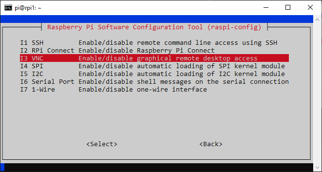

When asked:

```
Would you like the VNC Server to be enabled?
```
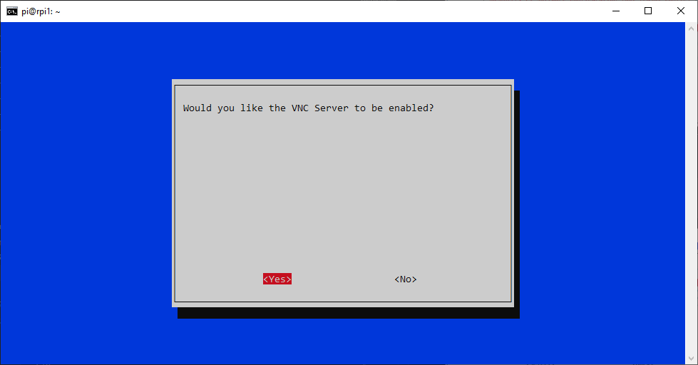

Choose:

```
Yes
```

After enabling VNC, return to the main menu.


---

# Step 4.1: Configure the Boot Option

Still inside **raspi-config**, navigate to:

```
System Options
```
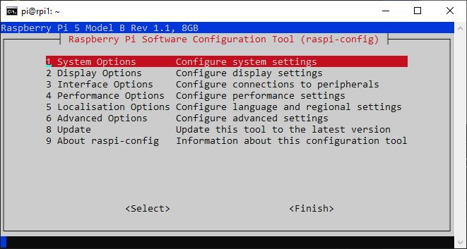

Select:

```
Boot
```
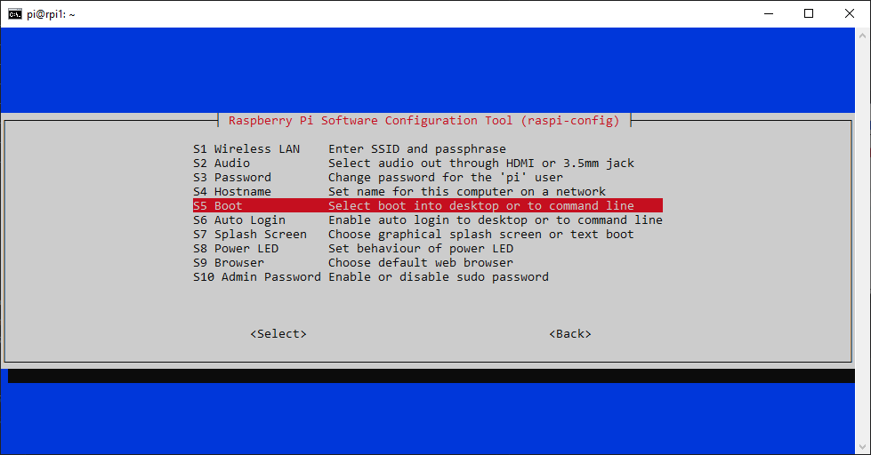
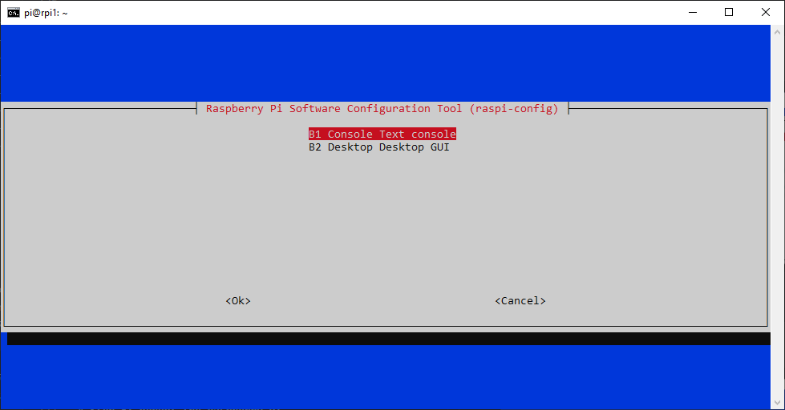

- **Console** (If you want to just see the RPi OS Terminal after connecting to it. Can already do this using SSH so this is not needed.)
- **Desktop GUI** (If you want to see the home screen of Raspberry Pi OS right after you connect to your RPi Board form your Laptop/Computer.)

Choose **Desktop GUI**.


If **Console** is selected, VNC will only display the terminal instead of the desktop.

After selecting the desired option, return to the main menu.

---

# Step 4.2: Configure the Auto Login Option

`System Options >> Auto Login >> Click *ENTER*`


You will be asked : ***Would you like to automatically login to the console ?***

Say **Yes**.

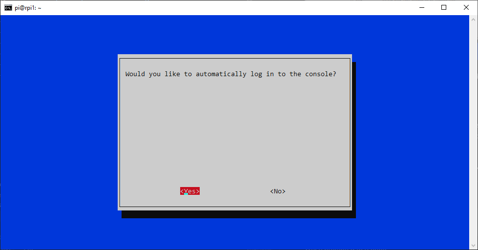

For most beginners, **Desktop Auto Login** is recommended because the Raspberry Pi will automatically log into the graphical desktop after booting.


# Step 5: Reboot the Raspberry Pi

Select:

```
Finish
```

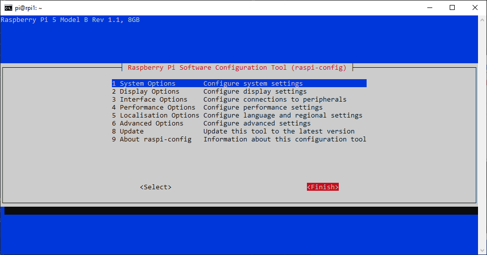

When prompted to reboot:

```
Yes
```


Your SSH connection will immediately close because the Raspberry Pi is restarting.

Wait approximately **30–60 seconds** for the Raspberry Pi to boot again.

After that, you can connect again with the Raspberry Pi using the SSH command.

---

# Step 6: Install a VNC Viewer

To access the Raspberry Pi desktop, you need a VNC client on your computer.

One recommended option is **TigerVNC**.

Download it from:

https://tigervnc.org

In the TigerVNC page, click on the **Github Release Page** option. This will open up the Github Repo of this project:

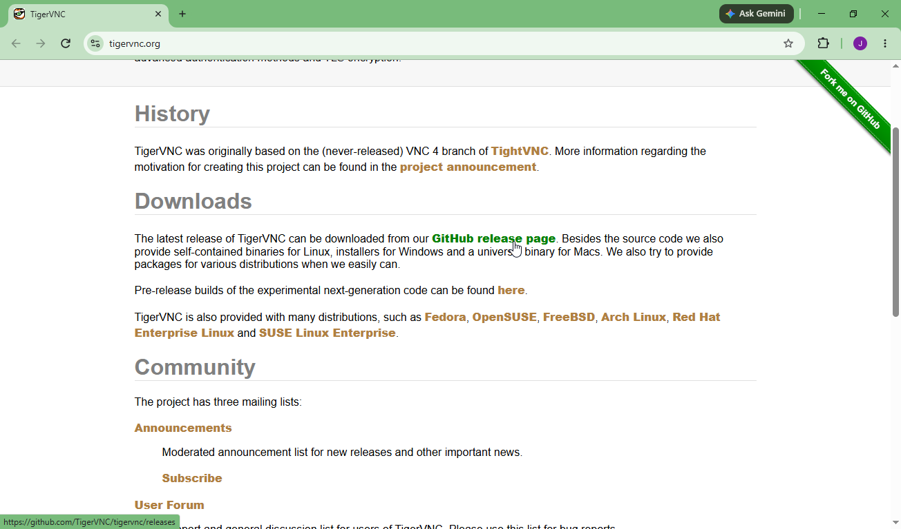

Inside the Github Releases Page of this Project, you can see trhe latest release version of TigerVNC. Click on the **SourceForge Link** in the project's Readme.   

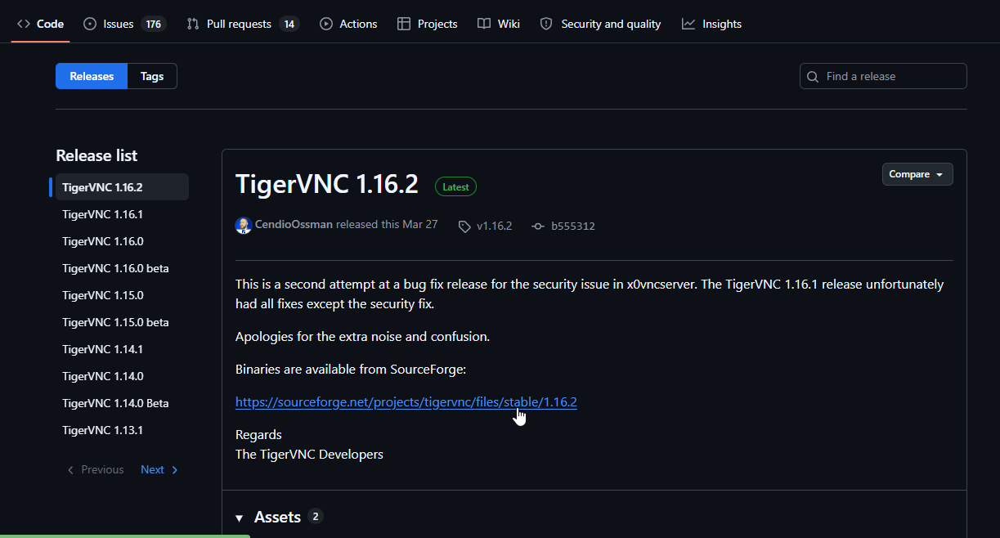

Download & Install the latest version appropriate for your operating system:

- Windows
- Linux
- macOS

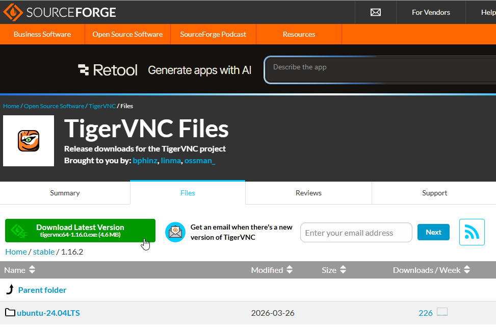

During installation:

- Accept the license agreement.
- Install using the default options.

> **Windows Note:** Windows Defender may display a security warning. If you downloaded TigerVNC from its official website, it is safe to proceed.

---

# Step 7: Connect to the Raspberry Pi Desktop

Launch **TigerVNC Viewer**.

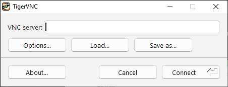

In the **Server** field, enter your Raspberry Pi's IP address.

Example:

```
192.168.1.150
```

Click:

```
Connect
```

The first time you connect, you may receive a security warning regarding an unknown certificate.

Click:

```
Yes
```

to continue.

---

# Step 8: Log In

Enter:

- Your RPi 5 Board's **Username**

- Your RPi 5 Board's **Password**

Use the same password that you created while installing Raspberry Pi OS.

Click:

```
OK
```

If everything has been configured correctly, the Raspberry Pi desktop should appear.

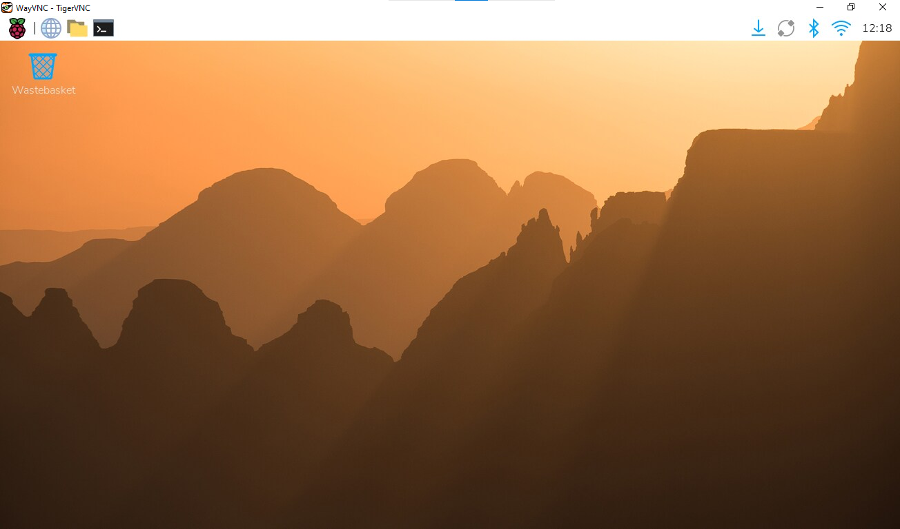

**Congratulations!**

You are now controlling your Raspberry Pi remotely through VNC.

---

# Important Note About IP Addresses

If VNC works today but stops working later, the most likely reason is that your Raspberry Pi has been assigned a different IP address.

This commonly happens when:

- The router is restarted.
- A mobile hotspot is turned off and on again.
- DHCP assigns a new address.

If this happens:

1. Find the Raspberry Pi's new IP address using the terminal command `ping -4 [your_rpi_hostname].local`.
2. Connect using the updated address.

There is no need to reinstall Raspberry Pi OS.

---

# Troubleshooting

## Cannot Connect Using VNC

Verify the following:

- The Raspberry Pi is powered on.
- The Raspberry Pi and your computer are connected to the same Wi-Fi network.
- SSH is working.
- VNC has been enabled in `raspi-config`.
- The IP address is correct.

---

## TigerVNC Shows a Grey Screen

Sometimes you may successfully connect but only see a grey window instead of the Raspberry Pi desktop.

If this happens:

Reconnect to the Raspberry Pi using SSH.

Update the package list:

```bash
sudo apt update
```

Upgrade all installed packages:

```bash
sudo apt upgrade
```

When prompted, confirm the installation.

The upgrade may take **10–15 minutes** depending on your internet connection.

After the upgrade completes, reboot the Raspberry Pi:

```bash
sudo reboot
```

Wait for the Raspberry Pi to restart and reconnect using TigerVNC.

In many cases, this resolves the grey screen issue.

---

## Funny Characters Appear when trying to type something inside the RPi GUI Terminal -- Keyboard Layout Mismatch

To fix this problem : 

**Click the Raspberry Menu icon** (the raspberry logo in the top-left corner) → **Preferences** → **Control Center** → Select **Keyboard** Tab → **Set Layout** to **English US** or **English UK** → Reboot the Pi Board once using `sudo reboot` command → Reconnect again sing TigerVNC app and try typing something this time, the problem should be fixed now.

# Step 9: Explore the Raspberry Pi Desktop

Once connected through VNC, you are viewing the actual Raspberry Pi desktop—not your computer's desktop.

Spend a few minutes familiarizing yourself with the interface.

The menu bar is located at the top of the screen and functions similarly to the Windows taskbar.

---

# Step 10: (Optional) Customize the Desktop Appearance

You may customize the appearance of Raspberry Pi OS.

Navigate to:

```
Menu
→ Preferences
→ Control Center
→ Desktop
```

These changes are optional and simply improve readability.

---

# Step 12: Raspberry Pi Configuration

Open and Explore these Raspberry Pi Settings:

```
Menu
→ Preferences
→ Control Center
→ System/Interfaces/Keyboard/Localisation/Main Menu/Taskbar/Theme
```

Here you can configure many important system settings.

Examples include:

- Change password
- Change hostname
- Enable or disable Auto Login
- Verify Desktop boot mode
- Enable or disable interfaces
- Change keyboard layout
- Change locale
- Change time zone

---

# Step 13: Network and Bluetooth

On the taskbar, you can access:

### Wi-Fi

Verify that your Raspberry Pi is connected to the correct wireless network.

### Bluetooth

Bluetooth is enabled by default.

If you are not using Bluetooth devices, you may disable it.

---

# Properly Shutting Down the Raspberry Pi

Never unplug the Raspberry Pi without shutting it down first unless absolutely necessary.

To safely shut down:

```
Menu
→ Shutdown
→ Shutdown
```

Wait approximately **10 seconds** after shutdown before disconnecting the power supply.

Improperly removing power can corrupt the operating system or damage files stored on the microSD card.

---

# Restarting the Raspberry Pi

After shutting down:

1. Connect the power cable again.
2. Wait approximately **20–30 seconds**.
3. Open TigerVNC.
4. Connect using the Raspberry Pi's IP address.
5. Enter your username and password.

You should once again see the Raspberry Pi desktop.

---

# Summary

In this lesson, you learned how to:

- Enable the VNC server.
- Configure Raspberry Pi OS to boot directly into the desktop.
- Install TigerVNC Viewer.
- Connect to the Raspberry Pi desktop remotely.
- Resolve common VNC connection issues.
- Configure Raspberry Pi OS using the graphical interface.
- Install software updates.
- Properly shut down and restart the Raspberry Pi.

At this point, your Raspberry Pi is fully configured for remote development. From now on, you can comfortably control it from your computer without needing to connect a monitor, keyboard, or mouse.

**Happy Learning !** 