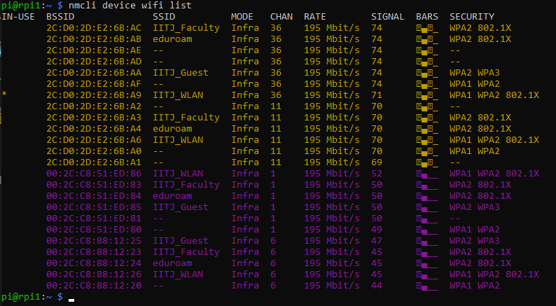
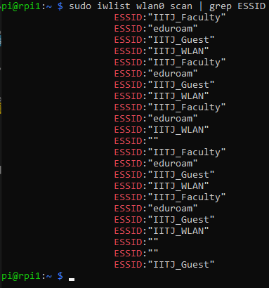
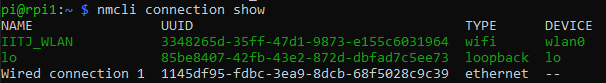

# Lesson 5: Changing the Wi-Fi Network of Your Raspberry Pi

@FirstAuthor: Pritam Ranjan Kalita, Project Assistant, WeRoCon Laboratory, July 2026. <br>
@Disclaimer: This tutorial was written and reviewed by the author. AI-assisted tools were used to support drafting, editing, and language refinement, with all technical content verified by the author.

## When Will You Need This Tutorial?

Suppose you have already configured your Raspberry Pi and are accessing it remotely using **TigerVNC** or **SSH** over your home or phone's Wi-Fi network. Later, you move your Raspberry Pi to a different location—for example, your office, laboratory, university, or another home—where a different Wi-Fi network is available. 

A common question at this point is:

> **How do you connect your Raspberry Pi to a different Wi-Fi network without reinstalling Raspberry Pi OS or losing access to it?**

The good news is that **you do not need to reinstall Raspberry Pi OS**. Raspberry Pi OS allows you to connect to new Wi-Fi networks and automatically remembers them for future use.

This tutorial explains the recommended methods for changing and managing Wi-Fi connections on your Raspberry Pi. It also explains what happens to your **TigerVNC** connection when the Wi-Fi network changes and how to reconnect successfully afterward.

---

# Method 1: Using the Raspberry Pi Desktop (Recommended for connecting to Home and Personal WiFi Networks Only)

If you already have access to your Raspberry Pi's GUI through **TigerVNC** do this:

1. Click the **Wi-Fi icon** on the GUI's taskbar.
2. Select the new Wi-Fi network from the list.
3. Enter the Wi-Fi password.
4. Click **Connect**.

The Raspberry Pi will connect to the selected network and automatically save its credentials.

The next time the Raspberry Pi detects this Wi-Fi network, it will reconnect automatically.

---

# Method 2: Connecting to a Wi-Fi Network Using the Terminal (`nmcli`) (Recommended for both Home & Official Networks)

Raspberry Pi OS **Bookworm** uses **NetworkManager** to manage network connections.

The `nmcli` command-line utility allows you to create, modify, delete, and manage Wi-Fi connections directly from the terminal.

---

## View Available Wi-Fi Networks

Open a terminal and run:

```bash
nmcli device wifi list
```




If you cannot see your network on the list, try this command instead:

```bash
sudo iwlist wlan0 scan | grep ESSID
```


If your network appears in the output of any of these commands, it is also visible to your RPi5 Board.

Example output:

```text
Home_WiFi
Office_WiFi
Phone_Hotspot
```

---

## Connect to a Home/Personal Wi-Fi Network (WPA2-Personal Type)

Run:

```bash
sudo nmcli device wifi connect "Office_WiFi" password "YourPassword"
```

Replace:

- `Office_WiFi` with your Wi-Fi network name (SSID).
- `YourPassword` with the corresponding Wi-Fi password.

If the connection is successful, NetworkManager automatically saves the network profile.

The Raspberry Pi will automatically reconnect to this network whenever it is available.

---

## Connecting to a WPA2-Enterprise Wi-Fi Network (For Office and Organization WiFi Networks)

Unlike a home Wi-Fi network, a WPA2-Enterprise network requires additional authentication details such as a username and password.

Fortunately, `nmcli` fully supports WPA2-Enterprise authentication.

### Example: 

Lets say your university/lab/office wireless network uses the following settings:

| Setting | Value |
|---------|-------|
| **Network SSID** | WiFi_Name |
| **Security Type** | WPA2-Enterprise |
| **EAP Method** | PEAP |
| **CA Certificate** | Do not validate |
| **Phase 2 Authentication** | MSCHAPV2 |
| **Username** | "Your_Internet_Access_ID" |
| **Password** | "Your_Internet_Access_Password" |

### Step 1: Create the Wi-Fi Profile

```bash
sudo nmcli connection add \
    type wifi \
    con-name WiFi_Name \
    ifname wlan0 \
    ssid WiFi_Name
```

### Step 2: Configure Enterprise Authentication

```bash
sudo nmcli connection modify WiFi_Name \
    wifi-sec.key-mgmt wpa-eap \
    802-1x.eap peap \
    802-1x.identity "YOUR_INTERNET_ACCESS_ID" \
    802-1x.password "YOUR_INTERNET_ACCESS_PASSWORD" \
    802-1x.phase2-auth mschapv2 \
    802-1x.system-ca-certs no
```

Replace:

- `YOUR_INTERNET_ACCESS_ID` with your official Internet Access ID.
- `YOUR_INTERNET_ACCESS_PASSWORD` with your official Internet Access password.

<br>

> 💡 **Note:** `YOUR_INTERNET_ACCESS_ID` and `YOUR_INTERNET_ACCESS_PASSWORD` should be within double quotes in the command above. 

### Step 3: Connect to the Network

```bash
sudo nmcli connection up WiFi_Name
```

If the authentication is successful, NetworkManager saves the connection profile automatically.

The Raspberry Pi will reconnect to **WiFi_Name** automatically whenever it is within range.

<br>

> 💡 **Note:** The option `802-1x.system-ca-certs no` is equivalent to selecting **"Do not validate"** for the CA Certificate in the graphical Wi-Fi configuration window.

---

## View Saved Wi-Fi Profiles

To display all saved Wi-Fi profiles, run:

```bash
nmcli connection show
```

Example:



These are all remembered by the Raspberry Pi and can be connected to automatically whenever they are available.

---

## Delete a Saved Wi-Fi Network

To remove a saved Wi-Fi profile:

```bash
sudo nmcli connection delete "Office_WiFi"
```

Replace `"Office_WiFi"` with the name of the network you want to remove.

---

# What Happens to My TigerVNC Session?

Suppose your current setup looks like this:

```text
Laptop
   │
   │
Home_WiFi
   │
Raspberry Pi
```

While connected through **TigerVNC**, you instruct the Raspberry Pi to connect to a different Wi-Fi network:

```text
Office_WiFi
```

The following sequence occurs:

1. The Raspberry Pi disconnects from **Home_WiFi**.
2. Your **TigerVNC** session immediately freezes and disconnects.
3. The Raspberry Pi connects to **Office_WiFi**.
4. The Raspberry Pi receives a **new IP address** from the new network.
5. The old TigerVNC connection becomes invalid.

> **This behavior is completely normal and expected.**

---

# How Do I Reconnect?

After changing the Raspberry Pi's Wi-Fi network:

1. Connect your **laptop** to the **same Wi-Fi network** as the Raspberry Pi.
2. Determine the Raspberry Pi's new IP address using the command `ping -4 <rpi_hostname>.local` 
3. Open **TigerVNC**.
4. Connect using the Raspberry Pi's **new IP address**.

Once connected, you will regain remote access to your Raspberry Pi.

---

# Troubleshooting

---

## TigerVNC Disconnects Immediately

If the Raspberry Pi changes to a different Wi-Fi network while you are connected through TigerVNC, the remote session will disconnect immediately.

This is expected behavior because the Raspberry Pi leaves the old network and joins a new one.

Simply reconnect after both your laptop and Raspberry Pi are connected to the same Wi-Fi network.

---

## I Cannot Find the Raspberry Pi

If you cannot reconnect, the Raspberry Pi has most likely received a new IP address.

Find the new IP address of the RPi and reconnect using TigerVNC

---

## I Forgot Which Networks Are Saved

Run:

```bash
nmcli connection show
```

This displays all Wi-Fi profiles currently stored on the Raspberry Pi.

---

**Happy Learning !** 😊